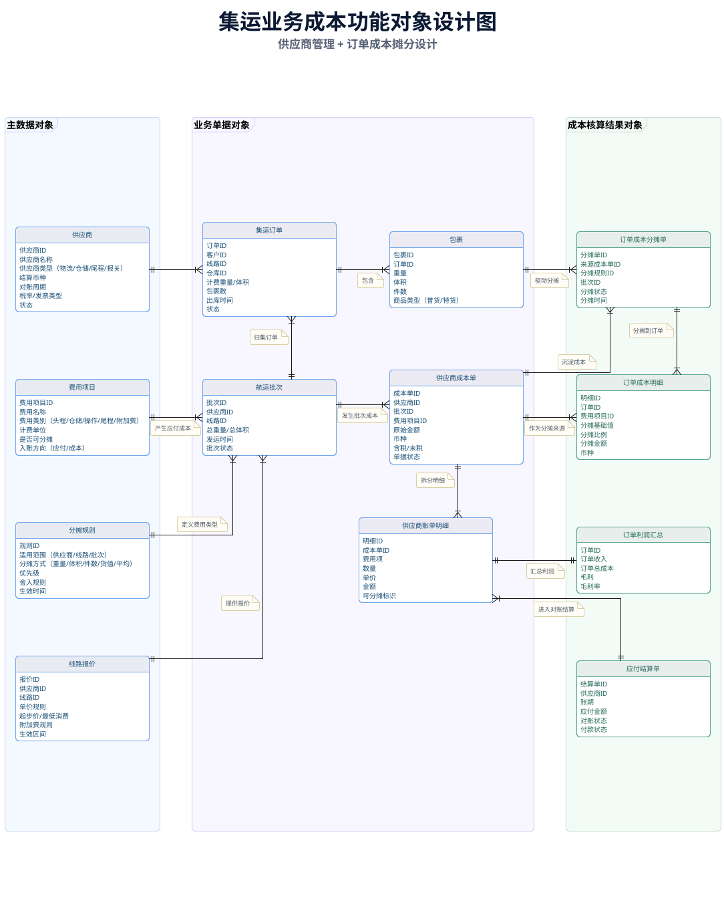
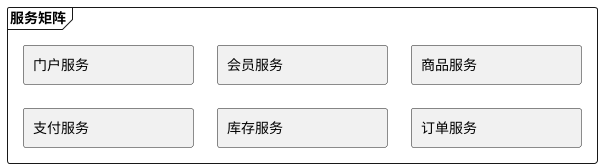
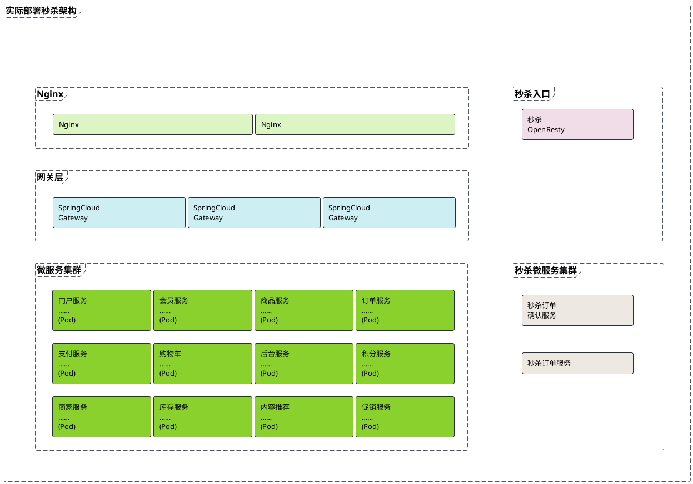
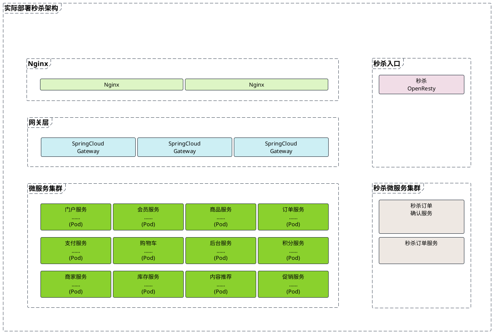

# PlantUML 类图与组件图布局规则

本文解释 PlantUML 类图、组件图如何完成自动布局，以及这些布局规则与 Graphviz `dot` 引擎之间的关系。

全文按“先会用、再理解、最后验证”的顺序组织：

- 第一章从 PlantUML 使用者视角出发，说明如何建立主结构、控制节点与分组、调整间距和连线，并集中列出布局相关设置。
- 第二章沿着 `dot` 的计算过程，解释 Rank、边约束、Cluster、交叉最小化和路由为何会产生第一章中的现象。
- 第三章把前两章应用到一个完整的三 Frame 泳道案例中，展示如何分离布局骨架与业务关系。
- 第四章进一步处理网格化系统架构图，说明如何同时控制分层区域、主次列和规则矩阵。

本文只讨论 PlantUML 类图和组件图默认使用的 Graphviz `dot` 布局路径。颜色、超链接、Tooltip 等纯表现能力不展开；字体、标签和样式会改变节点尺寸，因而仍属于布局范围。

为避免术语混淆，先约定：

| 本文术语 | 含义 |
| --- | --- |
| 元素 | PlantUML 中声明的类、组件、接口、Note、锚点等 |
| 节点 | 元素交给布局引擎后形成的可布局对象 |
| 关系或边 | 元素之间的继承、依赖、关联、隐藏约束等连线 |
| 分组或容器 | `package`、`frame`、`node` 等包含其他元素的结构 |
| Cluster | Graphviz 中参与布局的分组结构；PlantUML 容器通常会产生类似效果 |
| Rank | `dot` 为节点分配的离散层级，不是业务优先级或像素坐标 |
| 布局骨架 | 专门用于稳定层级和顺序的少量隐藏边与透明锚点 |

## 第一章 从 PlantUML 语义到可控布局

### 1.1 类图和组件图是什么关系

类图和组件图都是 UML 结构图，但它们是两个独立图类型。组件图不是类图的特例，也不继承类图的语义。

| 方面 | 类图 | 组件图 |
| --- | --- | --- |
| 建模目标 | 描述类、接口、属性、方法和静态关系 | 描述组件、接口、端口和组件依赖 |
| 常用元素 | `class`、`interface`、`enum`、`annotation` | `component`、`[]`、`interface`、`()`、`port` |
| 节点内部结构 | 常有标题、属性和方法分区 | 常有标题、组件图标、描述或嵌套内容 |
| 主关系 | 继承、实现、关联、聚合、组合、依赖 | 依赖、装配、提供接口、需要接口、端口连接 |
| 常见分组 | Package、Namespace、Frame | Package、Node、Frame、Folder、Cloud、Database |

二者在布局上相似，是因为都可以抽象为“节点 + 边 + 分组”，并复用 PlantUML 的一组通用布局语法和默认 Graphviz 布局能力。语义不同，布局基础相通。

### 1.2 PlantUML 与 Graphviz 如何协作

一张图从源码到成品大致经过以下过程：

```text
PlantUML DSL
    ↓ 解析元素、关系、分组和样式
PlantUML 内部图模型
    ↓ 转换为节点、边、Cluster 和布局约束
Graphviz dot
    ↓ 计算层级、顺序、坐标和连线路径
PlantUML
    ↓ 应用外观并输出
SVG / PNG
```

两者的职责不同：

| 环节 | 主要职责 |
| --- | --- |
| PlantUML | 理解 `class`、`component`、`frame`、关系符号和样式语义 |
| PlantUML 布局适配层 | 把 `hidden`、`norank`、方向、间距等意图转换为布局约束 |
| Graphviz `dot` | 计算 Rank、同层顺序、节点坐标、Cluster 边界和边路径 |
| PlantUML 渲染器 | 根据几何结果绘制最终图像 |

由此可以得到四个重要结论：

1. PlantUML 描述的是结构和布局意图，不是绝对坐标。
2. `dot` 决定最终几何位置，但只能依据 PlantUML 传递的约束。
3. DOT 属性有助于解释结果，却不一定都能从 PlantUML 直接设置。
4. PlantUML、Graphviz、Java 或字体版本变化，都可能改变最终坐标。

后文只讨论默认的 Graphviz `dot` 路径；其他布局后端不展开。

### 1.3 先建立共同的布局心智模型

类图和组件图都遵循以下基本规律：

- 节点内容先决定其最小尺寸，布局引擎不会为了对齐任意压缩文字。
- 普通关系既表达语义，也默认参与层级和顺序计算。
- 分组不是画在节点外面的装饰框，而是会参与布局的容器。
- Note 和边标签占用真实空间，会推动节点、扩大间距或改变路由。
- 源码声明顺序不是坐标命令；`dot` 会为了减少交叉重新排列节点。
- `nodesep`、`ranksep` 和加长连线提供的是最小约束，不是固定距离。
- 连线路由发生在节点位置基本确定之后，不能用路由修复错误层级。

类图和组件图的主要差异来自节点形状和业务主线：

| 差异 | 类图 | 组件图 |
| --- | --- | --- |
| 主层级来源 | 常由继承、实现或主关联决定 | 常由依赖方向、部署层次或数据流决定 |
| 尺寸主要来源 | 类名、stereotype、属性、方法和分区 | 标题、图标、说明、接口、端口和嵌套内容 |
| 常见侧边元素 | 棒棒糖接口、关联端点 | 圆形接口、Port、提供与需要接口 |
| 主要布局风险 | 继承树被大量普通关联拉动 | 接口、端口、嵌套和跨容器连线拥挤 |
| 等宽方式 | `sameClassWidth`、`minClassWidth` 或 class 样式 | component 样式中的 `MinimumWidth` |

有了这个共同模型，调图就可以沿着一条稳定路径推进：先确定主结构和总体方向，再决定关系是否参与 Rank，然后处理节点尺寸与分组，最后调整间距和路由。下面五节依次展开这条路径。

### 1.4 第一步：确定主结构和总体方向

#### 1.4.1 先找出主层级

主层级是读者浏览图时应首先看到的方向：

- 类图通常以继承、实现或核心依赖为主层级。
- 组件图通常以调用、数据流、部署层次或模块依赖为主层级。
- 回调、监控、审计、同步和补充引用通常不应主导层级。

如果所有关系都同等参与布局，`dot` 只能在相互竞争的约束之间折中，结果往往难以理解。

#### 1.4.2 再选择整图方向

默认主方向通常是从上到下：

```text
top to bottom direction
```

业务流、分层架构或泳道图常改为从左到右：

```text
left to right direction
```

总体方向建立的是 Rank 展开方向，不会把每个节点锁定到固定坐标。节点尺寸、分组和交叉最小化仍会调整局部位置。

### 1.5 第二步：决定每条关系如何参与布局

#### 1.5.1 连线中的短横线数量

在默认从上到下的布局中，PlantUML 通常把不同长度的连线解释为不同方向或最小跨度提示：

```text
A - B       ' 倾向水平
A -- B      ' 倾向垂直
A --- B     ' 通常增加最小 Rank 跨度
A ---- B    ' 通常进一步增加跨度
```

应注意：

- `-` 和 `--` 的差异首先是布局方向提示。
- 三个或更多连续 `-` 通常增加最小层级跨度，不是增加线宽。
- 跨度是最小要求，不保证最终距离按固定比例增加。
- 整图改为从左到右后，“同层”和“跨层”的视觉方向也会相应旋转。

#### 1.5.2 显式方向

```text
A -left-> B
A -right-> B
A -up-> B
A -down-> B
```

方向词可以缩写为 `l`、`r`、`u`、`d`。它们是较强的相对方向提示，仍不是像素坐标。少量使用可以澄清主结构；大量互相冲突的方向提示会让布局脆弱。

#### 1.5.3 普通边、`hidden` 和 `norank`

三者承担不同职责：

| 边类型 | 是否显示 | 是否参与 Rank | 适用场景 |
| --- | --- | --- | --- |
| 普通边 | 是 | 默认参与 | 主业务流、继承、实现和核心依赖 |
| `hidden` | 否 | 参与 | 固定层级、顺序、分组对齐和布局骨架 |
| `norank` | 是 | 不参与排名约束 | 回调、旁路、监控和补充引用 |

示例：

```text
A --> B
B -[hidden]right- C
C -[norank]-> A
```

这里，`A --> B` 建立主层级，隐藏边稳定 B 与 C 的相对顺序，`norank` 边保留 C 到 A 的业务含义但不反向拉动主层级。

`hidden` 与 `norank` 最容易混淆：前者“看不见但参与布局”，后者“看得见但不参与排名”。`norank` 边仍需要在最终图中路由，因此仍可能占用空间。

#### 1.5.4 `together` 只提供软分组

```text
together {
  class A
  class B
  class C
}
```

`together` 会提示布局引擎让元素靠近，但不保证：

- 严格处于同一行或同一列；
- 保持源码声明顺序；
- 抵抗所有跨组关系；
- 形成等宽或等高结构。

需要稳定顺序时，使用 `together` 聚集节点，再用少量隐藏边确定关键顺序。

### 1.6 第三步：控制节点、标签和 Note 的尺寸

自动布局先计算节点尺寸，再安排位置。因此，文字和样式变化也属于布局变化。

共同影响因素包括：

- 标题、字段、方法和说明的长度；
- 字体、字号、图标和 stereotype；
- 换行、内边距和最小宽度；
- 多重性、角色名和边标签；
- Note 的内容与位置；
- 隐藏锚点是否仍保留可见分区或最小尺寸。

边标签与 Note 的差异：

| 形式 | 布局影响 |
| --- | --- |
| `A --> B : 说明` | 在边附近预留标签空间 |
| `note on link` | 生成有宽高的附加图形，通常占用更多空间 |
| 独立 Note | 作为独立节点参与布局和路由 |

长说明宜缩成短语或移入正文。正交路由下，边标签位置尤其容易不理想。

### 1.7 第四步：建立容器与分组

#### 1.7.1 分组本身会参与布局

类图和组件图都可使用 `package`、`frame` 等容器；组件图还常使用 `node`、`folder`、`cloud` 和 `database`。

容器遵循以下规律：

- 外框由内部节点、标题、边距和连线占用范围共同决定。
- 相同样式不会让多个容器自动等宽或等高。
- 跨容器关系可能改变容器相对位置和内部节点顺序。
- 嵌套越深，局部 Rank、边界和跨容器路由越复杂。
- 容器类型应服务于业务语义，不应只为布局方便而混用。

#### 1.7.2 容器尺寸和对齐的控制边界

PlantUML 没有通用的容器固定宽高或绝对对齐属性。Frame、Package 等容器的外框是在内部节点定位后，根据标题、内容范围和留白生成的。因此，相同样式只能统一外观，不能保证多个容器自动等宽、等高或顶底对齐。

需要对齐多个容器时，只能通过内部节点的 Rank 和相对顺序间接控制。应先稳定每个容器的内部结构，再处理容器之间的关系；可见的跨容器边若不属于主层级，应避免让它参与 Rank。

本章到此只说明控制边界。第二章的 Cluster 小节解释其布局原因，第三章再通过完整案例展示顶部、底部和内部卡片如何具体对齐。

### 1.8 第五步：最后调整间距和路由

#### 1.8.1 间距

```text
skinparam nodesep 60
skinparam ranksep 50
```

- `nodesep` 控制同一 Rank 内相邻节点的最小间距。
- `ranksep` 控制相邻 Rank 的最小间距。
- Note、标签、节点高度和容器边界可能让实际间距更大。
- 增大间距只能缓解拥挤，不能修复错误的主层级。

#### 1.8.2 路由

```text
skinparam linetype spline
skinparam linetype polyline
skinparam linetype ortho
```

| 路由 | 特点 |
| --- | --- |
| `spline` | 平滑绕开节点，通常最稳健 |
| `polyline` | 使用多段折线，不保证水平或垂直 |
| `ortho` | 仅使用水平和垂直线段，接近业务架构图风格 |

正确的处理顺序是：

1. 减少不必要的排名边。
2. 修正节点层级和同层顺序。
3. 调整 `nodesep`、`ranksep`。
4. 缩短边标签，必要时改为 Note。
5. 最后选择路由类型。

正交路由负责连接已定位的节点，不负责决定 Rank；它对端口和边标签也存在限制。

### 1.9 类图的专属布局规则

前五步适用于类图和组件图。接下来只补充两种图在节点结构和常见关系上的差异；通用规则不再重复。

#### 1.9.1 类卡片结构

类节点常包含标题、属性和方法分区。以下命令会改变卡片尺寸：

```text
hide circle
hide <<stereotype_name>> stereotype
hide empty fields
hide empty methods
hide fields
hide methods
```

空属性区或方法区可能留下分隔线和留白。长成员名、泛型、多行类名与 stereotype 会扩大宽度；字段数量不同会造成高度不同。

#### 1.9.2 类宽度

使用 Style 设置类节点的宽度下限：

```text
<style>
class {
  MinimumWidth 180
}
</style>
```

需要让所有类采用相同宽度时，可使用：

```text
skinparam sameClassWidth true
```

等宽只统一宽度，不会自动等高。等高需要统一内容结构，或通过透明布局节点间接补偿。

#### 1.9.3 关系如何影响类图层级

```text
Parent <|-- Child
Contract <|.. Implementation
Whole *-- Part
Container o-- Item
A --> B
```

继承和实现通常应构成主层级。聚合、组合和普通关联的 UML 语义不同，但在布局层面都是边；菱形或三角形端点本身不会决定是否参与 Rank。

大量次要关联容易破坏继承树，可改用 `norank`。多重性、角色名和关联标签会占用边附近空间：

```text
Customer "1" -- "0..*" Order : places
```

关联类会引入额外节点和边：

```text
Student "*" -- "*" Course
(Student, Course) .. Enrollment
```

多个关联类、Note 和跨 Package 关系叠加时，应优先简化主结构，而不是继续增加方向提示。

#### 1.9.4 Package 与 Namespace

Package 和 Namespace 会形成嵌套区域。自动 Namespace 还可能根据限定名称创建额外分组。跨 Package 的继承和关联会同时影响两个容器；需要多个 Package 对齐时，也应通过内部锚点和隐藏边控制。

### 1.10 组件图的专属布局规则

组件图复用前面的 Rank、分组、间距和路由规则，但组件接口、Port 和嵌套结构会引入额外节点，因而更容易扩大容器并增加跨容器路由。

#### 1.10.1 组件外观先于精调布局

```text
component Service
[Repository]

skinparam componentStyle uml2
skinparam componentStyle uml1
skinparam componentStyle rectangle
```

`component` 与 `[]` 都声明组件，而不是类卡片。`componentStyle` 会改变图标和节点尺寸，应该在精调布局前确定。`rectangle` 通常更紧凑。

组件最小宽度宜使用样式：

```text
<style>
component {
  MinimumWidth 180
}
</style>
```

`MinimumWidth` 只保证下限。标题或多行说明超过该宽度时，节点仍会扩展。

#### 1.10.2 接口是独立节点

```text
component API
interface HTTP
API - HTTP

[Gateway] - () ExternalAPI
```

圆形接口会占用空间、参与 Rank 和交叉最小化。多个接口可能被分配到组件不同侧面；单横线通常更适合表达侧边连接。

#### 1.10.3 Port 会扩大内部布局

```text
component Gateway {
  portin request
  portout response
  component Handler

  request --> Handler
  Handler --> response
}
```

`port`、`portin`、`portout` 是真实局部节点，会改变组件内部布局和容器外框。端口较多时，应按“输入 → 处理 → 输出”建立清晰骨架，并控制边标签长度。

#### 1.10.4 容器和跨容器依赖

组件常嵌套在：

- `package`：逻辑模块；
- `node`：运行或部署位置；
- `folder`：文件或目录分组；
- `frame`：视觉边界或泳道；
- `cloud`：外部网络或服务；
- `database`：数据存储区域。

跨容器依赖会同时影响容器位置、内部组件顺序、Cluster 边界和连线路由。只有定义主架构方向的依赖应参与 Rank；监控、事件订阅、回调和双向同步通常适合 `norank`。

### 1.11 影响布局的 PlantUML 设置总表

前文按调图顺序解释了常用控制。本节改用索引视角集中列出设置，便于在遇到具体问题时查找；它不是新的操作步骤。

#### 1.11.1 如何使用本节

本节汇总类图、组件图在默认 Graphviz 路径中会改变以下任一结果的 PlantUML 设置：

- 节点和关系是否进入布局图；
- Rank、同层顺序或容器相对位置；
- 节点、标签、Note 或容器的宽高；
- 节点间距、层间距或连线路由；
- 最终画布、分页或输出比例。

影响级别分为：

| 级别 | 含义 |
| --- | --- |
| 直接 | 改变图拓扑、Rank、节点顺序、分组或路由算法 |
| 尺寸 | 通过改变文字、图标、内边距或节点宽高间接重排 |
| 画布 | 通常不改变节点相对关系，只改变缩放、分页或外边界 |
| 条件 | 仅在特定元素、样式选择器、版本或内容存在时生效 |

PlantUML 参数会随版本演进。本节以当前工作区 PlantUML 1.2024.3 的 `-language` 参数清单和官方文档为基准。可用以下命令重新核对安装版本：

```text
java -jar plantuml.jar -version
java -jar plantuml.jar -language
```

#### 1.11.2 结构、Rank 和顺序控制

这组设置对布局影响最强，应在尺寸和样式参数之前确定。

| 语法或参数 | 影响级别 | 作用与边界 |
| --- | --- | --- |
| `top to bottom direction` | 直接 | 设置主 Rank 从上到下展开，是默认方向 |
| `left to right direction` | 直接 | 设置主 Rank 从左到右展开 |
| 关系中的 `-`、`--`、`---`、`----` | 直接 | 提示同层、跨层方向和最小 Rank 跨度；不是固定像素长度 |
| `-left-`、`-right-`、`-up-`、`-down-` 及缩写 | 直接 | 提供两端节点的相对方向提示；大量冲突提示会降低稳定性 |
| 普通关系边 | 直接 | 默认参与 Rank、顺序和容器位置计算 |
| `-[hidden]-` | 直接 | 边不可见但参与布局，用于建立骨架和对齐 |
| `-[norank]-` | 直接 | 边可见但不参与排名，用于回调和补充关系 |
| `together { ... }` | 直接 | 提示一组节点靠近；不保证同 Rank 或声明顺序 |
| `package`、`namespace`、`frame` | 直接 | 创建分组和嵌套边界，影响局部 Rank 与跨容器路由 |
| `node`、`folder`、`cloud`、`database`、`rectangle` | 直接 | 在组件图中创建不同语义的容器或节点 |
| `interface`、`()`、`port`、`portin`、`portout` | 直接 | 创建真实节点或局部端口，参与排序、间距和路由 |
| `note`、`note on link`、关系标签和多重性 | 尺寸 | 创建附加节点或标签，占用节点和边附近空间 |
| `hide`、`show` | 直接/尺寸 | 隐藏成员、圆形标记、stereotype 或元素，改变节点尺寸或节点集合 |
| `remove`、`restore` | 直接 | 从渲染模型移除或恢复元素，直接改变图拓扑 |
| `hide @unlinked`、`remove @unlinked` | 直接 | 隐藏或移除未连接元素，改变连通分量 |
| `allowmixing`、`allow_mixing` | 条件 | 允许混合其他结构元素；新增节点类型会改变图模型 |
| `set separator none` | 直接 | 禁止依据限定名称自动创建中间 Package |
| `!pragma useIntermediatePackages false` | 直接 | 控制限定名称是否生成中间 Package，具体行为随版本变化 |
| `!pragma horizontalLineBetweenDifferentPackageAllowed` | 条件 | 允许不同 Package 之间形成水平关系；属于高级、版本相关布局开关 |
| `!pragma layout <后端>` | 直接 | 切换整个布局后端；影响最大，但其他后端不在本文展开 |

#### 1.11.3 专用布局和结构参数

以下参数直接控制布局算法、结构外观或特定行为，不属于 Style 的职责范围：

| 参数 | 影响级别 | 作用 |
| --- | --- | --- |
| `skinparam Nodesep <数值>` | 直接 | 设置同一 Rank 内相邻节点的最小间距 |
| `skinparam Ranksep <数值>` | 直接 | 设置相邻 Rank 的最小间距 |
| `skinparam Linetype spline / polyline / ortho` | 直接 | 选择曲线、折线或正交路由 |
| `skinparam SameClassWidth true / false` | 尺寸 | 统一类节点宽度；不统一高度 |
| `skinparam ComponentStyle uml2 / uml1 / rectangle` | 尺寸 | 改变组件符号及其外接尺寸 |
| `skinparam PackageStyle <样式>` | 尺寸 | 改变 Package 标题和边框形态，可能改变容器几何 |
| `skinparam GroupInheritance <阈值>` | 直接/条件 | 合并达到阈值的继承箭头端点，改变继承树局部路由 |
| `skinparam FixCircleLabelOverlapping true / false` | 条件 | 调整圆形接口或圆形标签重叠问题 |
| `skinparam Handwritten true / false` | 尺寸/条件 | 切换手写风格，字体度量变化时可能改变节点尺寸 |

参数名大小写通常不敏感，本文采用 `Nodesep`、`Ranksep` 等 `-language` 输出形式；常见源码中的 `nodesep`、`ranksep` 等价。

#### 1.11.4 内容显示与类图尺寸参数

这些命令主要通过改变类卡片内容和装饰影响尺寸：

| 语法或参数 | 影响级别 | 作用 |
| --- | --- | --- |
| `hide empty members` | 尺寸 | 同时隐藏空字段区和空方法区 |
| `hide empty fields`、`hide empty attributes` | 尺寸 | 隐藏空字段区 |
| `hide empty methods` | 尺寸 | 隐藏空方法区 |
| `hide fields`、`hide attributes` | 尺寸 | 隐藏所有字段内容 |
| `hide methods` | 尺寸 | 隐藏所有方法内容 |
| `hide members` | 尺寸 | 隐藏字段和方法 |
| `hide circle` | 尺寸 | 隐藏类名前的圆形字符 |
| `hide stereotype`、`hide <<类型>> stereotype` | 尺寸 | 隐藏 stereotype 文本或图标 |
| `skinparam ClassAttributeIconSize <数值>` | 尺寸 | 改变或关闭成员可见性图标；设为 `0` 可关闭 |
| `skinparam CircledCharacterRadius <数值>` | 尺寸 | 改变类名前圆形字符的半径 |
| `skinparam GenericDisplay <模式>` | 尺寸/条件 | 改变泛型文本的显示方式 |
| `skinparam Guillemet true / false` | 尺寸/条件 | 改变 stereotype 定界符显示，可能改变文本宽度 |
| `skinparam StereotypePosition <位置>` | 尺寸/条件 | 改变 stereotype 相对位置，可能改变外接尺寸 |
| `skinparam TabSize <数值>` | 尺寸/条件 | 改变包含制表符的文本宽度 |

类名、字段、方法、泛型、stereotype、手工换行、Sprite、`` 和 Creole/HTML-like 文本本身也属于尺寸输入。它们不是 Style 属性或 `skinparam`，但其内容和图片固有尺寸会影响布局。

#### 1.11.5 会改变几何的 Style 属性

本节统一说明字体、尺寸、内外边距、换行、对齐、边框和阴影等会影响元素几何的 Style 属性。

Style 负责元素外观及其几何尺寸，但不能替代 Rank、节点间距和路由算法等结构约束。应先用方向、关系和专用布局参数确定结构，再用 Style 控制节点几何。

##### 可影响几何的 Style 属性

| Style 属性 | 布局影响 |
| --- | --- |
| `FontName` | 改变字体度量，可能改变文字换行和节点宽高 |
| `FontSize` | 直接改变文字宽高 |
| `FontStyle` | 粗体、斜体可能改变文字宽度 |
| `Padding` | 改变内容到边框的距离，从而改变节点尺寸 |
| `Margin` | 改变元素外部留白；具体支持范围取决于选择器和版本 |
| `MaximumWidth` | 限制支持元素的最大宽度并触发换行，通常会增加高度 |
| `MinimumWidth` | 设置支持元素的宽度下限；并非所有选择器和版本都支持 |
| `HorizontalAlignment` | 改变多行内容或标题对齐；通常不改变 Rank |
| `Shadowing` | 阴影可能扩大最终绘制包围盒 |
| `LineThickness` | 粗边框可能轻微扩大绘制边界，通常不改变拓扑 |

`BackGroundColor`、`FontColor`、`LineColor`、`LineStyle`、`RoundCorner`、`DiagonalCorner` 和超链接外观通常只改变视觉效果，不改变 Rank 或节点坐标。若渲染器把粗线、圆角或阴影计入包围盒，它们最多影响输出边界。

##### 集中式 Style 示例

```text
<style>
class {
  FontName Microsoft YaHei
  FontSize 14
  Padding 8
  MinimumWidth 180
  MaximumWidth 260
}

component {
  FontName Microsoft YaHei
  FontSize 14
  Padding 8
  MinimumWidth 180
}

note {
  FontName Microsoft YaHei
  FontSize 12
  Padding 6
  MaximumWidth 220
  Shadowing 0
}

arrow {
  FontName Microsoft YaHei
  FontSize 12
}
</style>
```

`MinimumWidth`、`MaximumWidth`、`Margin` 和部分子选择器在不同 PlantUML 版本或不同元素上支持程度可能不同。使用时应逐项渲染验证，不能只以“语法能够解析”判断属性已经影响几何。

#### 1.11.6 画布、分页和输出参数

以下设置通常不改变节点之间的抽象关系，但会改变最终尺寸或分页：

| 语法或参数 | 影响级别 | 作用 |
| --- | --- | --- |
| `scale <倍率>`、`scale <宽度> width`、`scale <高度> height` | 画布 | 缩放最终图像 |
| `page <横向页数>x<纵向页数>` | 画布 | 将大图分页输出 |
| `newpage` | 画布/条件 | 创建新的输出页或图页 |
| `skinparam Dpi <数值>` | 画布 | 改变物理尺寸与像素换算 |
| `skinparam PageMargin <数值>` | 画布 | 改变分页外边距 |
| `title`、`caption`、`legend`、`header`、`footer` | 画布 | 这些内容拥有真实宽高，会扩大最终画布 |

输出格式也会间接影响几何：SVG、PNG 以及不同字体回退环境的文字测量可能不同。需要稳定结果时，应固定 PlantUML、Graphviz、Java、字体和输出格式版本。

#### 1.11.7 不应误认为布局参数的设置

| 设置 | 为什么不属于主要布局参数 |
| --- | --- |
| 背景色、边框色、字体颜色 | 通常只改变颜色，不改变节点尺寸和 Rank |
| 超链接、Tooltip、URL | 只增加交互元数据 |
| 线型颜色、虚线样式 | 只改变绘制外观；不要与连线中短横线数量混淆 |
| `PLANTUML_LIMIT_SIZE` | 限制可生成图像的最大尺寸，不决定节点相对位置 |
| Java 最大堆内存、MPE 最大内存占比 | 决定能否完成渲染，不参与布局约束 |
| `!pragma svek_trace` | 只输出调试用中间 DOT/SVG，不改变布局意图 |

### 1.12 第一章小结：先结构，后几何

第一章的操作顺序可以压缩为三层：

1. **主结构**：确定业务主线、总体方向，以及哪些关系应该参与 Rank。
2. **节点与分组**：控制内容和 Style 形成的节点尺寸，建立容器，并用必要的隐藏骨架稳定顺序和对齐。
3. **间距与路由**：加入次要关系，调整间距、标签、Note 和路由，然后重新检查整体结构。

如果一开始就用大量方向提示拖动节点，后续新增关系很容易破坏布局。第二章将沿着 `dot` 的计算过程说明为什么上述顺序更稳定，也说明 PlantUML 能控制到什么程度。

## 第二章 Graphviz `dot` 的布局机制

只需要绘图时，第一章已经足够；当布局结果与直觉不一致，或局部修改引起全图重排时，才需要沿着本章的计算阶段定位原因。

### 2.1 PlantUML 语法如何映射到 `dot`

PlantUML 不承诺把每条语法机械地转换为某个固定 DOT 属性，但下表可以用于理解主要行为：

| PlantUML 写法 | `dot` 中的近似概念 |
| --- | --- |
| `top to bottom direction` | `rankdir=TB` |
| `left to right direction` | `rankdir=LR` |
| `skinparam nodesep` | 同一 Rank 的最小节点间距 |
| `skinparam ranksep` | 相邻 Rank 的最小间距 |
| `-[hidden]->` | 不显示但仍参与布局约束的边 |
| `-[norank]->` | 类似 `constraint=false` 的非排名边 |
| `--`、`---`、`----` | 方向提示与类似 `minlen` 的最小 Rank 跨度 |
| `together` | 聚集或局部分组提示 |
| `frame`、`package` 等 | 类似 Cluster 的分组结构 |
| `skinparam linetype ortho` | 类似 `splines=ortho` 的正交路由请求 |

PlantUML 的间距值会经过适配层处理，不能把数值直接等同于原生 DOT 文件中的单位。理解概念映射比猜测最终 DOT 文本更可靠。

### 2.2 `dot` 的整体计算过程

`dot` 面向具有方向性的分层图。其目标不是复制源码顺序，而是让大多数边沿统一方向展开，同时减少交叉和不必要的边长。

可以把布局过程近似分成七个阶段：

1. **计算节点几何**：根据标签、字体、形状、图标和边距确定最小宽高。
2. **建立可分层结构**：处理有向关系和环，为节点分配 Rank。
3. **优化同层顺序**：调整每个 Rank 内的节点次序，尽量减少交叉。
4. **计算坐标**：结合节点尺寸、层间距、同层间距和边跨度确定位置。
5. **处理 Cluster 与分量**：计算容器边界，并组合彼此断开的连通分量。
6. **路由边和标签**：连接已定位的节点，放置边标签和端点标签。
7. **计算输出画布**：生成最终包围盒、缩放和输出尺寸。

这些阶段存在反馈，不是不可回退的严格流水线。例如，标签可能增大层间空间，Cluster 可能改变排序，路由需要的空间也可能影响最终画布。调试时仍可按上述顺序定位根因。

### 2.3 第一阶段：节点和标签几何

#### 2.3.1 节点尺寸

影响 Graphviz 节点尺寸的常见属性包括：

- `label`；
- `fontname`、`fontsize`；
- `image`、`imagescale`、`imagepos`；
- `margin`；
- `width`、`height`；
- `fixedsize`；
- `shape`；
- HTML-like Label 和 Record 单元格。

在原生 DOT 中，`width` 和 `height` 默认表示最小尺寸；标签过大时，节点仍会扩展。`fixedsize=true` 会固定形状尺寸，可能导致标签越界；`fixedsize=shape` 固定形状，但标签包围盒仍参与布局避让。

节点变大后会产生连锁影响：

- 同层节点需要更多横向空间；
- 所在 Rank 可能变高；
- Cluster 外框可能扩大；
- 边路径可能变长或改道；
- 画布宽高可能改变。

#### 2.3.2 标签占用真实空间

以下标签都会影响几何：

- 图和 Cluster 的 `label`；
- 节点的 `label`、`xlabel`；
- 边的 `label`、`xlabel`；
- `headlabel`、`taillabel`。

常见 DOT 属性：

| 属性 | 作用 |
| --- | --- |
| `labelloc` | 控制标签垂直位置 |
| `labeljust` | 控制标签水平对齐 |
| `labeldistance` | 控制端点标签到端点的距离 |
| `labelangle` | 控制端点标签角度 |
| `labelfloat` | 放宽避让要求，但可能产生覆盖 |
| `forcelabels` | 尽量放置外部标签 |
| `nojustify` | 控制多行标签的对齐基准 |

这解释了为什么只修改文字也可能引起整图重排：文字不是布局结束后的附加层，而是节点和边几何的一部分。

### 2.4 第二阶段：建立 Rank 与边约束

节点尺寸确定后，`dot` 根据主方向和参与排名的边建立层级结构。这个阶段决定“谁位于谁之前”，但还不决定同层节点的最终顺序和像素坐标。

#### 2.4.1 Rank 是什么

Rank 是 `dot` 分配给节点的离散层级：

- `rankdir=TB`：Rank 从上到下展开；
- `rankdir=BT`：从下到上；
- `rankdir=LR`：从左到右；
- `rankdir=RL`：从右到左。

同一 Rank 的节点大致位于同一水平带或垂直带，但 Rank 不等于最终坐标。节点尺寸、同层排序和间距仍会决定具体位置。

#### 2.4.2 原生 DOT 的 Rank 约束

DOT 子图可以使用：

- `rank=same`：节点位于同一 Rank；
- `rank=min`：位于最小 Rank；
- `rank=source`：位于最小 Rank，并限制其他节点进入；
- `rank=max`：位于最大 Rank；
- `rank=sink`：位于最大 Rank，并限制其他节点进入。

```text
digraph G {
  rankdir=TB
  { rank=same; A; B; C }
  A -> D
}
```

PlantUML 不直接暴露完整 DOT 子图语法，通常使用方向、`together`、隐藏边和透明锚点表达相似意图。

Rank 由边约束共同塑造。理解主方向之后，还要继续判断每条边是否参与排名、至少跨越多少层，以及图中的环如何处理。

#### 2.4.3 `constraint`：边是否参与排名

普通 DOT 边默认使用 `constraint=true`，会参与 Rank 分配：

```text
A -> B [constraint=true]
```

`constraint=false` 的边仍显示，但不参与节点排名：

```text
A -> B [constraint=false]
```

这对应了 PlantUML 中普通边与 `norank` 的核心差异。隐藏边则通常保留排名约束，只是不绘制。

#### 2.4.4 `minlen` 与 `weight`：跨度和优化倾向

`minlen` 表示边两端所需的最小 Rank 差：

```text
A -> B [minlen=3]
```

PlantUML 增加连续短横线通常会产生类似的最小跨度效果，但不是固定像素长度。

`weight` 表示边在坐标优化中的相对重要程度。较高权重通常使边更倾向于缩短、拉直或贴近主方向，但它不是绝对优先级。PlantUML 也不一定直接暴露具体边权重。

#### 2.4.5 环为什么会破坏直观层级

`dot` 的分层过程需要建立近似无环的结构。出现 A → B → C → A 时，引擎必须在内部处理方向冲突，所以不能保证每条边都沿直观上下游方向。

处理环时应：

1. 用排名边表达主流程。
2. 把回调和补充引用改为 `norank`。
3. 必要时使用隐藏骨架明确主顺序。
4. 避免对同一组节点施加多条相反的强方向提示。

### 2.5 第三阶段：同层排序与交叉最小化

Rank 只决定层级，同一 Rank 内还要决定左右或上下顺序。`dot` 会综合邻接关系、边权重、节点尺寸和 Cluster 归属，启发式地减少：

- 连线交叉；
- 边总长度；
- 不必要的折弯。

相关 DOT 属性包括：

- `ordering=in`、`ordering=out`；
- `group`；
- `samehead`、`sametail`；
- `mclimit`；
- `remincross`。

源码声明顺序最多只能在部分同等方案中充当提示，不能保证最终次序。新增一条跨层边后，多个同层节点可能一起换位。

PlantUML 中更稳定的处理方式是：

1. 先让主关系形成清晰层级。
2. 用 `together` 表达“这些节点应靠近”。
3. 只为关键顺序添加隐藏边。
4. 避免构造完整的隐藏网格，以免约束彼此竞争。

### 2.6 第四阶段：计算坐标与间距

Rank 和同层顺序确定后，`dot` 才结合节点尺寸与最小间距计算实际坐标。

`dot` 中常见的三个最小约束：

| 属性 | 作用 |
| --- | --- |
| `nodesep` | 同一 Rank 中相邻节点的最小间距 |
| `ranksep` | 相邻 Rank 的最小间距 |
| `minlen` | 某一条边跨越的最小 Rank 数 |

实际距离还要容纳节点、标签、边和 Cluster，因此可能显著大于设置值。看到间距过大时，先检查标签和跨层约束，再考虑减小间距参数。

### 2.7 第五阶段：处理 Cluster 与连通分量

节点获得基本坐标后，`dot` 还要计算容器边界，并处理彼此断开的子图。这一步解释了为什么 Frame 的尺寸依赖内部内容，也解释了为什么没有关系的多个 Frame 容易漂移。

#### 2.7.1 Cluster

DOT 中名称以 `cluster` 开头的子图会被识别为 Cluster。PlantUML 容器通常会形成类似的分组布局。

相关规则和属性：

- Cluster 外框由内部节点、标签和边距决定；
- Cluster 可以嵌套；
- `margin` 控制内容与边界的距离；
- `compound=true` 配合 `lhead`、`ltail` 可表达跨 Cluster 连接；
- `clusterrank` 控制 Cluster 在 Rank 阶段的处理方式；
- `newrank=true` 使用统一的全局排名，可能改善跨 Cluster 同层约束，也可能改变原布局；
- `remincross` 决定多 Cluster 场景是否再次减少交叉。

Cluster 没有“自动等高”规则。透明顶部锚点和底部锚点之所以有效，是因为它们对齐了容器内部的 Rank 和路径长度，容器外框随后才根据这些内部坐标生成。

#### 2.7.2 断开的连通分量

彼此没有边连接的子图可能先独立布局，再组合到画布中。它们的相对位置容易随节点尺寸或版本变化而改变。

DOT 可使用：

- `pack=false`：不显式独立打包；
- `pack=true`：独立布局后打包；
- 整数形式的 `pack`：指定分量外部间距；
- `packmode=node`：按节点和边紧密打包；
- `packmode=cluster`：保持顶层 Cluster 完整；
- `packmode=graph`：按矩形包围盒打包；
- `packmode=array`：按数组排列；
- `sortv`：提供分量或 Cluster 的排序值。

PlantUML 中通常更实用的方式，是用少量隐藏边把正文、图例、说明区和多个 Frame 纳入同一布局骨架。

### 2.8 第六阶段：连线路由和标签放置

`dot` 在节点坐标基本确定后路由边。`splines` 常见值：

| 值 | 路由效果 |
| --- | --- |
| `none` | 不绘制边 |
| `line` 或 `false` | 直线 |
| `spline` 或 `true` | 样条曲线 |
| `polyline` | 多段折线 |
| `ortho` | 水平和垂直正交线 |
| `curved` | 曲线圆弧 |

端点和跨容器路由还涉及：

- `headport`、`tailport`；
- `headclip`、`tailclip`；
- `samehead`、`sametail`；
- `lhead`、`ltail`；
- `concentrate=true`，用于尝试合并共享路径的边。

`concentrate` 可以减少平行线，但也可能降低单条关系的可辨识性。`ortho` 对端口和 `dot` 边标签的处理存在限制，因此正交图中应尽量减少长边标签。

如果边出现绕行或拥挤，排查顺序应是：Rank → 同层顺序 → 节点尺寸 → Cluster → 间距 → 路由。直接更换路由类型通常只能改变症状。

### 2.9 第七阶段：画布与输出尺寸

最终画布要包住所有节点、边、标签、Cluster、标题和说明区域。

常见 DOT 属性：

| 属性 | 作用 |
| --- | --- |
| `margin` | 图外边距；用于节点或 Cluster 时表示内部边距 |
| `pad` | 在最小包围盒外继续扩展 |
| `size` | 期望的最大或目标输出尺寸 |
| `ratio` | 调整宽高比或填充方式 |
| `center` | 是否居中 |
| `page`、`pagedir` | 分页尺寸和顺序 |
| `dpi`、`resolution` | 物理尺寸与像素换算 |
| `viewport` | 最终视口变换 |

这些设置通常不改变抽象拓扑，但可能缩放、裁切或重新分页。

需要特别注意：

- 隐藏边不显示，但会改变节点坐标。
- 透明节点即使不可见，也可能占用最小宽高。
- 空标题、空分区和占位字符可能留下空白或分隔线。
- 把颜色设为透明不等于从布局中移除对象。

因此，透明锚点应同时最小化内容、分区、边框和内边距。

### 2.10 约束的作用顺序与可控边界

前七个阶段说明了布局是多个约束共同优化的结果。因此，PlantUML 适合控制结构和相对关系，不适合指定像素级坐标。

#### 2.10.1 PlantUML 中比较可控的部分

- 整图主方向；
- 哪些关系参与 Rank；
- 关键节点的相对顺序；
- 同层和层间最小间距；
- 节点内容与最小尺寸；
- 分组结构；
- 路由风格；
- 隐藏骨架和透明锚点。

#### 2.10.2 只能间接控制的部分

- 精确 Rank 编号；
- 节点绝对坐标；
- 多个 Frame 的严格等宽和等高；
- 每条正交线的具体折点；
- 交叉最小化出现平局时的结果；
- 不同版本和字体环境下的像素级一致性。

如果需求是固定每个坐标和折点，PlantUML 类图或组件图的自动布局模型通常不是合适工具。

### 2.11 按症状排查布局问题

#### 2.11.1 节点层级错误

1. 检查边方向。
2. 找出本不应参与 Rank 的回调或补充关系。
3. 检查是否存在环。
4. 检查加长连线是否产生过大的最小跨度。
5. 检查 Cluster 内外是否存在竞争约束。
6. 最后再添加隐藏骨架边。

#### 2.11.2 同层顺序不稳定

1. 不要只调整源码声明顺序。
2. 检查新增边是否改变交叉最小化结果。
3. 先用 `together` 聚集相关节点。
4. 再用少量隐藏边固定关键顺序。
5. 检查隐藏边之间是否互相矛盾。

#### 2.11.3 Frame 顶部对齐但底部不齐

1. 确认每个 Frame 都有顶部和底部锚点。
2. 比较各 Frame 内从顶部到底部的 Rank 路径。
3. 对双列或短分支使用透明高度补偿节点。
4. 让跨 Frame 业务边使用 `norank`，避免拉动主骨架。
5. 确认锚点本身没有可见分区或过大尺寸。

#### 2.11.4 连线拥挤或覆盖标签

1. 修正错误层级。
2. 缩短标签，必要时改用 Note。
3. 增大 `nodesep`、`ranksep`。
4. 减少跨 Cluster 边。
5. 检查接口和 Port 是否过密。
6. 比较 spline、polyline 和 ortho。
7. 关系过多时拆图。

#### 2.11.5 同一源码在不同环境下变化

固定以下环境：

- PlantUML 版本；
- Graphviz 版本；
- Java 版本；
- 字体文件与字体替换规则；
- 输出格式；
- 渲染插件或服务器配置。

对关键图保留 SVG 基准文件，并比较节点包围盒、Cluster 边界和主要路径，而不只比较截图。

### 2.12 调试方法

PlantUML 提供：

```text
!pragma svek_trace
```

它可保存中间 DOT 和 SVG，用于检查：

- 哪些边参与 Rank；
- 哪些容器被转换为 Cluster；
- `hidden` 是否进入布局图；
- `norank` 是否变成非排名边；
- 节点的实际宽高；
- 正交边为何绕行。

推荐使用渐进式调试：

1. 只保留节点、主关系和总体方向。
2. 确认 Rank 后加入必要分组。
3. 加入少量隐藏骨架。
4. 恢复 `norank` 的次要关系。
5. 恢复边标签和 Note。
6. 最后应用正交路由和视觉样式。

调试锚点时，可暂时显示其名称、边框和背景，确认位置正确后再恢复透明样式。

### 2.13 核心结论

PlantUML 类图和组件图的默认自动布局，是 PlantUML 语义模型与 Graphviz `dot` 分层布局共同作用的结果：

- PlantUML 决定“有哪些元素、关系和布局意图”。
- `dot` 决定“这些约束下的层级、顺序、坐标和路径”。
- Rank 和排名边决定主结构。
- 节点内容先决定尺寸，样式和文字会间接改变整图。
- 源码顺序不是位置命令，隐藏边比移动声明更可靠。
- `nodesep`、`ranksep` 和加长连线都是最小约束。
- Cluster 按内部内容生成，不会自动等高。
- 路由位于布局后段，不能替代结构修正。
- 稳定复杂图的关键，是把可见业务关系与不可见布局骨架分开。

## 第三章 完整案例：概念实体关系图（泳道分组）

本章把前两章的规则应用到一个完整案例中。目标是把主数据、业务单据和成本核算结果组织成三个并排 Frame，并让三个 Frame 顶部、底部对齐，同时保留跨 Frame 的业务关系。

案例的关键不是某一条业务连线，而是把两类关系分开：

- 隐藏骨架负责 Frame 顺序、卡片层级以及顶部和底部对齐；
- 可见业务关系负责表达对象之间的基数和业务含义，但不参与 Rank 分配。

### 3.1 先看解法：把语义关系与布局约束分层

案例由五层结构组成：

| 层次 | 主要语法 | 职责 |
| --- | --- | --- |
| 视觉层 | `<style>`、stereotype 样式、标题分区颜色 | 统一 Frame、卡片、Note 和锚点的外观与尺寸 |
| 容器层 | 三个 `frame` | 表达主数据、业务单据和核算结果三个业务分组 |
| 内部骨架 | `-[hidden]down-`、`-[hidden]right-` | 固定各 Frame 内卡片的行列结构 |
| 全局骨架 | Frame 外部的顶部、底部公共锚点 | 约束三个 Frame 的横向顺序以及顶部、底部基准 |
| 业务关系 | 带基数端点的关系、`norank`、`note on link` | 表达基数和业务含义，不改变已经建立的 Rank |

阅读源码时先找三个 Frame，再找名称以 `anchor_` 开头的锚点和隐藏边，最后看可见业务关系。Style 决定元素需要多大空间，隐藏骨架确定主要 Rank 和顺序，业务关系则在既有节点位置之间路由。

### 3.2 完整 PlantUML 源码



### 3.3 顶部对齐和横向顺序

`anchor_frames_top` 是三个 Frame 共用的外部起点。它分别向三个内部顶部锚点建立向下的隐藏边，因此三个内部顶部锚点具有相同的上游参照：

```text
anchor_frames_top -[hidden]down- anchor_master_top
anchor_frames_top -[hidden]down- anchor_business_top
anchor_frames_top -[hidden]down- anchor_result_top
```

顶部锚点之间再通过向右的隐藏边固定 Frame 顺序：

```text
anchor_master_top -[hidden]right- anchor_business_top
anchor_business_top -[hidden]right- anchor_result_top
```

因此源码声明顺序不再承担位置控制职责。即使后续调整卡片定义顺序，三个 Frame 仍倾向于保持“主数据—业务单据—核算结果”的横向排列。

### 3.4 底部对齐和高度补偿

每个 Frame 的最后一个可见分支通过内部底部锚点接入 `anchor_frames_bottom`。主数据和核算结果都是单列链，能够直接连接公共底部基准；业务单据采用双列布局，实际路径层数不同，因此增加一个透明补偿节点：

```text
anchor_master_bottom -[hidden]down- anchor_frames_bottom
anchor_business_bottom -[hidden]down- anchor_business_height_pad
anchor_business_height_pad -[hidden]down- anchor_frames_bottom
anchor_result_bottom -[hidden]down- anchor_frames_bottom
```

`anchor_business_height_pad` 的作用是补齐业务 Frame 到公共底部基准的 Rank 路径。这里控制的是布局约束，并非直接给 Frame 设置固定高度。最终 Frame 外框仍由 Graphviz 根据内部节点、标签、留白和 Rank 坐标计算。

### 3.5 Frame 内部骨架

主数据和核算结果使用纵向隐藏链，业务单据同时使用纵向和横向隐藏边构成双列骨架。例如：

```text
anchor_business_top -[hidden]down- order
anchor_business_top -[hidden]down- package
order -[hidden]right- package
order -[hidden]down- batch
package -[hidden]down- cost_bill
batch -[hidden]right- cost_bill
```

`anchor_business_detail_row` 为账单明细提供独立的行基准，使 `bill_detail` 不会因为其他业务关系移动到错误层级。隐藏边虽然不绘制，但仍参与 Rank、同层顺序和坐标计算。

#### 3.5.1 使用相同的宽度上下限固定卡片宽度

本案例的所有可见业务卡片都是 `class`，并且设计目标是让它们全局等宽，因此适合启用：

```text
skinparam SameClassWidth true
```

同时把 `class` Style 的宽度上下限设置为相同数值：

```text
class {
  MinimumWidth 200
  MaximumWidth 200
}
```

`MinimumWidth 200` 防止卡片收窄，`MaximumWidth 200` 防止长文本继续撑宽卡片；两者共同把目标宽度固定为 `200px`。当前 PlantUML 1.2024.3 渲染结果中，13 张可见卡片的实测宽度均为 `200px`。字段文本超过可用宽度时，应通过换行控制内容，而不是让单张卡片扩大。

在宽度上下限已经相同的情况下，`SameClassWidth true` 不再承担主要的尺寸约束，但可作为全局等宽意图的保护声明。该参数只影响类节点，不会让 Frame 等宽、不会让卡片等高，也不会改变本案例中由 `object` 实现的透明锚点。如果不同泳道需要不同卡片宽度，应关闭该参数，并在各 stereotype 中分别设置成对的 `MinimumWidth` 与 `MaximumWidth`。

### 3.6 业务关系为什么使用 `norank`

案例中的业务对象存在大量跨 Frame 关系，并且部分关系会形成回指或环。如果这些边全部参与排名，Graphviz 会同时满足业务边和隐藏骨架，导致卡片层级、Frame 高度或横向顺序发生连锁变化。

```text
cost_bill ||-[norank]-|{ allocation
note on link : 沉淀成本
```

`norank` 保留可见连线、基数端点和 Note，但取消这条业务边的 Rank 约束。这样，隐藏骨架负责结构稳定性，业务边只在节点定位后参与路由。代价是 `norank` 关系不再保证严格的上下游位置；需要表达主流程层级的少量关系仍应作为普通排名边。

### 3.7 为什么锚点不可见但仍然有效

所有锚点统一使用 `<<anchor>>` stereotype，并通过 Style 隐藏自身：

```text
.anchor {
  BackgroundColor transparent
  LineColor transparent
  FontColor transparent
  MinimumWidth 0
  Shadowing 0
}
```

`hide <<anchor>> stereotype` 只隐藏 stereotype 文本，透明 Style 则隐藏锚点节点本身。`-[hidden]-` 隐藏锚点之间的边，但节点和边仍存在于布局模型中。调试时可以临时给 `.anchor` 设置明显的背景、边框和字体颜色，以观察每个 Rank 基准是否位于预期位置。

### 3.8 修改案例时的推荐顺序

1. 新增卡片后，先把它接入对应 Frame 的内部隐藏骨架。
2. 检查该 Frame 的顶部、底部锚点是否仍位于预期分支的两端。
3. 若双列路径层数改变，再调整或增减高度补偿锚点。
4. 确认三个 Frame 对齐后，再加入带 `norank` 的业务关系。
5. 最后调整 `nodesep`、`ranksep`、Note 文本和正交路由。

如果布局突然大幅变化，应先暂时删除业务关系，只保留 Frame、卡片和隐藏骨架。骨架稳定后，再逐条恢复业务边，通常可以快速定位是哪一条关系或哪个 Note 扩大了布局。

## 第四章 完整案例：系统架构图（栅格对齐）

网格化架构图常用于部署视图、微服务矩阵和资源拓扑。参考图可以先拆成两个尺度：

- **宏观网格**：左侧是 Nginx、网关、微服务三个纵向层级，右侧是秒杀入口和秒杀微服务两个纵向区域；
- **微观网格**：Nginx 为 2 列、网关为 3 列、微服务集群为 4 列 × 3 行，右下区域为 1 列 × 2 行。

PlantUML 没有 CSS Grid 一类的行列布局属性，也不提供单元格坐标。实现网格的核心仍是 Graphviz Rank：横向隐藏边确定同一行及从左到右的顺序，纵向隐藏边确定同一列及从上到下的顺序，容器负责包住各自的局部网格。

### 4.1 先建立两级布局骨架

把整图同时拆成“区域层”和“单元格层”，可以避免一开始就在几十个节点之间直接建立约束。

| 层级 | 布局对象 | 控制方法 |
| --- | --- | --- |
| 外层边界 | 整个部署架构 | 使用最外层 Frame 包住所有区域 |
| 区域网格 | 主链路列、秒杀侧栏列及其内部区域 | 使用透明列容器、外部顶部锚点和少量隐藏边 |
| 区域内部 | 每个实例、Pod 或服务 | 相邻单元格使用隐藏横边和隐藏纵边 |
| 可见依赖 | 调用、转发、消息和数据关系 | 默认只让主调用链参与 Rank，其他关系使用 `norank` |

先让五个区域形成稳定的两列结构，再分别处理每个区域内部的行列。不要直接用跨区域业务边兼任网格约束，否则新增调用关系时容易引起整图重排。

### 4.2 将 D2 Grid 翻译为 PlantUML 约束

D2 Grid 会直接建立行、列和单元格；PlantUML 的类图、组件图和部署图没有等价的 `grid-rows`、`grid-columns`、单元格坐标及跨行跨列属性。复刻时不能寻找一个对应参数，而要把 Grid 翻译成 Graphviz 能处理的 Rank、顺序和尺寸约束：

| D2 Grid 意图 | PlantUML 等价约束 |
| --- | --- |
| 指定列数 | 每一行用 `-[hidden]right-` 连接相邻节点 |
| 指定行数 | 每一列用 `-[hidden]down-` 连接相邻节点 |
| 水平、垂直间距 | 分别调整 `nodesep`、`ranksep` |
| 单元格等宽 | 统一同类节点的 `MinimumWidth`；类节点可再配合相同的 `MaximumWidth` |
| 空白单元格 | 放入透明占位锚点，并接入该行、该列的隐藏链 |
| 嵌套 Grid | 在每个 Frame 内建立局部骨架，再用少量隐藏边连接外层区域 |
| 不影响 Grid 的业务关系 | 网格稳定后再添加；不应改变层级的边使用 `norank` |

下面的最小示例把六个节点固定成 3 列 × 2 行：



横向链让同一行的节点进入相同 Rank 并固定次序，纵向链让对应节点保持上下关系。两套约束必须同时存在：只有横向链时，各行的列位置可能不同；只有纵向链时，同一行的横向次序可能漂移。

这是一种“约束自动布局”的近似 Grid，而不是固定坐标系统：

- `nodesep`、`ranksep` 是最小间距，不是单元格宽高；
- Frame 的包围盒仍由内部节点、标题、间距和连线路由共同生成；
- `--`、`---`、`----` 只会增加边的最小跨度倾向，不能作为 Grid 单元；
- `together` 只提供软分组，不能代替完整的横纵隐藏骨架；
- 声明顺序不能可靠地固定行列位置；
- 可见业务边即使使用 `norank`，仍会参与路由并可能扩大留白。

因此，节点数量相对稳定、关系语义更重要时，可以用 PlantUML 的隐藏骨架模拟 Grid；如果必须精确设置单元格尺寸、跨行跨列或连线折点，应优先使用 D2 Grid 或其他显式网格工具。PlantUML Salt 虽然提供表格式布局，但面向 UI 原型，不是类图、组件图和部署架构图的通用 Grid。

### 4.3 完整 PlantUML 源码



### 4.4 让三个主分组等宽

Frame 没有可直接指定的固定宽度。其宽度主要由内部最宽的一行、节点间距、标题和容器留白共同决定。要让 Nginx、网关层和微服务集群等宽，应先让三个区域的最宽行具有接近的总宽度：

```text
行宽 ≈ 各节点宽度之和 + 相邻节点间距之和
```

三个区域分别有 2、3、4 列，因此列数越少，单个节点需要越宽。第四章的 Frame 空白主要来自 Graphviz 的节点间距、Rank 间距和透明补偿节点，并非 `frame` Style 的 `Padding`。在 PlantUML 1.2024.3 中给 `frame` 设置 `Padding 0` 不会进一步缩小这些 cluster 包围盒，因此本案例将 `nodesep`、`ranksep` 从 `45` 降为经过实测仍可稳定渲染的 `5`，再重新标定三类节点宽度：

| 分组 | 最宽行列数 | 节点 `MinimumWidth` | 实测 Frame 宽度 |
| --- | ---: | ---: | ---: |
| Nginx | 2 | `339` | `780px` |
| 网关层 | 3 | `218` | `780px` |
| 微服务集群 | 4 | `157` | `780px` |

对应 Style 已集中在源码中：

```text
.nginx {
  MinimumWidth 339
}

.gateway {
  MinimumWidth 218
}

.service {
  MinimumWidth 157
}
```

这里控制的不是 Frame 本身，而是 Frame 内部最宽一行的几何占用。减小 `nodesep` 后，2、3、4 列区域减少的总宽度不同，所以必须同步调整三类节点的 `MinimumWidth`，不能只改全局间距。`nodesep` 会经过 PlantUML 到 Graphviz 的单位适配，标题、字体、容器留白和较长文本也可能扩大节点，因此不能只按公式计算后就认定像素一定相等。修改这些输入或升级渲染环境后，应重新检查 SVG 中三个 Frame 的包围盒宽度。

如果某个节点的实际内容宽度超过 `MinimumWidth`，该分组仍会继续变宽。此时应缩短文字、设置合适的 `MaximumWidth` 触发换行，或重新调整同类节点的宽度下限。

### 4.5 让侧栏 Frame 等宽并对齐对应区域的高度

秒杀入口和秒杀微服务集群先通过内部的透明水平补偿节点统一宽度。秒杀集群中的 `anchor_seckill_top_extent` 已经向右扩展了包围盒，因此在入口中增加对应的 `anchor_entry_width_extent`：

```text
rectangle "....." as anchor_entry_width_extent <<layout_helper>>
openresty -[hidden]right- anchor_entry_width_extent
```

这条隐藏横边让补偿节点与 OpenResty 处于同一 Rank，用水平几何占用扩展入口 Frame。将 `nodesep` 压缩为 `5` 后，两个侧栏 Frame 的实测宽度均由 `309px` 缩小为 `269px`，仍保持严格等宽。`.....` 只是透明的宽度校准载体，不会显示在图中。

右侧两个 Frame 分别对应左侧的两段垂直范围：

| 侧栏 Frame | 顶边参照 | 底边参照 |
| --- | --- | --- |
| 秒杀入口 | Nginx 顶边 | 网关层底边 |
| 秒杀微服务集群 | 微服务集群顶边 | 微服务集群底边 |

Frame 不能直接设置固定高度，因此仍要改变内部布局占用。所有补偿节点都使用 `<<layout_helper>>`，背景、边框和文字透明，只保留几何尺寸。

秒杀入口在 OpenResty 下方增加一个透明纵向补偿节点：

```text
rectangle "<size:38>.</size>" as anchor_entry_height <<layout_helper>>

openresty -[hidden]down- anchor_entry_height
```

补偿节点把入口 Frame 的底边推到网关层底边附近。随后从这个实际节点连接秒杀集群中的第一个服务，避免只连接两个 Frame 别名时出现容器重叠：

```text
anchor_entry_height -[hidden]down- seckill_confirm
```

普通微服务区域有三行服务，秒杀集群只有两张业务卡片。为了让卡片尽量靠近 Frame 顶部，先把两张卡片放入相邻的两个 Rank，再把高度补偿节点放到第二张卡片下方：

```text
seckill_confirm -[hidden]right- anchor_seckill_top_extent
seckill_confirm -[hidden]down- seckill_order
seckill_order -[hidden]right- anchor_seckill_bottom_extent
seckill_order -[hidden]down- anchor_seckill_height
```

`seckill_confirm -> seckill_order` 让两张卡片先在 Frame 上部紧凑排列；`seckill_order -> anchor_seckill_height` 再利用不可见节点向下撑开剩余高度。这样高度补偿只扩大卡片下方的空白，不会把第二张卡片推向 Frame 底部。`anchor_seckill_top_extent` 和 `anchor_seckill_bottom_extent` 使用相同字号，继续统一两个卡片 Rank 的横向几何占用。

当前工作区渲染结果如下：

| 边界 | 左侧参照 | 右侧 Frame | 误差 |
| --- | ---: | ---: | ---: |
| 绿色顶边 | `156px` | `155.5px` | `0.5px` |
| 绿色底边 | `431px` | `431px` | `0px` |
| 红色顶边 | `471px` | `471.5px` | `0.5px` |
| 红色底边 | `802px` | `801.5px` | `0.5px` |

`ranksep 5` 把微服务矩阵和秒杀服务之间的纵向空白压缩到当前结构可稳定使用的紧凑值。调整后，第二张秒杀卡片由约 `y=709px` 上移到 `y=630px`，秒杀 Frame 的边界为 `471.5px` 至 `801.5px`，与左侧微服务 Frame 的底边仍只差 `0.5px`。入口 Frame 仍需覆盖“Nginx 顶边到网关层底边”的完整高度，因此其中的大部分纵向留白属于等高约束，不能继续删除。`<size:38>`、`<size:50>` 是当前字体、间距和 PlantUML/Graphviz 版本下的校准输入，不等于 Frame 增加了同等像素。更改字体、间距、节点文字或渲染版本后，应重新检查 SVG 包围盒并微调这些值。

### 4.6 微服务矩阵为什么需要横纵两套约束

只写一条横向链，可以稳定某一行，却不能保证不同的行使用相同列位置：

```text
svc_portal -[hidden]right- svc_member
svc_member -[hidden]right- svc_product
svc_product -[hidden]right- svc_order
```

只写纵向链，可以稳定每一列，却不能保证同一行按预期顺序展开。4 × 3 网格因此需要：

- 3 条横向链，每条连接 4 个相邻节点；
- 4 条纵向链，每条连接 3 个相邻节点。

对于 `C` 列、`R` 行且没有空单元格的网格，需要的相邻隐藏边数量为：

```text
横向边数 = R × (C - 1)
纵向边数 = C × (R - 1)
```

这里连接的是相邻单元格，不是让每个节点连接所有其他节点。完整连接会产生大量冗余约束，并增加交叉最小化的负担。

### 4.7 区域网格与内部网格应分开

区域之间只保留少量宏观约束：

```text
layer_nginx -[hidden]down- layer_gateway
layer_gateway -[hidden]down- layer_services
layer_entry -[hidden]down- layer_seckill

anchor_main_top -[hidden]right- anchor_sidebar_top
anchor_main_top -[hidden]down- nginx_1
anchor_sidebar_top -[hidden]down- openresty
```

前三条边分别确定主链路列和侧栏列的纵向顺序。两个外部顶部锚点先用隐藏横边确定左右顺序，再分别向下连接两列中的第一个实际节点。透明列容器负责隔离内部布局，顶部锚点负责把两个连通分量纳入同一全局骨架。这样既避免直接依赖容器别名排序，也不会让某条业务调用关系决定侧栏位置。

Frame 仍由内部内容生成包围盒，所以这套方法保证的是稳定的行列关系，不是像素级等宽、等高。右侧区域若必须与左侧多个区域严格顶底对齐，可以继续采用第三章的公共顶部、底部锚点和透明高度补偿节点。

### 4.8 如何处理不完整网格

当最后一行缺少节点时，不要让 Graphviz 猜测空位。可在缺失单元格中放入透明锚点，并把它接入对应的横向链和纵向链：

```plantuml
hide <<anchor>> stereotype

<style>
.anchor {
  BackgroundColor transparent
  LineColor transparent
  FontColor transparent
  MinimumWidth 135
  Shadowing 0
}
</style>

rectangle "." as anchor_row3_col4 <<anchor>>

svc_content -[hidden]right- anchor_row3_col4
svc_points -[hidden]down- anchor_row3_col4
```

占位锚点的宽度应接近同列业务节点，才能保留明显的空单元格。若只需对齐而不希望保留列宽，可把 `MinimumWidth` 降到接近 `0`。

### 4.9 可见业务关系的加入顺序

网格稳定后再加入调用关系。主入口链可以继续参与 Rank，例如 Nginx 到网关、网关到服务；横向调用、监控、消息通知和回调关系通常应使用 `norank`：

```text
nginx_1 --> gateway_1
gateway_1 --> svc_portal

svc_order -[norank]-> svc_stock : 扣减库存
svc_order -[norank]-> svc_points : 增加积分
```

业务边即使使用 `norank`，仍会参与路由并占用空间。关系密集时，应减少边标签、避免跨越过多 Frame，或把调用关系拆到另一张动态视图中。

### 4.10 网格图的调试顺序

1. 只保留区域 Frame 和区域之间的隐藏边，确认宏观两列结构。
2. 逐个区域加入第一行节点和横向隐藏链。
3. 增加后续行，并用纵向隐藏链闭合网格。
4. 统一同类节点的文字行数、`MinimumWidth` 和 `Padding`。
5. 对缺失单元格加入透明占位锚点。
6. 最后加入可见业务关系、标签和正交路由。

若节点数量频繁变化，应优先维持每行固定列数和相邻单元格命名规则，例如 `anchor_row3_col4`。如果需求必须精确指定每个单元格的像素位置、跨行跨列尺寸和连线折点，PlantUML 的自动布局并不适合，应考虑支持显式网格或坐标的绘图工具。

## 第五章 同一架构的类图实现

第四章使用 `rectangle` 表达部署节点和服务卡片。本章保留相同的 Frame 分组、透明锚点和隐藏连线，只把节点改为 `class`，从而得到可以继续增加属性、方法、依赖、继承和实现关系的类图版本。

这里的“类图实现”指图中至少包含 `class` 元素，因此由 PlantUML 按类图语义解析；`frame` 仍只是通用分组元素，不会把图转换成组件图。布局引擎仍是 Graphviz `dot`，所以第四章的 Rank、隐藏边和透明补偿方法仍然适用。

### 5.1 从矩形卡片转换为类节点

| 转换对象 | 第四章 | 第五章 |
| --- | --- | --- |
| 可见业务卡片 | `rectangle` | `class` |
| 透明布局锚点 | 透明 `rectangle` | 透明 `class` |
| 节点通用 Style | `rectangle { ... }` | `class { ... }` |
| Frame 与宏观骨架 | 保留 | 保留 |
| 类图圆形标记 | 不存在 | 使用 `hide circle` 隐藏 |
| 空成员区 | 不存在 | 使用 `hide empty members` 隐藏 |
| stereotype 文字 | 使用 `hide stereotype` 隐藏 | 保留同一设置 |

类节点即使没有属性和方法，其文字、最小宽度及包围盒计算也与 `rectangle` 不同，因此不能直接复用第四章的全部宽度值。本章重新标定为：

```text
.nginx  MinimumWidth 339
.gateway MinimumWidth 224
.service MinimumWidth 167
.entry / .seckill_service MinimumWidth 202
```

不要在本案例中使用 `skinparam SameClassWidth true`。该设置会把 Nginx、网关、服务卡片和透明锚点统一为同一类宽度，而三个主区域分别是 2、3、4 列，统一单卡宽度后反而无法让三个 Frame 接近等宽。按 stereotype 分别控制宽度更符合这里的网格结构。

### 5.2 完整 PlantUML 源码



### 5.3 等宽、等高与顶部靠齐结果

类图版仍然通过“内部最宽行”间接控制 Frame 宽度。使用 PlantUML 1.2026.6、Java 17 和 Microsoft YaHei 字体渲染，SVG 包围盒为：

| Frame | 实测宽度 | 顶边 | 底边 |
| --- | ---: | ---: | ---: |
| Nginx | `740px` | `139px` | `238px` |
| 网关层 | `738px` | `278px` | `394px` |
| 微服务集群 | `740px` | `434px` | `723px` |
| 秒杀入口 | `234px` | `138.5px` | `394.5px` |
| 秒杀微服务集群 | `234px` | `433px` | `724px` |

三个主 Frame 的最大宽度误差为 `2px`，两个侧栏 Frame 严格等宽。入口 Frame 与上部主区的顶、底边误差均为 `0.5px`；秒杀微服务 Frame 与普通微服务 Frame 的顶、底边误差均为 `1px`。

本例不再用放大字号的点、点串或 `MaximumWidth 1` 制造几何占位。侧栏宽度直接由两类业务卡片共同使用的 `MinimumWidth 202` 决定；透明锚点只控制纵向 Rank，不再参与横向补宽。

类节点没有可直接指定像素高度的 Style 属性，但可以在标签末尾增加空行，把同一网格中的卡片统一到相同的文本行数：

```plantuml
class "秒杀订单\n确认服务\n\n" as seckill_confirm
class "秒杀订单服务\n\n" as seckill_order
```

末尾的 `\n` 不显示占位字符，只增加一个空文本行。`seckill_confirm` 原有两行可见文字，追加两个空行后占四行；`seckill_order` 原有一行可见文字，追加两个空行后占三行。可见文字仍停留在卡片上部，而卡片高度能够分别匹配需要的 Rank 几何。

Frame 的剩余高度则由语义化透明锚点承担：

```plantuml
class "入口\n底部\n基准" as anchor_entry_bottom <<layout_helper>>
class "秒杀区\n底部\n高度\n基准" as anchor_seckill_bottom <<layout_helper>>
```

这些标签描述锚点用途，因 `layout_helper` 的文字、边框和背景均透明而不会显示。它们与左侧对应节点通过水平隐藏边进入同一 Rank：

```plantuml
gateway_3 -[hidden]right- anchor_entry_bottom
svc_order -[hidden]right- seckill_confirm
svc_points -[hidden]right- seckill_order
svc_promotion -[hidden]right- anchor_seckill_bottom
```

因此，入口底部跟随网关行，秒杀区的两张卡片和底部基准分别跟随普通微服务的三行。该方法直接复用现有网格 Rank，比用 `---`、`----` 猜测跨越层数更稳定；左侧增加行距时，右侧也会随对应 Rank 一起移动。

### 5.4 增加类成员时如何保持网格

类图版可以继续为卡片增加属性或方法：

```plantuml
class "订单服务" as svc_order <<service>> {
  +创建订单()
  +取消订单()
}
```

但成员会改变类节点的宽高，进而改变所在 Rank、Frame 包围盒和跨区域对齐。网格图中如果必须展示成员，应让同一行或同一类卡片具有接近的成员行数，并用 `MaximumWidth` 控制长文本换行。若类成员和关系较多，更稳妥的做法是保留本章作为架构总览，再为领域类单独绘制详细类图。

### 5.5 选择矩形版还是类图版

| 需求 | 更合适的版本 |
| --- | --- |
| 只表达服务、实例、Pod 和部署区域 | 第四章矩形版 |
| 后续要增加属性、方法、继承或实现关系 | 第五章类图版 |
| 强调工程架构卡片而非类型语义 | 第四章矩形版 |
| 节点本身就是领域类型或代码结构 | 第五章类图版 |

两种版本使用相同的 Graphviz 布局机制，区别主要在节点语义和几何度量。转换时应保留隐藏骨架，重新校准节点宽度和透明补偿值，而不是把 `rectangle` 机械替换为 `class` 后继续沿用原来的像素结论。

## 官方资料

- [PlantUML 类图](https://plantuml.com/class-diagram)
- [PlantUML 组件图](https://plantuml.com/component-diagram)
- [PlantUML 布局引擎与选项](https://plantuml.com/layout-engines)
- [PlantUML Style 属性](https://plantuml.com/style)
- [PlantUML 部署图及通用分组元素](https://plantuml.com/deployment-diagram)
- [Graphviz `dot` 分层布局](https://graphviz.org/docs/layouts/dot/)
- [Graphviz 属性总览](https://graphviz.org/doc/info/attrs.html)
- [`rank`](https://graphviz.org/docs/attrs/rank/)
- [`rankdir`](https://graphviz.org/docs/attrs/rankdir/)
- [`constraint`](https://graphviz.org/docs/attrs/constraint/)
- [`minlen`](https://graphviz.org/docs/attrs/minlen/)
- [`weight`](https://graphviz.org/docs/attrs/weight/)
- [`nodesep`](https://graphviz.org/docs/attrs/nodesep/)
- [`ranksep`](https://graphviz.org/docs/attrs/ranksep/)
- [`splines`](https://graphviz.org/docs/attrs/splines/)
- [`pack`](https://graphviz.org/docs/attrs/pack/)
