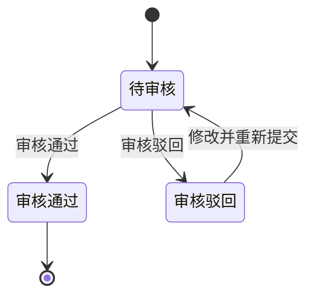

# 第015篇

> 本篇定位：调账中心；主要内容：调账中心；文档角色：模块档；文档ID：17F89514C9

## 1. 调账中心

### 1.1 调账中心修正范围与不回写原则

原始金额或核销信息已经入账后，如发现需要修正且历史账单不得回写，财务通过调账中心处理。调账中心统一承接应收账单、返款账单和成本账单的冲正差异，并把账单侧、导入侧和人工处理侧的冲正动作集中到同一入口。

修正过程不得改写源数据、历史账单或历史结清事实；调账结果必须可追溯、可审核、可留痕，并可由对应账单线稳定引用。

应收账单和返款账单的金额差异统一形成`金额冲正记录`。`调账`只表示财务处理差异的业务动作和页面入口，不再作为客户账单冲正记录的类型名称。成本账单继续使用`成本金额冲正`和`成本核销冲正`，不纳入本节的客户账单金额冲正分类。

成本账单调账分为`成本金额冲正`和`成本核销冲正`。前者修正供应商收费金额及成本明细，后者修正已登记的结清金额、币种、日期、汇率、方式或凭证。两类调账均不允许把原成本账单从`已结清`退回`待结清`，具体规则见<a href="../../../长篇单档PRD/PRD.成本中心.md">《成本中心 PRD》8.3 已结清成本账单的纠错</a>。

#### 1.1.1 应收与返款账单金额冲正记录如何分类？

每条客户账单金额冲正记录必须同时确定`账单类型`和`冲正归属`。系统以原账单及其实际账期和归属账单的关系判定冲正归属，不以记录的录入时间、提交时间或审核时间判定。

| 分类字段 | 可选值 | 判定规则 | 业务结果 |
| :--- | :--- | :--- | :--- |
| 账单类型 | `应收账单`、`返款账单` | 原账单和归属账单必须属于同一账单类型。 | 分别形成`应收账单金额冲正`或`返款账单金额冲正`记录；不得跨账单类型归属或生效。 |
| 冲正归属 | `本期账单金额冲正` | 原账单就是归属账单，原账期与归属账单的实际账期一致，且归属账单仍处于允许承接金额冲正的状态。 | 冲正结果在该账单中生效，并在该账单的`本期账单金额冲正`和金额冲正记录中展示。 |
| 冲正归属 | `往期账单金额冲正` | 原账单早于归属账单，且原账单的实际账期早于归属账单的实际账期。 | 原账单及其历史金额、状态和核销事实保持不变；冲正结果由归属账单承接，并在归属账单的`往期账单金额冲正`和金额冲正记录中展示。 |

`原账单`是发生金额差异且不得被直接改写的账单；`归属账单`是承接金额冲正并在审核通过后计入当前有效结果的账单。两类账单金额冲正都必须保留原账单编号、原账期和归属账单编号。已结清、已作废或其他不允许承接金额冲正的原账单，不得把同一账单作为本期归属，只能按实际账期更晚的有效同类型账单承接为往期账单金额冲正。无法满足上述任一分类条件，或原账单与归属账单类型不一致时，系统不得保存或审核通过，并提示财务重新确认账单类型、原账单和归属账单。

返款账单的`负数承接记录`和`负数承接冲抵记录`是负数返款的结转与冲抵事实，不属于`金额冲正记录`，不得标记为本期或往期账单金额冲正。相关处理仍按[应付返款不足以覆盖指定扣减费项时怎样处理？](PRD.账单系统.第012篇.返款账单.A4A4EF02F0.md#doc-A4A4EF02F0-refund-bill-negative-amount)执行。

### 1.2 调账中心页面字段与操作

[🔗原型链接](http://localhost:4181/#/billing/adjustments)

调整中心通过`账单类型`标识和筛选区分`应收账单金额冲正`、`返款账单金额冲正`与成本账单调账。应收账单和返款账单的金额冲正记录均使用统一字段结构，但列表、详情、批量审核和金额生效必须保留账单类型边界；不同账单类型不得合并为一笔金额或互相改派。

#### 1.2.1 金额冲正列表、导入与成本冲正字段

| 区域 | 业务字段 |
| :--- | :--- |
| 列表域 | 批次提交时间、金额冲正记录编号、审核状态、账单类型、冲正归属、客户名称、原账单编号、原账期、冲正费项、费项挂靠对象、业务订单号、尾程运单号、首程运单号、冲正理由、冲正前币种、金额变幅<冲正前币种>、冲正后金额<冲正前币种>、归属账单编号、冲正后币种、锁定汇率、金额变幅<冲正后币种>、账单金额影响<冲正后币种>、冲正后金额<冲正后币种>、费项凭证、登记人 |
| 导入域 | 账单类型、冲正归属、客户名称、原账单编号、原账期、归属账单编号、冲正费项、费项挂靠对象、业务订单号、尾程运单号、首程运单号、冲正理由、冲正前币种、金额变幅<冲正前币种> |
| 筛选域 | 批次提交时间、金额冲正记录编号、审核状态、账单类型、冲正归属、客户名称、原账单编号、原账期、冲正费项、费项挂靠对象、业务订单号、尾程运单号、首程运单号、冲正前币种、归属账单编号、冲正后币种、登记人 |
| 成本金额冲正域 | 调账类型、供应商、原成本账单号、原成本明细号、成本板块、标准成本费项、成本类型、业务订单号、尾程运单号、原币种、原金额、冲正金额、冲正后金额、冲正原因、凭证、登记人 |
| 成本核销冲正域 | 调账类型、供应商、原成本账单号、原结清记录号、原结清金额、原结清币种、原结清日期、原成本核销汇率、原结清方式、反向核销金额、正确结清金额、正确结清币种、正确结清日期、正确成本核销汇率、正确结清方式、冲正原因、凭证、登记人 |
| 说明 | 1. 金额冲正记录编号必须全局唯一，生成后不可变。 2. 冲正前币种按冲正费项的原始币种或结算币种填写。 3. `账单金额影响`表示该记录对归属账单最终金额的带符号影响：应收账单以应收金额增减方向记录，返款账单以实付返款增减方向记录。 |

#### 1.2.2 金额冲正记录状态、操作与权限

金额冲正记录的业务操作与审核状态强绑定。下表是可执行操作、执行人、批量能力和状态流转的完整定义。

| 状态 | 可执行操作 | 执行人 | 是否支持批量 | 状态流转 |
| :--- | :--- | :--- | :--- | :--- |
| `待审核` | 修改 | 提交人，且仅限本人提交的记录 | 否 | 修改后仍停留在 `待审核` |
| `待审核` | 移除 | 提交人，且仅限本人提交的记录 | 是 | 移除后记录终止，不再进入后续状态 |
| `待审核` | 审核 | 审核人 | 是 | 审核通过后进入 `审核通过`，审核驳回后进入 `审核驳回` |
| `审核驳回` | 修改并重新提交 | 提交人 | 否 | 重新提交后回到 `待审核` |
| `审核通过` | 查看 | 所有人 | 否 | 只读，不允许修改、移除或再次审核 |

状态含义概览：

| 状态 | 说明 |
| :--- | :--- |
| `待审核` | 记录可编辑、可移除、可审核，是唯一支持批量审核和批量移除的状态。 |
| `审核通过` | 记录已生效，只读保留，不允许再改。 |
| `审核驳回` | 记录保留驳回原因，允许提交人修改后再次提交，重新回到 `待审核`。 |
| 状态机起点 | 记录新建后进入 `待审核`。 |

### 1.3 录入与审核规则

1. 应收账单或返款账单录入的金额冲正记录和调账中心批量导入的金额冲正记录，最终都统一在调账中心审核，且归属账单由财务在审核时确认。
2. `应收账单金额冲正`、`返款账单金额冲正`和成本账单冲正共用同一审核入口，但字段、默认归属、审核归属和生效对象按各自账单类型处理。
3. 金额冲正记录在各状态下的可执行操作、执行人、批量能力和状态流转，以[金额冲正记录状态、操作与权限](#doc-17F89514C9-adjustment-center-59642159)中的操作矩阵为完整定义。
4. 审核人只能审核，不能代替提交人修改内容。
5. `审核通过`记录进入只读态，不允许再次修改或移除，只能通过新增反向金额冲正记录修正。
6. 批量移除、批量审核仅对待审核记录生效，混入其他状态时应禁用相应操作。
7. 归属账单未确认且系统未生成有效默认归属的金额冲正记录，不允许审核通过。
8. 金额冲正记录必须明确记录账单类型、冲正归属、原账单、原账期、归属账单、金额、币种、原因和凭证。
9. 成本金额冲正必须关联供应商、原成本账单、原成本明细和受影响业务对象；成本核销冲正必须关联原结清记录，并明确错误记录、反向记录和正确记录之间的关系。
10. 成本调账的提交人与审核人必须分离；审核人不得修改提交内容后直接通过。

### 1.4 生效与归属规则

1. 应收账单金额冲正记录审核通过后，系统按`冲正归属`把`账单金额影响`计入归属应收账单的`本期账单金额冲正`或`往期账单金额冲正`，并重新计算应收金额和待收金额。系统不得回写原账单的基础金额、原始明细、原账期和既有核销事实；原账单同时是本期归属账单时，只能基于新增金额冲正记录刷新当前有效汇总，基础快照保持不变。
2. 返款账单金额冲正记录审核通过后，系统按`冲正归属`把`账单金额影响`计入归属返款账单的`本期账单金额冲正`或`往期账单金额冲正`，并重新计算实付返款和待付返款。系统不得回写原账单的订单基础返款、原始明细、原账期和既有核销事实；原账单同时是本期归属账单时，只能基于新增金额冲正记录刷新当前有效汇总，基础快照保持不变。
3. `待审核`和`审核驳回`的金额冲正记录只在调整中心和账单的调整记录中展示，不得进入账单金额汇总、核销口径或客户导出。只有`审核通过`记录才允许影响对应应收账单或返款账单的金额和核销余额，或者影响成本调整记录、成本归属、成本核销结果和利润分析。
4. 如果原始金额已经进入 `BMS费项池`，修正动作必须走调账中心，不允许直接回写源数据。
5. 已结清账单若再发现差异，不能直接改写历史账单金额，必须由后续账单承接往期账单金额冲正；已审核通过的错误冲正则通过新增反向金额冲正记录修正。
6. 金额冲正记录一旦审核通过，必须保留历史状态、审核轨迹和凭证，不允许被后续操作直接覆盖。
7. 归属本账单的任何未移除金额冲正记录，只有在调账中心全部审核通过后，该账单才允许审核通过；其他账单或成本调账记录不阻塞本账单审核。
8. 调账中心也不触发源数据重采，不改变 `BMS检阅标记` 的状态流转。
9. 已结清成本账单发生金额差异时，调账中心生成新的成本调整明细和关联关系，原成本账单金额、编号和状态保持不变。
10. 已结清成本账单发生核销信息错误时，调账中心以新增反向核销记录和正确核销记录完成修正，不修改或删除原核销流水。
11. 成本调账形成待结清差额时，差额按供应商、币种和成本账期形成独立待结清记录；后续结清该差额不改变原成本账单状态。
12. 成本调账影响间接成本时，必须生成新的分摊版本；影响已确认`成本已齐`订单时，必须退回`成本未齐`并重算利润。
13. 返款负数处理产生的`负数承接记录`或`应收调整费项`需要修正或清理时，通过调账中心新增冲正或承接记录处理，不直接删除、覆盖或改写原记录；原处理规则分别见[应付返款不足以覆盖指定扣减费项时怎样处理？](PRD.账单系统.第012篇.返款账单.A4A4EF02F0.md#doc-A4A4EF02F0-refund-bill-negative-amount)和[应收调整费项怎样进入应收账单？](PRD.账单系统.第011篇.应收账单.88A604AED3.md#doc-88A604AED3-receivable-bill-arr-adjustment)。

### 1.5 自动归属规则

1. 对于尚未归属任何应收账单的应收账单金额冲正记录，系统在导入后先预生成默认归属，但该归属不等于最终审核归属。
2. 对于尚未归属任何返款账单的返款账单金额冲正记录，系统在导入后先预生成默认归属，但该归属不等于最终审核归属。
3. 金额冲正记录的归属账单由财务在审核时最终确认；财务可以沿用系统预生成的默认归属，也可以手动改派到另一份同类型的有效待审核账单。改派后系统必须重新判定`本期账单金额冲正`或`往期账单金额冲正`，不得保留与新归属账单不一致的冲正归属。
4. 系统先按原账单与候选归属账单的关系判定冲正归属。原账单本身仍是同类型有效待审核账单时，默认归属原账单并标记为`本期账单金额冲正`；原账单已不能承接变更时，只能选择实际账期晚于原账期的同类型有效待审核账单，并标记为`往期账单金额冲正`。
5. 应收账单和返款账单的候选归属账单都必须与原账单客户一致，并保持原账单类型；`已作废`账单不得作为归属账单。
6. 往期账单金额冲正存在多份候选账单时，先按实际账期开始日升序选择最早可承接账单；同一实际账期仍有多份候选时，优先选择财务本位币汇总金额最高的账单，以降低冲正金额叠加后单张账单出现负值的可能性。
7. 若候选账单的实际账期开始日和财务本位币汇总金额均相同，系统应按账单编号升序选出唯一承接账单，账单编号以固定且唯一的规则生成，不会重复。
8. 自动归属只处理尚未归属任何应收账单或返款账单的金额冲正记录，不影响已经归属完成的记录。
9. 成本账单调账不使用客户账单的自动归属算法。成本调账必须明确关联原成本账单；无法关联原成本账单的新增成本，应作为新的成本明细或新的成本账单处理，不得由系统猜测归属。

### 1.6 调账结果如何影响各类账单

1. 应收账单中的金额冲正只在审核通过后影响应收金额和待收金额；既有已收金额保持资金事实原值，不因金额冲正被覆盖或倒推修改。
2. 返款账单中的金额冲正只在审核通过后影响实付返款和待付返款；既有已付返款保持资金事实原值，不因金额冲正被覆盖或倒推修改。
3. 成本账单中的成本金额冲正影响成本调整金额、成本归属和利润；成本核销冲正影响结清流水及人民币换算结果，但不改变原成本账单的`已结清`状态。
4. 调账中心只是修正入口，不等于应收账单、返款账单或成本账单本身。
5. 调账中心产生的结果最终仍要由对应账单线或独立成本调整记录承接，不能绕过账单直接改写历史结果。
