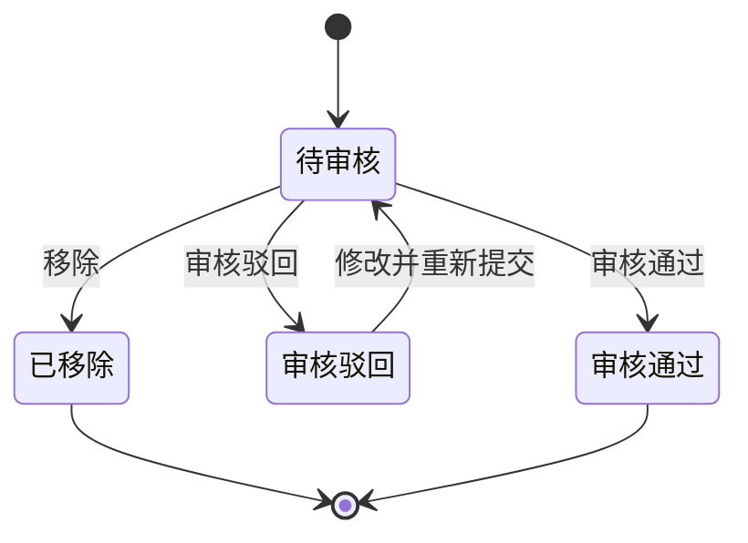

# 第015篇

> 本篇定位：调账中心；主要内容：调账中心；文档角色：模块档；文档ID：17F89514C9

## 1. 调账中心

### 1.1 调账中心修正范围与不回写原则

原始金额或核销信息已经入账后，如发现需要修正且历史账单不得回写，财务通过调账中心处理。调账中心统一承接应收账单、返款账单和成本账单的冲正差异，并把账单侧、导入侧和人工处理侧的冲正动作集中到同一入口。

修正过程不得改写源数据、历史账单或历史结清事实；调账结果必须可追溯、可审核、可留痕，并可由对应账单线稳定引用。

应收账单和返款账单的金额差异统一形成`金额冲正记录`，核销差异统一形成`核销记录冲正`（见[应收与返款账单核销记录如何冲正？](#doc-17F89514C9-adjustment-center-writeoff-reversal)）。`调账`只表示财务处理差异的业务动作和页面入口，不构成记录类型；`费用重整`、`费项级红冲更正`等表达不再作为独立操作或记录类型，所指的都是`金额冲正记录`。成本账单继续使用`成本金额冲正`和`成本核销冲正`，不纳入本节应收与返款账单的冲正分类。

成本账单调账分为`成本金额冲正`和`成本核销冲正`。前者修正供应商收费金额及成本明细，后者修正已登记的结清金额、币种、日期、汇率、方式或凭证。两类调账均不允许把原成本账单从`已结清`退回`待结清`，具体规则见<a href="../../lengthy-prd/PRD.成本中心.md">《成本中心 PRD》8.3 已结清成本账单的纠错</a>。

#### 1.1.1 应收与返款账单金额冲正记录如何分类？

每条应收账单或返款账单金额冲正记录最终都必须同时确定`账单类型`和`冲正归属`。系统按原账单、归属账单及其各自实际账期的关系判定冲正归属，不以记录的录入时间、提交时间或审核时间判定。

| 分类字段 | 可选值 | 判定规则 | 业务结果 |
| :--- | :--- | :--- | :--- |
| 账单类型 | `应收账单`、`返款账单` | 原账单和归属账单必须属于同一账单类型。 | 分别形成`应收账单金额冲正`或`返款账单金额冲正`记录；不得跨账单类型归属或生效。 |
| 冲正归属 | `本期账单金额冲正` | 原账单就是归属账单，原账期与归属账单的实际账期一致，且归属账单仍处于允许承接金额冲正的状态。 | 冲正结果在该账单中生效，并在该账单的`本期账单金额冲正`和金额冲正记录中展示。 |
| 冲正归属 | `往期账单金额冲正` | 原账单早于归属账单，且原账单的实际账期早于归属账单的实际账期。 | 原账单及其历史金额、状态和核销事实保持不变；冲正结果由归属账单承接，并在归属账单的`往期账单金额冲正`和金额冲正记录中展示。 |

`原账单`是发生金额差异且不得被直接改写的账单；`归属账单`是承接金额冲正并在审核通过后计入当前有效结果的账单。两类账单金额冲正都必须保留原账单编号、原账期和归属账单编号。已结清、已作废或其他不允许承接金额冲正的原账单，不得把同一账单作为本期归属，只能按实际账期更晚的有效同类型账单承接为往期账单金额冲正；当前不存在可承接归属账单时，记录按本节规则保持`未归属`。原账单与归属账单类型不一致，或原账单、归属账单无法唯一确定时，系统不得保存或审核通过，并提示财务重新确认账单类型、原账单和归属账单。

`可承接金额冲正`的归属账单必须同时满足：与原账单同一账单类型、账单有效且非`已作废`、主状态为`待审核`、不存在核销/返款登记/收款等账单侧资金事实。原账单当前没有可承接归属账单时，金额冲正记录可以保存但保持`未归属`，不进入任何账单汇总，也不允许审核通过；后续出现可承接归属账单时按[自动归属规则](#doc-17F89514C9-adjustment-center-23e4c954)自动归属，或由财务在审核时手动改派。

返款账单的`负数承接记录`和`负数承接冲抵记录`是负数返款的结转与冲抵事实，不属于`金额冲正记录`，不得标记为本期或往期账单金额冲正。相关处理仍按[应付返款不足以覆盖指定扣减费项时怎样处理？](PRD.账单系统.第012篇.返款账单.A4A4EF02F0.md#doc-A4A4EF02F0-refund-bill-negative-amount)执行。

#### 1.1.2 应收与返款账单核销记录如何冲正？

核销记录冲正用于修正已登记的客户账单核销事实，与金额冲正记录相互独立：金额冲正改变账单金额口径；核销记录冲正只修正实际到账或出账的资金记录，不改写原核销流水、不进入`BMS费项池`、不改变账单基础金额和费项明细。

1. 核销记录冲正按账单类型分为`应收账单核销记录冲正`和`返款账单核销记录冲正`。财务从对应账单的核销记录区发起，统一在调账中心完成审核与生效；两类记录不得跨账单类型合并或生效。
2. 每次核销记录冲正必须形成`反向核销记录`，并在存在正确资金事实时形成`正确核销记录`。反向核销记录冲销原核销记录对已收金额或已付返款及结清进度的计入；正确核销记录按实际到账或出账事实重新登记。原核销记录保持只读并保留与原记录的引用关系，不得修改或物理删除。
3. 核销记录冲正审核通过后，当前`已收金额`、`已付返款`与核销进度只读取最新有效核销结果；冲正前的核销金额不再计入当前资金余额与核销进度，但保留在账单快照和审计轨迹中用于追溯。
4. 核销记录冲正不影响账单基础金额、费项明细或本期/往期账单金额冲正分桶；应收金额、实付返款等金额口径仍按对应账单模块的公式计算，核销记录冲正只更新已收或已付资金口径。
5. 负数承接记录、负数承接冲抵记录和应收调整费项不属于核销记录；需要修正或清理时，按[生效与归属规则](#doc-17F89514C9-adjustment-center-74d68843)第13条通过调账中心新增冲正或承接记录处理。

### 1.2 调账中心页面字段与操作

[🔗原型链接](http://localhost:4181/#/billing/adjustments)

调账中心通过`账单类型`标识和筛选区分`应收账单金额冲正`、`返款账单金额冲正`与成本账单调账。应收账单和返款账单的金额冲正记录均使用统一字段结构，但列表、详情、批量审核和金额生效必须保留账单类型边界；不同账单类型不得合并为一笔金额或互相改派。

#### 1.2.1 金额冲正列表与成本冲正字段

| 区域 | 业务字段 |
| :--- | :--- |
| 列表域 | 批次提交时间、金额冲正记录编号、审核状态、账单类型、冲正归属、客户名称、原账单编号、原账期、冲正费项、费项挂靠对象、业务订单号、尾程运单号、首程运单号、冲正理由、冲正前币种、原币金额变幅、原币冲正后金额、归属账单编号、冲正后币种、锁定汇率、账单金额影响、冲正后金额、费项凭证、登记人 |
| 筛选域 | 批次提交时间、金额冲正记录编号、审核状态、账单类型、冲正归属、客户名称、原账单编号、原账期、冲正费项、费项挂靠对象、业务订单号、尾程运单号、首程运单号、冲正前币种、归属账单编号、冲正后币种、登记人 |
| 成本金额冲正域 | 调账类型、供应商、原成本账单号、原成本明细号、成本板块、标准成本费项、成本类型、业务订单号、尾程运单号、原币种、原金额、冲正金额、冲正后金额、冲正原因、凭证、登记人 |
| 成本核销冲正域 | 调账类型、供应商、原成本账单号、原结清记录号、原结清金额、原结清币种、原结清日期、原成本核销汇率、原结清方式、反向核销金额、正确结清金额、正确结清币种、正确结清日期、正确成本核销汇率、正确结清方式、冲正原因、凭证、登记人 |
| 说明 | 1. 金额冲正记录编号必须全局唯一，生成后不可变。 2. 冲正前币种、原币金额变幅和原币冲正后金额的取值口径见[金额冲正记录的字段口径](#doc-17F89514C9-adjustment-center-field-caliber)。 3. `账单金额影响`表示该记录对归属账单最终金额的带符号影响：应收账单以应收金额增减方向记录，返款账单以实付返款增减方向记录。 |

#### 1.2.2 金额冲正记录的字段口径

金额冲正记录的字段名称与口径以本节为权威定义，调账中心的列表、详情、导入模板，以及直接输出金额冲正记录数据的页面与导出模板列名都必须与之保持一致；表内金额列名与[金额冲正列表与成本冲正字段](#doc-17F89514C9-adjustment-center-9a76e6c3)中的列表域列名一一对应。账单详情、对账报表等按账单金额口径派生的下游视图只展示本节的换算结果，不直接输出`原币金额变幅`、`原币冲正后金额`等原币字段，展示列名与口径以对应章节定义为准。

| 字段 | 定义 | 取值口径 |
| :--- | :--- | :--- |
| 原账单编号、原账期 | 金额差异所在原账单及其实际账期 | 与原账单快照一致，审核通过后不可变。 |
| 冲正费项 | 需要修正金额的费项 | 必须能对应到原账单中的费项记录；冲正按该费项在原账单金额链路中已经计入的金额识别，金额一律在冲正前币种下计量。 |
| 冲正前币种 | 原币金额变幅与原币冲正后金额使用的币种 | 由系统按原账单与冲正费项唯一确定：应收账单金额冲正固定为`费项原始币种`，返款账单金额冲正固定为`返款原始币种`。财务录入和导入文件都不得另选币种；冲正前币种与系统推导值不一致时，系统拒绝保存并提示。 |
| 原币金额变幅 | 冲正完成后该费项在冲正前币种下的金额相对冲正前原金额的带符号差额 | 系统从原账单快照读取冲正前币种下的原金额；金额类导入只填写本字段，原币冲正后金额自动计算。 |
| 原币冲正后金额 | 冲正完成后该费项在冲正前币种下的金额 | 必须等于原账单中原金额与`原币金额变幅`之和；原账单中该费项不是冲正前币种直接计量的（返款账单指定扣减费项按锁定汇率换算进返款原始币种）时，原金额取换算后已经计入金额链路的金额。列表与详情展示同一数值。 |
| 归属账单编号 | 承接审核通过结果的账单 | 与原账单同一账单类型，且满足[应收与返款账单金额冲正记录如何分类？](#doc-17F89514C9-adjustment-center-amount-reversal-classification)中的可承接条件。 |
| 冲正后币种 | 冲正结果计入归属账单时采用的币种 | 应收账单为`费项结算币种`，返款账单为`返款结算币种`。 |
| 锁定汇率 | 冲正前币种换算为冲正后币种使用的汇率 | 两种币种相同时为`1`；不同时按归属账单锁定的对应货币对汇率取值，换算口径见[应收账单币种间换算规则](PRD.账单系统.第014篇.金额汇兑.27B80EF314.md#doc-27B80EF314-currency-exchange-bc29162a)与[返款账单换算总则](PRD.账单系统.第014篇.金额汇兑.27B80EF314.md#doc-27B80EF314-currency-exchange-83e6bbc9)。 |
| 账单金额影响 | `原币金额变幅`换算到冲正后币种后，该记录对归属账单最终金额的带符号影响 | 按`原币金额变幅 × 锁定汇率`计算；应收账单以应收金额增减方向记录，返款账单以实付返款增减方向记录，用于本期/往期账单金额冲正分桶汇总。 |
| 冲正后金额 | 冲正完成后该费项在冲正后币种下的金额 | 按`原币冲正后金额 × 锁定汇率`计算。 |

#### 1.2.3 金额冲正记录如何批量导入？

财务需要一次登记多条应收账单或返款账单金额冲正记录时，通过调账中心`导入`上传金额冲正记录导入模板文件；单条登记仍通过调账中心`新增`完成。导入形成的记录与手工`新增`的记录使用同一字段结构和审核流程，后续修改、移除、审核和生效分别按[金额冲正记录状态、操作与权限](#doc-17F89514C9-adjustment-center-59642159)与[录入与审核规则](#doc-17F89514C9-adjustment-center-4dd06723)处理。

**模板字段**

| 区域 | 业务字段 |
| :--- | :--- |
| 导入域 | 账单类型、冲正归属、客户名称、原账单编号、原账期、归属账单编号、冲正费项、费项挂靠对象、业务订单号、尾程运单号、首程运单号、冲正理由、原币金额变幅 |

导入规则：

1. 模板字段名称与取值口径与[金额冲正记录的字段口径](#doc-17F89514C9-adjustment-center-field-caliber)一致；金额类字段只填写`原币金额变幅`，`原币冲正后金额`、`冲正后币种`、`锁定汇率`、`账单金额影响`和`冲正后金额`由系统计算或读取，不进入导入文件。
2. 导入文件不提供`冲正前币种`列，系统按原账单与冲正费项推导并校验（规则见[金额冲正记录的字段口径](#doc-17F89514C9-adjustment-center-field-caliber)中`冲正前币种`行）；行内金额币种与推导结果不一致时，该行不得导入并提示原因。
3. 原账单或归属账单无法唯一确定、原账单与归属账单类型不一致等不满足[应收与返款账单金额冲正记录如何分类？](#doc-17F89514C9-adjustment-center-amount-reversal-classification)的行不得导入并提示失败原因。
4. 导入成功的记录进入`待审核`，系统先按[应收与返款账单金额冲正记录如何分类？](#doc-17F89514C9-adjustment-center-amount-reversal-classification)定义的可承接条件预生成默认归属；当前不存在可承接归属账单时保持`未归属`，后续归属按[自动归属规则](#doc-17F89514C9-adjustment-center-23e4c954)处理。

**导入演示数据**

下表为导入模板的数据行演示，币种不写入模板：示例第 1 行的冲正前币种为 USD，第 2 行为 TWD，均由系统按原账单与冲正费项推导。

| 账单类型 | 冲正归属 | 客户名称 | 原账单编号 | 原账期 | 归属账单编号 | 冲正费项 | 费项挂靠对象 | 业务订单号 | 尾程运单号 | 首程运单号 | 冲正理由 | 原币金额变幅 |
| :--- | :--- | :--- | :--- | :--- | :--- | :--- | :--- | :--- | :--- | :--- | :--- | :--- |
| 应收账单 | 本期账单金额冲正 | 示例客户甲 | ARB-OG0999-20260705-A1B2 | 2026/06/29 ~ 2026/07/05 | ARB-OG0999-20260705-A1B2 | 派送费 | 尾程包裹 | SO-260701-000123 | TW-20260701-0081 | CN-20260630-0456 | 派送费原始金额多计，冲减应收 | -3.20 |
| 返款账单 | 往期账单金额冲正 | 示例客户甲 | PCB-OG0999-20260621-2C3D | 2026/06/15 ~ 2026/06/21 | PCB-OG0999-20260714-4E5F | 代收服务费 | 业务订单 | SO-260618-000456 | TW-20260618-0152 | CN-20260616-0710 | 往期代收服务费少计，补足扣减金额 | 2.10 |

#### 1.2.4 金额冲正记录状态、操作与权限

金额冲正记录的业务操作与审核状态强绑定。下表是可执行操作、执行人、批量能力和状态流转的完整定义。

| 状态 | 可执行操作 | 执行人 | 是否支持批量 | 状态流转 |
| :--- | :--- | :--- | :--- | :--- |
| `待审核` | 修改 | 提交人，且仅限本人提交的记录 | 否 | 修改后仍停留在 `待审核` |
| `待审核` | 移除 | 提交人，且仅限本人提交的记录 | 是 | 移除后进入`已移除`终态，不再进入后续状态 |
| `待审核` | 审核 | 审核人 | 是 | 审核通过后进入 `审核通过`，审核驳回后进入 `审核驳回` |
| `审核驳回` | 修改并重新提交 | 提交人 | 否 | 重新提交后回到 `待审核` |
| `审核通过` | 查看 | 所有人 | 否 | 只读，不允许修改、移除或再次审核 |
| `已移除` | 查看（审计追溯） | 所有人 | 否 | 只读终态，不允许修改、移除或再次审核 |

状态含义概览：

| 状态 | 说明 |
| :--- | :--- |
| `待审核` | 记录可编辑、可移除、可审核，是唯一支持批量审核和批量移除的状态。 |
| `审核通过` | 记录已生效，只读保留，不允许再改。 |
| `审核驳回` | 记录保留驳回原因，允许提交人修改后再次提交，重新回到 `待审核`。 |
| `已移除` | 记录已逻辑删除，保留编号与提交内容，进入只读终态；默认不在列表、账单调账记录、金额汇总或导出中展示，只可通过筛选与内部审计追溯。 |
| 状态机起点 | 记录新建后进入 `待审核`。 |

`移除`是逻辑删除：金额冲正记录保留记录编号、提交内容、移除原因、移除时间和移除人，进入只读`已移除`终态。任何状态下的金额冲正记录均不允许物理删除；`已移除`记录不参与任何金额汇总、核销口径或导出，只供财务筛选追溯与内部审计查询。

### 1.3 录入与审核规则

1. 应收账单或返款账单录入的金额冲正记录和调账中心批量导入的金额冲正记录，最终都统一在调账中心审核，且归属账单由财务在审核时确认。
2. `应收账单金额冲正`、`返款账单金额冲正`和成本账单冲正共用同一审核入口，但字段、默认归属、审核归属和生效对象按各自账单类型处理。
3. 金额冲正记录在各状态下的可执行操作、执行人、批量能力和状态流转，以[金额冲正记录状态、操作与权限](#doc-17F89514C9-adjustment-center-59642159)中的操作矩阵为完整定义。
4. 审核人只能审核，不能代替提交人修改内容。
5. `审核通过`记录进入只读态，不允许再次修改或移除，只能通过新增反向金额冲正记录修正。
6. 批量移除、批量审核仅对待审核记录生效，混入其他状态时应禁用相应操作。
7. 归属账单未确认且系统未生成有效默认归属的金额冲正记录，不允许审核通过。
8. 金额冲正记录必须明确记录账单类型、冲正归属、原账单、原账期、归属账单、金额、币种、原因和凭证。
9. 成本金额冲正必须关联供应商、原成本账单、原成本明细和受影响业务对象；成本核销冲正必须关联原结清记录，并明确错误记录、反向记录和正确记录之间的关系。
10. 成本调账的提交人与审核人必须分离；审核人不得修改提交内容后直接通过。

### 1.4 生效与归属规则

1. 应收账单金额冲正记录审核通过后，系统按`冲正归属`把`账单金额影响`计入归属应收账单的`本期账单金额冲正`或`往期账单金额冲正`，并重新计算应收金额和待收金额。系统不得回写原账单的基础金额、原始明细、原账期和既有核销事实；原账单同时是本期归属账单时，只能基于新增金额冲正记录刷新当前有效汇总，基础快照保持不变。
2. 返款账单金额冲正记录审核通过后，系统按`冲正归属`把`账单金额影响`计入归属返款账单的`本期账单金额冲正`或`往期账单金额冲正`，并重新计算实付返款和待付返款。系统不得回写原账单的订单基础返款、原始明细、原账期和既有核销事实；原账单同时是本期归属账单时，只能基于新增金额冲正记录刷新当前有效汇总，基础快照保持不变。
3. `待审核`和`审核驳回`的金额冲正记录只在调账中心和账单的调账记录中展示，`已移除`记录默认不展示，两者均不得进入账单金额汇总、核销口径或客户导出。只有`审核通过`记录才允许影响对应应收账单或返款账单的金额和核销余额，或者影响成本调整记录、成本归属、成本核销结果和利润分析。
4. 如果原始金额已经进入 `BMS费项池`，修正动作必须走调账中心，不允许直接回写源数据。
5. 已结清账单若再发现差异，不能直接改写历史账单金额，必须由后续账单承接往期账单金额冲正；已审核通过的错误冲正则通过新增反向金额冲正记录修正。
6. 金额冲正记录一旦审核通过，必须保留历史状态、审核轨迹和凭证，不允许被后续操作直接覆盖。
7. 归属本账单的任何未移除金额冲正记录，只有在调账中心全部审核通过后，该账单才允许审核通过；其他账单或成本调账记录不阻塞本账单审核。
8. 调账中心也不触发源数据重采，不改变 `BMS检阅标记` 的状态流转。
9. 已结清成本账单发生金额差异时，调账中心生成新的成本调整明细和关联关系，原成本账单金额、编号和状态保持不变。
10. 已结清成本账单发生核销信息错误时，调账中心以新增反向核销记录和正确核销记录完成修正，不修改或删除原核销流水。
11. 成本调账形成待结清差额时，差额按供应商、币种和成本账期形成独立待结清记录；后续结清该差额不改变原成本账单状态。
12. 成本调账影响间接成本时，必须生成新的分摊版本；影响已确认`成本已齐`订单时，必须退回`成本未齐`并重算利润。
13. 返款负数处理产生的`负数承接记录`或`应收调整费项`需要修正或清理时，通过调账中心新增冲正或承接记录处理，不直接删除、覆盖或改写原记录；原处理规则分别见[应付返款不足以覆盖指定扣减费项时怎样处理？](PRD.账单系统.第012篇.返款账单.A4A4EF02F0.md#doc-A4A4EF02F0-refund-bill-negative-amount)和[应收调整费项怎样进入应收账单？](PRD.账单系统.第011篇.应收账单.88A604AED3.md#doc-88A604AED3-receivable-bill-arr-adjustment)。
14. 替换生成成功把原账单转为`已作废`并启用候选新账单时，已归属原账单的应收或返款账单金额冲正记录不得删除、失效或回写原账单快照：记录继续保留原账单编号与原账单快照引用，并按[配置变了，怎样安全替换待审核账单？](PRD.账单系统.第010篇.账单生成重算与变更分流.4CA3C606DB.md#doc-4CA3C606DB-billing-calculation-63bd6948)的替换关系挂到承接的新账单，供新账单读取与展示。只有非`已作废`账单才把该引用计入账单金额、核销与结清口径；已作废原账单上的关联只用于内部留档与审计追溯。

### 1.5 自动归属规则

1. 对于尚未归属任何应收账单的应收账单金额冲正记录，系统在导入后先按[应收与返款账单金额冲正记录如何分类？](#doc-17F89514C9-adjustment-center-amount-reversal-classification)定义的可承接条件预生成默认归属；当前不存在可承接归属账单时保持`未归属`，等可承接账单出现后再自动归属。预生成或自动归属都不等于最终审核归属。
2. 对于尚未归属任何返款账单的返款账单金额冲正记录，系统按同一可承接条件预生成默认归属或保持`未归属`，该归属不等于最终审核归属。
3. 金额冲正记录的归属账单由财务在审核时最终确认；财务可以沿用系统预生成的默认归属，也可以手动改派到另一份满足可承接条件的同类型账单。改派后系统必须重新判定`本期账单金额冲正`或`往期账单金额冲正`，不得保留与新归属账单不一致的冲正归属。
4. 系统先按原账单与候选归属账单的关系判定冲正归属。原账单本身仍是同类型有效待审核账单时，默认归属原账单并标记为`本期账单金额冲正`；原账单已不能承接变更时，只能选择实际账期晚于原账期的同类型有效待审核账单，并标记为`往期账单金额冲正`。
5. 应收账单和返款账单的候选归属账单都必须与原账单客户一致，并保持原账单类型；`已作废`账单不得作为归属账单。
6. 往期账单金额冲正存在多份候选账单时，先按实际账期开始日升序选择最早可承接账单；同一实际账期仍有多份候选时，优先选择财务本位币汇总金额最高的账单，以降低冲正金额叠加后单张账单出现负值的可能性。
7. 若候选账单的实际账期开始日和财务本位币汇总金额均相同，系统应按账单编号升序选出唯一承接账单，账单编号以固定且唯一的规则生成，不会重复。
8. 自动归属只处理尚未归属任何应收账单或返款账单的金额冲正记录，不影响已经归属完成的记录。
9. 成本账单调账不使用客户账单的自动归属算法。成本调账必须明确关联原成本账单；无法关联原成本账单的新增成本，应作为新的成本明细或新的成本账单处理，不得由系统猜测归属。

### 1.6 调账结果如何影响各类账单

1. 应收账单中的金额冲正只在审核通过后影响应收金额和待收金额；既有已收金额保持资金事实原值，不因金额冲正被覆盖或倒推修改。
2. 返款账单中的金额冲正只在审核通过后影响实付返款和待付返款；既有已付返款保持资金事实原值，不因金额冲正被覆盖或倒推修改。
3. 成本账单中的成本金额冲正影响成本调整金额、成本归属和利润；成本核销冲正影响结清流水及人民币换算结果，但不改变原成本账单的`已结清`状态。
4. 调账中心只是修正入口，不等于应收账单、返款账单或成本账单本身。
5. 调账中心产生的结果最终仍要由对应账单线或独立成本调整记录承接，不能绕过账单直接改写历史结果。
6. 核销记录冲正审核通过后，只改变对应账单的已收金额或已付返款与核销进度口径，不改变应收金额、实付返款、费项明细和本期/往期账单金额冲正分桶；原核销记录与账单快照不回写，完整规则见[应收与返款账单核销记录如何冲正？](#doc-17F89514C9-adjustment-center-writeoff-reversal)。
