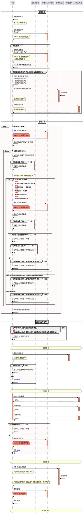

```plantuml
@startuml
!pragma teoz true
scale 1
'hide unlinked
'caption figure 1
'autoactivate on
autonumber 1 "<font color=blue><b>M# "
autonumber stop

'skinparam style strictuml

'skinparam ResponseMessageBelowArrow true
'skinparam MaxMessageSize 100
'skinparam MinClassWidth 100
'skinparam WrapWidth 50
skinparam SequenceGroupBodyBackgroundColor #Snow

'title "中台对接洋葱NGC平台"
participant "中台" as node1
participant "接口平台" as node2
participant "洋葱NGC平台" as node3
participant "富勒系统" as node4
participant "快递公司" as node5
participant "海关系统" as node6

|||
==基础工作==
node1 -> node1 : 准备基础数据
note right of node1 : 客户/店铺/账号
|||
node1 -> node3 : 更新数据字典\n至 BOP
activate node3 #DarkSalmon
note right of node1 : <API> 物流公司列表
return
|||
group 商品备案
    node1 -> node3 : 复制商品数据\n至 BOP、客户门户
    activate node3 #DarkSalmon
    note right of node1 : <API> 商品列表查询\n+ 商品详情查询
    return

    node1 -> node1 : 人工修补和审核备案信息
end

group 确保备案商品有充足的账册库存和实际库存

    node1 -> node1 : 进行 “备货入库” 流程\n* 报关(商品进关区)\n* 收货(可分批次)\n* 理货(可分批次)
    node1 -> node4 ++ #DarkSalmon : 下发入库单(按理货批次)

    node4 -> node4 : 仓内操作
    note right of node1: 更新实际库存
    return

    node1 -> node6 : 申报核注清单
    activate node6 #DarkSalmon
    note right of node1: 更新账册库存
    return
end
'===================================================
||30|
==接收订单==
loop 轮询 - 每30分钟1次
    autonumber resume
    node1 -> node3 : 获取订单列表
    autonumber stop
    activate node3 #DarkSalmon
    note right of node1 #Salmon: <API> 订单列表查询
    return
    ||10|
    node1 -> node1 : 缓存获取到的订单列表数据
    |||
    loop 遍历当中每张订单
        node1 -> node1 : 以RSA公钥解密所有加密字段
        ||10|
        group 订单是存量订单?[是]
            node1 -> node1 : 更新订单列表数据
        end
        ||10|
        note right of node1 : BBC暂订单不支持部分发货
        alt 订单状态 == 已审核\n<color red>AND </color>\n配送信息变更处理状态 != 待处理\n<color red>AND </color>\n无需发货状态 == 需要发货\n<color red>AND </color>\n发货状态 == 未发货\n<color red>AND </color>\n缺货状态 == <空值>\n<color red>AND </color>\n退款状态 == <空值>
            '------
            autonumber resume
            node1 -> node3 : 获取订单详情
            autonumber stop
            activate node3 #DarkSalmon
            note right of node1 #Salmon: <API> 订单详情查询
            return
            ||10|
            node1 -> node1 : 缓存订单详情数据
            ||10|
            group 订单是存量订单?[是]
                node1 -> node1 : 更新订单详情数据
            end
            ||15|
            group 订单详情不包含预售SKU?[是]
                node1 ->o node1 : 订单归入“正常订单”池
                ||10|
                group 订单未在下方队列?[是]
                    node1 ->o node1 : 订单加入“正常订单”事务队列
                end
            else 否
                group 订单是存量订单，且“客户取消”为否?[是]
                    node1 ->o node1 : 订单加入“取消订单”事务队列
                end
            end
        else 无需发货状态 == 全部无需发货 AND 无论其他订单状态如何
            group 订单是存量订单，且“客户取消”为否?[是]
                node1 ->o node1 : 订单加入“取消订单”事务队列
            end
        else 其他状态组合
            group 订单是存量订单，且“客户取消”为否?[是]
                node1 ->o node1 : 订单加入“取消订单”事务队列
            end
        end
    end
    node1 ->o node1 : 清除所有缓存订单数据
end
'===================================================
||30|
==处理“正常订单”==
||10|
group 订单某项SKU没有对应的备案商品\n<color red>OR </color>\n订单某项SKU的数量超过对应备案商品的账册库存和实际库存?[否]
    node1 ->o node1 : 订单归入“异常订单”池
end
||30|
hnote across: 快递单号
||10|
node1 -> node5 : 获取快递单号
activate node5 #DarkSalmon
note right of node1 : 只走"中通快递"
return
||15|
group 取号成功?[否]
    node1 ->o node1 : 重入"取快递单号"事务队列
else 是
    node1 ->o node1 : 前往 <font color=blue><b>M3
end
'===================================================
||30|
hnote across: 三单报关
||10|
activate node1 #DarkSalmon
autonumber resume
node1 -> node6 : 订单申报
autonumber stop
activate node6 #DarkSalmon
return 回执
||10|
node1 -> node6 : 运单申报
activate node6 #DarkSalmon
return 回执
||10|
node1 -> node6 : 清单申报
activate node6 #DarkSalmon
return 回执
deactivate node1
||15|
group 清单申报成功?[否]
    node1 ->x node1 : 订单归入“异常订单“池
else 是
    node1 -> node3 : 推送清关状态
    activate node3 #DarkSalmon
    note right of node1 #Salmon: <API> 清关状态更新
    return
    ||10|
    node1 ->o node1 : 前往 <font color=blue><b>M4
end
'===================================================
||30|
hnote across : 仓库发货
||10|
autonumber resume

node1 -> node4 : 下发仓库服务
autonumber stop
note right of node1 : “仓库状态” 变为 “已下发”
activate node4 #DarkSalmon
node4 -> node4 : 仓内操作
note right of node1 : “仓库状态” 变为 “待出库”，联动触发下一序列项
'activate node1 #DarkSalmon
node4 --> node1
deactivate node4
||10|
node1 -> node3 : 整单发货
activate node3 #DarkSalmon
note right of node1 #Salmon: <API> 整单发货
return
'deactivate node1
||10|
node1 -> node1 : 确认出库

'===================================================
||30|
hnote across : 商品出关区
||10|
node1 -> node6 : 核注单申报
activate node6 #DarkSalmon
return 回执
||10|
node1 -//? : 商品出关区
||10|
node1 ->X node1: 结束
'===================================================
|||
@enduml
```