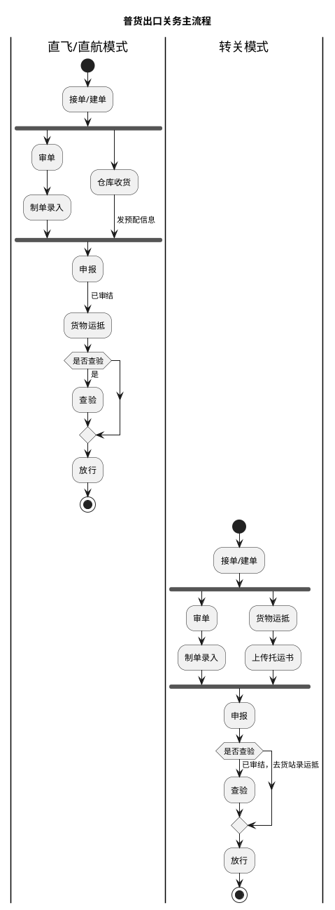
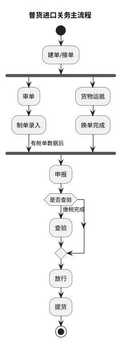

# A：简化版_主流程.1（普货进出口关务总体流程）

> 来源：`temp/流程图SVG/A：简化版_主流程.1.svg`（Visio 跨职能流程图），转换为 PlantUML 泳道活动图（新语法）。

## 普货出口关务主流程

## 普货进口关务主流程

## 转换说明

- 原 SVG 中“查验”均存在旁路线（直飞/直航模式为 货物运抵→放行，转关模式为 申报→放行，进口为 换单完成→放行），均未标注分支条件；上表以“是否查验”判断节点统一表示，箭头文字（已审结、已审结，去货站录运抵、缴税完成）保留在“查验”分支上，与原图标注位置一致。
- 出口两条泳道（直飞/直航模式、转关模式）中，接单/建单后单证链（审单→制单录入）与货物链（直飞为仓库收货、转关为货物运抵→上传托运书）并行汇入“申报”，原图为汇聚连接，此处用 fork/join 表达并行汇聚。
- 进口原图中“换单完成”分别连线至“查验”（顶部）与“放行”（跨过“申报”），已按主流程归并为在“申报”前汇入；“有舱单数据后”原标注于 制单录入→申报 连线上。
- 进口流程原图无泳道，故进口图不设泳道分区。
