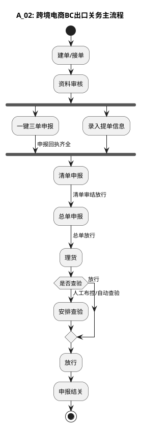

# A：简化版_主流程.2（A_02: 跨境电商BC出口关务主流程）

> 来源：`temp/流程图SVG/A：简化版_主流程.2.svg`（Visio 流程图），转换为 PlantUML 活动图（新语法）。

## 转换说明

- 原图“资料审核”后分两路汇聚到“清单申报”（一键三单申报 / 录入提单信息），未标注并行或择一，此处按并行汇聚（fork/join）表达。
- 原图“理货”后有两条带标注的出口（人工布控/自动查验→安排查验，放行→直接放行），此处以“是否查验”判断节点表达，两条原标注分别保留在两个分支上。
