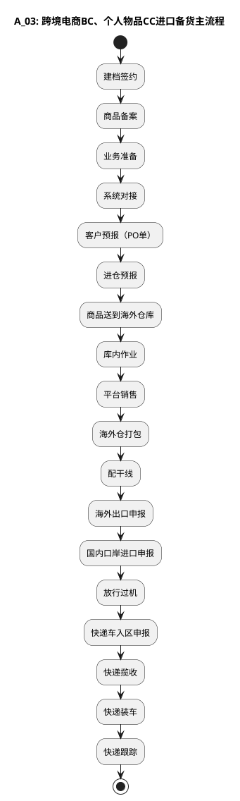

# A：简化版_主流程.3（A_03: 跨境电商BC、个人物品CC进口备货主流程）

> 来源：`temp/流程图SVG/A：简化版_主流程.3.svg`（Visio 流程图），转换为 PlantUML 活动图（新语法）。

```plantuml
@startuml
title A_03: 跨境电商BC、个人物品CC进口备货主流程
start
:建档签约;
:商品备案;
:业务准备;
:系统对接;
:客户预报（PO单）;
:进仓预报;
:商品送到海外仓库;
:库内作业;
:平台销售;
:海外仓打包;
:配干线;
:海外出口申报;
:国内口岸进口申报;
:放行过机;
:快递车入区申报;
:快递揽收;
:快递装车;
:快递跟踪;
stop
@enduml
```
