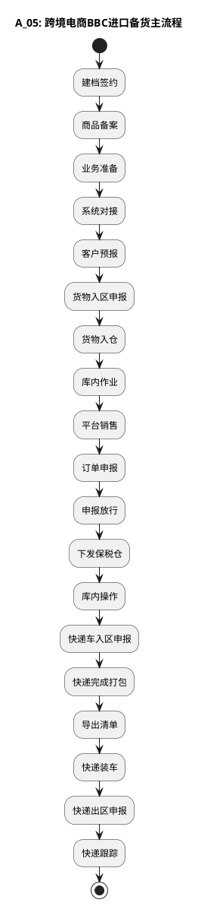

# A：简化版_主流程.5（A_05: 跨境电商BBC进口备货主流程）

> 来源：`temp/流程图SVG/A：简化版_主流程.5.svg`（Visio 流程图），转换为 PlantUML 活动图（新语法）。

```plantuml
@startuml
title A_05: 跨境电商BBC进口备货主流程
start
:建档签约;
:商品备案;
:业务准备;
:系统对接;
:客户预报;
:货物入区申报;
:货物入仓;
:库内作业;
:平台销售;
:订单申报;
:申报放行;
:下发保税仓;
:库内操作;
:快递车入区申报;
:快递完成打包;
:导出清单;
:快递装车;
:快递出区申报;
:快递跟踪;
stop
@enduml
```
