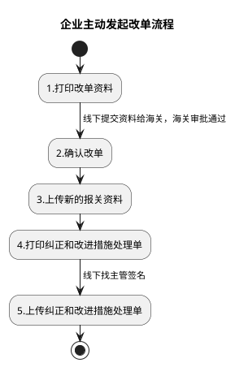
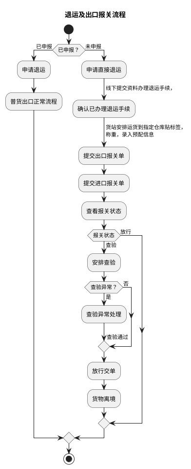
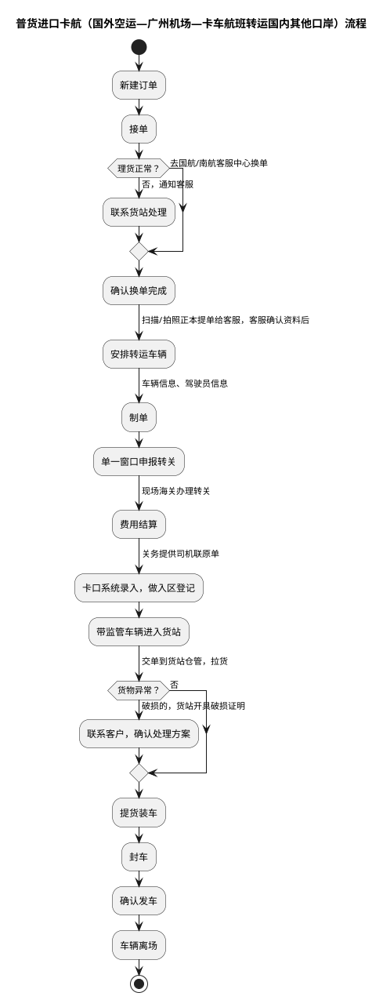
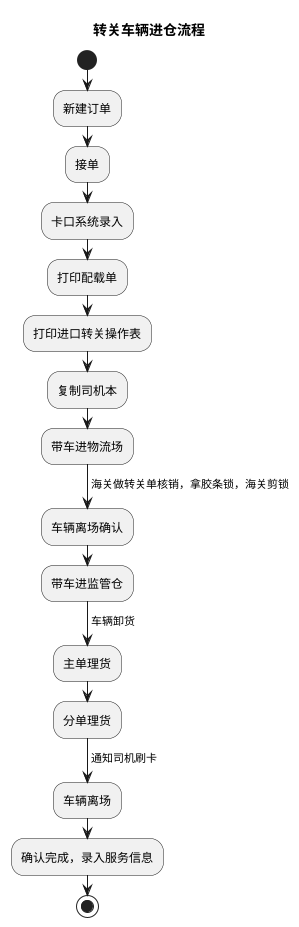
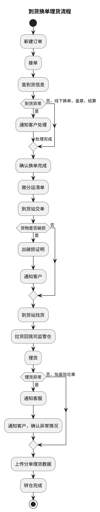
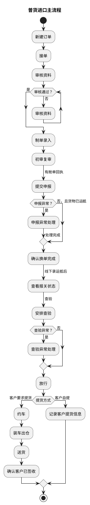

# C：普货进出口关务详细流程.1（B_01: 普货进口流程）

> 来源：`temp/流程图SVG/C：普货进出口关务详细流程.1.svg`（Visio 流程图，含 6 个独立子流程区域），转换为 PlantUML 活动图（新语法）。
> 区域 1、3 的标题来自原图标注，其余区域标题为按内容推断。

## 1. 企业主动发起改单流程（原图标注）

## 2. 退运及出口报关流程（标题为推断）

## 3. 普货进口卡航（国外空运—广州机场—卡车航班转运国内其他口岸）流程（原图标注）

## 4. 转关车辆进仓流程（标题为推断）

## 5. 到货换单理货流程（标题为推断）

## 6. 普货进口主流程（标题为推断）

## 转换说明

- 原图 6 个泳道区域各含独立开始/结束，按内容拆为 6 张图；“报关状态”“提货方式”两个判断条件文字为补充，分支标注均为原图文字。
- 区域 3 中“联系货站处理”原图无后续连线，此处按流向汇入“确认换单完成”。
- 区域 5 中“到货异常”另有一条未标注的到“确认换单完成”的连线，未纳入。
- 区域 6 中“查看报关状态”原图仅标注“查验”一条出口（“查看报关状态→[放行]→结束”的连线经坐标核实属于区域 2），“审核通过？→否→审核资料”的回退用 while 循环表达。
- 原图中的“文档”类注释形状（各步骤操作说明）未纳入流程图。
