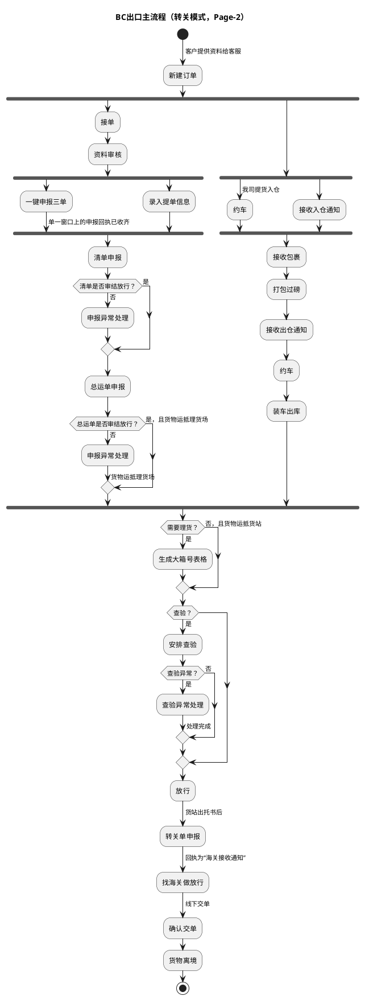

# D：跨境电商BC出口关务详细流程-2（Page-2，BC出口转关主流程）

> 来源：`temp/流程图SVG/D：跨境电商BC出口关务详细流程-2.svg`（Visio 流程图 Page-2），转换为 PlantUML 活动图（新语法）。
> 本页为 BC 出口转关模式主流程，与《D：跨境电商BC出口关务详细流程.1》区域 3 结构相近（货物链少“车辆进出区登记”环节）。

## 转换说明

- “新建订单→接收入仓通知”为原图未标注连线；“接收出仓通知→约车→装车出库”两环原图连线缺失，按节点顺序补齐。
- 本页“查验？”仅有“是”分支连线，未查验直达“放行”的分支未标注、未纳入。
- 原图中的“文档”类注释形状（转关单申报、查验细化等说明）未纳入流程图。
