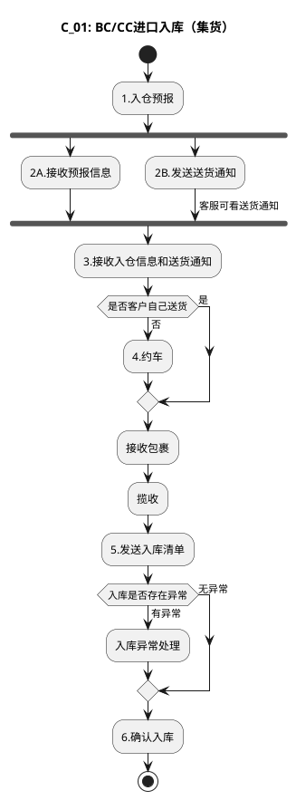

# E：跨境电商BC、个人物品CC进口详细流程.2（C_01: BC/CC进口入库（集货））

> 来源：`temp/流程图SVG/E：跨境电商BC、个人物品CC进口详细流程.2.svg`（Visio 流程图），转换为 PlantUML 活动图（新语法）。

## 转换说明

- “1.入仓预报”后 2A/2B 两路无条件并行汇入“3.接收入仓信息和送货通知”，按 fork/join 表达。
- 原图中的“文档”类注释形状（入仓计划表、入库清单、库存查看说明等）未纳入流程图。
