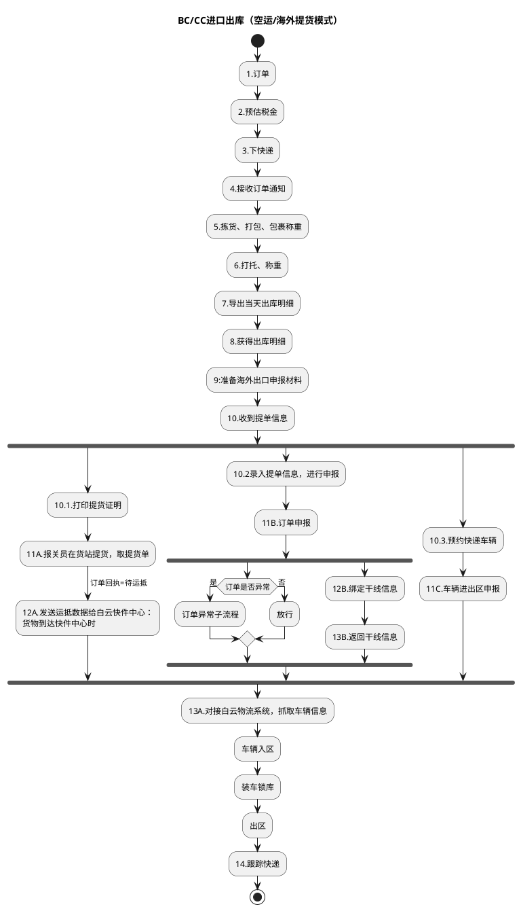
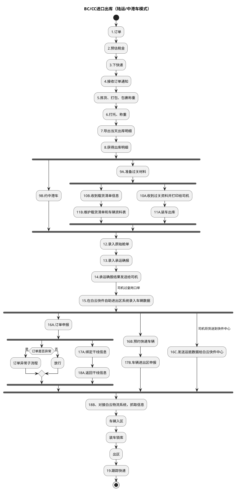

# E：跨境电商BC、个人物品CC进口详细流程.3（B_03: BC/CC进口出库）

> 来源：`temp/流程图SVG/E：跨境电商BC、个人物品CC进口详细流程.3.svg`（Visio 流程图，含 2 个独立子流程区域），转换为 PlantUML 活动图（新语法）。
> 区域标题为按内容推断。

## 1. 出库流程（空运/海外提货模式，标题为推断）

## 2. 出库流程（陆运/中港车模式，标题为推断）

## 转换说明

- 两个区域为同一出库流程的两种模式：空运/海外提货（准备海外出口申报材料、货站提货）与陆运/中港车（约中港车、过关材料、皇岗口岸）。
- 原图中“13B.返回干线信息→结束”（空运模式）与“18A.返回干线信息→结束”（陆运模式）为直达结束的支线；活动图语法无法表达支线提前结束，此处并入主线汇聚，差异以本说明为准。同理“订单异常子流程→结束”在原图中直达结束。
- “10.收到提单信息”（空运）与“15.在白云快件自助进出区系统录入车辆数据”（陆运）后的多路无条件分支按 fork/join 表达。
- 原图中的“文档”类注释形状（车辆信息表、承运确报单、打托称重说明等）未纳入流程图。
