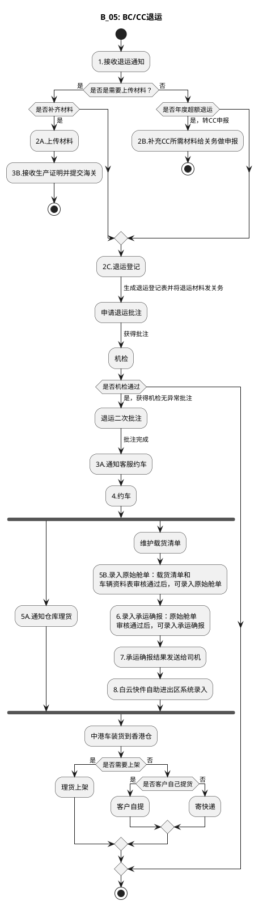

# E：跨境电商BC、个人物品CC进口详细流程.4（B_05: BC/CC退运）

> 来源：`temp/流程图SVG/E：跨境电商BC、个人物品CC进口详细流程.4.svg`（Visio 流程图），转换为 PlantUML 活动图（新语法）。

## 转换说明

- “是否补齐材料→是”与“是否年度超额退运→是，转CC申报”两个分支在原图中分别经“3B.接收生产证明并提交海关”“2B.补充CC所需材料给关务做申报”直达结束，此处用分支内 stop 表达提前结束（与原图单一“结束”节点相比会多出结束符号）；“是否机检通过”仅有“是”分支连线。
- “4.约车”后 5A（通知仓库理货，原图无后续连线）与载货清单/舱单链并行，按 fork/join 表达；“维护载货清单→5B.录入原始舱单”连线原图缺失，按节点顺序补齐。
- 原图中的“文档”类注释形状（退运登记表、生产证明、承运确报等说明）未纳入流程图。
