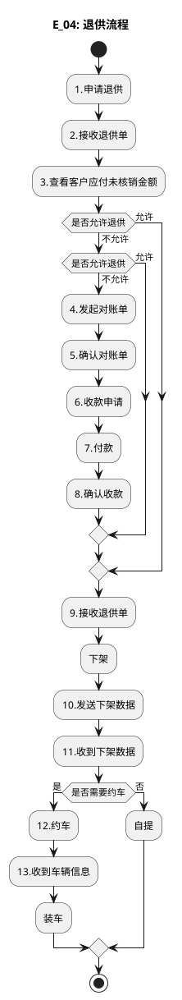

# E：跨境电商BC、个人物品CC进口详细流程.5（E_04: 退供流程）

> 来源：`temp/流程图SVG/E：跨境电商BC、个人物品CC进口详细流程.5.svg`（Visio 流程图），转换为 PlantUML 活动图（新语法）。

## 转换说明

- 原图有两个“是否允许退供”判定：首个“不允许”进入第二个判定，第二个“不允许”进入对账收款链（4.发起对账单→…→8.确认收款），两个“允许”均汇入“9.接收退供单”；嵌套 if 按此表达。
- “是否需要约车→12.约车”的连线原图未标注，此处补“是”。
- 原图中的“文档”类注释形状（退供单、对账单、应付未核销提示等）未纳入流程图。
