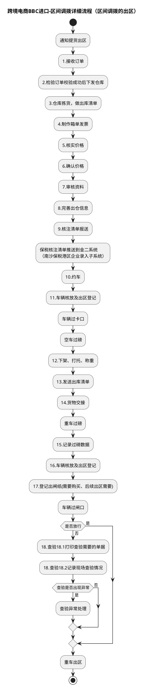
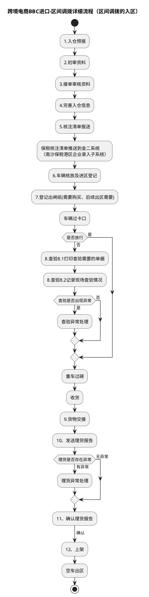

# F：跨境电商BBC进口详细流程.1（跨境电商BBC进口-区间调拨详细流程）

> 来源：`temp/流程图SVG/F：跨境电商BBC进口详细流程.1.svg`（Visio 流程图，含出区/入区 2 个独立子流程区域），转换为 PlantUML 活动图（新语法）。
> 区域标题来自原图标注。

## 1. 区间调拨的出区（原图标注）

## 2. 区间调拨的入区（原图标注）

## 转换说明

- 原图中的“文档”类注释形状（核注清单、核放单、数据异常处理说明、优化点批注等）未纳入流程图。
