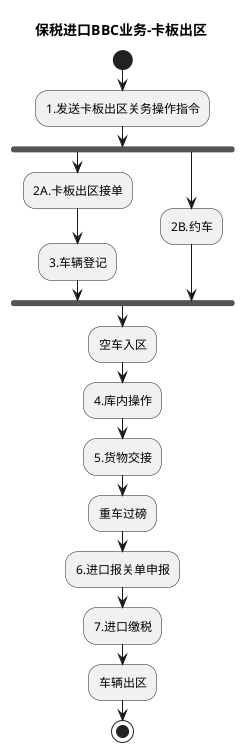

# F：跨境电商BBC进口详细流程.10（B10_9：保税进口BBC业务-卡板出区）

> 来源：`temp/流程图SVG/F：跨境电商BBC进口详细流程.10.svg`（Visio 流程图），转换为 PlantUML 活动图（新语法）。

## 转换说明

- “1.发送卡板出区关务操作指令”后 2A（接单登记链）与 2B（约车）两路无条件并行汇入“空车入区”，按 fork/join 表达。
- 原图中的“文档”类注释形状（进口报关单、出库清单、抬杆申请说明等）未纳入流程图。
