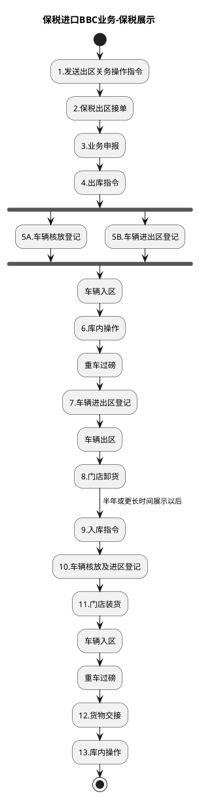

# F：跨境电商BBC进口详细流程.11（B10_10：保税进口BBC业务-保税展示）

> 来源：`temp/流程图SVG/F：跨境电商BBC进口详细流程.11.svg`（Visio 流程图），转换为 PlantUML 活动图（新语法）。

## 转换说明

- “4.出库指令”后 5A/5B 两路无条件并行汇入“车辆入区”，按 fork/join 表达；原图中“车辆入区”“重车过磅”“库内操作”在出区展示、展示后回仓两段各出现一次，为两个独立节点，图中按同名节点分别表达。
- 原图中的“文档”类注释形状（业务申报表、核放单、出库清单等）未纳入流程图。
