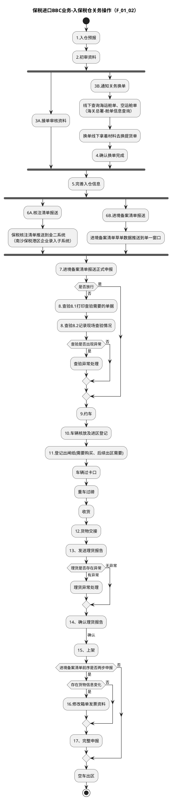

# F：跨境电商BBC进口详细流程.2（F_01_02：保税进口BBC业务-入保税仓关务操作）

> 来源：`temp/流程图SVG/F：跨境电商BBC进口详细流程.2.svg`（Visio 流程图），转换为 PlantUML 活动图（新语法）。

## 转换说明

- “2.初审资料”后 3A（接单审核）与 3B（换单链）、“5.完善入仓信息”后 6A（核注清单链）与 6B（备案清单链）均为无条件并行汇聚，按 fork/join 表达。
- 原图中的“文档”类注释形状（提单、核注清单、进境备案清单、优化点批注等）未纳入流程图。
