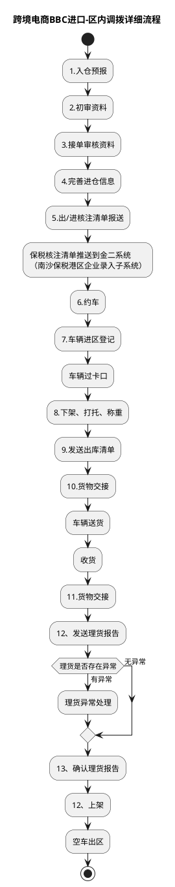

# F：跨境电商BBC进口详细流程.3（跨境电商BBC进口-区内调拨详细流程）

> 来源：`temp/流程图SVG/F：跨境电商BBC进口详细流程.3.svg`（Visio 流程图，页面名 F_01_01），转换为 PlantUML 活动图（新语法）。

## 转换说明

- “理货是否存在异常”的两个分支在原图中未在线上加标注，分支文字（有异常/无异常）按同系列图惯例补充。
- 原图中的“文档”类注释形状（核注清单、理货报告、出库清单等）未纳入流程图。
