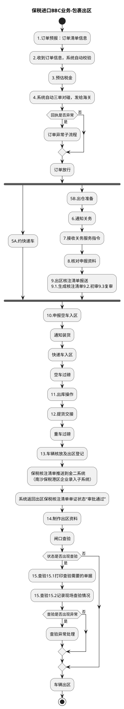

# F：跨境电商BBC进口详细流程.4（B10_3：保税进口BBC业务-包裹出区）

> 来源：`temp/流程图SVG/F：跨境电商BBC进口详细流程.4.svg`（Visio 流程图），转换为 PlantUML 活动图（新语法）。

## 转换说明

- “订单放行”后 5A（约快递车）与 5B（出仓准备→关务申报链）无条件并行汇入“10.申报空车入区”，按 fork/join 表达。
- “系统返回出区保税核注清单单证状态“审批通过”→14.制作出区资料”的连线原图缺失，按节点顺序补齐；“状态是否出现查验→否”的出口原图未连线，按流向汇入“车辆出区”。
- “回执是否异常”原图另有一条未标注的到“订单放行”的连线，未纳入（与否分支同义）。
- 原图中的“文档”类注释形状（核放单、核注清单、出区资料说明等）未纳入流程图。
