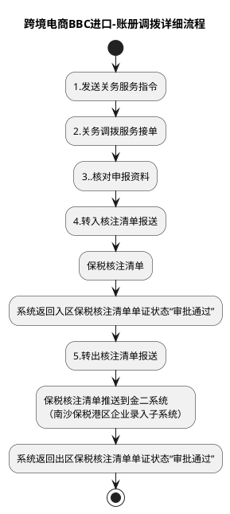

# F：跨境电商BBC进口详细流程.5（跨境电商BBC进口-账册调拨详细流程）

> 来源：`temp/流程图SVG/F：跨境电商BBC进口详细流程.5.svg`（Visio 流程图，页面名 B10_4），转换为 PlantUML 活动图（新语法）。

## 转换说明

- 节点名“3..核对申报资料”“保税核注清单”沿用原图文字。
- 原图中的“文档”类注释形状（账册调拨示例、核注清单说明、优化点批注）未纳入流程图。
