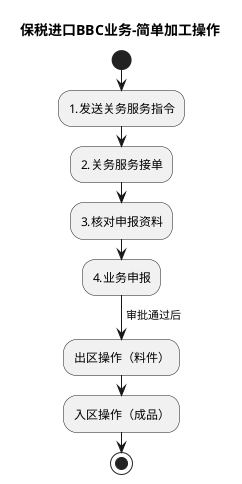

# F：跨境电商BBC进口详细流程.6（B10_5：保税进口BBC业务-简单加工操作）

> 来源：`temp/流程图SVG/F：跨境电商BBC进口详细流程.6.svg`（Visio 流程图），转换为 PlantUML 活动图（新语法）。

## 转换说明

- “出区操作（料件）”“入区操作（成品）”原图为子流程形状。
- 原图中的“文档”类注释形状（业务申报表、组套加工说明等）未纳入流程图。
