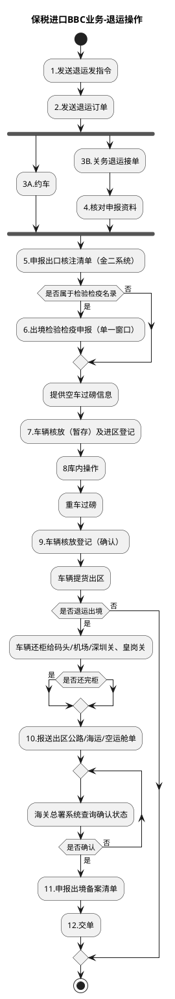

# F：跨境电商BBC进口详细流程.7（B10_6：保税进口BBC业务-退运操作）

> 来源：`temp/流程图SVG/F：跨境电商BBC进口详细流程.7.svg`（Visio 流程图），转换为 PlantUML 活动图（新语法）。

## 转换说明

- “2.发送退运订单”后 3A（约车）与 3B（关务接单审核链）无条件并行汇入“5.申报出口核注清单”，按 fork/join 表达。
- “是否确认→否→海关总署系统查询确认状态”的回退用 repeat while 循环表达。
- “是否退运出境→否”的出口原图未连线，按流向汇入结束；“是否还完柜”原图仅一条出口（未标注），此处补“是”。
- 原图中的“文档”类注释形状（舱单、核放单、出境检验检疫申请表等）未纳入流程图。
