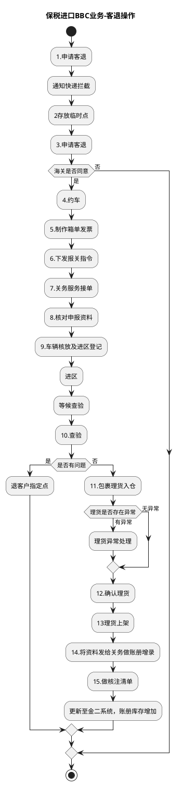

# F：跨境电商BBC进口详细流程.8（B10_7：保税进口BBC业务-客退操作）

> 来源：`temp/流程图SVG/F：跨境电商BBC进口详细流程.8.svg`（Visio 流程图），转换为 PlantUML 活动图（新语法）。

## 转换说明

- “8.核对申报资料→9.车辆核放及进区登记→进区→等候查验→10.查验→是否有问题”一段连线原图未完全画出，按节点顺序及原图分支标注（是/否/有异常/无异常）补齐。
- “是否有问题→是→退客户指定点”原图无后续连线，按流向汇入结束；“海关是否同意→否”的出口原图未连线，按流向汇入结束。
- 原图中的“文档”类注释形状（退货清单、核放单、客退条件说明等）未纳入流程图。
