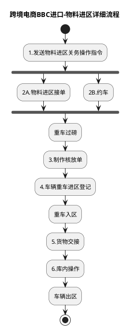

# F：跨境电商BBC进口详细流程.9（跨境电商BBC进口-物料进区详细流程）

> 来源：`temp/流程图SVG/F：跨境电商BBC进口详细流程.9.svg`（Visio 流程图，页面名 B10_8），转换为 PlantUML 活动图（新语法）。

## 转换说明

- “1.发送物料进区关务操作指令”后 2A/2B 两路无条件并行汇入“重车过磅”，按 fork/join 表达。
- 原图中的“文档”类注释形状（核放单、理货报告、车辆进区登记表等）未纳入流程图。
