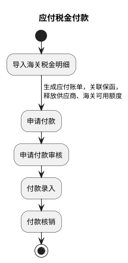
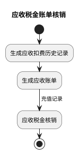
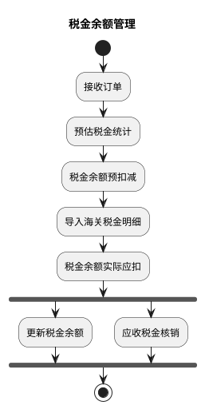
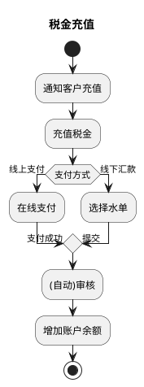

# G：税金管理详细流程（E_01：税金管理）

> 来源：`temp/流程图SVG/G：税金管理详细流程.svg`（Visio 流程图，含 4 个独立子流程），转换为 PlantUML 活动图（新语法）。

## 应付税金付款

## 应收税金账单核销

## 税金余额管理

## 税金充值

## 转换说明

- 原图 4 个泳道区域各含独立开始/结束，按内容拆为 4 个子流程图。
- 应付税金付款中，原图另有一条“申请付款→付款核销”的未标注直连线（跳过审核与录入），未纳入主链。
- 税金余额管理中“税金余额实际应扣”后无条件分为“更新税金余额”与“应收税金核销”（原图为子流程形状）两路，按并行汇聚表达。
- 税金充值的“线上支付/线下汇款”原为带标注分支，判断条件“支付方式”为补充，两个分支标注均为原图文字。
- 原图中的“文档”类注释形状（核销记录、付款记录、应收月结报表、余额计算公式等）未纳入流程图。
