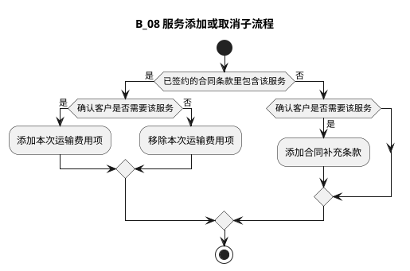

# H：服务添加或取消详细流程（B_08 服务添加或取消子流程）

> 来源：`temp/流程图SVG/H：服务添加或取消详细流程.svg`（Visio 流程图），转换为 PlantUML 活动图（新语法）。

```plantuml
@startuml
title B_08 服务添加或取消子流程
start
if (已签约的合同条款里包含该服务) then (是)
  if (确认客户是否需要该服务) then (是)
    :添加本次运输费用项;
  else (否)
    :移除本次运输费用项;
  endif
else (否)
  if (确认客户是否需要该服务) then (是)
    :添加合同补充条款;
  endif
endif
stop
@enduml
```

## 转换说明

- 原图“添加合同补充条款”无后续连线，此处按流向汇入结束（“完成”）。
