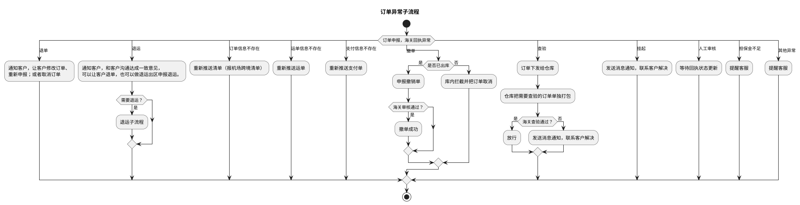

# I：订单异常详细流程（订单异常子流程）

> 来源：`temp/流程图SVG/I：订单异常详细流程.svg`（Visio 流程图），转换为 PlantUML 活动图（新语法）。

## 转换说明

- 原图中“撤单/查验/挂起/人工审核/担保金不足/其他异常”为连接线上的分支标注（Visio 动态连接线文字），此处作为 switch 分支条件保留；“退单/退运/订单信息不存在/运单信息不存在/支付信息不存在”同为原图分支标注。
- “挂起”分支按位置就近归入“发送消息通知，联系客户解决”（与查验不通过分支共用该节点）。
- 原图“需要退运？”仅有“是”分支连线、“海关审核通过？”仅有“是”分支连线，未标注的分支未纳入。
- “海关查验通过？→否→发送消息通知，联系客户解决”及两个“提醒客服”节点在原图中无后续连线，按流向汇入结束。
