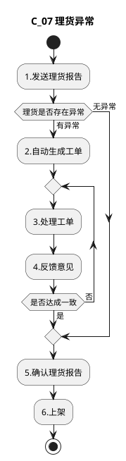

# J：理货异常处理详细流程（C_07 理货异常）

> 来源：`temp/流程图SVG/J：理货异常处理详细流程.svg`（Visio 流程图，泳道：电商客服），转换为 PlantUML 活动图（新语法）。

```plantuml
@startuml
title C_07 理货异常
start
:1.发送理货报告;
if (理货是否存在异常) then (有异常)
  :2.自动生成工单;
  repeat
    :3.处理工单;
    :4.反馈意见;
  repeat while (是否达成一致) is (否) not (是)
else (无异常)
endif
:5.确认理货报告;
:6.上架;
stop
@enduml
```

## 转换说明

- “是否达成一致→否→3.处理工单”的回退用 repeat while 循环表达。
- 原图单一泳道“电商客服”，未设泳道分区。
