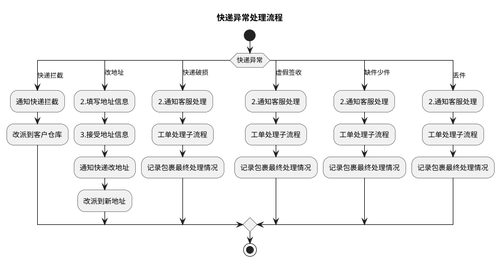

# K：快递异常处理详细流程（快递异常处理流程）

> 来源：`temp/流程图SVG/K：快递异常处理详细流程.svg`（Visio 流程图），转换为 PlantUML 活动图（新语法）。

## 转换说明

- 原图判定“快递异常”的 6 条出口未在线上加标注，分支类型体现在各分支首节点（1A.快递拦截～1F.丢件），此处将类型名作为 switch 分支条件保留。
- “快递破损/虚假签收/缺件少件/丢件”四个分支的后续链路完全相同（通知客服处理→工单处理子流程→记录包裹最终处理情况），原图为四个同名独立节点，此处逐分支重复表达以保持结构一致。
- 原图“2.通知客服处理”另有未标注的直连结束连线，未纳入。
- 原图中的“文档”类注释形状（拦截/破损场景说明）未纳入流程图。
