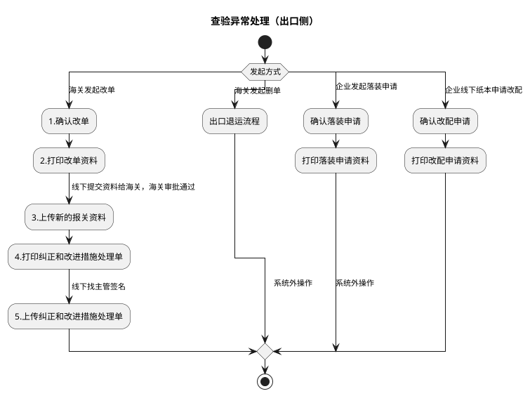
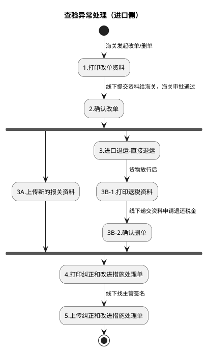

# L：查验异常处理详细流程

> 来源：`temp/流程图SVG/L：查验异常处理详细流程.svg`（Visio 流程图，含出口/进口两个泳道区域），转换为 PlantUML 活动图（新语法）。

## 出口侧（改单/删单/落装/改配）

## 进口侧（改单/删单）

## 转换说明

- 原图两个泳道区域分别对应出口（含出口退运流程）与进口（含进口退运-直接退运），拆为两张图；区域标题为按内容推断。
- 出口侧“开始”的 4 条出口均带原图标注（海关发起改单/海关发起删单/企业发起落装申请/企业线下纸本申请改配），作为 switch 分支保留；“发起方式”为补充的判断条件文字。
- 进口侧“2.确认改单”后无条件分为 3A 与退运退税两路并汇聚于“4.打印纠正和改进措施处理单”，按并行汇聚（fork/join）表达。
- 原图中的“文档”类注释形状（改单资料清单、落装/改配申请材料、操作记录说明等）未纳入流程图。
