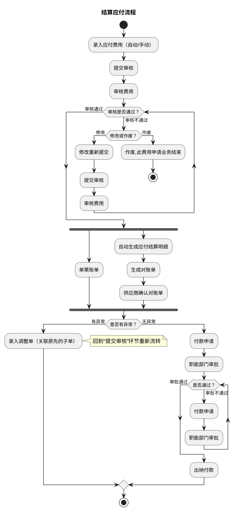

# M：财务结算详细流程.1（结算应付流程）

> 来源：`temp/流程图SVG/M：财务结算详细流程.1.svg`（Visio 流程图，页面名 G），转换为 PlantUML 活动图（新语法）。

## 转换说明

- “审核不通过→修改重新提交→提交审核”与“审批不通过→付款申请”两处回退分别用 while 循环表达；“作废”分支用分支内 stop 表达业务终止。
- “审核通过”后“单票账单”（原图无后续连线）与“自动生成应付结算明细”对账链并行，按 fork/join 表达。
- “是否有异常？→有异常→录入调整单（关联原先的子单）→提交审核”为跨环节回退连线，活动图语法无法回跳，此处以注释说明，主线按无异常走向绘制。
- 原图中的“文档”类注释形状（对账单、银行水单、付款申请单等）未纳入流程图。
