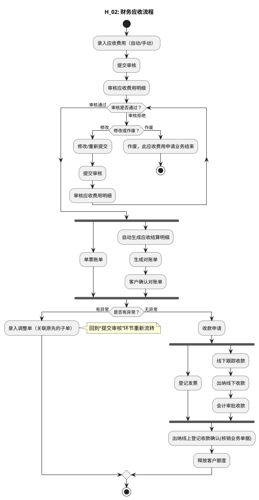

# M：财务结算详细流程.2（H_02: 财务应收流程）

> 来源：`temp/流程图SVG/M：财务结算详细流程.2.svg`（Visio 流程图），转换为 PlantUML 活动图（新语法）。

## 转换说明

- “审核拒绝→修改/重新提交→提交审核”的回退用 while 循环表达；“作废”分支用分支内 stop 表达业务终止。
- “审核通过”后“单票账单”（原图无后续连线）与“自动生成应收结算明细”对账链并行；“收款申请”后“登记发票”（原图无后续连线）与线下收款链并行，均按 fork/join 表达。
- “是否有异常？→有异常→录入调整单（关联原先的子单）→提交审核”为跨环节回退连线，活动图语法无法回跳，此处以注释说明，主线按无异常走向绘制。
- 原图中的“文档”类注释形状（对账单、银行水单、应收发票等）未纳入流程图。
