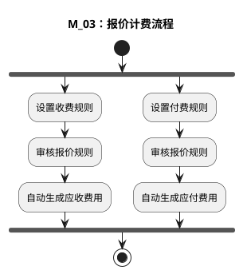

# M：财务结算详细流程.3（M_03：报价计费流程）

> 来源：`temp/流程图SVG/M：财务结算详细流程.3.svg`（Visio 流程图），转换为 PlantUML 活动图（新语法）。

## 转换说明

- 原图中两个“审核报价规则”节点之间有一条连线（审核报价规则→审核报价规则），此处按收费/付费两条并行链简化表达。
- 原图注释说明：根据订单下的服务单生成费用，形成费用后回到 M_01、M_02 的“提交审核”节点。
- 原图中的“文档”类注释形状（收费规则设置说明等）未纳入流程图。
