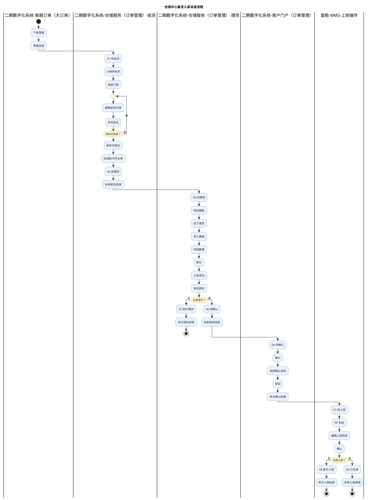
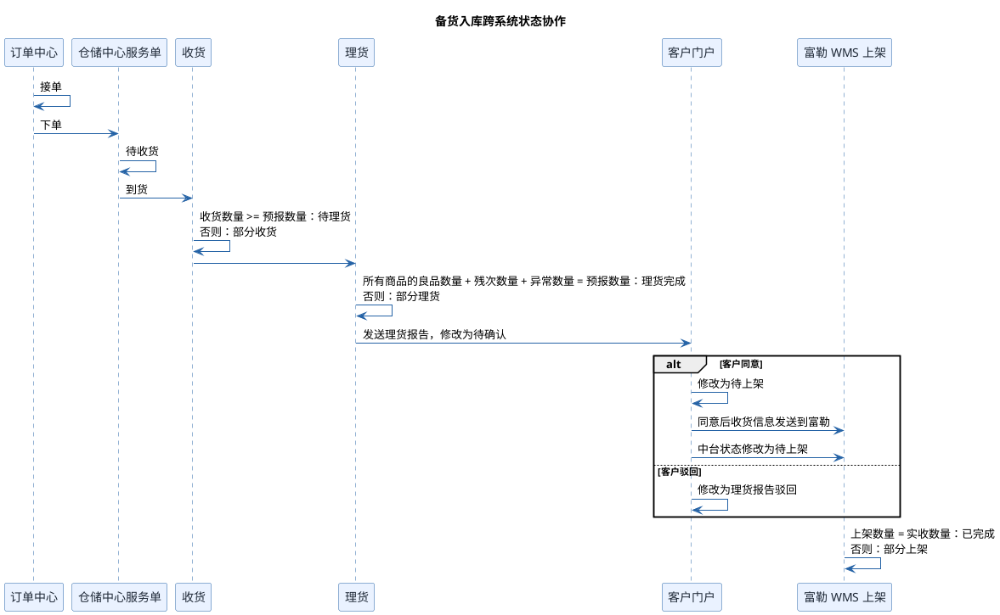
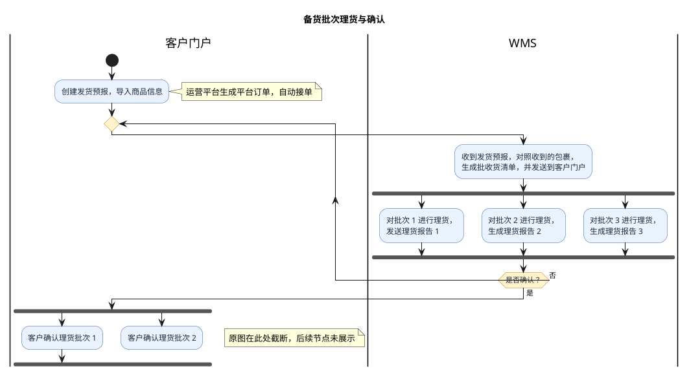

# 高捷物流 BC 个人物品 CC 进口流程

## 1. 需求概览与总体范围

本文件按现有流程资料的顺序，将 BC、个人物品 CC 进口的主流程、备货入库泳道流程、跨系统状态协作和批次理货确认流程转换为可维护的 DSL 示意图。图示用于呈现源资料中已经出现的参与方、处理顺序、状态、分支和结果；源图未说明的字段、异常处理、生效时间及已有业务对象处理不在本文件中推断。

| 顺序 | 源资料 | 本文件中的表达 |
| --- | --- | --- |
| 1 | [1.png](../bms/temp/高捷物流/流程图/BC进口.备货入库/1.png) | D2 主流程总览 |
| 2 | [2.jpg](../bms/temp/高捷物流/流程图/BC进口.备货入库/2.jpg) | PlantUML 泳道活动图 |
| 3 | [3.png](../bms/temp/高捷物流/流程图/BC进口.备货入库/3.png) | PlantUML 时序图 |
| 4 | [4.png](../bms/temp/高捷物流/流程图/BC进口.备货入库/4.png) | PlantUML 批次活动图 |

## 2. BC、个人物品 CC 进口主流程

第一张源图包含备货与集货两条主流程。两条流程均从建档签约、商品备案、业务准备和系统对接开始，经客户预报、海外及国内作业、进出口申报和快递履约后结束；各自的仓内处理环节按源图分别保留。

```d2
vars: {
  d2-config: {
    layout-engine: elk
    theme-id: 104
    sketch: false
  }
  d2-elk-config: {
    "elk.direction": "DOWN"
    "elk.layered.spacing.nodeNodeBetweenLayers": 42
    "elk.spacing.nodeNode": 24
  }
}

classes: {
  process: {
    style.fill: "#EAF2FF"
    style.stroke: "#2563A6"
    style.stroke-width: 1
  }
  terminal: {
    style.fill: "#E8F5E9"
    style.stroke: "#2E7D32"
    style.stroke-width: 1
    shape: oval
  }
  customs: {
    style.fill: "#FFF3CD"
    style.stroke: "#C47F00"
    style.stroke-width: 1
  }
}

grid-columns: 1

stocked: "BC、个人物品 CC 进口（备货）主流程" {
  grid-columns: 1

  outbound: {
    label: ""
    grid-columns: 12
    start: "开始" { class: terminal }
    contract: "建档\n签约" { class: process }
    filing: "商品\n备案" { class: process }
    prep: "业务\n准备" { class: process }
    integration: "系统\n对接" { class: process }
    forecast: "客户预报\n（PO 单）" { class: process }
    warehouse_forecast: "进仓\n预报" { class: process }
    overseas_receive: "商品送到\n海外仓库" { class: process }
    warehouse_ops: "库内\n作业" { class: process }
    platform_sale: "平台\n销售" { class: process }
    overseas_pack: "海外仓\n打包" { class: process }
    trunk: "配干线" { class: process }
  }

  inbound: {
    label: ""
    grid-columns: 8
    end: "结束" { class: terminal }
    tracking: "快递跟踪" { class: process }
    express_load: "快递装车" { class: customs }
    express_pickup: "快递揽收" { class: process }
    vehicle_declare: "快递车入区申报" { class: process }
    release: "放行过机" { class: process }
    import_declare: "国内口岸\n进口申报" { class: process }
    export_declare: "海外出口\n申报" { class: customs }
  }

  outbound.start -> outbound.contract -> outbound.filing -> outbound.prep
  outbound.prep -> outbound.integration -> outbound.forecast
  outbound.forecast -> outbound.warehouse_forecast -> outbound.overseas_receive
  outbound.overseas_receive -> outbound.warehouse_ops -> outbound.platform_sale
  outbound.platform_sale -> outbound.overseas_pack -> outbound.trunk
  outbound.trunk -> inbound.export_declare
  inbound.export_declare -> inbound.import_declare -> inbound.release
  inbound.release -> inbound.vehicle_declare -> inbound.express_pickup
  inbound.express_pickup -> inbound.express_load -> inbound.tracking -> inbound.end
}

consolidated: "跨境电商 BC、个人物品 CC 进口（集货）主流程" {
  grid-columns: 1

  outbound: {
    label: ""
    grid-columns: 12
    start: "开始" { class: terminal }
    contract: "建档\n签约" { class: process }
    filing: "商品\n备案" { class: process }
    prep: "业务\n准备" { class: process }
    integration: "系统\n对接" { class: process }
    forecast: "客户预报" { class: process }
    parcel_receive: "海外仓收到\n小包裹" { class: process }
    unpack_weigh: "小包裹揽收、\n称重" { class: process }
    manifest: "导出\n清单" { class: process }
    trunk: "配干线" { class: process }
    export_declare: "海外出口\n申报" { class: customs }
    import_declare: "国内口岸\n进口申报" { class: process }
  }

  inbound: {
    label: ""
    grid-columns: 6
    end: "结束" { class: terminal }
    tracking: "快递跟踪" { class: process }
    express_load: "快递装车" { class: customs }
    express_pack: "快递完成\n打包" { class: process }
    vehicle_declare: "快递车入区申报" { class: process }
    release: "放行过机" { class: process }
  }

  outbound.start -> outbound.contract -> outbound.filing -> outbound.prep
  outbound.prep -> outbound.integration -> outbound.forecast
  outbound.forecast -> outbound.parcel_receive -> outbound.unpack_weigh
  outbound.unpack_weigh -> outbound.manifest -> outbound.trunk
  outbound.trunk -> outbound.export_declare -> outbound.import_declare
  outbound.import_declare -> inbound.release -> inbound.vehicle_declare
  inbound.vehicle_declare -> inbound.express_pack -> inbound.express_load
  inbound.express_load -> inbound.tracking -> inbound.end
}
```

| 图中环节 | 业务说明 | 进入条件 | 形成结果 |
| --- | --- | --- | --- |
| 备货主流程 | 商品送达海外仓并完成库内作业、平台销售和海外仓打包后进入干线及进出口申报 | 完成建档签约、商品备案、业务准备、系统对接、客户 PO 单预报及进仓预报 | 快递揽收、装车和跟踪完成后结束 |
| 集货主流程 | 海外仓收到小包裹后完成揽收、称重和清单导出，再进入干线及进出口申报 | 完成建档签约、商品备案、业务准备、系统对接和客户预报 | 快递完成打包、装车和跟踪后结束 |

## 3. 备货入库泳道流程

第二张源图从客服订单下发预报开始，依次经过仓储服务收货、仓储服务理货、客户门户确认和富勒 WMS 上架。部分理货和部分上架分别结束当前作业；全部理货后才进入客户确认，全部上架后形成已完成状态。



| 图中环节 | 业务说明 | 进入条件 | 形成结果 |
| --- | --- | --- | --- |
| 预报与待收货 | 客服订单下发预报，预报结束后进入仓储服务的待收货状态 | 客服订单开始本次预报 | `01.待收货` |
| 收货 | 收货人员通过小程序选择订单、编辑收货内容并手写签名；可保存后继续编辑，最终保存并提交 | 订单处于`01.待收货` | 生成批次作业单，进入`04.待理货` |
| 理货 | 导出模板完成线下理货，再导入模板、匹配数据、确认入库并发送报告 | 批次作业单处于`04.待理货` | 未全部理货时进入`05.部分理货`并结束本次理货；全部理货时进入`06.待确认` |
| 客户确认 | 客户在门户选择确认选项并提交 | 理货结果处于`06.待确认` | 本次确认结束，进入`07.待上架` |
| 上架 | 富勒 WMS 通过 RF 系统编辑并确认上架信息 | 作业处于`07.待上架` | 未全部上架时进入`08.部分上架`；全部上架时进入`09.已完成` |

## 4. 备货入库跨系统时序

第三张源图补充了订单中心、仓储中心服务单、收货、理货、客户门户和富勒 WMS 上架之间的消息及状态变化。数量是否达到对应订单数量决定收货、理货和上架环节进入完成状态还是部分完成状态。



| 图中环节 | 业务说明 | 进入条件 | 形成结果 |
| --- | --- | --- | --- |
| 下单 | 订单中心接单后向仓储中心服务单下单 | 订单中心接单 | 仓储中心服务单进入待收货 |
| 收货状态判定 | 收货环节比较收货数量与预报数量 | 仓储中心服务单通知到货 | 收货数量达到或超过预报数量时进入待理货，否则形成部分收货 |
| 理货状态判定 | 理货环节汇总所有商品的良品数量、残次数量和异常数量，并与预报数量比较 | 收货结果进入理货 | 数量相等时理货完成，否则形成部分理货；理货报告发送到客户门户后进入待确认 |
| 客户确认 | 客户门户处理理货报告 | 收到待确认的理货报告 | 同意时进入待上架并向富勒 WMS 发送收货信息；驳回时进入理货报告驳回 |
| 上架状态判定 | 富勒 WMS 比较上架数量与实收数量 | 客户同意并进入待上架 | 数量相等时已完成，否则形成部分上架 |

## 5. 备货批次理货与确认

第四张源图展示客户创建发货预报后，WMS 按批次完成理货报告并等待客户确认；客户未确认时回到 WMS 收货与批次理货环节。源图底部在客户确认理货批次 1、批次 2 的后续箭头处截断，且没有展示批次 3 的客户确认节点，因此本图仅保留可见范围。



| 图中环节 | 业务说明 | 进入条件 | 形成结果 |
| --- | --- | --- | --- |
| 发货预报 | 客户在客户门户创建发货预报并导入商品信息，运营平台生成平台订单并自动接单 | 客户开始备货 | WMS 收到发货预报 |
| 批收货清单 | WMS 对照收到的包裹生成批收货清单，并发送到客户门户 | WMS 收到发货预报和包裹 | 进入按批次理货 |
| 批次理货 | WMS 分别处理批次 1、批次 2、批次 3，并形成对应理货报告 | 批收货清单已形成 | 等待是否确认；未确认时回到 WMS 继续处理 |
| 客户确认 | 源图仅展示客户确认理货批次 1、批次 2 | 客户确认理货结果 | 后续节点、批次 3 的确认去向及最终结果未在源图中展示 |
