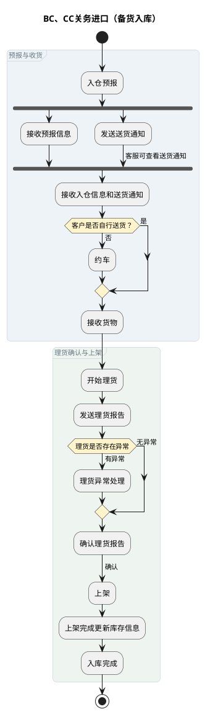
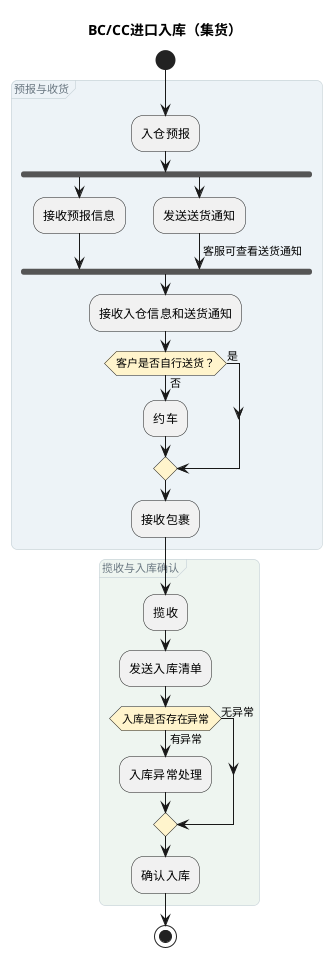
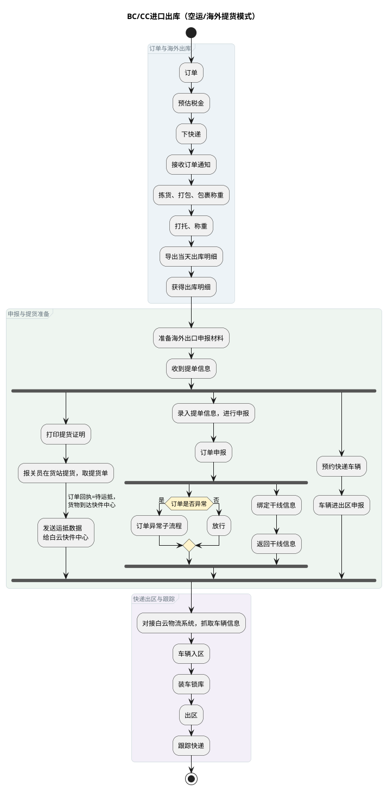
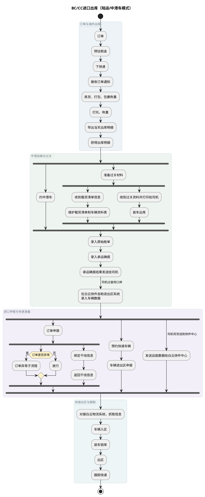
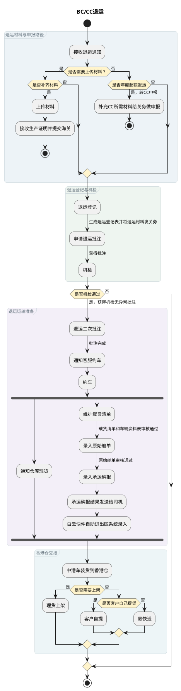
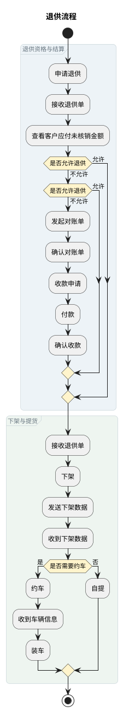

# 第007篇

> 本篇定位：跨境电商BC、个人物品CC进口详细流程；主要内容：备货与集货入库、空运与陆运出库、退运和退供；文档角色：共享规则档；文档ID：94C028FB51

## 1. 业务范围

本文定义 BC/CC 进口的入库（备货/集货）、出库（空运/陆运）、退运与退供流程，说明备货与集货、空运与陆运链路的差异。主流程总览见《业务模式主流程总览》第 5、6 节。

## 2. BC、CC关务进口（备货入库）

## 3. BC/CC进口入库（集货）

## 4. BC/CC进口出库（空运/海外提货模式）

## 5. BC/CC进口出库（陆运/中港车模式）

## 6. BC/CC退运

## 7. 退供流程

