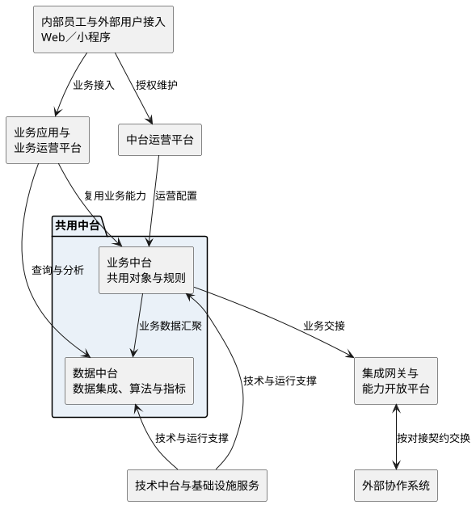

# 第012篇

> 本篇定位：系统架构与非功能需求；主要内容：架构分层、共用能力、统一接入与数据服务约束；文档角色：非功能需求档；文档ID：B41CD8B36C

## 1. 适用范围

本篇定义跨模块的系统架构与非功能约束。架构能力服务于各业务篇已经定义的场景；操作资格、业务触发、状态、计算、结算时点与接口结果按相应业务篇执行。

## 2. 架构分层与职责

| 层次或平台 | 适用对象与职责 | 约束 |
| --- | --- | --- |
| 前端互动层 | 面向内部员工与外部用户，以Web端和小程序提供接入 | 按角色与场景开放入口，各渠道仍执行相应操作与数据授权 |
| 业务应用与业务运营平台 | 承接客户业务与内部各业务板块的操作 | 应用复用业务中台能力，保留不同业务模式的处理差异 |
| 中台运营平台 | 维护共用基础资料、消息、流程及业务运营配置 | 维护资格受相应业务授权约束，不因平台管理身份获得全部业务操作权 |
| 业务中台 | 为各业务应用提供可复用的业务能力 | 共用对象与规则统一维护，领域专属规则由所属业务模块定义 |
| 数据中台 | 汇聚内外部数据，通过数据集成、算法与指标提供企业级数据服务 | 数据来源、指标含义与统计期间采用对应业务定义 |
| 技术中台与基础设施服务层 | 为上层应用、中台与数据服务提供共用技术及运行支撑 | 技术支撑不改变业务操作资格、对象归属或已定义的处理结果 |
| 集成网关 | 统一外部接口接入方式，连接内部工具与生态系统 | 各对接方的身份、报文、字段映射、回执及失败处理保持独立契约 |
| 能力开放平台 | 向生态伙伴开放企业共用能力 | 按已定义的业务与接口范围开放，不因共用能力存在而开放内部数据或管理操作 |

**系统分层与共用能力**

图中连线表示分层职责与能力使用关系，不表示具体接口调用顺序。外部数据汇聚、查询与业务写入边界分别按本篇的统一接入及数据服务约束执行。

## 3. 共用能力与统一接入

| 能力 | 系统级要求 | 业务边界 |
| --- | --- | --- |
| 统一身份 | 用户中心统一承接登录、注册及用户、用户组、组织、员工信息，支持多租户、多组织视图，为单点登录和统一权限提供身份基础 | 登录、注册入口及账号操作范围沿用各端已有定义；组织与租户的对应关系不据此推定 |
| 统一授权 | 各入口共用身份与授权判定基础 | 菜单、页面、按钮、数据和字段范围按[访问权限与业务条件](../PRD.高捷物流系统.第08册.运营支撑/PRD.高捷物流系统.第067篇.角色与访问权限.5E31456F30.md#doc-5E31456F30-access-boundary)执行；跨系统接入与单点登录均不扩大授权 |
| 共用规则 | 规则中心统一管理规则参数与决策树，并提供解析、计算能力，供各业务调用 | 规则内容、配置资格、触发条件与计算结果仍按各业务篇定义 |
| 外部接入 | 集成网关与能力开放平台承接钉钉、企业微信、金蝶、WMS、航司、货站、海关及客户平台等系统的业务交接 | 按已定义的场景和契约接入；客户与平台专属约定见[客户数据交接范围](../PRD.高捷物流系统.第09册.系统对接/PRD.高捷物流系统.第072篇.客户接口与数据交接.58EB46CA94.md#doc-58EB46CA94-scope)，开放下单与OMS交接见[接入边界与标识](../PRD.高捷物流系统.第09册.系统对接/PRD.高捷物流系统.第073篇.开放接入与OMS同步.14B128CCE3.md#doc-14B128CCE3-scope) |

## 4. 数据服务与读写分离

数据服务中心汇聚各业务中心的数据，通过准实时数据库流复制，支持跨中心关联查询与业务报表。数据查询与业务写入分离：数据服务中心只提供查询，业务修改仍由对应业务中心处理。

| 约束 | 适用范围 | 判断口径 |
| --- | --- | --- |
| 只读查询 | 数据服务中心的查询与报表消费 | 查询入口不得直接修改业务中心数据 |
| 业务语义一致 | 跨中心关联、统计与展示 | 保留对象标识、组织归属及各业务的状态含义，不将不同业务状态合并为统一处理结果 |
| 授权一致 | 跨中心查询及其下载、导出 | 按调用用户与目标对象的既有授权范围提供数据，关联查询不额外扩大访问范围 |
| 生成周期独立 | 报表与经营指标 | 数据复制频率不替代业务统计期间、报表生成时间与结算时点；具体口径见[报表管理](../PRD.高捷物流系统.第08册.运营支撑/PRD.高捷物流系统.第070篇.报表管理.CF2AF4B8B2.md#doc-CF2AF4B8B2-section-4743cdb45c83) |

