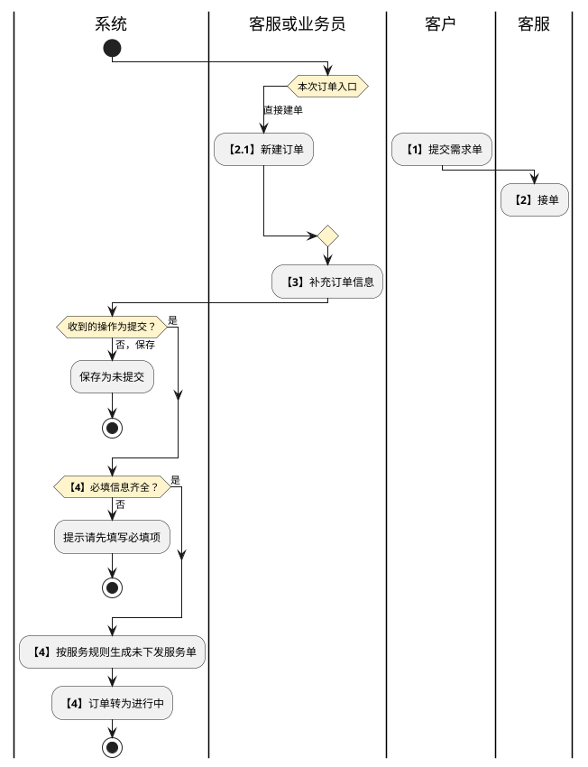

# 第012篇

> 本篇定位：综合订单管理；主要内容：跨业务建单、服务编排、订单协作与信息交接；文档角色：模块档；文档ID：C97EF7E0FE

共用定义见[综合订单与服务协同实体](../PRD.高捷物流系统.第08册.运营支撑/PRD.高捷物流系统.第065篇.数据字典.7A3D9E1F50.md#doc-7A3D9E1F50-integrated-order-model)、[综合订单与客户订单权限](../PRD.高捷物流系统.第08册.运营支撑/PRD.高捷物流系统.第066篇.角色与访问权限.5E31456F30.md#doc-5E31456F30-integrated-order-access)。

## 1. 业务范围与关联

综合订单记录高捷与客户的交易需求，支持客服或业务员直接建单，也接收客户门户需求单。订单包含基本信息、客户、总运单、客户分单、货物、服务与附件；提交后按所选服务生成下游服务订单，持续汇总服务状态、节点轨迹及费用。

本篇定义综合订单入口的共同行为。空运工作台的主订单、子订单合成及待订舱、待补录等专有生命周期仍见[空运订单创建](PRD.高捷物流系统.第020篇.空运-订单管理.5029269CA8.md#doc-5029269CA8-section-e5c5405adb52)。两类入口的订单身份、状态映射和重复建单防止规则尚未统一，不把“已接单”等同于空运“待补录”，也不据来源文件版本覆盖专用规则。

总运单及其分单的录入、查询和作废完整定义归[综合总运单与分单资料](PRD.高捷物流系统.第013篇.综合总运单与分单资料.0B2997FBF5.md#doc-0B2997FBF5-general-waybill-records)。订单中的客户分单号用于引用总运单分单，不等同于另一个业务订单号。

## 2. 订单形成与提交

客服或业务员在与客户签订合同后建单；来源未定义是否必须关联有效合同及系统如何阻断无合同建单，不能把业务前提扩写为已确认的自动校验。

| 步骤 | 执行方 | 处理 | 接续 |
| --- | --- | --- | --- |
| 1 | 客户 | 在客户门户提交入仓预报、货物出口等需求单 | 运营平台形成待接单记录，进入步骤2 |
| 2 | 所属部门客服 | 接收需求并准备补充订单 | 进入步骤3 |
| 2.1 | 客服或业务员 | 不经客户门户，直接新建订单 | 进入步骤3；与步骤1、2是不同入口 |
| 3 | 客服或业务员 | 补充基本、客户、总运单、货物、服务及附件信息 | 可保存未提交订单，或进入步骤4 |
| 4 | 客服或业务员、系统 | 校验必填信息后提交，按服务下发规则生成未下发的服务单 | 订单进行中，服务进入各业务部门或供应商门户 |

此图结束于订单提交，不表示各下游服务履约完成；客户发起与直接建单并非必须顺序发生。接单资格执行第4章。

本篇的客户需求入口由客服接单、补充再提交生成服务，而[客户门户需求提交](PRD.高捷物流系统.第014篇.客户门户订单管理.C90EB28313.md#doc-C90EB28313-demand-orders)又规定客户提交时生成服务。首次创建时点、客服后续增量下发和两端共用服务身份尚未统一，不能在两个入口分别重复生成。

| 操作 | 处理与反馈 |
| --- | --- |
| 保存 | 保留已输入内容，切换为详情查看态，订单状态为未提交。保存是否也须校验必填项，用例与按钮说明不一致，待确认。 |
| 提交 | 必填项校验失败时提示“请先填写必填项”；成功后保存订单，状态为进行中。 |
| 返回 | 二次确认后放弃本次未保存修改；取消则留在编辑页。 |

### 2.1 分单、货物与附件维护

**客户分单**

- 分单号支持手工输入或从当前总运单的分单中选择；输入时模糊匹配，无匹配时可保留输入值，允许编辑或清空。
- 一主多分时，按分单分别维护货物及服务。未填写分单号时，提交后按地区代码+YYMM+5位流水生成。
- 删除分单须确认，同时删除该分单下的货物与服务配置；已有下游服务时的删除限制见第4章。

**货物明细**

- 查询按输入模糊匹配；清空后查询或重置，恢复显示全部货物。
- 模板随业务类型切换，下载为Excel。导入覆盖当前货物明细；已有内容时须提示覆盖风险并确认。字段不符或必填项为空时，整次导入失败，提示检查后重新导入。
- 添加时在末尾追加一行。删除须勾选并二次确认；未勾选时提示“请勾选至少一条记录”。

**附件**

- 支持上传本地文件，单文件大小限制20M；记录附件类型、名称、上传人及时间。
- 按服务类目控制下游可见性：勾选某类后，该类全部相关服务订单可见；取消勾选则不可见。提交后仍可调整可见性；删除原附件后，下游同步停止显示。
- 待确认：初始可见类目有“全部服务类型”和“已填写服务项的类型”两种口径；上传、删除的允许状态写为待接单、进行中，与新建未提交入口不一致。

## 3. 服务配置与下发

服务类型分为我司服务、客自处理、委外服务：

| 服务类型 | 处理规则 |
| --- | --- |
| 我司服务 | 默认取内部供应商和对应业务部门。 |
| 客自处理 | 不生成服务订单。 |
| 委外服务 | 向供应商门户下发；合同、供应商资格及失败反馈按供应商门户与服务协同规则执行。 |

| 服务类别 | 拆单粒度 | 下游去向 |
| --- | --- | --- |
| 干线服务 | 每个订单、每个服务项、每条记录分别生成 | 订舱进入空运/海运干线服务；约中港车进入陆运干线服务；打板进入打板服务 |
| 仓储服务 | 每个分单的每条服务记录生成 | 仓储服务列表 |
| 关务服务 | 按分单形成服务单，包含选择的服务项；同服务项多条记录时分别生成 | 按业务类型进入普货、BC、CC或BBC关务；多服务项多条记录的组合配对算法待确认 |
| 运输服务 | 每个分单的每条服务记录生成 | 运输服务列表 |
| 地面操作 | 每个分单、每个服务项、每条记录分别生成 | 预配发送保留服务记录但不单列可见服务单；货站安检、清关派送进入各自模块 |
| 增值服务 | 每个分单、每个服务项、每条记录分别生成 | 增值服务列表 |

无客户分单的一主一单场景如何使用“每个分单”粒度，干线打板的选择入口，以及预配“提交生成”与空运“手动发送才生成”规则的对应关系待确认。

切换服务类别时展示该类服务项；类别标识根据是否勾选服务项高亮。源文要求首次切换新类别默认勾选全部服务项；仅切换查看是否应改变已选服务，需确认。添加服务记录采用该服务项初始值；只有勾选记录才显示删除按钮，确认后删除。删除全部记录时拒绝，提示至少保留一条记录；不需要该服务时取消勾选服务项。

订单提交只为尚未下发的服务记录生成服务单。详情中的下发服务仅作用于已保存、尚未生成服务订单的服务记录，须二次确认；不因再次提交重复生成已有服务单。

### 3.1 服务项目联动

| 条件 | 可选服务项或附加信息 |
| --- | --- |
| 干线+空运 | 订舱；航司代码仅此场景显示 |
| 干线+海运 | 订舱 |
| 干线+陆运 | 约中港车 |
| BC进口、CC进口 | 国内清关 |
| BC出口 | 国内报关，是否转关默认否 |
| BBC一线进境、包裹出区 | 国内清关 |
| BBC区间调拨、区内调拨 | 国内报关；需出区仓库、转出账册、进区仓库、转入账册 |
| BBC简单加工、物料进区、卡板出区、保税展示、退供、退运 | 国内报关 |
| 普货进口 | 国内报关、换单、查验；国内报关默认代理报关，是否转仓默认否 |
| 普货出口 | 国内报关、查验；国内报关默认代理报关，是否转关默认否 |
| 其他业务 | 国内报关 |
| 地面操作 | 预配发送、货物安检、清关派送 |
| 增值服务 | 默认拆盒、贴标、其他；基础数据维护新服务项后，使用者可选择并填写该项信息 |

### 3.2 界面原型概述：服务配置

同一服务项的表格通常包含序号、服务类型、供应商、部门、备注；序号自动递增只读，其他按资格可编辑。服务类型必选且默认我司服务；部门在我司服务时必填，其他类型可空；供应商在客自处理时通常可空。预配发送及增值供应商存在专项差异，不强套共性。

| 字段或控件 | 适用条件 | 个别界面约束或可见反馈 |
| --- | --- | --- |
| 我司服务可选我的供应商中集团内部机构 | 共用供应商 | 通常默认广东高捷；运输服务默认航晟物流 |
| 航司代码、预计进港日期、备注 | 干线 | 空运我司服务的航司代码必填，取航司管理；日期可选。空运部门默认空运产品组，海运默认海运客服部，打板默认打板组 |
| 选择仓库、预计入仓时间、备注 | 仓储 | 我司服务仓库必选，取仓库基础数据；预计入仓时间必填；部门默认仓库部 |
| 报关类型、是否转关/转仓、调拨仓库及账册、备注 | 关务 | 按3.1联动；部门默认关务部；调拨仓库选基础数据、账册手工录入，四项必填 |
| 提货地点省市区、提货详细地址、提货时间、提货联系人及电话、送货地点省市区、送货详细地址、送货时间、送货联系人及电话、备注 | 运输 | 提送货信息必填，备注可空；部门默认运输部 |
| 序号、供应商、备注 | 预配发送 | 供应商必填，取基础数据的预配发送供应商；无服务类型与部门列 |
| 共用字段、货站 | 货物安检 | 货站必选，取货站基础数据；部门默认关务部 |
| 共用字段 | 清关派送 | 部门默认关务部 |
| 共用字段、选择商品 | 增值服务 | 部门默认仓库部；供应商源表必填且取预配发送供应商，与通用供应商口径存在冲突，待确认 |
| 序号、商品名称、商品条形码、商品HS编码、规格型号、数量、勾选、确定、取消 | 增值商品弹窗 | 从本分单货物信息只读带入；品名兼容商品名称/中文品名，规格兼容规格型号/中文品名及规格 |

## 4. 状态、协作与修改

### 4.1 订单状态与操作资格

| 操作 | 状态条件 | 人员及处理结果 |
| --- | --- | --- |
| 接单 | 待接单，单条 | 所属部门客服或主管确认后转已接单；其他人员提示无权限，其他状态提示仅待接单可接单 |
| 提交 | 未提交，单条 | 仅建单人确认后提交；不满足人员或状态条件分别拒绝；生成未下发的服务并转进行中 |
| 删除订单 | 未提交，单条 | 仅建单人，确认后不再显示；不将删除等同于作废或取消 |
| 订单流转 | 已接单或未提交 | 选择目标组织、部门及业务员，流转后标记是，按业务类型在目标列表展示；目标接单方式及后续权限待确认 |
| 取消订单 | 进行中，单条 | 确认后转已取消。源文分别写接单人及主管、建单人及主管、所属部门客服及主管，完整人员范围待确认 |
| 编辑订单 | 未提交、待接单、进行中 | 详情按钮限定建单人；其他状态表又允许已接单编辑，两者待统一；字段限制见4.3 |
| 完成订单 | 人工完成，或所有服务均服务完成 | 转已完成，仅查看；人工完成资格、无服务订单的自动完成条件待确认 |
| 拒接 | 客户门户进入的待接单需求有拒接入口 | 源文未给出完整资格、结果和拒接后再提交规则，不能用取消代替 |

已完成、已取消订单只读。没有操作资格时，按钮是否隐藏及是否保留只读入口按角色权限篇维护；在执行端仍需验证资格，不只依赖按钮可见性。

### 4.2 服务状态汇总与取消

| 下游服务记录集合 | 订单展示状态 |
| --- | --- |
| 未选择该类服务 | 空 |
| 至少一个服务单待接单 | 待服务 |
| 不存在待接单，但存在进行中 | 服务中 |
| 所有服务单仅为已完成、已终止或已取消 | 服务完成 |

同一类服务以待接单优先，其次进行中，最后终态汇总。列表点击服务状态进入节点轨迹，不把服务完成等同于每张服务单均成功完成。

上游取消服务允许作用于待接单或进行中的服务单，确认后标记“上游取消服务”为是：待接单自动转已取消且下游只读；进行中不直接改变状态，由下游业务部门人工取消或终止。取消与终止是否计费分别按对应服务规则处理。编辑正文一处写“只对进行中”，与后续待接单分支不一致，待确认入口资格。

编辑页的取消服务仅支持单选，不因订单列表存在批量工具而扩大服务取消范围。

### 4.3 界面原型概述：编辑限制

| 界面区域 | 未提交或待接单 | 进行中 |
| --- | --- | --- |
| 基本信息 | 业务类型、业务模式、申报模式锁定，其他可编辑 | 全部只读 |
| 客户信息 | 可修改 | 全部只读 |
| 总运单 | 可修改 | 只允许修改总运单号及进入补录 |
| 货物信息 | 可增删改 | 可增删改，保存后同步下游服务单；下游申报完成后的变更边界待确认 |
| 服务信息 | 可增删改 | 可添加、取消；提交新增服务后生成新服务单，取消按4.2处理 |
| 分单删除 | 确认后删除该分单的货物与服务 | 既有分单无删除按钮，仅本次编辑新增分单可删 |
| 附件 | 见2.1中待统一的入口状态 | 可增删及调整服务可见性，下游同步 |

提交编辑后显示详情查看态；返回仍需确认是否放弃修改。已接单状态未出现在该限制表中，不能擅自套用待接单或进行中规则。

## 5. 界面原型概述：建单

新建时字段可编辑，系统生成值或下表标明的关联值只读；业务必填性在提交时校验。界面按业务类型、模式与运输方式展示相应区域，不展示无关的输入项。

### 5.1 基本、客户与运输信息

| 字段或控件 | 适用条件 | 个别界面约束或可见反馈 |
| --- | --- | --- |
| 业务类型、业务模式、财务组织名称、所属部门、客服、业务员、是否流转、流转组织、流转部门、原业务员、备注 | 基本信息 | 类型为BC/CC/BBC/普货/其他，再联动进出口；BBC仅进口。模式按类型取得，源文只写BC进口及BBC进口显示，与CC集货/备货场景的差异待确认 |
| 财务组织、所属部门、客服、业务员 | 组织与人员 | 组织、部门默认当前账号的首个归属，可下拉调整；客服只读当前账号；业务员可模糊检索选择；主体字段必填 |
| 是否流转、流转组织、流转部门、原业务员 | 流转信息 | 默认否；为是才显示后三项并必填；原业务员在源表另写业务员，目标与来源含义待确认 |
| 客户名称、联系人姓名、联系人电话、联系人邮箱、备注 | 客户信息 | 客户来自我的客户，可模糊检索；联系人信息自动带出且可修改，四项必填；备注可空，最多500字 |
| 运输方式、始发港、目的港、总运单号、总运单信息补录 | 总运单 | 运输方式空运/海运/陆运；前三项通常必填，其他业务则全部可空；港口源表取空港管理，海运/陆运适配待确认 |
| 总运单号 | 运单回填 | 可手工填写；订舱或约中港车返回后覆盖手工值。补录入口已填单号则带入并锁定，未填则允许录入 |
| 客户分单号、添加、删除、分单切换 | 客户分单区域 | 一主多分时显示，每个分单有独立货物和服务信息；默认编号及删除规则见2.1 |

### 5.2 各业务货物明细

每行序号自动递增；商品名称、品名等手工字段可编辑。BC出口、BC进口集货、CC进口和BBC进口的毛净重使用kg并保留两位小数；普货预计毛重的精度来源未定，不套用上述限制。件数或商品数量的整数约束按对应行执行。模板按下表字段联动。

| 字段或控件 | 适用条件 | 个别界面约束或可见反馈 |
| --- | --- | --- |
| 序号、中文品名、英文品名、特殊货物、预计件数、预计毛重、预计体积 | 普货进口/出口 | 中文品名及预计货量必填；中英文品名各最多500字；特殊货物选锂电池、危险品、生鲜、机械 |
| 序号、商品HS编码、商品名称、规格型号、数量、总毛重、总净重、原产国代码 | BC出口 | 商品名称必填；数量为整数，毛净重两位小数 |
| 序号、商品名称、规格型号、数量、总毛重、总净重 | BC进口集货 | 商品名称必填；数量整数，毛净重两位小数 |
| 序号、商品名称、规格型号、批次号、商品条形码、数量、保质期、生产日期、托盘尺寸 | BC进口备货 | 商品名称必填，数量整数；保质期源表写日期而非天数，业务含义待确认；源字段“生成日期”结合截图指生产日期，需统一受控名称 |
| 序号、商品HS编码、商品名称、规格型号、总毛重、总净重、数量、原产国代码 | CC进口 | 商品名称必填；数量整数，毛净重两位小数 |
| 序号、商品ID、海关编码、品牌、商品条形码、中文品名及规格、数量、总毛重、总净重、原产国 | BBC进口 | 商品ID及商品条形码必填；原产国显示名称；数量整数，毛净重两位小数 |

货物统称、预计最大尺寸或其他界面中出现但未在此字段表定义的列，按相应专项建单场景保留，不从空白表格推导数值上限。CC出口的详细业务及货物模板在源文中未展开。

## 6. 界面原型概述：列表、详情与轨迹

### 6.1 列表查询与统计

订单按空运、电商的BC/CC/BBC及其他业务分入口或页签展示，默认近一个月。列表查询为空时提示“请先选择条件”，否则组合筛选；重置只恢复初始条件，不在再次查询前刷新当前结果。查询区可展开、收起；自定义列配置保存到本地。

| 字段或控件 | 适用条件 | 个别界面约束或可见反馈 |
| --- | --- | --- |
| 财务组织名称、订单号、总运单号、客户分单号、客户名称、业务员、是否流转、建单日期 | 查询栏 | 三类单号换行批量输入；组织多选，客户及业务员支持模糊检索再选择，是否流转单选；建单日期为起止日期 |
| 总计、未提交、待接单、进行中、已完成、已拒接、已取消 | 状态导航 | 总计和终态默认近一个月，未提交/待接单/进行中默认全部；指定建单日期后按该区间统计。已拒接/已取消说明误取已完成，其真实筛选口径待确认 |
| 订单号、是否流转、建单人、建单时间、订单状态及建单全部业务信息 | 列表主信息 | 订单号自动生成；发生流转记录后标识为是；建单人和时间源文取新建或接单人/时刻，是否覆盖原创建记录待确认 |
| 干线、仓储、关务、运输、货站安检、清关派送 | 列表服务状态 | 按4.2汇总，点击跳转详情节点轨迹；未选择时为空 |
| 新建、自定义列表、更多操作、编辑、提交、接单、取消、删除、流转 | 列表操作 | 按4.1控制单条操作及人员资格；拒绝提示应命名实际动作，不沿用源文取消/删除却写提交的错词 |

### 6.2 详情与日志

| 字段或控件 | 适用条件 | 个别界面约束或可见反馈 |
| --- | --- | --- |
| 订单信息、应收应付、节点轨迹、操作日志 | 详情页签 | 默认只读；应收应付引用财务管理，不保留排期语句 |
| 建单各区域、订单状态、是否流转、原财务组织、原部门、原业务员 | 订单信息 | 读取当前保存内容，流转前后主体分别可追溯；只读详情不出现可修改下拉 |
| 服务订单号、服务项、服务状态、查看商品明细、下发服务、取消服务 | 服务信息 | 服务单号按下发自动生成；增值商品详情沿用只读商品选择列；下发和取消资格见第3、4章 |
| 附件类型、名称、上传时间、上传人、服务类目可见性 | 附件 | 点击名称下载；编辑及下游可见性按2.1 |
| 服务订单号、服务项、服务状态、处理事项、操作人、操作时间、回执信息 | 节点轨迹 | 读取下游服务记录，按处理事项发生时间顺序展示。源文操作时间又取新建/接单时间，与逐事项时间冲突，待确认 |
| 操作人、操作名称、操作内容、操作时间 | 操作日志 | 按操作时间倒序；新建/接单记录成功，编辑记录变更区域；拒接、取消、删除需区分真实动作，源文统写拒接订单的口径待修正 |

订单号、服务单号和分单号的稳定编码见数据字典。主订单号使用业务代码+YYMMDD+5位流水；业务代码来源分别列出口空运E、物流L、普货G、电商C、其他O。旧空运编号是否迁移或仅用于综合订单，尚待确认。
