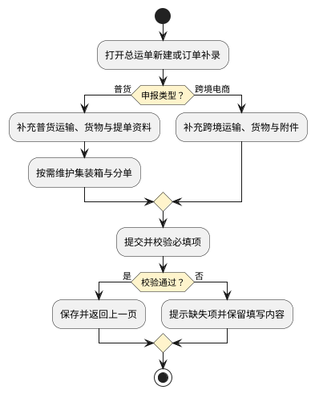

# 第013篇

> 本篇定位：综合总运单与分单资料；主要内容：总运单查询、录入、作废及普货分单资料维护；文档角色：模块档；文档ID：0B2997FBF5

**关联业务：** [综合订单管理](PRD.高捷物流系统.第012篇.综合订单管理.C97EF7E0FE.md#doc-C97EF7E0FE-scope)使用本篇总运单与分单资料；制单和外部发送分别见[空运提单管理](PRD.高捷物流系统.第023篇.空运-提单与航司推送.ED54E43A14.md#doc-ED54E43A14-section-8954946dbce2)、[航司推送](PRD.高捷物流系统.第023篇.空运-提单与航司推送.ED54E43A14.md#doc-ED54E43A14-section-e1b5f4988019)与[D4航司交接](PRD.高捷物流系统.第023篇.空运-提单与航司推送.ED54E43A14.md#doc-ED54E43A14-d4-airline-handover)。

## 1. 综合订单总运单与分单资料

本篇维护综合订单使用的总运单资料，与空运提单制单、航司推送及D4交接分别定义。总运单分为普货、跨境电商两类；仅普货总运单提供分单管理入口。

### 1.1 总运单查询与录入入口

总运单列表支持新建、查看、作废和自定义列表。查询至少指定一个条件，否则提示“请先选择条件”；重置仅还原条件，未再次查询时不刷新结果。列表列显隐保存在本地，筛选区支持展开、收起。

**界面原型概述 · 总运单查询与列表**

- **区域字段或业务元素**：查询栏含总运单号、分单号、申报类型、进出口标志、运输工具、航班号/车牌号；列表含总运单号、分单号、创建人、创建时间及本章录入资料。
- **区域级通用规则**：筛选均选填；列表只读，总运单号与分单号作为详情入口。

| 字段或控件特例 | 界面特例或可见反馈 |
| --- | --- |
| 总运单号、分单号、航班号/车牌号 | 支持逐行输入多个号码，精确匹配。 |
| 申报类型、进出口标志、运输工具 | 分别选择普货/跨境电商、进口/出口、飞机/汽车/船舶。 |
| 已作废号码 | 号码后显示“已作废”标识；展示标识不改变原号码。 |
| 创建人、创建时间 | 取创建账号及保存成功时间，显示至分钟。 |

申报类型必填。从列表新建时默认普货并允许切换；从综合订单“总运单信息补录”进入时，BC、CC、BBC 固定为跨境电商，普货固定为普货，其他业务默认普货并可选择。提交校验必填项，成功后保存并返回上一页；详情读取已保存资料，无值留空。

### 1.2 普货总运单界面原型概述

**界面原型概述 · 普货运输与货物资料**

- **区域字段或业务元素**：始发港代码、目的港代码、预计到货时间、预计出港时间、运输工具、航班号/车牌号、头程/二程/三程目的地；中文品名、英文品名、特殊货物、预计件数、预计毛重、预计体积。
- **区域级通用规则**：订单补录带入关联资料；独立新建未列默认值的字段为空。提交前可补充资料，但预计毛件体的编辑资格须按下表区分入口。

| 字段或控件特例 | 界面特例或可见反馈 |
| --- | --- |
| 始发港、目的港、预计到货时间、预计出港时间 | 必填；补录时取订单对应值。 |
| 运输工具 | 必填；空运映射飞机、海运映射船舶、陆运映射汽车；独立新建默认飞机。 |
| 航班号/车牌号、各程目的地 | 选填；补录时分别取订舱或约车结果、订舱确认的各程目的地；缺失时可补填。 |
| 中文品名、英文品名、特殊货物 | 中文品名必填，其余选填；补录时取首条货物对应内容，缺失值留空或保持未选。 |
| 预计件数、预计毛重、预计体积 | 必填；补录按关联分单逐项求和，作为汇总展示。独立新建要求手工录入，而字段表标为不可编辑，具体入口约束待确认。 |

**界面原型概述 · 集装箱与提单资料**

- **区域字段或业务元素**：集装箱序号、集装箱号、集装箱规格、添加、删除；提单号、进出口标志、代码、发货人、收货人、唛头、海关申报价值、IATA CODE、ISSUING CARRIER、签发日期、随机文件、Handling Information、提单属性、采购单号/销售单号、发票号、分单管理。
- **区域级通用规则**：提单号、进出口标志、收发货人必填，其余选填；系统来源字段只读，手工资料可维护。集装箱可添加多行，勾选后显示删除，确认后删除所选行。

| 字段或控件特例 | 界面特例或可见反馈 |
| --- | --- |
| 提单号 | 订单已有号码时带入且不可改，未有号码或独立新建时手工填写。 |
| 进出口标志 | 按订单业务的进口/出口属性带入；无法确定或独立新建时选择。 |
| 发货人、收货人 | 选择历史联系人或录入新联系人；选择后显示别称，详细规则见[主单联系人编辑](PRD.高捷物流系统.第023篇.空运-提单与航司推送.ED54E43A14.md#doc-ED54E43A14-section-43b81c0c9f43)。 |
| IATA CODE、ISSUING CARRIER | 取航司代码对应的航司资料。 |
| 签发日期 | 取订舱确认航班时间；该业务含义与实际提单签发是否一致待确认。 |
| 采购单号/销售单号 | 提单属性选择采购单时显示采购单号，否则显示销售单号。 |
| 提单属性 | 采购单、销售单，单选。 |
| 集装箱序号 | 随添加行自动递增；无需手工填写。 |
| 集装箱规格 | 从候选规格选择；候选集另由基础数据维护。 |
| 代码 | 来源未明确业务含义及取值，不把它与 IATA CODE 合并。 |

进出口标志、发货人和收货人的字段表同时标为不可编辑、允许选择或录入，源图也提供选择入口。直接改值与通过选择动作更新的边界待确认，不将上述只读共性扩大到禁止已明确的选择操作。

**界面原型概述 · 普货总运单详情计费信息**

- **区域字段或业务元素**：分单计费重。
- **区域级通用规则**：只读，按本章分单计费重算法展示；该字段出现在总运单详情，但来源命名为“分单计费重”，其归属是当前分单还是主单汇总尚待确认。

### 1.3 跨境电商总运单界面原型概述

**界面原型概述 · 跨境运输资料**

- **区域字段或业务元素**：总运单号、进出口标志、进出口岸代码、申报海关代码、监管场所代码、国家地区代码、国家地区名称、港口代码、进港日期、运输工具、航班号/车牌号、头程/二程/三程目的地、预计离港时间 ETD、预计到港时间 ETA。
- **区域级通用规则**：总运单号、进出口标志、监管场所代码、港口代码、运输工具必填，其余选填；订单来源、工具映射及航班/车牌联动沿用普货对应规则。

| 字段或控件特例 | 界面特例或可见反馈 |
| --- | --- |
| 港口代码 | 订单补录时，出口取始发港、进口取目的港；独立新建手工录入。 |
| 国家地区名称 | 优先根据国家地区代码展示。 |
| 各程目的地 | 取订舱确认结果，可补充维护。 |

监管场所代码和港口代码按字段表要求必填；源图缺少监管场所控件、港口未标必填，图文投影差异待确认，不据截图省略必填资料。

**界面原型概述 · 跨境货物与附件**

- **区域字段或业务元素**：中文品名、英文品名、特殊货物、总包号/箱号、分运单数量、提单总毛重（kg）、提单计费重量（kg）、托数/箱数、加固托盘数量、打托托盘数量、纸箱数、体积、箱尺寸、柜型、上传附件、附件下载。
- **区域级通用规则**：中文品名必填，其他选填；首条货物的品名和特殊货物按普货规则带入，其余允许手工维护。此页不提供分单管理。

| 字段或控件特例 | 界面特例或可见反馈 |
| --- | --- |
| 分运单数量、托数/箱数、两类托盘数量、纸箱数 | 按整件数量填写。 |
| 提单总毛重、提单计费重量、体积 | 保留两位小数。这里是跨境资料录入，不据此替换空运制单的计费重进位规则。 |
| 箱尺寸、柜型 | 从候选项选择。 |
| 附件 | 录入页上传本地文件，详情点击附件名下载；格式、大小、删除和替换资格未明确。 |

跨境电商总运单不提供分单管理入口；总运单列表源图仍在跨境电商行显示分单号，其数据来源和是否可打开详情尚待确认，不据列表截图开放分单管理。

### 1.4 普货分单管理

分单列表限定在当前普货总运单下。按分单号查询；空条件展示当前主单全部分单，重置清空查询条件。支持新建、编辑、查看和作废；作废经二次确认后使分单资料无效并展示已作废标识，取消则不改变数据。作废关联订单、仓储或关务已使用分单后的下游处理，以及总运单自身的作废条件尚未明确。

**界面原型概述 · 分单列表与详情**

- **区域字段或业务元素**：主单摘要含始发港、头程目的地、头程航班、目的地、入仓件数/毛重/体积、提单计费重；分单列表含分单号、分单件数、分单毛重、分单体积、分单计费重；详情另含入仓毛件体、提单毛件体及录入资料。
- **区域级通用规则**：本区域只读；主单摘要取总运单对应字段，入仓实测来自仓储收货，提单毛件体来自货站实测，不以预计数据冒充实测数据；两类实测毛件体按来源保留两位小数。

分单列表展示件数、毛重和体积合计；已作废分单是否计入，以及合计基于筛选结果还是当前主单全部分单尚待确认。

计费重以 `max(毛重, 体积 × 166.66)` 计算；综合总运单的分单列表和详情保留两位小数。与空运制单中向上进位至 0.5 kg、保留一位小数的字段是否同一计费对象，待确认后统一，不跨场景自行覆盖。

**界面原型概述 · 分单新建与编辑**

- **区域字段或业务元素**：分单号、始发港、头程/二程/三程目的地、中文品名、英文品名、Handling Information、唛头、仓库操作要求、发货人、收货人、提交。
- **区域级通用规则**：始发港、头程目的地、中文品名必填，其余选填；提交校验必填项，未通过指出缺失内容。

| 字段或控件特例 | 界面特例或可见反馈 |
| --- | --- |
| 分单号 | 可录入客户提供号码；为空时按“3 位地区代码 + YYMM + 5 位流水”生成。地区来源、流水重置和重复号码处置待确认。 |
| 始发港、头程目的地 | 带入主单对应值，允许维护。 |
| 二程目的地、三程目的地 | 字段表要求手工录入，源图提供候选选择；候选来源及是否允许候选外输入待确认。 |
| 收发货人 | 与主单选择交互一致，选择后显示别名。 |
| 分单预计件数、毛重、体积 | 在货物信息区录入，均必填；分单计费重在旁展示。入仓和提单实测件数、毛重、体积只读。 |
