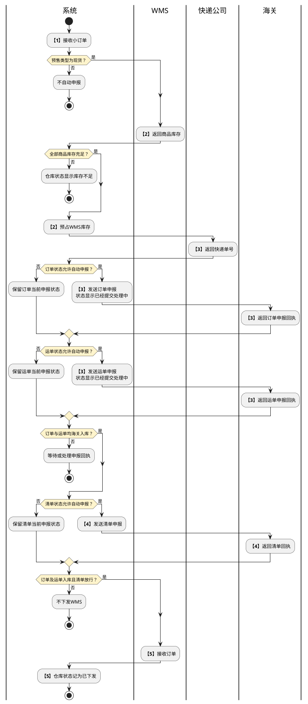

# 第015篇

> 本篇定位：BBC客户订单管理；主要内容：平台小订单、三单申报、订单处置及回执查询；文档角色：模块档；文档ID：40DBFB6718

共用定义见[综合订单与服务协同实体](../PRD.高捷物流系统.第08册.运营支撑/PRD.高捷物流系统.第065篇.数据字典.7A3D9E1F50.md#doc-7A3D9E1F50-integrated-order-model)、[综合订单与客户订单权限](../PRD.高捷物流系统.第08册.运营支撑/PRD.高捷物流系统.第066篇.角色与访问权限.5E31456F30.md#doc-5E31456F30-integrated-order-access)。

## 1. 业务范围

BBC客户订单接收电商平台推送的小订单，供电商部客服处理履约异常、跟踪物流节点，供关务申报订单、运单、清单及退货申请。小订单与安排出区后生成的平台大订单、仓储服务单、核注清单关联，不将它们合并为同一种单据。

客服使用下快递、取消、恢复、作废、修改订单、安排客退和安排消退；关务使用批量申报。两者均可导出明细；客服的退货申报入口与关务批量申报的授权边界见角色权限篇。逆向操作完整定义见[逆向订单与增值服务](PRD.高捷物流系统.第016篇.逆向订单与增值服务.B2B931A50F.md#doc-B2B931A50F-bbc-returns)，关务单据处理见[BBC进口关务](../PRD.高捷物流系统.第03册.关务管理/PRD.高捷物流系统.第030篇.BBC进口关务.2CA9B1E5A1.md#doc-2CA9B1E5A1-scope)。

## 2. 三单自动申报与下发

订单、运单和清单各自保存海关申报状态，不能以其中一个成功代替三单全部满足条件。各单据允许自动申报的状态为待报关、发送海关失败或海关退单；不满足相应状态条件时不自动申报。自动申报还要求订单内全部商品的WMS库存充足。

| 步骤 | 执行方 | 处理与分支 | 结果或接续 |
| --- | --- | --- | --- |
| 1 | 系统 | 接收电商平台小订单并判断预售类型 | 预售不自动申报；现货进入库存校验 |
| 2 | 系统、WMS | 校验所有商品库存；充足时预占WMS库存 | 不足时仓库状态显示库存不足；充足进入取号 |
| 3 | 系统、快递公司 | 自动取得快递单号，依次发送订单、运单申报 | 申报后的单据状态显示已经提交处理中，并接收海关回执 |
| 4 | 系统、海关 | 订单及运单回执均为海关入库时发送清单申报 | 未同时满足时不发送清单，继续显示各自回执 |
| 5 | 系统、WMS | 订单状态=海关入库、运单状态=海关入库、清单状态=放行时下发订单 | 同时满足后仓库状态为已下发；未满足不下发 |

图中的等待终点仅结束本次判断，不表示订单完成或申报失败。库存不足后的再次触发、预售转现货触发、取号失败后的库存处理及重复回执的去重边界尚待确认。

源文库存展示使用“WMS库存＞商品数量”才显示有货，而申报只写库存“足够”；库存恰好等于需求量时的处理待确认。取号时机也有“预占后、申报前”与“申报成功后”两种描述；上述流程承接流程正文，尚不能据此消除字段说明中的冲突。

本篇申报前预占WMS库存，与[BBC关务库存协同](../PRD.高捷物流系统.第03册.关务管理/PRD.高捷物流系统.第030篇.BBC进口关务.2CA9B1E5A1.md#doc-2CA9B1E5A1-scope)的小订单下发时预占WMS和账册，以及核注发送时的占用口径尚未统一；不得把各篇的预占重复累加。首次申报、分步重报、恢复订单是否复用占用及快递号也未明确。

## 3. 订单处置

批量申报、取消、恢复和导出支持按勾选订单或查询结果操作；下快递在未勾选时按查询结果操作。混合资格批次是整批拒绝还是逐条处理，源文未统一定义。

| 操作 | 资格与确认 | 业务结果 | 拒绝反馈 |
| --- | --- | --- | --- |
| 批量申报 | 关务勾选订单或按查询结果选择订单、运单、清单、退货申报 | 发送对应申报并显示海关回执；三单相互依赖仍执行第2章 | 手动重报与自动申报的状态门槛是否完全一致待确认 |
| 取消订单 | 原文条件为仓库状态“不等于已发货或者已出库”，须二次确认；两种状态的精确排除口径待确认 | 订单状态=已取消，仓库状态=订单已取消，运单和清单状态=待报关；同步WMS用于库内拦截，并向海关发送撤销申请 | 所选订单不能被取消 |
| 恢复订单 | 订单状态=已取消，确认后恢复 | 订单状态=待报关、仓库状态=待下发，并重新进入三单自动申报流程 | 所选订单不能被恢复 |
| 作废订单 | 订单状态为待报关、订单取消或海关退单，确认后执行；“订单取消”与“已取消”的同义关系待确认 | 订单状态=已作废，不可恢复，仅能查看，不得继续业务操作 | 所选订单不能作废 |
| 下快递 | 无快递号分支要求订单状态“≠已取消或者已作废”，该或条件的精确排除口径待确认；已有快递号分支要求运单状态=待报关。选择快递公司后确认 | 从选定快递公司获取新单号并返填；原号失效与重报处理未定义 | 所选订单不支持下快递 |
| 修改订单信息 | 仅勾选一条，且订单状态为待报关或已取消 | 进入修改界面；具体可修改字段和修改后的重报边界待确认 | 所选订单不支持修改信息 |
| 导出明细 | 按勾选订单或查询结果 | 导出对应订单明细 | 空结果及导出脱敏规则待确认 |

取消是订单处置、WMS拦截和海关撤销三类结果的协作，不以本地状态变为已取消推定外部撤销或拦截已经成功。回执失败、部分成功与库存释放的处理仍需确认。

## 4. 界面原型概述

列表和详情默认只读，查询区域可编辑；海关、WMS及平台回填内容按业务来源展示，不在列表直接维护。下述必备字段表示页面应展示该信息，不将只读展示列的“必填”反推为用户录入义务。

### 4.1 列表与查询

| 字段或控件 | 适用条件 | 个别界面约束或可见反馈 |
| --- | --- | --- |
| 已发货、未发货、消退订单、客退订单 | 页签 | 已发货取仓库状态=已出库；未发货取仓库状态≠已出库；后两者分别取消退状态、客退状态非空的订单 |
| 出区订单号、订单号、快递单号、核注清单号、账册编号、下单时间 | 查询栏 | 单号查询区支持粘贴多个单号；下单时间为起止区间 |
| 订单状态、运单状态、清单状态、出区状态、快递方式、仓库状态、电商平台名称、店铺名称 | 查询栏 | 状态和快递方式按选项筛选，平台与店铺按输入查询；精确或模糊匹配口径待确认 |
| 查询、重置、批量申报、下快递、订单操作、修改订单信息、导出明细 | 工具栏 | 操作资格执行第3章；订单操作包含取消、恢复、作废及逆向操作 |
| 订单号、快递单号、出区订单号、仓储服务单号、板号/托盘号、核注清单号、账册编号 | 列表关联标识 | 订单号进入详情；出区订单号取安排出区形成的大订单，再关联仓储单及板/托盘；无板/托盘时留空 |
| 电商平台名称、店铺名称、订购人、下单时间、支付金额、估算税款、库存情况、预售类型、截止退货日期、客户取消订单 | 列表订单信息 | 平台信息取推送数据；税款取税金计算；客户门户取消动作使“客户取消订单”显示是，否则为否 |
| 订单状态、运单状态、清单状态、仓库状态、出区状态、撤销单状态、退货状态、客退结果、消退结果 | 列表状态 | 前三项及退货状态取海关回执；出区/撤销单取核注清单与撤销申报结果；逆向结果取关联逆向订单 |

一个小订单可关联多个核注清单号；账册编号按商品ID与BBC业务模式从备案库取得，源文限定一个订单一个账册。含跨账册商品时的拆单或拒绝规则待确认。截止退货日期为清单放行日期加30天；临界日是否计入及所用时区按逆向订单的待确认项处理。

上述多核注清单关联与[BBC关务自动生成](../PRD.高捷物流系统.第03册.关务管理/PRD.高捷物流系统.第030篇.BBC进口关务.2CA9B1E5A1.md#doc-2CA9B1E5A1-parcel-grouping)限定一个小订单对应一张核注清单冲突，是否区分当前有效单与历史改单尚未明确。“客户取消订单”来源指向客户门户，但[门户BBC客户视图](PRD.高捷物流系统.第014篇.客户门户订单管理.C90EB28313.md#doc-C90EB28313-small-order-interface)只定义查看与导出，尚缺取消入口及退款接口的授权与触发口径。

### 4.2 订单详情

| 字段或控件 | 适用条件 | 个别界面约束或可见反馈 |
| --- | --- | --- |
| 订单号、订单商品描述、收件人、订购人、订单总毛重、订单总净重、收件地址、运单号、担保企业、快递公司、预售类型、备注 | 订单基础 | 读取平台订单；担保企业无值时留空 |
| 商品总额、运费、保价费、预收税款、非现金抵扣、实际支付金额 | 金额 | 读取平台金额。源文实际支付公式为商品总额+运费+保价费+预收税款-折扣；折扣与非现金抵扣的对应关系待确认 |
| 订购人电话、订购人身份证号 | 敏感信息 | 显示查看入口，输入查看密码后才展示明文；密码作用范围、有效期和失败限制待确认 |
| 电商企业、电商平台 | 主体 | 分别展示名称与企业代码，不只显示名称 |
| 估算税额、海关回执税额、海关清单号、关区代码 | 税务 | 估算税额由系统计算；海关税单导入后由税金管理回填实缴口径；清单号取申报回执。关区代码正文默认5165南沙保税，截图示例为516A，默认值冲突待确认 |
| 出区订单号、核注清单号、仓储服务单号、账册编号、仓库状态 | 履约关联 | 关联规则同列表；详情对核注清单号另要求相应清单卡口状态=已过卡才返填，与列表申报后返填的时机差异待确认 |
| 商品序号、备案商品ID、商品名称、备案HS号、商品条码、原产国代码、数量及单位、单价、估算增值税、估算消费税、消退数量、客退数量 | 商品明细 | 序号由系统生成；ID、名称取订单来源，备案属性按ID关联。数量/单位来源写备案数据，单价又同时写平台及备案，估算增值税同时写系统计算及平台回填；三者来源存在冲突，不补定覆盖顺序 |
| 回执类型、回执状态、回执时间、回执信息；查询、重置、分页 | 回执查询与列表 | 按回执类型筛选，按回执时间倒序展示海关回执 |

未发起消退、客退时，对应商品数量显示0。详情中的消退数量与客退数量分别记录对应逆向操作的数量；跨次累计及重复发起限制见逆向订单篇的待确认边界。原字段表中的“否是”“是否”等拼接项不直接转换为确定必填规则。
