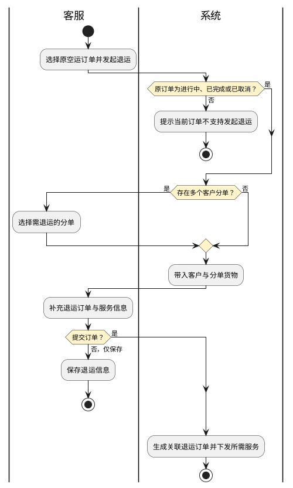
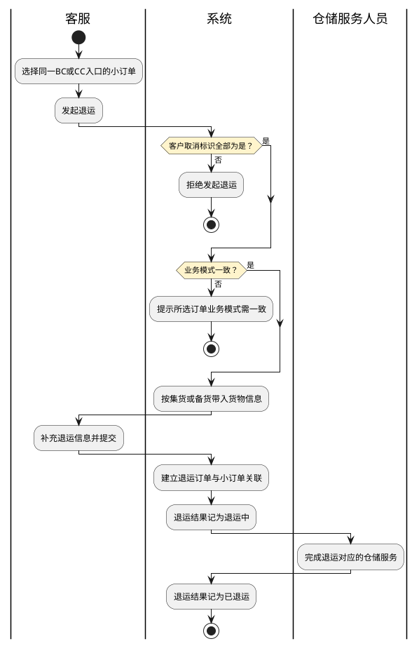
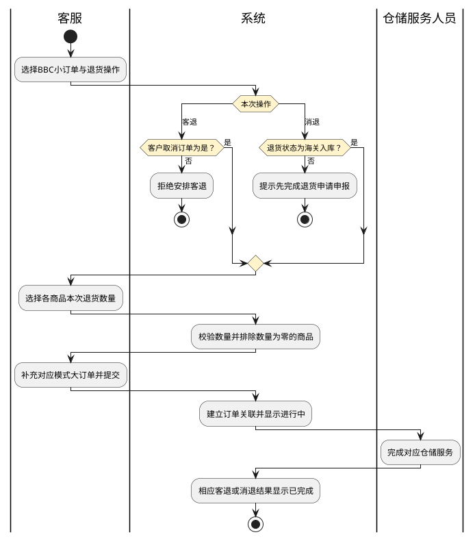
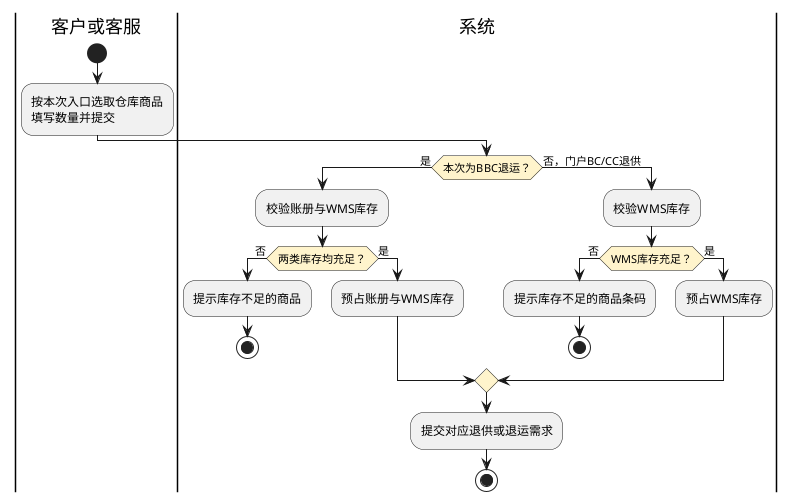
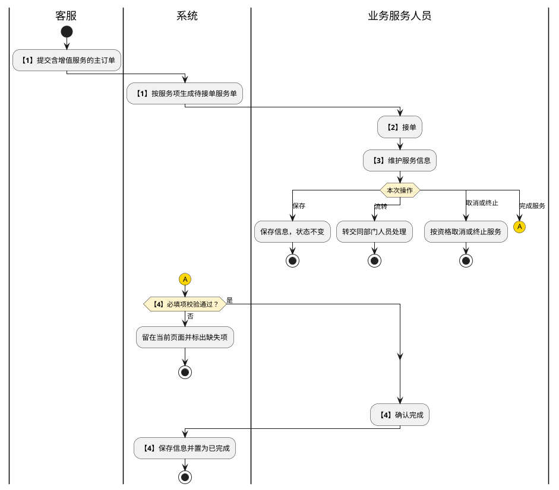

# 第017篇

> 本篇定位：逆向订单与增值服务；主要内容：退运、退供、客退、消退及增值服务处理；文档角色：模块档；文档ID：B2B931A50F

共用定义见[综合订单与服务协同实体](../PRD.高捷物流系统.第08册.运营支撑/PRD.高捷物流系统.第066篇.数据字典.7A3D9E1F50.md#doc-7A3D9E1F50-integrated-order-model)、[综合订单与客户订单权限](../PRD.高捷物流系统.第08册.运营支撑/PRD.高捷物流系统.第067篇.角色与访问权限.5E31456F30.md#doc-5E31456F30-integrated-order-access)。

## 1. 场景与入口

逆向订单保留原订单或商品来源及关联关系，再下发所需服务，不以原订单状态改写代替新的逆向履约记录。不同逆向业务的去向和服务组合如下。

| 场景 | 触发与去向 | 发起入口与服务 |
| --- | --- | --- |
| 空运出口退运 | 查验异常需删单退运；放行后因配载或客户取消需删单退运 | 客服从出口空运原订单发起，选择分单后下发退运所需服务 |
| 空运进口退运 | 已申报但查验不通过，或未申报但已到海关监管场所且客户要求退回海外 | 客服从进口空运原订单发起 |
| BC/CC进口退运 | 无法清关或拦截失败的包裹退回海外仓；已明确承接的目的仓为香港仓 | 客服从小订单批量发起；BC、CC及集货、备货模式分别形成订单 |
| BBC进口退运 | 货物从保税仓退往香港或海外 | 客户门户新建需求单后由客服接单，或运营平台客服直接新建BBC退运订单 |
| BC/CC进口退供 | 备货商品下架，退出海外仓 | 客户门户新建退供需求单，提交到运营平台，客服接单后安排下架出库 |
| BBC客退 | 消费者退回的包裹送至国内普通仓或临时存放点 | 客服在小订单列表发起，形成平台大订单，下发运输、仓储服务 |
| BBC消退 | 消费者退回的包裹进入保税仓并重新理货上架 | 客服先申报退货申请，海关入库后形成消退大订单，下发运输、仓储、关务服务 |

逆向订单的通用建单、服务编排与附件交接引用[综合订单管理](PRD.高捷物流系统.第013篇.综合订单管理.C97EF7E0FE.md#doc-C97EF7E0FE-scope)，不在本篇重复完整服务配置。客户门户需求单与电商平台小订单是不同对象。

## 2. 空运退运

客服仅可对进行中、已完成或已取消的原空运订单发起退运；其他状态拒绝并提示“当前订单不支持发起退运”。一次选择一个原订单。多个客户分单时先选择需退运的分单，可多选或全选；没有分单或只有一个分单时直接进入建单界面。

退运单默认业务类型为出口退运或进口退运，继承客户和所选分单货物，补充服务后保存或提交；提交按服务下发规则生成服务单。退运列表展示关联原订单号、客户分单号和业务类型，不再提供发起退运入口，避免由退运单继续发起同类退运。

原订单的“发起退运”字段在关联退运单为进行中或已完成时显示是；查询支持是/否筛选。源文用例另写“生成退运订单即显示是”，草稿或待接单退运单是否使标识生效待确认。

### 2.1 界面原型概述

| 字段或控件 | 适用条件 | 个别界面约束或可见反馈 |
| --- | --- | --- |
| 客户分单号、全选、确定、取消 | 分单选择弹窗 | 仅展示当前原订单分单；选择后带入对应分单信息 |
| 业务类型、财务组织名称、所属部门、客服、业务员、客户名称、联系人姓名、电话、邮箱、基本备注、客户备注 | 基本与客户信息 | 业务类型及原订单关联信息只读；客服为当前发起人；两处备注分别可编辑 |
| 运输方式、启运港、目的港、总运单号、总运单信息补录 | 总运单信息 | 运输方式默认原值且可调整；港口下拉选择；总运单号手工录入 |
| 客户分单号、货物统称、海关编码、商品名称、英文品名、特殊货物、规格、数量、单位、单价、总价 | 客户分单货物 | 除数量外继承原值只读；无客户分单号时不显示该字段；总价=数量×单价 |
| 预计件数、预计毛重、预计体积、预计最大尺寸的长/宽/高 | 预计货量 | 可编辑；数量不得大于原订单数量。源文将件数、重量、体积、尺寸均写成“不大于原订单数量”，跨量纲上限需分别确认 |
| 干线、仓储、关务、运输、地面操作、快递、增值及各服务明细 | 服务信息 | 可编辑；多分单可使用与第一个分单相同的服务信息，具体下发引用综合订单篇 |
| 附件类型、名称、上传时间、上传人、服务类目可见性、添加、删除 | 附件资料 | 原订单资料自动带入，可增删；保留按服务类别分发的可见性设置 |
| 原订单通用字段、关联订单号、客户分单号、业务类型 | 退运列表 | 单号可进入详情；不提供再次发起退运 |

### 2.2 退运建单路径

图仅表达退运建单，不表示海关删单、实物退运或结算已完成。已发起退运后的再次发起资格和累计退运数量上限待确认。

## 3. BC/CC进口退运

客服可按筛选条件或批量订单号查询小订单，再选择异常处理中的发起退运。订单的“客户取消订单”必须为是，且同批业务模式一致；否则分别提示“所选订单不支持发起退运”或“所选订单业务模式需一致”。BC和CC分别处理，不混合生成一个退运订单。

创建时业务类型固定为BC进口退运或CC进口退运，业务模式读取选中小订单，不可修改。补全其他信息后可保存或提交；提交后在对应电商订单退运列表形成记录，小订单退运结果显示退运中。关联退运单生成的仓储服务状态=已完成时，退运结果为已退运；未发起过退运时结果为空。

### 3.1 界面原型概述

| 字段或控件 | 适用条件 | 个别界面约束或可见反馈 |
| --- | --- | --- |
| 业务类型、业务模式、入库单号、财务组织、所属部门、客服、备注 | 基本信息 | 类型、模式及客服只读；组织、部门默认当前账号，可选择；备注可编辑。入库单号原文同时写“手工录入”和“不可编辑”，待确认 |
| 客户名称、联系人姓名/电话/邮箱、客户备注、运输方式、启运港、目的港、总运单号、总运单补录 | 客户与总运单 | 沿用通用建单；运输方式默认公路运输，可调整 |
| 货物统称、订单号、快递单号、订单重量、快递公司、托盘号、预计件数、毛重、体积、预计最大尺寸 | 集货货物 | 订单与快递信息从选中小订单只读带出；货物统称、托盘号和预计货量可补充；订单重量取总毛重 |
| 货物统称、商品ID、商品名称、规格型号、产品批次号、商品条码、数量、保质期、生产日期、失效日期、托盘号、预计货量 | 备货货物 | 商品ID取选中小订单只读；商品名称、规格型号、保质期按商品ID自动带出，只读；产品批次号、商品条码、数量、生产日期、失效日期、托盘号可手工补充。货物统称、商品ID、批次号、条码、数量、生产日期、失效日期及预计件数、毛重、体积必填；支持下载模板、导入、删除、添加 |
| 各服务配置、附件类型/名称/上传时间/上传人/服务类目可见性 | 服务及附件 | 沿用通用建单；附件可按服务类别设置可见 |
| 订单号、退运订单号、总运/提单号、快递单号、客户名称、店铺、电商平台、订购人、状态、下单时间；BC另展示相关贸易主体及关区查询 | 退运列表查询 | 按当前BC/CC订单字段投影，保留原订单与逆向订单双向定位 |
| 退运订单编号、总运/提单号、退运结果及小订单既有字段 | 退运列表 | 结果取关联逆向仓储服务，支持导出；BC、CC各自显示已发货、未发货、退运订单页签 |

图从提交后继续展示结果反馈；仅保存时不推定已经形成退运结果。多个下游仓储服务并存时，需要哪些服务完成才更新结果，源文未明确。

## 4. BBC客退与消退

| 操作 | 前置条件 | 结果与拒绝反馈 |
| --- | --- | --- |
| 安排客退 | 客户取消订单=是 | 进入客退数量选择，再创建BBC进口、客退模式的平台订单；不满足时拒绝。源文拒绝文案误写发起退运，界面应表达当前客退操作 |
| 退货申请 | 客户取消订单=是，且截止退货日期≥当前日期 | 确认后发送申请，列表显示海关退货回执。不满足取消条件时提示不支持发送退货申请；超期提示清关放行起30天内才可申请退货 |
| 安排消退 | 退货状态=海关入库 | 进入消退数量选择，再创建BBC进口、消退模式的平台订单；否则提示需完成退货申请申报才能安排消退 |

截止退货日期按清单放行日期加30天计算，边界包含该日期；放行当日是否算第1天及采用时区仍待统一。客退不自动具备回保税仓资格，退货申请成功也不表示消退已完成。

客退和退货申请依赖“客户取消订单”标记，但[BBC客户订单](PRD.高捷物流系统.第016篇.BBC客户订单管理.40DBFB6718.md#doc-40DBFB6718-interface)所指客户门户尚未定义BBC取消入口；取消主体和标记触发未确认前，不以本篇逆向操作反向赋予客户取消权限。

### 4.1 部分退货数量

客退与消退使用同一数量选择方式，分别写入各自结果字段：展示所选小订单及商品信息，每行退货数量默认原始数量，允许录入0到原始数量之间的整数。大于原始数量时提示“输入数量不能大于订单商品数量”，并恢复为原始数量。0表示该商品不参与本次退货；一订单全部商品均为0时，该订单不参与本次退货。

确定后只带入参与本次退货的订单与商品信息，补充其他建单信息后可保存或提交。提交形成对应模式的平台大订单，运营平台与客户门户的BBC客退/消退列表均显示进行中；关联仓储服务完成后显示已完成。小订单详情展示对应商品的客退数量、消退数量。

同一商品多次客退或消退时，数量上限是否扣除既往已退或在途数量、客退后转消退如何关联，以及全批数量为0时的提交反馈尚未明确，不以单次上限代替累计约束。

图按客服本次选择区分客退和消退，并不表示两者互相替代或禁止先后发生。数量校验、退货申请和重复退货边界按本章正文执行。

### 4.2 界面原型概述

| 字段或控件 | 适用条件 | 个别界面约束或可见反馈 |
| --- | --- | --- |
| 订单号查询、订单号、商品序号、备案商品ID、商品名称、备案HS号、商品条码、原产国代码、原始数量及单位、客退/消退数量、分页、确定、取消 | 数量弹窗 | 原始信息只读，仅本次退货数量可编辑；数量规则见4.1 |
| 业务类型、业务模式、仓库名称、入库单号、收发货人及国家、财务组织、所属部门、业务员、客服、备注 | 新建逆向订单 | 类型固定BBC进口，模式固定为本次客退或消退；原型示例中客退页面写消退，不能据此更改本次模式 |
| 客户名称、联系人姓名/电话/邮箱、备注、运输方式、启运港、目的港、总运单号及补录 | 客户与运输 | 沿用综合订单建单 |
| 原小订单号、商品ID、海关编码、品牌、商品条码、中文品名、规格、单位、数量、总价、预计件数/毛重/体积/长宽高、服务配置、附件 | 货物及服务 | 商品按所选退货数量带入；服务与附件按对应业务模式配置 |
| BBC客退/消退页签、关联逆向订单号、客户取消标识、对应退货结果；商品详情客退/消退数量 | 结果视图 | 结果回填运营平台和客户门户；其余查询和展示引用BBC客户订单篇 |

## 5. 退供与BBC库存退运

### 5.1 建单与库存校验

| 场景 | 入口与商品来源 | 提交时校验与占用 | 默认服务 |
| --- | --- | --- | --- |
| 客户门户BC/CC退供 | BC/CC需求单新建，选择进口退供；商品来自当前客户在所选逻辑仓的已备货库存 | 校验商品WMS库存，充足立即预占；不足提示具体商品条码，修改后再提交 | 仓储、运输、货站安检、清关派送 |
| 客户门户BBC退运 | BBC需求单新建，选择退运；仓库取当前客户关联逻辑仓，商品选择同退供 | 同时校验账册和WMS库存，充足立即预占两类库存；不足提示具体商品条码 | 仓储、关务、运输、货站安检 |
| 运营平台BBC退运 | 客服在电商订单BBC列表新建，业务类型固定BBC进口、模式选择退运；按仓库与店铺选择商品 | 导入及提交均校验商品ID存在于所选仓库与店铺库存、ID非空、数量非空；不存在或ID空则整文件导入失败。提交时同时校验并预占账册与WMS库存，不足提示具体商品ID | 服务信息沿用综合订单，不从客户门户默认组合反推运营端不可调整 |

运营平台商品ID不存在时的源提示为“不能导入没有成功备案的商品ID”；其校验描述却使用库存数据存在性，备案与库存是否为两个独立校验待确认。只选择已有库存商品，不推定满足海关退运资格。

**退供与库存退运提交图**

本图只比较提交阶段的库存要求，不代表已完成海关退运或实物出库。门户入口提示商品条码，运营平台BBC入口提示商品ID；商品选择、导入资格及服务组合仍按上表分别执行。两类库存部分占用成功的补偿，以及跨篇预占去重仍属待确认边界。

### 5.2 取消与库存释放

| 发起入口及取消时机 | 订单与服务结果 | 预占库存处理 |
| --- | --- | --- |
| 客户门户退供或BBC退运，需求单待接单 | 取消成功 | 释放占用库存；BBC包含账册及WMS两类 |
| 客户门户退供或BBC退运，需求单进行中 | 取消成功 | 不释放占用库存；后续人工处理边界待确认 |
| 运营平台BBC退运，尚无下游服务单 | 取消成功 | 释放占用库存 |
| 运营平台BBC退运，仓储服务待接单 | 主订单取消，下游服务自动取消 | 释放占用库存 |
| 运营平台BBC退运，仓储服务进行中 | 主订单取消，服务不自动取消 | 本次不释放；人工取消仓储服务时才释放 |
| 运营平台BBC退运，仓储服务已完成 | 主订单取消，服务完成状态保留 | 不释放占用库存 |

门户与运营平台的取消入口条件不同，不能合并成“取消即释放”。退供的良品/不良品分量占用、跨批次占用及账册与WMS仅一方占用成功时的补偿尚未定义。

运营平台BBC退运按仓储服务状态释放库存，而[BBC关务库存协同](../PRD.高捷物流系统.第03册.关务管理/PRD.高捷物流系统.第031篇.BBC进口关务.2CA9B1E5A1.md#doc-2CA9B1E5A1-scope)按关务服务状态判断。两个服务不同步时由谁决定释放及释放哪些占用尚未统一，不能分别执行两次释放，也不能将某一篇的条件当作全链路最终判据。

### 5.3 界面原型概述

| 字段或控件 | 适用条件 | 个别界面约束或可见反馈 |
| --- | --- | --- |
| 业务类型、退供收货人、退供收货人电话、仓库名称、备注 | 门户退供基本信息 | 类型在对应BC/CC入口选择；收货人、电话、仓库必填；仓库来自当前客户关联逻辑仓 |
| 业务类型、业务模式、运输方式、退供收货人及电话、仓库名称、境外收发货人代码、境内收发货人、备注 | 门户BBC退运基本信息 | 业务类型BBC进口；其余业务必填项依源表保留，备注可空。“退供收货人”是否应更名为退运收货人，以及境内/境外名称在截图中的差异待确认 |
| 业务类型、业务模式、仓库名称、退供收货人及电话、境外收发货人、财务组织、所属部门、客服、业务员、备注 | 运营BBC退运基本信息 | 仓库源文列加工区、物流园、港口二期；境外收发货人使用英文；组织、部门默认当前账号；客服只读，业务员取销售员角色 |
| 商品ID、商品条码、商品名称、退供良品数量、退供不良品数量、有效期、产品批次号 | 商品明细 | ID及条码选择或导入；名称、有效期按条码带出；批次号带出或导入。两类退供数量不得同时为空或同时为0。源字段表将ID、条码、批次号列为只读但同时允许选择或导入，其直接编辑边界待确认；有效期文字定义只读而截图为白色输入框，不据截图扩大编辑权 |
| 下载模板、导入、删除、添加 | 商品导入 | 条码必须存在于所选仓库，否则提示具体条码；批次必须存在，否则提示具体批次号；BBC运营端另执行商品ID校验 |
| 商品ID、商品条码查询；商品ID、条码、名称、可分配可用库存、可分配不良品库存、批次号；分页、确定、取消 | 商品选择弹窗 | 只显示当前客户已备货在所选仓库的商品；选择后返填商品明细 |
| 运输提货地址/时间、送货地址/时间；对应服务项；附件类型、名称、添加、删除 | 服务与附件 | 按5.1默认服务展开配置，附件可下载；原型中部分已勾选但置灰的服务与文字默认组合不同，其可调整性待确认 |

## 6. 增值服务作业

主订单维护增值服务项并提交后，系统按服务下发规则向相应业务部门生成增值服务订单；一个上游订单的多个服务项分别生成服务订单。业务服务人员处理从接单到完成的全过程。服务单编号为`S+111+YYMMDD+5位流水号`；固定段与服务编码关系统一在数据字典定义。

### 6.1 主流程

| 步骤 | 执行方 | 处理 | 形成结果 |
| --- | --- | --- | --- |
| 1 | 客服、系统 | 提交包含增值服务项的主订单，按下发规则生成服务单 | 对应业务部门收到待接单服务单 |
| 2 | 业务服务人员 | 接单，可批量处理 | 待接单转进行中，非接单人员只读 |
| 3 | 接单人员 | 维护委外、处理人、处理时间、结果和附件，可保存或流转 | 保存不改变状态；流转改变当前处理人 |
| 4 | 接单人员 | 完成服务时校验必填项并确认 | 保存当前信息并转为已完成 |

图中连接符 `A` 表示选择“完成服务”后进入步骤 **【4】** 的必填项校验；不新增独立入口或重试路径。

保存、流转、取消和终止的图内终点仅结束该次操作；是否形成业务终态按下表判定，不将其统一解释为服务完成。

### 6.2 操作规则

| 操作 | 条件与处理 | 状态、资格及计费结果 |
| --- | --- | --- |
| 接单 | 可批量，只处理待接单记录，其他状态自动过滤；无待接单记录时提示所选订单已被接单；确认后执行 | 待接单→进行中；由接单人处理，其他人只读 |
| 流转 | 只处理本人接单且进行中的记录，过滤其他记录；无可处理记录时提示所选订单不能流转 | 给部门所有人员时重置待接单，部门人员均可接单；给同组织部门指定人时无需再接单。转交后原接单人只读 |
| 保存 | 保存当前编辑信息和附件，不校验必填项 | 状态不变；与源文通用“必填不满足则保存禁用”存在冲突，待统一 |
| 完成服务 | 校验必填项，通过后确认；不通过留在本页，在缺项下提示请输入相应字段 | 保存信息和附件，状态→已完成 |
| 终止服务 | 待接单或进行中可人工终止，须确认；已完成不改变状态 | 状态→已终止，只读，不再业务操作；不影响应收应付生成 |
| 取消服务 | 待接单或进行中可人工取消，须确认；已完成不改变状态 | 状态→已取消，只读，不再业务操作；不再生成应收应付 |
| 上游订单取消 | 下游增值服务待接单时自动取消 | 服务→已取消；进行中、已完成不从本规则推定自动取消 |

取消时既有应收应付如何处置、已完成服务是否允许改字段、开始与完成时间的先后校验尚待确认。源文仅列应收应付页面而未定义字段和操作，其内容引用财务篇，不以排期说明代替需求。

### 6.3 界面原型概述

列表默认每页50条、按创建时间倒序。查询栏默认展开，可收起、重置；未填写筛选时查询可见范围全部记录。详情的上游关联内容默认只读，待接单、已取消、已终止时整体只读；接单人员在进行中维护处理信息。

| 字段或控件 | 适用条件 | 个别界面约束或可见反馈 |
| --- | --- | --- |
| 服务订单号、订单号、业务类型、服务项、客户、业务员、供应商、内部部门、建单日期 | 查询栏 | 两类单号支持换行分隔的批量查询；分类、主体与人员下拉多选、精确查询；建单日期默认近一个月 |
| 总计、待接单、进行中、已完成、已取消、已终止 | 状态统计 | 总计及三类终态默认近一个月，待接单/进行中默认全部；指定建单日期后各数量随该区间变化 |
| 服务订单号、订单号、业务类型、服务项、供应商、内部部门、客户、业务员、建单人、建单时间、最后修改人、最后修改时间、服务订单状态 | 列表 | 上游业务字段按主订单读取；建单时间为服务单生成时间；点击服务订单号进入详情；状态文字与颜色同时区分 |
| 接单、流转、取消服务、终止服务、自定义列表 | 列表工具栏 | 资格与批量过滤规则见6.2；自定义列表允许调整展示列 |
| 基本信息、应收应付、操作日志 | 详情页签 | 订单信息可展开/收起，返回列表不保存修改 |
| 服务订单号、订单号、业务类型、业务模式、所属部门、业务员、建单人、财务组织、基本备注、客户名称、联系人姓名/电话/邮箱、客户备注 | 基本与客户信息 | 均取上游主订单；不同区域备注分别保留 |
| 服务项、服务类型、供应商、内部部门、是否委外、委外供应商、服务备注 | 服务信息 | 上游字段只读；是否委外选择是/否，为是时必须选择委外供应商；供应商可输入模糊匹配 |
| 海关编码、商品名称、英文编码、规格型号、单位、特殊货物、数量 | 商品明细 | 读取上游货物；“英文编码”与英文品名的关系不从截图自行替换 |
| 资料名称、上传时间、上传人、下载 | 上游附件 | 仅展示分发给增值服务的附件，支持勾选下载 |
| 处理人、开始处理时间、处理完成时间、处理结果、处理附件 | 处理信息 | 处理人取同组织部门人员，可模糊匹配；前三项完成服务时必填。完成时间已有值则读已有值，否则默认当前时间；处理结果可空，最多1000字 |
| 上传附件、删除附件、保存、返回列表、完成服务 | 处理附件与操作 | 上传支持多选，附件显示名称及大小，可逐项删除；保存包含附件，完成须校验必填 |
| 部门所有人员可接单、指定人接单、人员选择、确定、取消 | 流转弹窗 | 人员取同组织部门，支持输入模糊匹配；两种流转结果见6.2 |
| 接单、取消、终止、保存、完成确认 | 确认弹窗 | 取消明确告知不再计费，终止明确告知不影响计费，完成明确告知保存当前信息并完成服务 |
| 操作人、操作名称、操作时间、操作内容 | 操作日志 | 记录接单成功、流转目标、取消、终止及编辑字段；只读，无业务按钮 |
