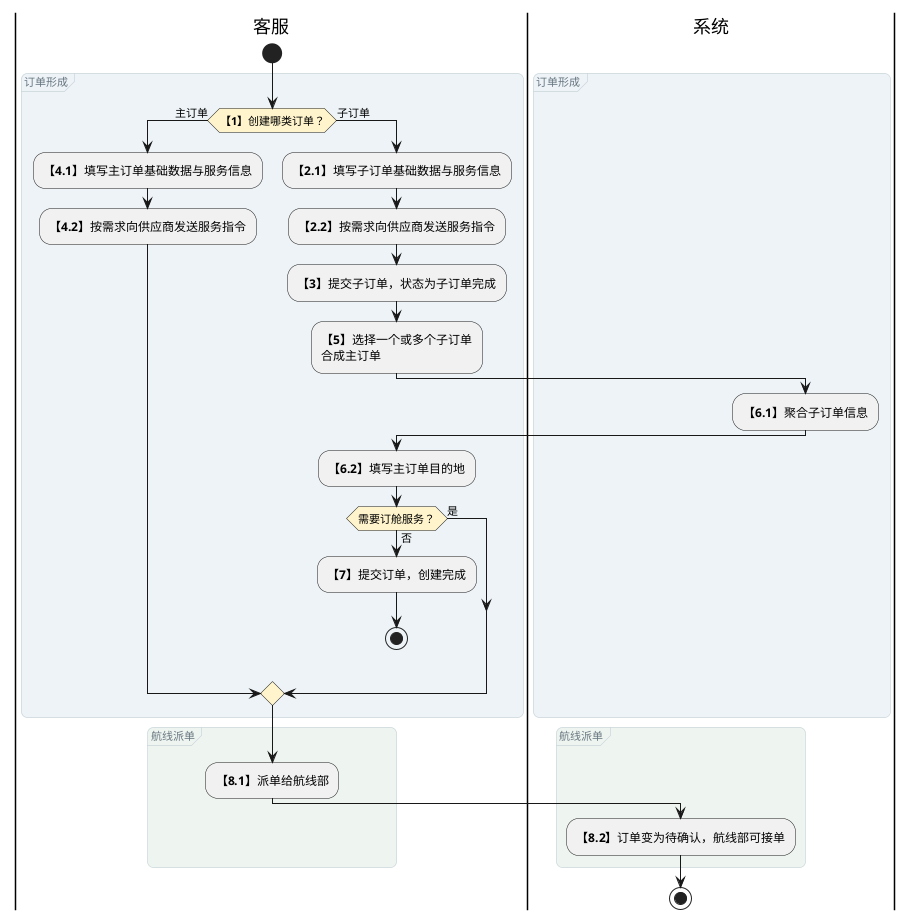
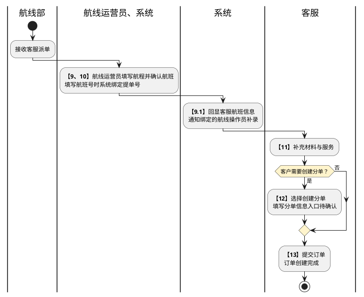
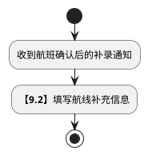
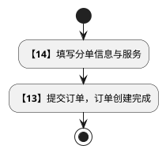
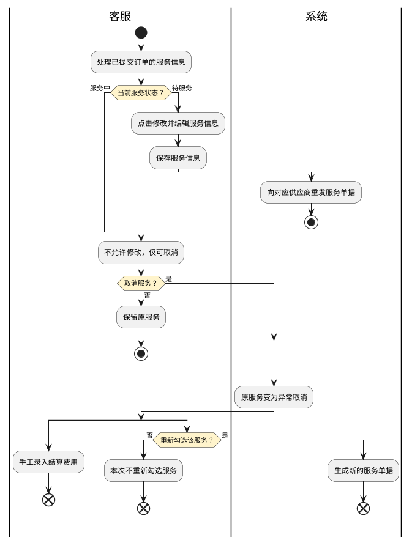
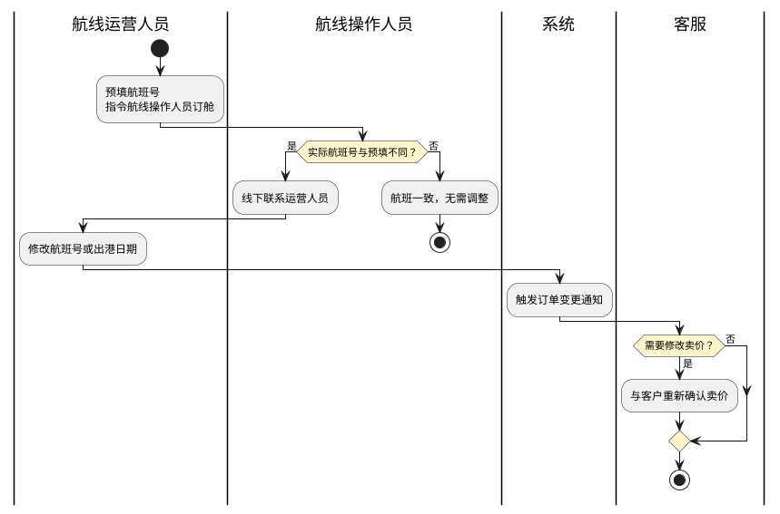
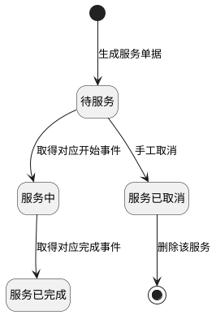
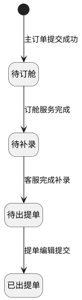
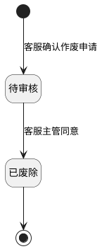

# 第020篇

> 本篇定位：空运-订单管理；主要内容：订单对象、状态与主子订单生命周期；文档角色：模块档；文档ID：5029269CA8

**主流程入口：** 本篇关联[业务模式主流程总览](../PRD.高捷物流系统.第01册.需求框架/PRD.高捷物流系统.第003篇.业务模式主流程总览.460E66776A.md#doc-460E66776A-business-modes)、[普货进出口关务流程](../PRD.高捷物流系统.第01册.需求框架/PRD.高捷物流系统.第005篇.普货进出口关务详细流程.D409606401.md#doc-D409606401-general-cargo-customs)、[跨境电商 BC 出口关务流程](../PRD.高捷物流系统.第01册.需求框架/PRD.高捷物流系统.第006篇.跨境电商BC出口关务详细流程.E21C200E67.md#doc-E21C200E67-bc-export-customs)、[跨境电商 BC 与个人物品 CC 进口流程](../PRD.高捷物流系统.第01册.需求框架/PRD.高捷物流系统.第007篇.跨境电商BC、个人物品CC进口详细流程.94C028FB51.md#doc-94C028FB51-bc-cc-import)、[跨境电商 BBC 进口入出区与调拨流程](../PRD.高捷物流系统.第01册.需求框架/PRD.高捷物流系统.第008篇.跨境电商BBC进口详细流程.B7B938B684.md#doc-B7B938B684-bbc-import)、[跨境电商 BBC 进口特殊业务流程](../PRD.高捷物流系统.第01册.需求框架/PRD.高捷物流系统.第008篇.跨境电商BBC进口详细流程.B7B938B684.md#doc-B7B938B684-special-operations)、[异常处理流程](../PRD.高捷物流系统.第01册.需求框架/PRD.高捷物流系统.第010篇.异常处理流程.13D397C572.md#doc-13D397C572-exceptions)。

## 1. 业务范围、角色与订单流程

**业务入口：** 空运订单

**概念模型：** [数据字典 · 空运订单与履约实体](../PRD.高捷物流系统.第08册.运营支撑/PRD.高捷物流系统.第065篇.数据字典.7A3D9E1F50.md#doc-7A3D9E1F50-domain-air-fulfillment)

**消息规则入口：** [消息推送规则](../PRD.高捷物流系统.第08册.运营支撑/PRD.高捷物流系统.第068篇.消息推送.5F950AB3B1.md#doc-5F950AB3B1-section-ef4930471a81)

### 1.1 空运订单业务范围

本篇定义空运主订单、子订单和分单的创建、补录、查询、修改、合成与作废规则，以及订单服务状态的流转边界。

### 1.2 业务入口与操作

| 系统 | 一级菜单 | 二级菜单 | 说明 |
| --- | --- | --- | --- |
| 空运工作台 | 订单管理 | 主订单管理 | 客服创建、编辑主订单。 |
| 空运工作台 | 订单管理 | 子订单管理 | 客服创建、编辑、合成子订单。 |
| 空运工作台 | 订单管理 | 订舱管理 | 航线填写订舱服务信息，完成订舱服务。 |

### 1.3 订单计算术语

受控术语定义见 [数据字典 · 受控业务术语](../PRD.高捷物流系统.第08册.运营支撑/PRD.高捷物流系统.第065篇.数据字典.7A3D9E1F50.md#doc-7A3D9E1F50-domain-values)。

本篇使用的订单计算术语如下：

| 专用名词 | 名词解释 |
| --- | --- |
| 分泡 | 分泡指分泡比例。客户的货物有的体积大、轻；有的货物体积小、重。为了统一计算重量 （体积重-毛重）*分泡比例+毛重=收客户的重量 |
| 体积重 | 体积重=体积*166.66 体积的取值优先顺序为 提单体积、仓库体积、预计体积 |
| 提单计费重 | 体积重量和净重对比。大者为提单计费重。 |

### 1.4 参与角色与职责

参与角色为管理员、客服、客服主管和航线部；操作授权见[空运操作权限](../PRD.高捷物流系统.第08册.运营支撑/PRD.高捷物流系统.第066篇.角色与访问权限.5E31456F30.md#doc-5E31456F30-air-actions)。

### 1.5 订单管理流程

下图聚焦主订单的两种形成方式，以及合成主订单是否进入订舱的分支，截止到派单给航线部。

派单后由航线部确认订单，客服继续补料，并根据客户需求创建分单。航班确认与提单号绑定按表中的同步关系合并展示。

- 步骤 9、10：航班确认与提单号绑定同步处理。
- 步骤 9：绑定的航线操作员收到通知后继续填写航线补充信息；该补录与客服步骤 11 的先后或等待关系未定义，图中不设同步汇合。
- 步骤 10：自动绑定的提单号支持修改。
- 步骤 12、14：进入步骤 14 的关系待确认；步骤 14 填写分单信息与服务后进入步骤 13，不推定步骤 12 直接接续步骤 14。

下图承接步骤 9.1 发出的通知，仅展示航线操作员收到通知后的补录，不定义其与客服步骤 11 的先后或等待关系。

本图终点仅表示通知后的补录片段结束，不据此认定订舱服务已完成；订舱完成条件见[订舱前置与完成流程](PRD.高捷物流系统.第021篇.空运-订舱管理.6A0360EC35.md#doc-6A0360EC35-section-2ab623a2d33a)。

下图仅展示步骤 14 到步骤 13 的已知片段；步骤 14 的入口待确认，不与步骤 12 建立未定义的连线。

订单形成、派单和补录的完整步骤及既有步号关系如下。

| 步骤 | 步骤描述 | 角色 | 流程描述 | 下一步骤 | 关键控制点 |
| --- | --- | --- | --- | --- | --- |
| 1 | 创建订单 | 客服 | 创建子订单，下一步2； 创建主订单，下一步是4 | 2 |  |
| 2 | 填写基础数据和服务信息 | 客服 | 填写子单上客户信息、货物信息、空运信息。基于客户需求对供应商发出各项服务指令，支持填写服务信息，传送给对应供应商。子订单上基础数据比主订单的基础数据填写项上多了收发件人信息。 | 3 | 是 |
| 3 | 提交子订单 | 客服 | 点击提交子订单。订单状态为“子订单完成”。 | 5 |  |
| 4 | 填写基础数据和服务信息 | 客服 | 填写主订单上客户信息、货物信息、运价信息。基于客户需求选择对供应商发出各项服务指令，支持填写服务信息，传送给供应商。 | 8 | 是 |
| 5 | 在列表栏勾选一个或多个子订单合成主单 | 客服 | 在子订单列表中勾选一个或多个子订单后，“合成主订单”操作区显示已选数量。点击该操作后，弹窗展示全部已选子订单；确认后合成主订单。 | 6 |  |
| 6 | 填写主订单信息 | 客服 | 合成主订单后，系统将子订单上的客户、品名、毛件体等信息做个聚合。填写主单上的目的地。基于客户需求，不需要进行订舱服务的走下一步7；需要进行订舱服务的走下一步8 | 7/8 |  |
| 7 | 提交订单 | 客服 | 客服提交订单，订单创建完成。 | 7 |  |
| 8 | 派单给航线部 | 客服 | 订单变为待确认状态。航线部可接单。 | 9 |  |
| 9 | 确认订单 | 航线部 | 航线部运营员填写航程信息后，点击确认航班。客服的展示界面回显航线部填写的关键信息；绑定关联关系的航线部操作员收到通知，继续填写航线补充信息。 | 10 | 是 |
| 10 | 生成提单号 | 航线部 | 9、10是同步实行。当航线运营员填写航班号后，系统自动绑定提单号，支持修改提单号。 | 11 | 是 |
| 11 | 补充材料、服务 | 客服 | 客服收到客户的服务需求和补料信息后，编辑订单。如果客户有创建分单的需求，下一步为12；如果客户没有创建分单的需求，下一步为13 | 12/13 | 是 |
| 12 | 创建分单 | 客服 | 客服选择创建分单 | 13 |  |
| 14 | 填写分单信息、服务 | 客服 | 填写分单信息和分单服务。 | 13 |  |
| 13 | 提交订单 | 客服 | 提交订单，订单创建完成。 |  |  |

### 1.6 订单异常与修改规则

订单提交后，服务是否可修改取决于服务状态；取消正在进行的服务后，原服务与重新勾选后生成的新服务单据分开处理。

原服务变为异常取消后，费用录入必做，重新勾选可选；未规定两者的先后或同步等待，因此分别展示。

图中仅覆盖“待服务”和“服务中”的修改、取消分支。分支终点只表示对应操作结束，不表示新服务或订单履约完成。

实际订舱航班与预填航班不同时，航线操作人员线下联系运营人员修改；卖价需要变更时由客服重新与客户确认。

本图细化下表“确定订单”的航班差异处理，终点仅表示本次航班差异检查与处理结束，不表示订单业务完成；原表未说明的后续节点不补接。订单状态、允许修改的字段和其他异常处理如下。

| 流程点 | 异常节点 | 前置条件 | 后续处理 |
| --- | --- | --- | --- |
| 3/7 | 提交订单 | 1. 子订单（分单）可以暂存，暂存时不生成服务单据，任意信息均可修改。 2. 子订单提交后，订单状态变为“子订单完成”，仅预计毛件体、运费卖价、后段卡车卖价、分泡可修改。 3. 订单状态为“待订舱”时，由航线部填写信息。航线部只能查看客服填写的信息，客服只能查看航线部填写的信息。 4. 订单状态为“待补录”或“待出提单”时，仅可编辑运费卖价、后段卡车卖价、分泡等客户报价信息及订单补录“代码”字段；保存后触发订单修改通知，具体规则见[消息推送规则](../PRD.高捷物流系统.第08册.运营支撑/PRD.高捷物流系统.第068篇.消息推送.5F950AB3B1.md#doc-5F950AB3B1-section-ef4930471a81)。 | 1. 符合修改条件时允许编辑并提交；不符合条件的字段置灰且不可编辑。 2. 订单提交后，状态为“待服务”的服务信息必须先点击“修改”方可编辑；保存后向对应供应商重新发送服务单据。 3. 状态为“服务中”的服务不允许修改，仅可取消；取消后服务状态变为“异常取消”，原服务置灰并排列在服务项末尾。重新勾选服务时生成新的服务单据。 4. 服务异常取消后，由客服手工录入结算费用。 |
| 2/8 | 选择服务 | 1. 未获取到服务状态节点时，客服需手动修改服务状态并选择修改时间。 | 1. 修改后的状态节点实时更新到在途跟踪中。 |
| 10 | 生成提单号 | 航司通知提单号作废时，需航线部临时修改提单号。 | 1. 修改提单号后，实时更新所有提单号信息。 |
| 9 | 确定订单 | 航线运营人员先填写航班号，发出指令让航线操作人员订舱。如果实际订下的航班号与预填航班号不同，操作员线下联系运营人员修改航班号或出港日期。 | 修改后触发订单变更通知，具体规则见[消息推送规则](../PRD.高捷物流系统.第08册.运营支撑/PRD.高捷物流系统.第068篇.消息推送.5F950AB3B1.md#doc-5F950AB3B1-section-ef4930471a81)。如需修改卖价，由客服与客户重新确认。 |

### 1.7 页面交互通用规则

- 订单列表页面，默认分页结构，每页默认10条记录显示。

- 创建订单时，默认显示“提交”“取消”按钮；修改订单时，默认显示“保存”“取消”按钮。

- 提交成功，页面显示“已提交成功！”提示。

- 若页面有输入项不符合输入规范或未填写必填项，则该输入项高亮提示，“提交”和“保存”按钮置灰，不可点击。

## 2. 主订单管理

### 2.1 主订单创建

- 订单创建页面，可创建主订单。

#### 2.1.1 主订单创建字段

所列长度限制用于保存、提交或接收校验；不符合时按本场景失败规则处理。

**界面原型概述 · 主订单创建客户信息**

| 字段或控件 | 个别界面约束或可见反馈 |
| --- | --- |
| 客户 | 取自合作方档案管理中为“客户”类别；必填；可编辑。 |
| 业务员 | 取自用户中心业务员名字；必填。 |
| 联系人 | 也可直接取合作方档案中的业务联系人信息，直接从候选列表选择，选择后，带出该联系人的姓名、电话和邮箱信息；也可单独重新录入；长度限制：256 个字符；选填。 |
| 订单流转 | 各分公司名称/各部门。 |
| 联系电话 | 长度限制：8～20 个字符；选填。 |

**界面原型概述 · 客户授信提示**

- **区域字段或业务元素**：客户、授信额度、剩余授信额度、联系业务员提醒、确定。
- **区域级通用规则**：从客户额度不足提示进入，只读展示该客户额度信息；不足及禁止下单的判定见[主订单创建规则](#doc-5029269CA8-section-a5d48cac9f5b)。

**界面原型概述 · 主订单创建货物信息**

| 字段或控件 | 个别界面约束或可见反馈 |
| --- | --- |
| 中文品名 | 填写中文品名；长度限制：256 个字符；选填；默认值：多个品名用分号隔开。 |
| 件数（件） | 正整数即可；必填。 |
| 体积（m³）、重量（kg) | 正数，支持保留两位小数；必填。 |
| 尺寸（长度cm）、尺寸（高度cm） | 正数，支持保留两位小数；选填。 |
| 尺寸（宽度cm） | 正数，最多保留两位小数；选填。 |
| 期望到货时间 | 格式：YYYY-MM-DD HH:mm；选填。 |
| 特殊货物 | 锂电池/危险品/鲜活；选填。 |

**界面原型概述 · 主订单创建空运信息**

| 字段或控件 | 个别界面约束或可见反馈 |
| --- | --- |
| 始发港代码、目的港代码 | 取自基础数据；必填。 |
| 航司产品 | 取自基础数据；必填；初始不设值。 |
| 预计出港日期 | 格式：YYYY-MM-DD；选填；初始不设值。 |
| 订舱要求 | 长度限制：50 个字符；选填；初始不设值。 |

**界面原型概述 · 主订单创建客户报价**

| 字段或控件 | 个别界面约束或可见反馈 |
| --- | --- |
| 运费卖价 | Minimum是最低总价；取值范围：0～100；必填；默认值：双击补充最小价格。 |
| 后段卡车卖价 | [计算/聚合规则见关联业务规则](#doc-5029269CA8-section-380bac5fe613)；取值范围：0～100；选填；默认值：双击补充最小价格。 |
| 分泡 | 0；0.1；0.2；0.3；0.4；0.5；0.6；0.7；0.8；0.9；1；选填；初始不设值。 |

**界面原型概述 · 主订单创建提货服务**

| 字段或控件 | 个别界面约束或可见反馈 |
| --- | --- |
| 供应商 | 必填；默认值：航晟；可编辑。 |
| 提货时间 | 格式：YYYY-MM-DD HH:mm；必填。 |
| 提货点 | 按省市区选择，输入具体地址；必填。 |
| 提货联系人 | 长度限制：1～4 个字符；必填；初始不设值。 |
| 提货电话 | 必填；初始不设值。 |
| 到货点 | 支持修改；必填；默认值：取系统配置的默认到货点。 |
| 到货联系人 | 支持修改；长度限制：0～60 个字符；必填；默认值：取系统配置的默认到货联系人。 |
| 到货电话 | 支持修改；默认值：取系统配置的默认到货联系电话。 |
| 特种车 | 监管车；非监管车；气垫车；平板车；初始不设值。 |
| 备注 | 可输入多个提货地点和时间；长度限制：256 个字符。 |

**界面原型概述 · 主订单创建仓储服务**

| 字段或控件 | 个别界面约束或可见反馈 |
| --- | --- |
| 仓储 | 支持多选；全部、打托、拆托、加重、分拣、改标签。 |

**后段卡车卖价计算规则：** 后段卡车卖价=单价*提单计费重。

#### 2.1.2 主订单创建与服务状态规则

**场景：** 主订单管理-创建主订单

**范围：** 录入主订单信息，提交订单

**参与角色：** 出口空运部客服、客服主管

**触发与入口：** 进入主订单管理页面，点击《新建主订单》按钮，进入此页面

**业务结果：** 校验通过后创建主订单并生成所选服务的服务单据；校验不通过时标识错误字段且不提交。

**处理规则**

1. 客户信息：客户必须取自合作方档案中与高捷合作关系为“客户”的公司主体。支持通过“+”录入多个联系人邮箱，录入后同步维护到合作方档案的业务联系人信息。订单节点触发的邮件按[消息推送规则](../PRD.高捷物流系统.第08册.运营支撑/PRD.高捷物流系统.第068篇.消息推送.5F950AB3B1.md#doc-5F950AB3B1-section-ef4930471a81)发送。客户授信额度低于0时禁止下单；低于20%时提示“此客户额度不足”，点击提示可查看详情。客户信息填写错误时，在费用录入页面修改客户名称并备注理由；财务已审核的，按调账流程处理。

2. 货物信息、空运信息：按照字段定义录入。

3. 服务项：可选订舱、提货、仓储服务。默认勾选订舱和仓储；订舱为必选项，仓储允许取消勾选，提货默认不勾选；未勾选的服务不展示。

4. 提交：点击《提交》保存。提交成功后提示“提交成功”并返回订单管理页面；必填项缺失或输入业务格式不符合要求时，相应字段高亮提示，《提交》按钮置灰且不可点击。

5. 服务单据：提交后生成所选服务的单据，并向对应供应商发送服务指令。服务状态根据供应商返回的货物轨迹判定；无法取得轨迹时，客服在线下确认后通过“状态管理”手工修改。

**主订单服务状态**

| 服务 | 待服务 | 进入服务中 | 进入服务已完成 |
| --- | --- | --- | --- |
| 提货 | 服务单据生成后 | 司机在小程序点击“出发”后自动更新。 | 司机到达目的地并点击“到达”后自动更新。 |
| 仓储 | 服务单据生成后、取得仓库重量前 | 取得WMS仓库称重后自动更新。 | 货物从中转仓离库后自动更新。 |
| 订舱 | 服务单据生成后、航线运营确认航班前 | 航线运营点击“确认航班”后自动更新。 | 航线操作点击“订舱完成”后自动更新。 |

上述三类服务在“待服务”状态下手工取消，状态变为“服务已取消”；在“服务中”或“服务已完成”状态下手工取消，状态变为“异常结束”。

订舱服务无法取得状态时，客服可手工将“待服务”改为“服务中”或“服务已完成”，不得将“服务已完成”回退为“待服务”或“服务中”。

**业务分支**

空运订单与内部供应商进行数据交互；字段定义见 [数据字典 · 主订单创建内部供应商接口字段](../PRD.高捷物流系统.第08册.运营支撑/PRD.高捷物流系统.第065篇.数据字典.7A3D9E1F50.md#doc-7A3D9E1F50-mappings-mapping-internal-supplier-order)。

**关联处理**

在提交后，才生成服务单据。服务单据的操作按钮：

待服务：修改。点击修改后，才可以修改服务信息。

服务中：取消。点击取消后，通知客服主管。

服务已取消：不展示，直接删除服务。

服务已完成：没按钮。置灰，不可编辑。在结算页面生成明细

异常结束：没按钮。置灰，不可编辑。在结算页面生成明细。

**服务单状态图 · 正常履约与待服务取消**

本图共用于提货、仓储和订舱的一般履约路径，各服务触发事件取上表；补录新增服务的事件见[主订单补录与服务规则](#doc-5029269CA8-section-be0a1aa30e46)。订舱的手工补录、航班变更及亏损审核单独见[订舱处理规则](PRD.高捷物流系统.第021篇.空运-订舱管理.6A0360EC35.md#doc-6A0360EC35-section-7e8797c5c9ba)。

- “服务中”的取消分支：[订单异常与修改规则](#doc-5029269CA8-section-9983c813182e)称服务中取消后为“异常取消”，本节称“异常结束”；统一前不将二者绘为同一状态。重新勾选会生成新服务单据，不是原服务回到“待服务”。
- “服务已完成”的取消分支：本节同时写“服务已完成可手工取消”和“服务已完成没按钮”，取消入口尚待明确，因此本图未补接完成后的取消路径，也不将完成画成不可逆终点。取消及费用规则仍保留在正文。

### 2.2 主订单补录

- 在《主订单管理》新增主订单后，点击提交后，页面跳转至主订单列表。订单状态变为“待订舱”。

- 在航线部订舱服务完成后，订单状态变为“待补录”。点击订单号，进入订单补录界面。

**主订单状态图 · 创建至出提单**

本图聚焦主订单，不将订舱、提货和仓储的服务状态合并为订单状态。补录完成后的状态见[客服待办任务](../PRD.高捷物流系统.第08册.运营支撑/PRD.高捷物流系统.第067篇.工作台与待办管理.279CFF369E.md#doc-279CFF369E-section-677910652394)，出提单结果见[提单编辑与预览下载规则](PRD.高捷物流系统.第023篇.空运-提单与航司推送.ED54E43A14.md#doc-ED54E43A14-section-43b81c0c9f43)。

- “待订舱”的入口：本图采用本节明确的主订单创建入口；[订单管理流程](#doc-5029269CA8-section-0de90fb8a71c)另称派单后为“待确认”，与“待订舱”的关系尚未明确，不在图中合并或新增迁移。亏损审批见[订舱处理规则](PRD.高捷物流系统.第021篇.空运-订舱管理.6A0360EC35.md#doc-6A0360EC35-section-7e8797c5c9ba)。
- “已出提单”的后续：图示范围截止到出提单，不表示订单生命周期结束。“已交单”的进入动作与“已废除／已作废”的术语关系未闭合，不能据此补接终态；相关未决项集中见[PRD自洽性问题](../../analysis/PRD自洽性问题.md)。

#### 2.2.1 主订单补录字段

**界面原型概述 · 订单补录**

- **区域字段或业务元素**：英文品名、唛头、海关申报价值、发货人、收货人、签发日期、随机文件、采购单号、销售单号、发票号、代码、IATACODE、ISSUING CARRIER。
- **区域级通用规则**：所列长度限制用于保存、提交或接收校验；不符合时按本场景失败规则处理。

| 字段或控件特例 | 界面特例或可见反馈 |
| --- | --- |
| 英文品名 | 长度限制：1～256 个字符；必填。 |
| 唛头 | 客户有提供就填写；长度限制：1～256 个字符；选填。 |
| 海关申报价值 | 支持以字母或数字表示；数字表示时最多保留两位小数；选填。 |
| 发货人、收货人 | 弹出编辑；长度限制：1～500 个字符；必填。 |
| 签发日期 | 提单右下角的签发日期，默认为出港日期，支持修改；选填。 |
| 随机文件 | 支持多选；选填。 |
| 采购单号、销售单号 | 选择对应单号后按业务单号规则填写，可包含数字、特殊字符和文字；长度限制：1～50 个字符；选填。 |
| 发票号 | 按发票号规则填写，可包含数字、特殊字符和文字；长度限制：1～50 个字符；选填。 |
| 代码 | 可选 EAP 或 EAW；[维护状态见主订单补录与服务规则](#doc-5029269CA8-section-be0a1aa30e46)；选填；默认值：EAP。 |
| IATACODE | 基础数据自动带出；长度限制：1～10 个字符；只读。 |
| ISSUING CARRIER | 基础数据自动带出；长度限制：1～256 个字符；只读。 |

#### 2.2.2 主订单补录与服务规则

**场景：** 主订单管理-订单补录

**范围：** 补充订单信息。完成订单操作。

**参与角色：** 空运客服、客服主管

**触发与入口：** 订舱服务完成后，订单状态=“待补录”时，可点击订单号进行补录。

**业务结果：** 校验通过后保存补录信息并完成订单操作；校验不通过时给出提示且不提交。

**处理规则**

**页面逻辑**

- 确认订单类型为直单还是主单。在未提交前，订单类型可以修改，修改后，提单信息、货物信息、服务信息可以自动带入修改前的已填写的数据。（如果是点击“发送预配”按钮后，更改订单类型。则系统报错。必须先取消发送预配服务后，才可以更改订单类型）

- 确认为直单时，默认按钮为“取消”、“提交”。确认为主单时，默认按钮为“取消”、“分单”。只有生成分单后，主单才展示“提交”按钮。如果分单毛件体之和与主单数据不相符，提交时校验，系统报错，不予提交。

- 依据字段定义填写提单信息、货物信息、服务信息。

直单的服务信息项：订舱服务、提货服务、仓储服务、地面操作服务（预配发送、中转、货站安检、清关派送）、关务服务。

主单的服务信息项：订舱服务、提货服务、仓储服务、地面操作服务（预配发送、中转、货站安检、清关派送）。

- 在订单创建时填写的服务项，在订单补录时，自动带入已填写的服务项信息。如，订单创建时已勾选的提货服务，在订单补录的时候展示，置灰，不可编辑。当提货服务状态=“待服务”，点击修改按钮，支持修改服务信息。当提货服务状态=“服务中”，没有修改按钮，仅可支持取消服务。取消服务后生成异常取消费用项。

- 地面操作服务中，默认勾选预配发送、中转、货站安检服务；清关派送服务默认不勾选。

- 点击提交订单后，不生成预配发送服务单据。必须由客服手动操作“发送预配”按钮后，才生成服务单据。默认发送入仓后回传的毛件体给海关。如果此时货物没有入高捷仓库，则入仓的毛件体由客服手动录入。如果入仓的毛件体没有数据，则点击“发送预配”后，弹出提示《当前没有入仓毛件体，是否使用预计毛件体发送预配》。

- 点击“分单”按钮后，进入分单页面。详细页面见分单页面。此时报关服务和清关派送服务挂在每个分单上。

**业务分支**

入仓后返回的毛件体不在航线部设定的预定区间内时，点击“发送预配”应提示异常；区间规则见订舱管理。

空运订单与内部供应商交换以下数据：

**空运发送给内部供应商**

- 中转服务：库区、单证情况、预报关/非预报关（直航=预报关，国内中转=非预报关）、提单号、头程航班、中转件数、中转重量、中转体积、提货点（默认高捷仓库地址）、卸货点（默认货站地址）。

- 报关服务：报关选择（我司报关/客自报关）、单证类型（代理出口报关/单证报关/B2C报关）、上传附件、报关备注、报关员电话、中转件数、中转重量、中转体积、品名。

- 货站安检：预报关/非预报关（直航=预报关，国内中转=非预报关）、预报件数、预报重量、预报体积、客户名称、提单号、始发地、目的地、头程航班、截单时间、分单号、分单品名、到货日期。

- 清关派送：提单号、提单件数、提单毛重、提单体积、头程出港日期、二程出港日期、预计到达日期（航班到达时间）、派送地址、电话、联系人（取分单地址）、清关派送备注。

2. 内部供应商返回：中转服务的派车时间和进货站时间、货站安检的入园区时间、清关派送的清关时间和派送时间。

**补录服务状态与节点**

| 服务及业务结果 | 待服务 | 进入服务中 | 进入服务已完成 |
| --- | --- | --- | --- |
| 中转：将货物从中转仓运到货站 | 提交服务后 | 货物离开高捷中转仓，取得WMS离库状态后自动更新。 | 货物到达货站，安检人员在小程序确认封签号或订单号后自动更新。 |
| 报关：完成货物报关 | 提交服务后 | 取得翌飞“审结”状态后自动更新。 | 取得翌飞“SWP报关单放行”状态后自动更新。 |
| 货站安检：货物进入货站 | 提交服务后 | 货站人员在小程序录入封条或订单号后自动更新。 | 抓取到实际件重体状态后自动更新。 |
| 清关派送：通知海外部在货物下飞机后清关并派送至目的地 | 提交服务后 | 取得翌飞“CCD货物清关”状态后自动更新。 | 客户签收后，客服线下获知结果并手工修改状态，维护签收时间等基本信息。 |

上述四类服务在“待服务”状态下手工取消，状态变为“服务已取消”；在“服务中”或“服务已完成”状态下手工取消，状态变为“异常结束”。

预配发送服务在提交后、点击“预配发送”前为“待服务”。客服手动点击“预配发送”并收到翌飞货物预配状态后，状态变为“服务已完成”；在“服务中”或“服务已完成”状态下手工取消，状态变为“异常结束”。

订单补录中的“代码”默认取 `EAP`，可选 `EAP` 或 `EAW`。订单状态为“待补录”或“待出提单”时可修改；其他状态下不可修改。

### 2.3 主订单查询与操作

- 主订单提交后，页面跳转至主订单列表

#### 2.3.1 主订单列表筛选项

**界面原型概述 · 主订单列表筛选栏**

| 字段或控件 | 个别界面约束或可见反馈 |
| --- | --- |
| 订单号、提单号、业务员 | 支持模糊查询。 |
| 客户 | 按客户筛选；匹配方式尚未明确。 |
| 航司、始发港、目的港 | 默认值：全部。 |
| 客服 | 支持模糊查询；默认值：全部。 |
| 航班号 | 精确查询。 |
| 出港日期、创建日期 | 按日期筛选；如果不筛选，默认为全部。 |
| 货物状态、订单状态、报关状态 | 分别按对应状态维度勾选，提供“全部”选项；不能用其中一类状态替代另一类状态。 |

**界面原型概述 · 主订单结果列表**

- **区域字段或业务元素**：订单号、提单号、分单号、建单日期、头程航班、出港日期、主订单类型、始发港、目的港、预计/入仓/提单毛件体、货物状态、订单状态、报关状态、业务人员、复制、发送、作废、修改；选择汇总含已选项数、总重量、总数量、总体积、清空、客服派单。
- **区域级通用规则**：结果区只读展示订单信息，订单号可进入详情，毛件体按预计、入仓、提单分别展示；操作资格与结果按下一节处理。

已选项汇总的重量、件数、体积采用哪一组毛件体及空值处理尚未明确；不得直接将页面示例的合计当成正式算法。

#### 2.3.2 主订单查询与操作规则

**场景：** 主订单管理-主订单查询

**范围：** 查看所有主订单，了解主订单情况

**参与角色：** 空运客服、空运客服主管

**触发与入口：** 进入主订单管理页面，通过浏览和筛选，快捷找到相关订单。

**业务结果：** 列表展示符合筛选条件的主订单，并支持复制、发送、作废和修改。

**处理规则**

1. 排序：主订单优先按订单状态排序；状态相同时按货物状态排序；货物状态仍相同时按创建时间排序。

2. 复制：复制当前订单的全部信息，新订单状态为“待订舱”，且不生成服务单据。

3. 发送：客服可选择入仓图、航班信息及收件人后发送；默认不选择发送内容。收件人取合作方档案中的业务联系人。通知渠道、接收对象、附件取值与消息内容见[消息推送规则](../PRD.高捷物流系统.第08册.运营支撑/PRD.高捷物流系统.第068篇.消息推送.5F950AB3B1.md#doc-5F950AB3B1-section-ef4930471a81)。

4. 作废：所有服务状态均为“待服务”时，点击“作废”直接删除订单，不触发审核，订单不再显示在列表中。有任一服务不是“待服务”时，系统弹出确认框；确认后订单状态变为“待审核”。客服主管可在审批管理页面按提交时间查看申请，并进入订单创建页面选择“同意”或“拒绝”。拒绝时必须填写0至500字的理由；同意后订单状态变为“已废除”。审批结果通知按消息推送规则发送。

5. 修改：仅允许修改运费卖价、后段卡车卖价和分泡。保存后触发订单修改通知；航线部修改成本或航班信息后触发订单变更通知。具体规则见[消息推送规则](../PRD.高捷物流系统.第08册.运营支撑/PRD.高捷物流系统.第068篇.消息推送.5F950AB3B1.md#doc-5F950AB3B1-section-ef4930471a81)。

**主订单状态图 · 作废审批片段**

本图从“任一服务不是待服务，客服确认作废申请”开始，不表示主订单创建时即进入审核。所有服务均为待服务时直接删除，不进入本图。

“待审核”专指作废申请，不能与亏损审核共用通过结果；拒绝后的主订单状态尚未明确，图中不假定恢复为申请前状态。

**适用范围与约束**

客服的主订单查看范围见[空运数据范围](../PRD.高捷物流系统.第08册.运营支撑/PRD.高捷物流系统.第066篇.角色与访问权限.5E31456F30.md#doc-5E31456F30-air-scope)。转交他人跟进时，按下表处理。

| 动作 | 处理与结果 |
| --- | --- |
| 客服派单 | 勾选订单，点击“客服派单”；从用户中心选择接单客服，填写不超过500字的备注并确认。 |
| 接受派单 | 接单客服接受后，订单加入其所属列表。 |
| 拒绝派单 | 接单客服拒绝时必须填写备注。 |

派单及拒绝结果通知按[消息推送规则](../PRD.高捷物流系统.第08册.运营支撑/PRD.高捷物流系统.第068篇.消息推送.5F950AB3B1.md#doc-5F950AB3B1-section-ef4930471a81)发送。

**界面原型概述 · 作废申请与审批管理**

- **区域字段或业务元素**：作废确认弹窗含订单号、提单号、分单号、正在进行或已完成的服务、作废理由、费用提醒、确认、取消；审批查询栏含订单号、提单号、客户、客服、建单日期范围、申请日期范围、查询、重置；审批列表含订单号、客户、客服、创建日期、提交日期、提单号、理由、货物数据、货物状态、查看。
- **区域级通用规则**：弹窗展示本次作废对象和受影响服务；审批列表只读展示申请，点击查看进入本节规定的同意或拒绝处理。

| 字段或控件特例 | 界面特例或可见反馈 |
| --- | --- |
| 作废理由 | 可录入不超过500字的理由。 |
| 费用提醒 | 提示作废后将产生所列已进行服务的异常完成费用；费用处理按服务结算规则执行。 |

## 3. 分单管理

- 《订单补录》中选择订单类型为主单的时候，支持点击“分单”后，进入分单创建页面。管理主单下的分单。

**界面原型概述 · 主单下的分单管理**

- **区域字段或业务元素**：主单摘要含始发港、头程目的地、头程航司、目的港及提单毛重、件数、体积、计费重；分单列表含子单号、客户分单号、分单件数、毛重、计费重、体积、状态、编辑、取消、移单及各数量合计；提供新增、引入和返回入口。
- **区域级通用规则**：摘要和合计只读展示；分单操作与引入后主分单数量校验见[分单创建与移单规则](#doc-5029269CA8-section-99d88c9da156)。列表合计是否排除已取消分单，尚未明确。

### 3.1 分单状态定义

| 订单状态 | 状态说明 |
| --- | --- |
| 子订单暂存 | 主订单未提交前，点击保存后是子订单暂存 |
| 子订单完成 | 主订单提交后，子订单的状态为“子订单完成” |
| 已取消 | 在有服务项生成后，取消订单的子订单 |

- 点击新增后，创建分单。注意，此时分单创建页面不生成子订单号，必须点击保存后，才生成子订单号。

### 3.2 分单创建字段

**界面原型概述 · 分单创建**

- **区域字段或业务元素**：子订单号、分单号、英文品名、唛头、海关申报价值、发货人、收货人、币种、运费条款、杂费预付到付、付费方式、费率、目的港、仓库操作要求、分单体积、件数、毛重、分单计费重、总金额、Handling Information。
- **区域级通用规则**：所列长度限制用于保存、提交或接收校验；不符合时按本场景失败规则处理。

| 字段或控件特例 | 界面特例或可见反馈 |
| --- | --- |
| 分单号 | 按分单号规则由数字和字母组成；暂存与编辑规则见[空运订单业务规则](#doc-5029269CA8-section-99d88c9da156)；长度限制：12 个字符；选填；无预设值；可编辑。 |
| 英文品名 | 长度限制：1～256 个字符；必填。 |
| 唛头 | 客户有提供就填写；长度限制：1～256 个字符；选填。 |
| 海关申报价值 | 支持以字母或数字表示；数字表示时最多保留两位小数；选填。 |
| 发货人、收货人 | 长度限制：1～500 个字符；必填。 |
| 币种 | 取自基础数据；选填。 |
| 运费条款、杂费预付到付 | 在 FREIGHT PREPAID、FREIGHT COLLECT 中单选；必填；默认值：FREIGHT PREPAID。 |
| 付费方式 | 在 PP、CC、DDP、DDU 中单选；必填；默认值：PP。 |
| 费率 | 公布运价；取值范围：1～100；选填。 |
| 目的港 | 选填。 |
| 仓库操作要求 | 长度限制：0～256 个字符；选填。 |
| 子订单号 | 显示保存后生成的子订单号。 |
| 分单体积 | 支持双击录入体积明细。 |
| 分单计费重 | 只读展示对应分单计费重。 |

分单详情中的毛件体、总金额和 Handling Information 需保留；其独立录入、重算及与订单补录、提单编辑之间的同步边界尚未明确，不以示例数值补定默认值或公式。目的港在字段表为选填、在页面标为必填，必填性待确认。

### 3.3 分单创建与移单规则

**场景：** 主订单管理-分单管理

**范围：** 创建分单

**参与角色：** 空运客服、客服主管

**触发与入口：** 创建主订单，选择订单类型为主单。

**业务结果：** 保存后生成子订单号，订单进入“子订单暂存”状态。

**处理规则**

1. 按上述字段规则填写分单信息。

1. 选择服务项：子订单可选择提货服务、仓储服务、关务服务和清关派送服务；默认勾选关务服务，其他服务默认不勾选。

**保存后，子订单状态变为“子订单暂存”，操作栏显示“编辑”“取消”和“移单”。**

- 编辑：可编辑任意字段。

- 取消：子订单处于“子订单暂存”状态时可直接取消；处于“子订单完成”状态时，系统判断是否已生成服务单据。已生成服务单据的，取消后该订单仍保留在子订单列表中，并生成结算费用；子订单状态变为“已取消”。

- 移单：将一个分单移动到子订单列表，服务状态和信息保持不变。

1. 引入：引入同一客户的其他子订单。引入后，系统不自动更新主单毛件体，仅校验子单毛件体之和是否等于主单毛件体；相等时允许提交主单，不相等时提示错误。

- 分单号：客户有则填；未填写时，点击“暂存”生成分单号。
- 编辑控制：子订单状态=“暂存”时所有字段可编辑，其他状态不可编辑。

## 4. 子订单与合成主订单

- 在确定为空运出口的业务后，客户不确定是否下的是主单时，客服创建子订单。

### 4.1 子订单创建与批次规则

**场景：** 子订单管理-子订单创建

**范围：** 创建子订单

**参与角色：** 航晟物流客服、空运客服

**触发与入口：** 点击子订单管理上的“创建”按钮，进入订单详情

**处理规则**

页面字段与主订单创建字段一致。

1. 填写客户信息、货物信息、空运信息和批次管理，并选择服务项。

2. 批次管理：客户不同批次的货物在不同时刻入仓，绑定在同一个子订单并分批出运。具体规则如下。

   | 事项 | 规则 |
   | --- | --- |
   | 批次明细 | 勾选批次管理时默认生成一行明细；点击“增加行”新增明细。 |
   | 批次号 | 按“分单号+两位数字”生成。 |
   | 预计货物毛件体 | 选填。 |
   | 入仓货物毛件体、剩余毛件体 | 由仓库返回；入仓毛件体格式为净重（kg）/件数（个）/体积（m³）。 |
   | 发送件数 | 由客服录入；大于该批次件数时数字标红，且不可提交。 |
   | 件数计算 | 剩余件数=件数-已发送件数；已发送件数=客服多次发送指令的件数之和。 |

3. 合并批次：点击“合并”打开弹窗，按子订单号和批次号筛选。无批次时列表为空；有批次时，勾选目标批次并确认后引入当前订单。系统记录原子订单号和新子订单号，并发送给航晟物流。

4. 提交后返回子订单列表，订单状态变为“子订单完成”。此时不生成订舱服务单据，合成主订单后方可生成。

**界面原型概述 · 子订单批次管理**

- **区域字段或业务元素**：批次号、预计货物毛件体、入仓货物毛件体、剩余毛件体、已发送件数/总件数、剩余件数/总件数、发送指令件数、增加行、删除、引入；引入弹窗含子订单号、批次号、查询、批次号列表、所属子订单号、剩余毛件体、选择、确定、取消。
- **区域级通用规则**：按批次展示货物数量与发送结果，发送件数由客服填写；增行、引入和数量校验按本节规则处理。

批次删除入口的允许状态、已发送货物或已入库记录的处理尚未明确，不能据入口推定可删除已履约批次。

### 4.2 子订单管理页面

- 查看所有子订单。

### 4.3 子订单查询与合成规则

**场景：** 子订单管理-子订单查询

**范围：** 查看子订单

**参与角色：** 航晟客服、空运客服

**触发与入口：** 筛选项可以使用

**处理规则**

1. 子订单沿用主订单的通用筛选维度；订单标识及状态选项按子订单对象呈现，不使用主订单专属状态代替子订单状态。

2. 操作栏：复制后新订单信息与原订单一致且允许修改，不生成服务单据；“子订单暂存”状态下作废时直接删除，“子订单完成”且未生成服务单据时标记删除；“子订单暂存”状态下可修改任意信息，“子订单完成”状态下仅可修改运费卖价、后段卡车卖价和分泡。

3. 合成主订单：勾选子订单后，“合成主订单”功能显示已选数量。点击后弹窗展示所有已选订单；可查看订单或从本次选择中删除订单。

4. 点击“确定生成”后，上半部分展示不可编辑的子订单数据。客服重新选择始发港和目的港；需要订单流转时可选择对应分公司，该项非必填。订舱服务为必选，客服重新填写航司及航司产品；提交后向航线部生成订舱服务单据。

5. 航线部完成订舱服务后，主订单变为“待补录”，订单类型为“合成主订单”。

**界面原型概述 · 子订单列表与合成主订单**

- **区域字段或业务元素**：查询栏显示订单号、分单号和通用查询条件；列表含订单号、分单号、建单日期、始发港、目的港、预计/入仓/提单货物数据、货物状态、订单状态、报关状态、业务人员、复制、作废、修改，以及已选项数与毛件体汇总、合成主订单、导出、客服派单。合成弹窗含子单号、分单号、客户、货物数据、始发港代码、目的港代码、合计、查看、删除、取消、确定生成。
- **区域级通用规则**：列表与合成弹窗只读展示所选订单，合成数量随勾选结果展示；从本次选择中删除不等于作废原子订单。

导出范围、格式与字段，以及子订单客服派单是否完全沿用主订单资格仍待确认；保留入口，不从截图推定权限和处理结果。

### 4.4 合成主订单补录

- 合成主订单后，进入补录环节。合成前的所有子订单信息变为分单信息。

#### 4.4.1 合成主订单补录规则

**场景：** 主订单管理-订单补录

**范围：** 航线部订舱完成后，客服填写合成主订单的补录信息

**参与角色：** 航晟客服、空运客服

**触发与入口：** 子订单合成后。

**处理规则**

1. 合成主订单和主订单的补录字段定义保持一致。

1. 服务选择项只支持勾选“地面操作服务”。服务信息跟主订单服务信息保持一致。

1. 分单管理的信息默认带入原子订单的信息，不支持编辑。原子订单上的服务展示在分单上。待服务的服务状态信息的服务状态需点击“修改”后修改服务信息。服务中的服务不可编辑。
