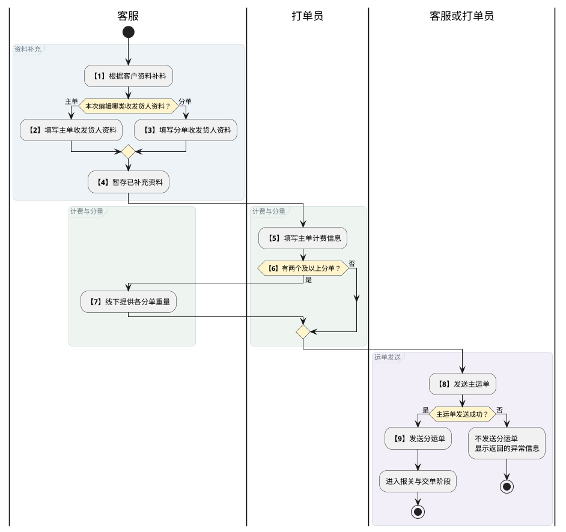
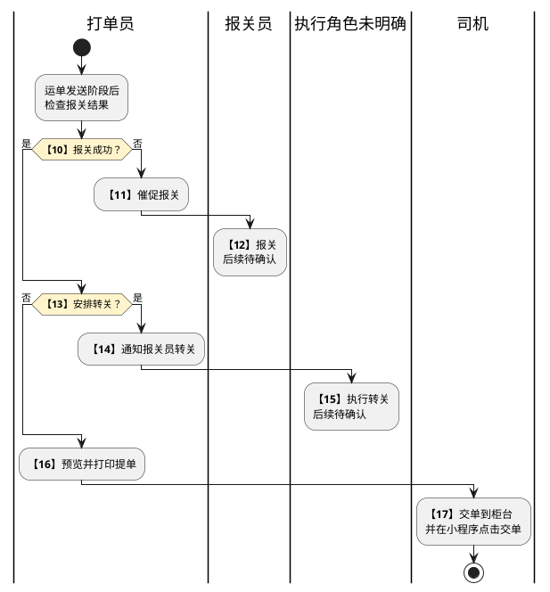
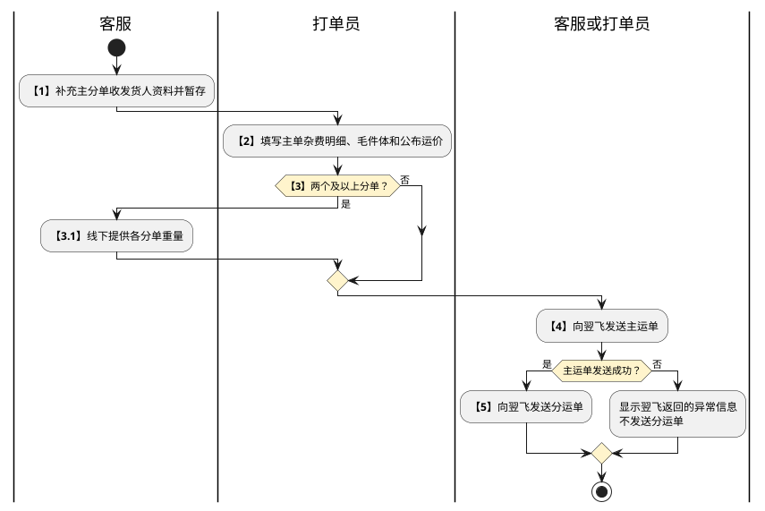
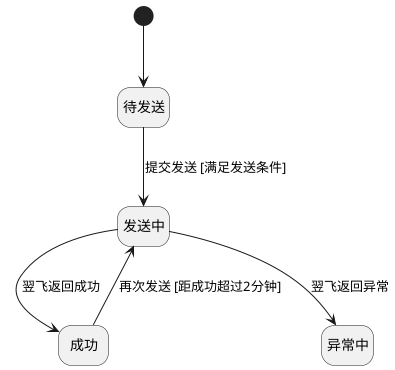
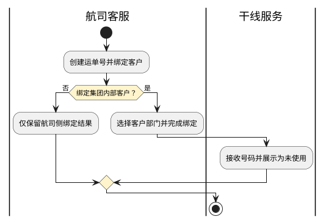
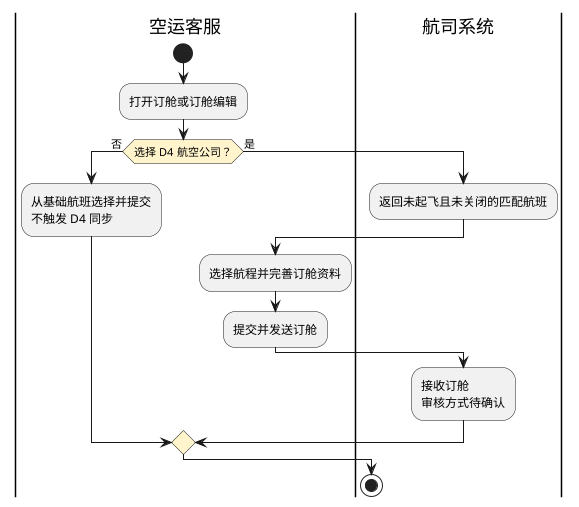
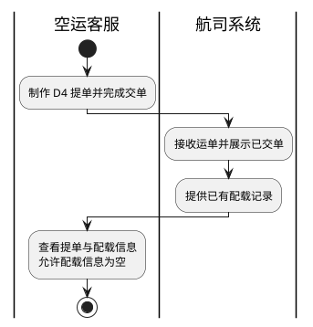

# 第023篇

> 本篇定位：空运-提单与航司推送；主要内容：提单查询、编辑、输出与模板，以及航司推送入口、批量发送、防重、状态与失败反馈；文档角色：模块档；文档ID：ED54E43A14

**主流程入口：** 本篇关联[业务模式主流程总览](../PRD.高捷物流系统.第01册.需求框架/PRD.高捷物流系统.第003篇.业务模式主流程总览.460E66776A.md#doc-460E66776A-business-modes)、[普货进出口关务流程](../PRD.高捷物流系统.第01册.需求框架/PRD.高捷物流系统.第005篇.普货进出口关务详细流程.D409606401.md#doc-D409606401-general-cargo-customs)、[跨境电商 BC 出口关务流程](../PRD.高捷物流系统.第01册.需求框架/PRD.高捷物流系统.第006篇.跨境电商BC出口关务详细流程.E21C200E67.md#doc-E21C200E67-bc-export-customs)、[跨境电商 BC 与个人物品 CC 进口流程](../PRD.高捷物流系统.第01册.需求框架/PRD.高捷物流系统.第007篇.跨境电商BC、个人物品CC进口详细流程.94C028FB51.md#doc-94C028FB51-bc-cc-import)、[跨境电商 BBC 进口入出区与调拨流程](../PRD.高捷物流系统.第01册.需求框架/PRD.高捷物流系统.第008篇.跨境电商BBC进口详细流程.B7B938B684.md#doc-B7B938B684-bbc-import)、[跨境电商 BBC 进口特殊业务流程](../PRD.高捷物流系统.第01册.需求框架/PRD.高捷物流系统.第008篇.跨境电商BBC进口详细流程.B7B938B684.md#doc-B7B938B684-special-operations)。

## 1. 空运-提单管理

**业务入口：** 提单管理

**概念模型：** [数据字典 · 空运订单与履约实体](../PRD.高捷物流系统.第08册.运营支撑/PRD.高捷物流系统.第065篇.数据字典.7A3D9E1F50.md#doc-7A3D9E1F50-domain-air-fulfillment)

### 1.1 空运提单业务范围、流程与功能规则

#### 1.1.1 提单管理业务范围

本篇定义提单查询、主分单编辑、预览下载、批量发送、备注和提单模板管理规则。

综合订单使用的总运单资料见[综合总运单与分单资料](PRD.高捷物流系统.第013篇.综合总运单与分单资料.0B2997FBF5.md#doc-0B2997FBF5-general-waybill-records)。

#### 1.1.2 业务入口与操作

| 系统 | 一级菜单 | 二级菜单 | 说明 |
| --- | --- | --- | --- |
| 空运系统 | 提单管理 | 提单编辑 | 对提单进行编辑 |
| 空运系统 | 提单管理 | 分单编辑 | 对分单进行编辑 |
| 空运系统 | 提单管理 | 提单模板管理 | 对提单模板进行管理 |

#### 1.1.3 业务术语

受控术语定义见 [数据字典 · 受控业务术语](../PRD.高捷物流系统.第08册.运营支撑/PRD.高捷物流系统.第065篇.数据字典.7A3D9E1F50.md#doc-7A3D9E1F50-domain-values)。

#### 1.1.4 参与角色与职责

| 用户角色 | 描述 |
| --- | --- |
| 客服 | 操作授权见[提单操作权限](../PRD.高捷物流系统.第08册.运营支撑/PRD.高捷物流系统.第066篇.角色与访问权限.5E31456F30.md#doc-5E31456F30-air-actions)。 |
| 打单员 | 操作授权见[提单操作权限](../PRD.高捷物流系统.第08册.运营支撑/PRD.高捷物流系统.第066篇.角色与访问权限.5E31456F30.md#doc-5E31456F30-air-actions)。 |
| 报关员 | 对该票货物报关 |
| 司机 | 把提单等资料交到柜台 |

#### 1.1.5 提单处理流程

提单处理分为资料与运单发送、报关与交单两个阶段。主单和分单资料从各自编辑入口补充；分单数量决定是否需要客服线下分重。

本图终点仅表示本次准备与发送阶段结束，不表示报关、转关或交单已完成。主单发送成功后才可发送分单，发送规则见[主分运单发送流程](#doc-ED54E43A14-section-7680e3573975)。发送阶段之后，按报关结果决定催报关或进入转关判断。

- 步骤 12：报关后的后续连接待确认。
- 步骤 15：执行转关的执行角色与后续连接待确认；该步骤的角色栏与动作描述不一致。

报关、转关分支保留到原表已明确的处理结果，不推定其后自动打印或交单。各角色与完整步骤如下。

| 步骤 | 步骤描述 | 角色 | 流程描述 | 下一步骤 | 关键控制点 | 备注 |
| --- | --- | --- | --- | --- | --- | --- |
| 1 | 补料编辑 | 客服 | 客服根据客人的资料进行资料补充 | 2/3 |  | 系统流程 |
| 2 | 编辑收发货人 | 客服 | 填写主单收发货人等资料 | 4 |  | 系统流程 |
| 3 | 填写分单的收发货人 | 客服 | 填写分单的收发货人等资料 | 4 |  | 系统流程 |
| 4 | 暂存 | 客服 | 暂存已补充的资料 | 5 |  | 系统流程 |
| 5 | 填写主单计费信息 | 打单员 | 填写主单杂费明细、毛件体和公布运价 | 6 |  | 系统流程 |
| 6 | 判断分单数量 | 打单员 | 有两个及以上分单时进入步骤7；否则进入步骤8。 | 7/8 |  | 系统流程 |
| 7 | 客服分重 | 客服 | 客服提供各分单重量，用于随机文件、航司系统录入和按分单结算。 | 8 |  | 线下流程 |
| 8 | 发送主运单 | 客服/打单员 | 发送提单相关信息给航司系统 | 9 |  | 系统流程 |
| 9 | 发送分运单 | 客服/打单员 | 发送分单相关信息给航司系统 | 10 |  | 系统流程 |
| 10 | 报关是否成功 | 打单员 | 报关成功则进入步骤13 报关不成功则进入步骤11 | 11/13 |  | 线下流程 |
| 11 | 催促报关 | 打单员 | 催促报关员报关 | 12 |  | 线下流程 |
| 12 | 报关员报关 | 报关员 | 报关员报关 | - |  | 线下流程 |
| 13 | 转关 | 打单员 | 安排转关则进入步骤14 不安排转关则进入步骤16 | 14/16 |  | 线下流程 |
| 14 | 通知报关员转关 | 打单员 | 通知报关员转关 | 15 |  | 线下流程 |
| 15 | 报关员转关 | 打单员 | 报关员转关 | - |  | 线下流程 |
| 16 | 打印提单 | 打单员 | 预览提单并打印 | 17 |  | 系统流程 |
| 17 | 司机交单 | 司机 | 司机根据打单员打印出的提单交到柜台，并在司机端小程序点击“交单” |  |  | 系统流程 |

#### 1.1.6 提单列表字段与汇总规则

**查询字段**

**界面原型概述 · 提单列表查询栏**

- **区域字段或业务元素**：工作号/提单号、操作人员、客户简称、出港日期、截单时间、订单状态。
- **区域级通用规则**：除所列特例外，查询条件均选填、无预设值。

| 字段或控件特例 | 界面特例或可见反馈 |
| --- | --- |
| 工作号/提单号 | 填写工作号/提单号，支持模糊搜索。 |
| 操作人员 | 支持模糊搜索。 |
| 客户简称 | 支持模糊搜索；（档案资料-客户管理-客户简称）；可搜索候选项。 |
| 出港日期、截单时间 | 不选择默认全部日期。 |
| 订单状态 | 选项如下：；全部；待出提单；已出提单；已交单；默认值：待出提单。 |

**列表字段**

每页显示50条。

**界面原型概述 · 提单列表栏**

- **区域字段或业务元素**：提单号、分单号、主单数据-重量（kg）、主单数据-件数（件）、主单数据-体积（m³）、分单数据-重量（kg）、分单数据-件数（件）、分单数据-体积（m³）、主单发送状态、分单发送总状态、目的港、头程航班号、出港日期、客服、航线、截单时间、航司/同行、订单号、交单时间、交单人、建单日期。
- **区域级通用规则**：字段均只读。

| 字段或控件特例 | 界面特例或可见反馈 |
| --- | --- |
| 提单号 | 来源：订舱-舱单创建-提单号。 |
| 分单号 | 来源：补料-订单完善-分单号。 |
| 主单数据-重量（kg） | 来源：补料-订单完善-提单毛重；单位：kg。 |
| 主单数据-件数（件） | 来源：补料-订单完善-提单件数；单位：件。 |
| 主单数据-体积（m³） | 来源：补料-订单完善-提单体积；单位：m³。 |
| 分单数据-重量（kg） | [计算及聚合规则见关联业务](#doc-ED54E43A14-section-2c00120c039d)；单位：kg。 |
| 分单数据-件数（件） | [计算及聚合规则见关联业务](#doc-ED54E43A14-section-2c00120c039d)；单位：件。 |
| 分单数据-体积（m³） | [计算及聚合规则见关联业务](#doc-ED54E43A14-section-2c00120c039d)；单位：m³。 |
| 分单发送总状态 | 分单总状态。 |
| 目的港 | 来源：接单-订单创建-目的港代码。 |
| 头程航班号 | 来源：订舱-舱单创建-头程航班及出港日期。 |
| 出港日期 | 来源：订舱-舱单创建-出港日期。 |
| 截单时间 | 来源：舱位管理-舱位产品-截单时间；格式：YYYY-MM-DD HH:mm。 |
| 航司/同行 | 来源：订舱-舱单创建-航司代码或同行。 |
| 建单日期 | 不选择时查询全部日期。 |

**分单汇总规则：** 重量、件数和体积分别为该主单下所有分单对应数值之和。

**提单备注字段**

**界面原型概述 · 提单备注**

| 字段或控件 | 个别界面约束或可见反馈 |
| --- | --- |
| 提单备注 | 手工录入；选填；无预设值；可编辑。 |

#### 1.1.7 提单列表查询与操作规则

**场景：** 提单管理-提单列表

**范围：** 查看所有提单，了解提单概况

**参与角色：** 高捷客服，打单员

**触发与入口：** 进入提单管理页面，通过浏览和筛选，快捷找到相关提单

**业务结果：** 列表展示符合条件的提单及其发送状态，并支持批量发送、批量下载和备注维护。

**处理规则**

1. 展示范围：列表展示订单状态为“待出提单”“已出提单”“交单”或“已作废”的订单。

2. 查询与重置：未选择查询字段时，“查询”按全部条件检索；选择条件时展示匹配数据，并优先展示“待出提单”订单。“重置”清空全部查询条件。

3. 批量发送运单：仅已有提单号的订单可选择主单或分单数据发送至翌飞。发送顺序、两分钟防重、DescriptionCode、状态与失败反馈统一按[翌飞批量发送与防重规则](#doc-ED54E43A14-section-36be6b5a98f3)处理；发送结果在列表中更新。

4. 批量下载提单：打开“批量下载提单”弹窗，默认不选择数据并支持多选；确认后按航司代码从提单模板中取得相应模板并批量下载，不限制数量和时间。

5. 提单备注：打开“提单备注”弹窗；确定后保存该票备注并显示在列表中，取消后关闭弹窗且不保存。

6. 主分单导航：点击提单号进入对应的提单编辑页面；分单超过两个时以可滚动列表展示，点击分单号进入对应的分单编辑页面。

7. 截单时间异常：订单处于“待出提单”状态且截单时间晚于系统当前时间时，显示异常状态。

8. 分单发送异常：鼠标移至分单“发送总状态”的“异常中”标识时，浮窗仅展示已发送翌飞且处于异常状态的分单，依次显示分单号、发送航司分单子状态和翌飞返回的异常内容；内容超出展示区域时可滚动查看。

9. 出单要求：打开独立弹窗，支持录入最多 250 字；保存后保留内容，关闭退出弹窗。出单要求与提单备注是不同字段，不相互覆盖。

**界面原型概述 · 提单操作要求与补充筛选**

- **区域字段或业务元素**：货物状态、报关状态；航线备注、报关备注、随机文件、文件要求、催单现场电话、提单备注、订舱备注、出单要求。
- **区域级通用规则**：状态作为选填筛选条件，操作要求按其所属订单资料展示；除提单备注和出单要求外在本列表只读。

| 字段或控件特例 | 界面特例或可见反馈 |
| --- | --- |
| 货物状态 | 支持全部、已派车、已提货、已入仓库、已出仓库、到货站、已过安检、已打板、已出运、目的地提货、已清关送达；来源中的“已中装”含义待确认，不擅自更名为中转。 |
| 报关状态 | 全部、报关审结、海关查验、放行、已结关。 |
| 航线备注、订舱备注 | 分别来自舱单创建的航线备注、建单的订舱备注。 |
| 报关备注、随机文件、文件要求 | 来自订单补料。 |
| 催单现场电话 | 取非我司进货站安检时填写的现场电话。 |

查询匹配方式、默认排序、订单状态候选范围，以及提单备注的 250/256 字上限和必填性存在不同来源口径。既有查询规则保留；补充筛选不据此改变订单状态机，差异由问题清单确认后统一。

#### 1.1.8 提单编辑页面

**界面原型概述 · 主提单编辑字段映射**

| 字段或控件 | 个别界面约束或可见反馈 |
| --- | --- |
| 提单号前三位 | 取提单号前三位。 |
| 始发地 | 取自主数据-空港管理的三字代码；必填；可编辑。 |
| 提单号后八位 | 字段名称为“提单号后八位”，取值规则为“取提单号后三位”；位数口径尚未确定。 |
| 发货人 | 取补料-订单完善-发货人打印内容，无值留空；可编辑。 |
| 收货人 | 取补料-订单完善-收货人打印内容，无值留空；可编辑。 |
| 提单号 | 订舱-舱单创建-提单号。 |
| 航司 | 取航司管理对应。 |
| 公司全称 | 签发代理人名称区与签名区复用同一公司全称；默认值：GUANGDONG GOLDJET INT’L LOGISTICS CO.，LTD。 |
| IATA CODE | 本字段表取补料-订单完善-IATA CODE；另一来源取航司管理且允许编辑。来源优先级与编辑资格待确认。 |
| Account No | 取档案资料-航司管理-Account No；另一来源允许编辑，是否允许手工修改待确认。 |
| Accounting Information | 默认值：FREIGHT PREPAID；可编辑。 |
| 折扣号 | 订舱-舱单创建-折扣号；可编辑。 |
| 始发地全称 | 同时用于始发机场名称区与签发地点；字段表取自主数据-空港管理的三字代码，与图示全称口径不一致，准确取值待确认；可编辑。 |
| 头程目的地 | 来源写作订舱-订舱创建-头程航班，与目的地字段语义不一致，准确映射待确认；可编辑。 |
| 头程航段 | 订舱-订舱创建-头程航段；可编辑。 |
| 二程目的地 | 订舱-订舱创建-二程目的地；可编辑。 |
| 二程航段 | 订舱-订舱创建-二程航段；可编辑。 |
| 三程目的地 | 订舱-订舱创建-三程目的地；可编辑。 |
| 三程航段 | 订舱-订舱创建-三程航段；可编辑。 |
| 币值 | 默认值：CNY；可编辑。 |
| WT/VAL、Other | 默认值：PP；可编辑。 |
| 运输价值 | 默认值：NVD；可编辑。 |
| 海关申报价值 | 取补料-订单完善-海关申报价值；可编辑。 |
| 目的地全称、提单运价 | 可编辑。 |
| 头程航班号 | 订舱-舱单创建-头程航班号；可编辑。 |
| Amount of Insurance | 默认显示 `XXX`，可编辑；`XXX` 是提单字段的文字占位，不表示已投保或实际保险金额。 |
| Handling Information | 取补料-订单完善-Handling Information；可编辑。 |
| 提单件数 | 取补料-订单完善-提单件数；可编辑。 |
| 提单毛重 | 取补料-订单完善-提单毛重；可编辑。 |
| Kg lb、计费总价 | [计算/聚合规则见关联业务规则](#doc-ED54E43A14-section-5625afd14d62)。 |
| 运费条款 | 选项为FREIGHT PREPAID和FREIGHT COLLECT；默认值：FREIGHT PREPAID；可编辑。 |
| 唛头 | 取补料-订单完善-唛头；与运费条款分别保留，不因两个来源在同一行序位置使用不同字段而互相替代。 |
| 提单计费重 | 取补料-订单完善-提单计费重；[计算/聚合规则见关联业务规则](#doc-ED54E43A14-section-5625afd14d62)。 |
| 英文品名 | 取补料-订单完善-英文品名；可编辑。 |
| 尺寸 | 取补料-订单完善-尺寸；可编辑。 |
| 体积 | 取补料-订单完善-提单体积；可编辑。 |
| 杂费 | 取费用管理-杂费；可编辑。 |
| 杂费总和 | 显示各行杂费小计之和，计算口径见本节提单计费规则。 |
| 总价 | 计费总价与杂费总和相加，只读。 |
| 主单签发日期 | 取补料-订单完善-签发日期；可编辑。 |

**提单计费规则：**

- 当`提单计费重*相应等级的运费卖价<M`时，提单运价取M，并默认使用M等级。
- 当`提单计费重*运费卖价>M`时，提单计费重大于45 kg则按计费重等级生成提单价格并默认使用Q等级；小于45 kg则默认使用N等级。
- 提单计费重取`体积*166.66`与毛重中的较大值，并向上调整为0.5的倍数、保留一位小数。例如，214.3取214.5，214.6取215.0。
- 计费总价=提单计费重*提单运价。
- 杂费总和为各行小计之和；主单总价=计费总价+杂费总和。

运费乘积恰好等于 M、计费重恰好为 45 kg 时的等级未定义；M 表示最低总运费还是单价、对应总价是否仍直接乘计费重，尚待确认。来源一处允许手改提单计费重，另一处按公式生成，人工覆盖资格不能据此默认开放。

**界面原型概述 · 提单版式与联动特例**

- **区域字段或业务元素**：主分单号码及前缀、航司抬头、签发公司、IATA CODE、Account No、始发地全称、目的地全称、计费等级、重量单位、Special Handling Code、Notify、运费与杂费输出位置。
- **区域级通用规则**：号码、抬头、签发公司、IATA CODE、Account No 和汇总结果由业务资料生成；版式上的重复位置引用同一值，不另立字段定义。

| 字段或控件特例 | 界面特例或可见反馈 |
| --- | --- |
| 始发地全称、目的地全称 | 始发地全称按始发港联动；最终目的地全称按各程目的地联动。图示最终目的地不可改，与字段表可编辑口径冲突，编辑资格待确认。 |
| 航司专用文字 | 航司为 CZ 时显示“VALID ON CZ FLIGHT ONLY”，其他航司不显示。 |
| Special Handling Code | 默认 K；它不等于重量单位字段，也不等于计费等级 Q。字段表把 Kg lb 与等级规则混写，须确认并分离。 |
| Notify | 中转欧洲或目的地为欧洲时需录入 `X-RAY`；欧洲范围、具体国家集和例外未定义。 |
| 主单提单运价 | 取空港管理的公布运价，按本节计费规则展示，不以示例单价作默认。 |
| 分单价格输出 | 图示分单运价、计费总价、运费、杂费及总价默认输出 `AS AGREED`；该文本的使用资格、与实际价格编辑及费用计算的关系待确认，不据此将应收应付金额置空。 |
| 报关备注汇总 | 主单查看按各分单号逐条展示对应报关备注，避免覆盖成一个分单的备注；分单查看对应分单资料。 |

字段表“提单号后八位”取后三位，与图中八位号码不一致；分单号码来源分别指向舱单创建和订单补料。未确认前保留现有取值，不按图中号码硬编码。

#### 1.1.9 提单编辑与预览下载规则

**场景：** 提单管理-提单编辑页面

**范围：** 编辑主提单信息，维护常用联系人和体积、杂费明细，并提交、暂存、预览或下载提单。

**参与角色：** 客服、打单员

**触发与入口：** 进入提单管理，双击某个提单号进入“提单编辑”页面；

**处理规则**

1. 主分单切换与发送：通过页签在主单和分单之间切换，展示主单、分单汇总及分单明细。展示字段、发送状态、选择和批量发送规则见[航司推送状态展示与选择规则](#doc-ED54E43A14-section-b27d10bc025a)。

2. 操作按钮：“提交”将订单状态由“待出提单”变为“已出提单”；“暂存”保存当前编辑内容；“预览”和“下载”打开“提单格式选择”弹窗；“托运书预览”打开托运书预览。

3. 发货人编辑：名称、地址、电话、邮编、国家、国家代码、省份、城市和别称分别取主单补料中的对应字段，无值时留空；勾选“保存为常用联系人”时保存联系人，并校验别称唯一。取消时关闭弹窗；清空时清除填写区和提单信息展示区；保存时保存两个区域的数据。提单信息展示区取主单补料中的发货人提单信息。常用联系人支持按别称模糊搜索、使用和删除；点击“使用”后，将该联系人内容带入填写区和提单信息展示区。

4. 收货人编辑：字段、按钮和常用联系人规则与发货人一致，取值源改为主单补料中的收货人信息。

5. 体积明细：默认10行，可添加或删除行。总体积为各行`长*宽*高*件数/1000000`之和，结果四舍五入保留两位小数；总件数为各行件数之和。

6. 杂费明细：默认行数取默认杂费项数量；填写单价和计费数量后，每行小计=单价*计费数量。

7. 键盘操作：输入状态下按制表键（Tab）移至下一输入格。

8. 数据同步：提单管理填写的毛重、件数和体积同步回订单管理对应字段。

#### 1.1.10 分单编辑页面

**界面原型概述 · 分提单编辑字段映射**

| 字段或控件 | 个别界面约束或可见反馈 |
| --- | --- |
| 提单号前三位 | 取提单号前三位。 |
| 始发地 | 来源：主数据-空港管理-三字代码；必填；可编辑。 |
| 提单号后八位 | 字段名称为“提单号后八位”，取值规则为“取提单号后三位”；位数口径尚未确定。 |
| 发货人 | 来源：补料-订单完善-分单发货人打印内容；无值时留空；可编辑。 |
| 收货人 | 来源：补料-订单完善-分单收货人打印内容；无值时留空；可编辑。 |
| 分单号 | 来源：订舱-舱单创建-分单号。 |
| 航司 | 来源：航司管理。 |
| 公司全称 | 签发代理人名称区与签名区复用同一公司全称；默认值：GUANGDONG GOLDJET INT’L LOGISTICS CO.，LTD。 |
| IATA CODE | 来源：航司管理-IATA CODE。 |
| Account No | 来源：档案资料-航司管理-Account No。 |
| Accounting Information | 来源：补料-分单运费条款；默认值：FREIGHT PREPAID；可编辑。 |
| 始发地全称 | 同时用于始发机场名称区与签发地点；可编辑，准确取值与主提单一起确认。 |
| 头程目的地、二程目的地、三程目的地、目的地全称 | 可编辑。 |
| 头程航段、二程航段、三程航段 | 保留各程航段字段；来源未给出独立约束，不套用目的地字段规则。 |
| 币值 | 默认值：CNY；可编辑。 |
| WT/VAL、Other | 默认值：PP；可编辑。 |
| 运输价值 | 默认值：NVD；可编辑。 |
| 海关申报价值 | 来源：补料-订单完善-分单海关申报价值；可编辑。 |
| 头程航班号 | 来源：订舱-舱单创建-头程航班号；可编辑。 |
| Amount of Insurance | 字段表默认显示 `XXX`，分单源图另标默认 `NIL`；最终默认值待确认，可编辑，不按数值保险金额处理。 |
| Handling Information | 字段表取补料-订单完善-分单 Handling Information，分单源图另写读取分单运费条款；准确来源待确认，可编辑。 |
| 分单件数 | 来源：补料-订单完善-分单件数；可编辑。 |
| 分单毛重 | 来源：补料-订单完善-分单毛重；可编辑。 |
| Kg lb | 默认值：Q；可编辑。 |
| 唛头 | 来源：补料-订单完善-分单唛头。 |
| 提单计费重 | 来源：补料-订单完善-分单计费重。 |
| 分单运价 | 可编辑；输出 `AS AGREED` 的资格见提单版式特例。 |
| 计费总价 | 在分单运费相关位置复用同一结果；文字输出与实际计算的关系见提单版式特例。 |
| 英文品名 | 来源：补料-订单完善-分单英文品名；可编辑。 |
| 尺寸 | 来源：补料-订单完善-分单尺寸；可编辑。 |
| 体积 | 来源：补料-订单完善-分单体积；可编辑。 |
| 杂费 | 来源：费用管理-杂费；可编辑。 |
| 杂费总和 | 保留杂费汇总输出位置，文字占位规则见提单版式特例。 |
| 总价 | 分单总价输出，文字占位规则见提单版式特例。 |

#### 1.1.11 分单编辑与预览下载规则

**场景：** 提单管理-分单编辑页面

**范围：** 编辑分提单信息，维护常用联系人和体积、杂费明细，并提交、暂存、预览或下载分单。

**参与角色：** 客服、打单员

**触发与入口：** 进入提单管理，双击某个分单号进入“分单编辑”页面；

**处理规则**

1. 主分单切换、发送状态、提交、暂存和键盘操作与[提单编辑规则](#doc-ED54E43A14-section-43b81c0c9f43)一致；“预览”和“下载”打开“分单格式选择”弹窗。

2. 发货人编辑：名称、地址、电话、邮编、国家、国家代码、省份、城市和别称分别取分单补料中的对应字段，无值时留空；勾选“保存为常用联系人”时保存联系人，并校验别称唯一。取消、清空、保存及常用联系人搜索、使用、删除规则与主提单一致，分单信息展示区取分单补料中的发货人分单信息。

3. 收货人编辑：字段、按钮和常用联系人规则与发货人一致，取值源改为分单补料中的收货人信息。

4. 体积明细：默认10行，可添加或删除行。总体积为各行`长*宽*高*件数/1000000`之和，结果四舍五入保留两位小数；总件数为各行件数之和。

5. 杂费明细：杂费代码、单价和计费数量无默认值；填写单价和计费数量后，每行小计=单价*计费数量。

**发送客户提单：** 主单、分单均支持选择提单格式，初始不勾选并支持多选；确认后按提单航司生成所选 PDF 并进入预览，取消或关闭则退出格式选择。预览确认后发送至客服录入的客户邮箱。客户邮箱来源、允许多个收件人的规则，以及发送失败、重发与发送记录的展示未明确，不以邮件界面的示例收件人作为默认配置。

**打印提单：** 选择所需格式，初始不勾选并支持多选；按提单航司生成 PDF 预览后，可下载至本地或调用打印机打印。打印与下载不据此改变提单业务状态。

审核后是否锁定全部提单信息，与现有“提交后变为已出提单”的状态及编辑资格尚未统一；不将提交自动解释为审核。主单杂费的默认行、默认代码与“不设默认”记录也存在冲突，分单无默认值的规则不据此反向覆盖主单。

#### 1.1.12 提单模板查询与列表字段

**查询字段**

**界面原型概述 · 提单模板查询栏**

| 字段或控件 | 个别界面约束或可见反馈 |
| --- | --- |
| 航司代码 | 不选择时查询全部；选填；无预设值。 |
| 类型 | 不选择时查询全部；选项：提单（有格式）、中性提单（有格式）、中性提单（无格式）、中性提单（TPE）、中性提单（电池）、UPS提单（有格式）、UPS提单（无格式）、舱单、分单（有格式）、分单（无格式）、托运书。 |
| 状态 | 选项：全部、已完成、已上传。 |

**模板列表字段**

**界面原型概述 · 提单模板列表栏**

| 字段或控件 | 个别界面约束或可见反馈 |
| --- | --- |
| 航线代码、类型、创建时间 | 在模板列表展示。 |
| 状态 | 显示已完成或已上传。 |

#### 1.1.13 提单模板上传与下载规则

**场景：** 提单管理-提单模板管理列表页面

**范围：** 按航司和模板类型上传、查询及批量下载提单相关模板。

**参与角色：** 产品人员、技术人员

**触发与入口：** 进入提单管理，点击提单模板管理进入“提单模板管理”页面；

**处理规则**

1. 模板上传：点击“模板上传”进入上传页面。航司必填，取航司管理中的航司代码；类型必填，可选提单（有格式）、中性提单（有格式）、中性提单（无格式）、中性提单（TPE）、中性提单（电池）、UPS提单（有格式）、UPS提单（无格式）、舱单、分单（有格式）、分单（无格式）或托运书。上传文件必填，支持`.doc`、`.docx`、`.xlsx`、`.xls`格式，单个文件不超过20 MB；保存前可删除并重新上传。

2. 模板下载：勾选一条或多条模板后批量下载。

3. 状态：“已上传”表示模板文件上传成功；“已完成”表示模板已完成配置并可供业务使用。

4. 托运书处理要求：所有托书模板的“Also notify”区域均引用客服界面的“Handling Information”。货物温度要求由客服在 Handling Information 中填写，随托书输出；模板中的示例温度不是所有货物的固定温控要求。

## 2. 航司推送

**业务入口：** 航司系统对接

### 2.1 航司推送业务范围

#### 2.1.1 航司推送业务范围

本篇定义从提单管理向翌飞、CCSP发送主运单和分运单的数据条件、发送顺序、两分钟防重、DescriptionCode取值、状态展示及失败反馈规则。

### 2.2 航司推送流程与规则

#### 2.2.1 主分运单发送流程

客服与打单员完成资料准备后，先发送主运单；主运单成功是发送分运单的前置条件。

下表说明资料准备与发送交接；批量选择、两分钟防重和失败反馈见[翌飞批量发送与防重规则](#doc-ED54E43A14-section-36be6b5a98f3)。

| 步骤 | 步骤描述 | 角色 | 流程描述 | 下一步骤 | 关键控制点 | 备注 |
| --- | --- | --- | --- | --- | --- | --- |
| 1 | 补充主分单资料 | 客服 | 客服补充主单或分单的收发货人资料并暂存。 | 2 |  | 系统流程 |
| 2 | 完善主单数据 | 打单员 | 打单员填写主单杂费明细、毛件体和公布运价。 | 3 |  | 系统流程 |
| 3 | 判断是否需要分重 | 客服、打单员 | 主单包含两个及以上分单时，由客服提供各分单重量；否则直接发送主运单。 | 4 |  | 线下流程 |
| 4 | 发送主运单 | 客服、打单员 | 向翌飞发送主单的运单信息。 | 5 | 必须先于分运单发送 | 系统流程 |
| 5 | 发送分运单 | 客服、打单员 | 主运单发送成功后，向翌飞发送分单运单信息。 |  | 主运单未成功时不得发送 | 系统流程 |

#### 2.2.2 翌飞批量发送与防重规则

**场景：** 发送运单

**范围：** 批量向翌飞发送主运单和分运单。

**参与角色：** 客服、打单员

**触发与入口：** 订单已有提单号，客服或打单员在提单管理列表选择待发送数据。

**业务结果：** 符合条件的数据按主单后分单的顺序发送；成功项更新发送状态，失败项显示翌飞返回的异常信息。

**处理规则**

1. 发送条件：仅已有提单号的订单可使用“批量发送运单”。可选择主单、分单或整票数据发送至翌飞。

2. 发送顺序：必须先发送主单运单信息，包括航班信息、起飞港、降落港、件数和重量；主单成功后方可发送分单。未发送主单而直接发送分单时，展示翌飞返回的错误信息。

3. 两分钟防重：任一主单或分单发送成功后的2分钟内不得重复提交，否则展示翌飞返回的错误信息。例如，一个主单包含两个分单，其中分单1已发送成功；2分钟内全选整票发送时返回错误，超过2分钟后全选则重新发送该主单及全部分单，包括分单1。

**单个主运单或分运单的发送状态图**

本图按本节发送条件、顺序、防重和状态定义表达单个主运单或分运单，不表示整票发送完成或分单发送总状态。“成功”不是永久终态，超过2分钟后再次发送会重新进入发送过程。

进入“发送中”：仅已有提单号的订单可以发送；分运单还须满足主运单发送成功的前置条件。成功后2分钟内重复提交只按本节返回错误，不据此推断原发送状态会改成“异常中”；恰好2分钟的边界未明确，图中不补充结论。

“异常中”的后续：异常信息按本节展示；异常后的重发条件、发送中重复提交及分单发送总状态的聚合口径尚未明确，图中不连接未定义的迁移。待确认事项见[PRD自洽性问题](../../analysis/PRD自洽性问题.md)。

**界面原型概述 · 运单选择与发送状态**

| 字段或控件 | 适用条件 | 个别界面约束或可见反馈 |
| --- | --- | --- |
| 主单选择 | 勾选主单序号前的多选项时 | 默认选择该主单下全部分单；也可在下拉项中单独选择主单或某个分单。 |
| 发送状态 | 主单、分单汇总及分单明细 | 状态均为“待发送”“发送中”“成功”“异常中”；异常时显示异常标识和翌飞返回的信息。 |

分单发送总状态的已知判据为：尚未操作发送时为“待发送”；至少一个分单处于发送中时可显示“发送中”；至少一个分单处于异常中时可显示“异常中”。同票同时包含发送中和异常中的优先级、部分成功且部分未发送的结果，以及“成功”是否要求全部分单成功尚未明确，不以单个分单成功代替整票成功。

**界面原型概述 · 运单发送代码（DescriptionCode）**

- **区域字段或业务元素**：本次所选提单号、运单发送代码（DescriptionCode）。
- **区域级通用规则**：弹窗只展示本次所选数据中需要填写DescriptionCode的提单号。

| 字段或控件特例 | 适用条件 | 界面特例或可见反馈 |
| --- | --- | --- |
| DescriptionCode | 前缀为784（CZ）、043（KA）、131（JL）、235（TK） | 必填；可选EAP、EAW，默认EAP。 |
| DescriptionCode | 前缀为999（CA） | 可选EAP、EAW、中性提单999，默认EAP；中性提单支持手工录入。 |
| DescriptionCode | 其他航司 | 值为空，不在弹窗中展示。 |

**发送代码与CCSP接收模块**

| 代码 | CCSP接收模块 |
| --- | --- |
| EAP、EAW | 国际电子运单模块 |
| 中性提单999 | 国际主单-中性运单制单模块 |

#### 2.2.3 推送状态展示与选择规则

客服、打单员在提单或分单编辑页面查看发送状态，通过页签切换主单与分单，并选择待发送运单。

**界面原型概述 · 主单发送区**

- **区域字段或业务元素**：选择状态、提单号、发送航司提单状态、头程航班、提单件数、提单重量、提单体积。
- **区域级通用规则**：按上述顺序展示当前主单的发送信息。

**界面原型概述 · 分单发送汇总区**

- **区域字段或业务元素**：分单数、分单总件数、分单总重量、分单总体积、发送航司分单总状态。
- **区域级通用规则**：按上述顺序展示当前主单下分单的汇总信息。

**界面原型概述 · 分单发送明细区**

- **区域字段或业务元素**：选择状态、分单号、发送航司分单子状态、分单件数、分单重量、分单体积。
- **区域级通用规则**：按上述顺序展示各分单的发送信息。

点击“批量发送运单”后，按[翌飞批量发送与防重规则](#doc-ED54E43A14-section-36be6b5a98f3)处理。

## 3. D4 航司系统业务交接

航司系统管理航班、运单号、航司订舱、运单与配载；干线服务管理可用提单号和空运订舱，提单服务负责制单与交单。本章定义这两侧之间的业务交接，不将 D4 航司系统等同于翌飞或 CCSP，也不把翌飞两分钟防重规则扩展到 D4。

### 3.1 运单号绑定与接收

航司客服创建运单号并绑定客户；选择集团内部客户时必须同时选择客户部门，绑定或生成成功后向干线服务的提单号管理同步号码，接收后初始状态为“未使用”。非集团内部客户不触发此同步。

**界面原型概述 · 运单号生成与绑定**

- **区域字段或业务元素**：运单起始号、航空公司、客户、客户部门、类型、生成数量、生成、提交、取消。
- **区域级通用规则**：生成和绑定分别使用各自弹窗；保存成功关闭弹窗并刷新运单号列表，校验不通过时指出对应字段。

| 字段或控件特例 | 界面特例或可见反馈 |
| --- | --- |
| 运单起始号、航空公司、生成数量 | 生成时必填；起始号由航司前缀与输入的原始七位号码组成。校验位及连续生成算法不在本来源中定义。 |
| 客户、客户部门 | 绑定时客户必填；集团内部客户必须选择客户部门。来源生成弹窗未展示客户部门，内部客户直接生成时的部门选择入口待确认。 |
| 类型 | 随运单号同步，可为空。 |

交接内容为航空公司代码、运单号、类型、发送时间；除类型外均必有值，发送时间默认本次发送时刻并对应接收侧创建时间。同一号码反复绑定、改绑、撤销绑定和重复接收的业务结果未明确。

### 3.2 订舱航班选择

订舱和订舱编辑中的 D4 数据均需要同步航司系统。订舱字段的通用业务资格按空运订舱篇执行；下表完整定义本交接场景的航班数据选择和联动差异。

| 选择环节 | 非 D4 航空公司 | D4 航空公司 |
| --- | --- | --- |
| 航班来源 | 基础数据的航班号管理。 | 航司系统的运力管理与航班管理。 |
| 候选筛选 | 根据所选航班取得基础航班信息。 | 根据始发港、目的港、航空公司筛选；实际起飞时间和回程实际起飞时间均为空，且航班未关闭。 |
| 航班号展示 | 基础航班号。 | 头段航班号去重；跨航段时展示涉及的多个航班号。 |
| 出港日期 | 将周班期展开为未来两个月可选择的日期。 | 使用所选航班的头段航班日期。 |
| 未选择航班号 | 出港日期可选任意日期；已选航班号后只能从对应候选日期选择。 | 出港日期可选任意日期；已选航班号后只能从对应候选日期选择。 |
| 起飞时刻、截单时刻 | 取基础航班的对应时刻。 | 取头段起飞时刻、头段截单时刻。 |
| 到达日期、到达时刻 | 到达日期以出港日期为基准，次日到达加一天；时刻取基础航班到达时刻。 | 取末段航班日期、末段到达时刻，次日到达在末段航班日期上加一天。 |

头段是所选完整航程的第一段，末段是最后一段，不按页面当前展示的一行随意重定义。到达日期与到达时刻转换得到相应时区的到达日期、时刻；时区基准、夏令时及跨时区换日规则待确认，不以示例值替代转换口径。

**界面原型概述 · 航司交接订舱信息**

- **区域字段或业务元素**：订单信息、提单属性、提单号、航司供应商、航空公司、航线类型、整板类型、舱位、始发港、目的港、是否 BUP、BUP 收货人、航线备注、抵达时间、抵达时间（时区）、订板类型、干线类型。
- **区域级通用规则**：订单信息自动带入且只读；必填项不满足时突出错误并禁用提交。

| 字段或控件特例 | 界面特例或可见反馈 |
| --- | --- |
| 提单属性、提单号 | 必填，属性默认自营。自营从未使用号码中选择，不得重复选择；非自营允许手工填写或生成。 |
| 航司供应商 | 必填，默认航空公司关联供应商；存在多个时来源要求默认首个，但首个的排序口径未定义。 |
| 航空公司、航线类型、始发港、目的港 | 必填；航空公司取基础航司代码，航线类型为直航、国内中转。始发港取订单且只读，目的港取基础空港三字代码。 |
| 整板类型、舱位 | 选填；整板类型为是、否、不限，舱位为 A、B、C。 |
| 是否 BUP、BUP 收货人 | 是否 BUP 必填，默认否；选择是时收货人必填。 |
| 抵达时间、抵达时间（时区） | 必填且只读，由航班信息的到达日期与时刻组合生成。 |
| 航线备注 | 选填，最多 100 字。 |
| 订板类型、干线类型 | 来源默认浮动板位、到港；其他可选值及切换资格未定义。 |

**界面原型概述 · 货物与航班明细**

- **区域字段或业务元素**：品名、货物类型、重量、件数、体积、长、宽、高；航班行的始发港、目的港、航司、航班号、出港日期、起飞时刻、到达日期、到达时刻、到达日期（时区）、到达时刻（时区）、截单时刻，以及新增行、删除行。
- **区域级通用规则**：航班行数量不设上限，首行航班字段必填；无须在本场景展开到商品明细。

| 字段或控件特例 | 界面特例或可见反馈 |
| --- | --- |
| 品名、货物类型 | 必填；品名默认主订单中文品名，可编辑；货物类型沿用既有订舱货物类型。 |
| 重量、件数、体积 | 必填，来源为订单预计毛重、预计件数、预计体积。字段表要求只读，用例又描述支持录入；是否可改待确认。 |
| 长、宽、高 | 选填，取订单预计尺寸；字段表要求只读，沿用上述编辑性待确认项。 |
| 航班行始发港、目的港、航司 | 空港取基础空港三字代码；航司默认订舱航空公司。 |
| 起飞时刻、到达日期、到达时刻 | 自动带出，允许编辑。 |
| 到达日期（时区）、到达时刻（时区） | 日期自动转换且只读；时刻随所选时区转换，允许选择时区。 |

**界面原型概述 · 费用、预计盈利与打板**

- **区域字段或业务元素**：空运成本、空运成本分泡、内部结算分泡、指导价、卡车成本、卡车最低成本、航司折扣号、预计盈利规则的字段/公式/数值、增加规则行、删除规则行、打板公司、内部部门、备注、提交、提交并审核。
- **区域级通用规则**：金额和预计盈利规则数值保留两位小数；预计盈利规则整体选填，填写某条规则时该条各字段必填。

| 字段或控件特例 | 界面特例或可见反馈 |
| --- | --- |
| 空运成本、空运成本分泡、内部结算分泡、指导价 | 必填；分泡候选项来源只引用未展开的原型候选列表，完整选项待确认，不从展示样例推定。 |
| 卡车成本、卡车最低成本、航司折扣号 | 选填；折扣号最多 30 字。 |
| 预计盈利规则 | 字段为毛重、件数、密度、计费重；公式为大于、大于等于、小于、小于等于、等于、介于。介于的双边数值和规则组合关系未定义。 |
| 打板公司、内部部门 | 打板公司必填，取打板供应商档案；集团内部供应商显示部门。航晟物流默认部门在来源中分别写作“打板部”和“打板组”，待确认。 |
| 备注 | 选填，最多 100 字。 |
| 提交、提交并审核 | 非 D4 使用提交；D4 用例要求提交并审核、发送数据并进入订舱通过，但总流程另定义可能人工审核，审核状态契约待确认。 |

### 3.3 同步内容与终止处理

| 业务事件 | 发送与接收结果 |
| --- | --- |
| D4 订舱提交或编辑保存 | 向航司订舱发送提单号、航空公司、始发港、目的港、是否 BUP、BUP 收货人、航线备注、品名、货物类型、重量、件数、体积、长宽高，以及每段的始发港、目的港、航司、航班号、出港日期、起飞时刻。 |
| 字段对应 | 提单号对应航司运单号；航线备注对应订舱备注；出港日期对应航班日期；每段航司来源默认 D4。长宽高、航线备注选填，BUP 为是时须发送收货人，其余列明的订舱与每段关键字段必有值。 |
| D4 订舱终止 | 下发作废信息，航司系统作废对应订舱并把运单号释放为待使用。 |
| 提单交单 | D4 提单交单成功后发送至航司运单管理，接收方展示运单，状态为已交单，并支持编辑和查看。 |
| 提单查看 | D4 提单从航司配载管理查询配载数据，配载信息不是查看提单的必填前提。 |

订舱状态“订舱通过”与是否需要人工审核的矛盾未确认前，不据此承诺任一接收路径自动通过。交接失败、重试、防重、同步后再编辑的覆盖范围及终止时两侧结果不一致的处置未定义。

上述图分别表达号码同步、订舱和交单配载交接，不把航班基础资料维护、终止订舱和正常交单拼成必须顺序发生的一条路径。终止路径按业务事件表执行；航司客服可维护航班，机场货站的货物配载信息由航司用户导入后供查询。

**界面原型概述 · D4 运单查看**

- **区域字段或业务元素**：运单基本信息（运单号、运单属性、BUP、航司公司、始发港、目的港、BUP 收货人、货物类型、品名、件数、重量、体积）；分单信息（分单号、始发港、目的港、品名、件数、重量、体积）；航线信息（航段、航班号、始发港、目的港、起飞时间、到达时间、机型、件数、重量、体积）；配载信息（板号、件数、重量）；航线轨迹、返回。
- **区域级通用规则**：本查看页只读，配载来自航司系统；截图示例记录及空状态不作为固定业务值。
