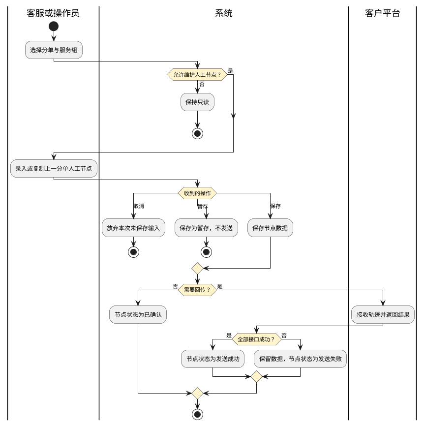

# 第026篇

> 本篇定位：空运-在途跟踪；主要内容：轨迹节点、展示状态、查询字段与结果；文档角色：模块档；文档ID：8ADA3E9EFF

**主流程入口：** 本篇关联[业务模式主流程总览](../PRD.高捷物流系统.第01册.需求框架/PRD.高捷物流系统.第003篇.业务模式主流程总览.460E66776A.md#doc-460E66776A-business-modes)、[普货进出口关务流程](../PRD.高捷物流系统.第01册.需求框架/PRD.高捷物流系统.第005篇.普货进出口关务详细流程.D409606401.md#doc-D409606401-general-cargo-customs)、[跨境电商 BC 出口关务流程](../PRD.高捷物流系统.第01册.需求框架/PRD.高捷物流系统.第006篇.跨境电商BC出口关务详细流程.E21C200E67.md#doc-E21C200E67-bc-export-customs)、[跨境电商 BC 与个人物品 CC 进口流程](../PRD.高捷物流系统.第01册.需求框架/PRD.高捷物流系统.第007篇.跨境电商BC、个人物品CC进口详细流程.94C028FB51.md#doc-94C028FB51-bc-cc-import)、[跨境电商 BBC 进口入出区与调拨流程](../PRD.高捷物流系统.第01册.需求框架/PRD.高捷物流系统.第008篇.跨境电商BBC进口详细流程.B7B938B684.md#doc-B7B938B684-bbc-import)、[跨境电商 BBC 进口特殊业务流程](../PRD.高捷物流系统.第01册.需求框架/PRD.高捷物流系统.第008篇.跨境电商BBC进口详细流程.B7B938B684.md#doc-B7B938B684-special-operations)。

## 1. 空运-在途跟踪

**业务入口：** 在途跟踪

**概念模型：** [数据字典 · 空运订单与履约实体](../PRD.高捷物流系统.第08册.运营支撑/PRD.高捷物流系统.第066篇.数据字典.7A3D9E1F50.md#doc-7A3D9E1F50-domain-air-fulfillment)

### 1.1 在途跟踪交互规则

#### 1.1.1 轨迹节点状态

- 空心节点：已选择该服务，服务状态已完成。

- 实心圆点节点：已选择该服务，服务状态为“服务中”。

- 方形节点：未选择该节点对应的服务。

### 1.2 空运在途跟踪业务范围、角色与流程

#### 1.2.1 在途跟踪业务范围

本篇定义按主订单号或提单号查询在途轨迹，以及轨迹节点状态、排序和展开规则。

#### 1.2.2 业务入口与操作

| 系统 | 一级菜单 | 说明 |
| --- | --- | --- |
| 空运工作台 | 在途跟踪 | 按主订单号或提单号查询订单轨迹。 |

#### 1.2.3 参与角色与职责

参与角色为客服；查看权限见[空运页面访问权限](../PRD.高捷物流系统.第08册.运营支撑/PRD.高捷物流系统.第067篇.角色与访问权限.5E31456F30.md#doc-5E31456F30-air-entry)。

#### 1.2.4 轨迹查询流程

客服输入主订单号或提单号查询订单；系统汇总对应服务节点的状态与时间，并按最新轨迹优先展示。

### 1.3 空运在途跟踪字段与规则

#### 1.3.1 在途跟踪字段

**界面原型概述 · 在途跟踪查询栏**

| 字段或控件 | 适用条件 | 个别界面约束或可见反馈 |
| --- | --- | --- |
| 订单号/提单号 | 查询订单轨迹时 | 必填、可编辑。 |
| 查询输入项 | 填写“查询输入项”时 | 选填，精确搜索。 |
| 查询、重置 | 点击操作时 | 查询对应订单的在途轨迹；重置清空两个查询输入项。 |

**界面原型概述 · 订单与货物信息**

- **区域字段或业务元素**：订单号、提单号、货物毛件体-重量（kg）、货物毛件体-件数（件）、货物毛件体-体积（m³）、起始港、目的港、客户、航班号、出港日期、运费卖价。
- **区域级通用规则**：展示订单查询结果，无值字段留空。

| 字段或控件特例 | 适用条件 | 界面特例或可见反馈 |
| --- | --- | --- |
| 订单号 | 展示结果时 | 取订单创建的主订单号，只读。 |
| 提单号 | 展示结果时 | 取订舱的提单号。 |
| 货物毛件体 | 展示结果时 | 重量、件数和体积取订单补料的提单毛重、提单件数和提单体积，单位分别为kg、件、m³。 |
| 起始港 | 展示结果时 | 取订单创建的“始发港代码/目的港代码”。 |
| 客户、运费卖价 | 展示结果时 | 分别取订单创建的客户名称、舱单创建的运费卖价。 |
| 航班号 | 展示结果时 | 取订舱的头程航班与出港日期，拼接格式见[轨迹查询与展示规则](#doc-8ADA3E9EFF-section-a3bb2d917be4)。 |
| 出港日期 | 展示结果时 | 取订舱的出港日期，格式为YYYY-MM-DD。 |

**界面原型概述 · 运输与交单信息**

- **区域字段或业务元素**：运单号、司机、联系方式（司机）、车牌、车型、尺寸-长度（cm）、尺寸-宽度（cm）、尺寸-高度（cm）、交单司机、交单司机联系方式、交单时间。
- **区域级通用规则**：展示对应运输与交单结果，无值字段留空。

| 字段或控件特例 | 适用条件 | 界面特例或可见反馈 |
| --- | --- | --- |
| 运单号 | 展示结果时 | 取TMS航晟仓库运单列表中的运单号。 |
| 司机、联系方式（司机）、车牌 | 展示结果时 | 取TMS运单列表中的司机姓名、联系方式、车牌号。 |
| 车型 | 展示结果时 | 取运单信息中的车型。 |
| 尺寸 | 展示结果时 | 长、宽、高取TMS，单位为cm。 |

**界面原型概述 · 服务节点与联系人**

- **区域字段或业务元素**：实际发生时间、状态、轨迹内容、一程航班号、货站、截单日期、航线操作、联系方式（航线操作）、航线运营、联系方式（航线运营）、仓库客服、联系方式（仓库客服）、客服（预配发送）、联系方式（预配发送）、报关员、联系方式（报关）、货站人员、联系方式（货站安检）、海外部、联系方式（清关派送）。
- **区域级通用规则**：展示对应服务的节点与联系人信息，无值字段留空。

| 字段或控件特例 | 适用条件 | 界面特例或可见反馈 |
| --- | --- | --- |
| 实际发生时间、状态、轨迹内容 | 展示服务节点时 | 分别取对应服务的节点时间、状态和内容；时间格式为YYYY-MM-DD HH:mm。 |
| 一程航班号 | 展示服务节点时 | 取订舱的头程航班及出港日期。 |
| 货站 | 展示服务节点时 | 取航班主数据中的货站名称。 |
| 截单日期 | 展示服务节点时 | 取舱位产品的截单时间，格式为YYYY-MM-DD HH:mm。 |
| 联系方式（预配发送）、报关员、联系方式（报关）、货站人员、联系方式（货站安检）、海外部、联系方式（清关派送） | 展示服务节点时 | 取主数据。 |

#### 1.3.2 轨迹查询与展示规则

**场景：** 空运-在途跟踪

**范围：** 有主订单号/已配置提单号的订单

**参与角色：** 空运客服

**触发与入口：** 进入系统，点击《在途跟踪》按钮，进入此页面

**业务结果：** 展示与主订单号或提单号匹配的在途轨迹；无值字段留空。

**处理规则**

1. 输入主订单号或提单号后点击“查询”，系统展示对应订单的在途轨迹；点击“重置”清空两个查询输入项。

2. 轨迹字段取自空运系统，有值时显示，无值时留空。航班号由头程航班和出港日期拼接：前半部分取订舱管理中的头程航班，后半部分为“/日期.英文月份”。例如，头程航班为`CZ327`、出港日期为12月2日时，显示`CZ327/02.DEC`。

3. 多个运单号以页签切换轨迹信息，当前运单号显示选中态，其他运单号显示未选中态。

4. 轨迹按时间倒序排列，默认显示最新两条；服务状态为“异常结束”时，对应轨迹标红。轨迹超过两条时可展开查看全部，再次点击后收起并恢复为最新两条。

#### 1.3.3 服务事件与轨迹内容

在途页面展示各服务已经产生的业务结果，不在查询时改变服务状态。各节点显示实际发生时间、执行人或联系人、结果及对应单据；运输节点可按运单切换。尚未选择的服务按方形节点展示。

| 服务节点 | 已发生的业务事件 | 轨迹展示内容 |
| --- | --- | --- |
| 提货 | 航晟运单进入提货中；司机确认提货完成 | 提货途中显示司机、电话、车牌、车型、身份证号及预计到达时间；完成后显示司机已卸货、提货服务已完成。预计到达时间取提货时间。 |
| 订舱 | 航线运营确认航班 | 提单号、头程航班号、出港日期及截单日期；同时显示航线操作、运营及联系方式。 |
| 仓储 | 入库、出库 | 入库后显示货物已进仓及长×宽×高×件数的尺寸明细；出库后显示货物已出仓。 |
| 预配发送 | 预配发送完成 | 已预配发送至海关，服务已完成；显示负责客服及联系方式。 |
| 报关 | 海关结关、放行、结关回执 | 分别展示报关单已审结、分单号已放行、已结关及报关服务完成；回执定位分别为通关无纸化审结 SWJ、放行 SWP、结关 SWR。 |
| 中转 | 中转调度派车完成；货站到达扫描 | 派车后显示从中转仓由指定车辆运往航晟监管仓；到达后显示已到达货站、中转服务完成。 |
| 货站安检 | 货站接口或司机安检扫描；货站打板扫描 | 分别展示已完成安检、已打板结束；保留事件时间和货站人员联系方式。 |
| 出运 | 离港 DEP、中转 TFD、到达 ARR 轨迹 | 离港显示一程航班号，中转显示二程航班号，到达显示货物到达最终目的地；航班号取对应航程。 |
| 清关派送 | 海外部确认目的地提货；确认清关送达 | 展示目的地已提货或货物已完成清关并派送到客户，毛件体取清关派送模块本次记录。 |
| 交单 | 司机在小程序扫描提单号并交接柜台 | 展示交单司机、联系方式、交单时间及航空运单已交接航空公司。 |

报关节点中 SWJ、SWP、SWR 与页面状态的名称对应关系须以已确认的回执约定解释；不得把“已审结”“已放行”“已结关”合并为同一状态。

## 2. 白云物流节点回传

白云物流回传货站节点数据，用于出口空运订单关联的中转运输、安检、主提单和出运轨迹。该回传与进口业务的进出区登记是不同操作，不互相替代。

### 2.1 取数范围与重复反馈

取数范围同时满足订单状态为“进行中”、已选择“货物安检”服务、订单航班货站为“南航货站”，按提单号查询。接口交互覆盖货物到达货站闸口、货站入库完成、运抵放行状态、航班计划起飞和实际起飞离港；其中运抵放行、计划起飞的具体回填目标尚待确认。

来源提出的取数频率为每5分钟一次、每批最多10个提单、超过1分钟未响应即中断本次任务并返回异常回执；这些参数原标记为“初定”，保留为待确认口径。收到节点数据后保存回执并按下表回填；首次同时获得多个节点时，将货物状态更新到本次已获得的最末节点，不根据缺失节点补造完成记录。

| 回传目标 | 匹配与触发 | 回填结果 | 已有结果保护 |
| --- | --- | --- | --- |
| 中转运输运单 | 提单号关联的中转服务运输订单下运单；收到闸口到达时间和车牌号，按提单号及车牌号匹配 | 操作时间取货物到达货站闸口时间，运单状态更新为已卸货；同步出口空运订单轨迹 | 已卸货运单不再更新。 |
| 货物安检订单 | 提单号关联的安检订单；收到货站收运完成节点时间 | 安检状态更新为已安检，操作时间取收运完成时间 `actualTime`；同步出口空运订单轨迹 | 已安检记录不再更新；已取消安检单能否回写尚待确认。 |
| 主提单 | 提单号对应主单；收到货站收运完成标记及收运件数、重量、尺寸、体积 | 回填主提单件数、毛重、计费重、尺寸与体积 | 仅待出提单可回填；已出提单、已交单不再更新。接口不提供分单数据，不回填分单。 |
| 航班起飞轨迹 | 收到离港分批标识、实际起飞时间、离港件数、毛重、体积 | 在干线服务下新增航班起飞节点，保存本次离港毛件体 | 按“节点操作＋操作时间”识别重复，已存在时不重复新增。 |

### 2.2 回填字段与制单通知

| 主提单业务字段 | 白云物流回传定位 | 约束 |
| --- | --- | --- |
| 提单件数 | 收运件数 `number` | 取本次收运完成数据。 |
| 提单毛重、提单计费重 | 来源均标为收运重量 `weight` | 两个重量是否确为同一字段待确认，不据名称自行拆成不同接口字段。 |
| 尺寸、体积 | `osize`、`volume` | 分别写入尺寸明细和提单体积；不把截图示例数值写成固定值。 |

收运完成且成功回填提单数据后通过企业微信发送制单通知，内容为“【制单通知】提单号：{提单号}，货站已收运完毕，且回传数据了。请留意后续操作。”接收条件涉及提单打印员、订单创建部门、订单流转部门，重叠接收人只通知一次；角色与部门取交集还是并集尚待确认。

航班起飞轨迹的操作人取回传 `operator`，操作时间取实际起飞时间；时区列按操作时间转换，默认伦敦时间，操作地点和异常原因为空，预留字段保存离港件数/毛重/体积。节点状态的正文名称“已确定”与来源截图“已确认”不一致，名称在确认前不得用于推导新的状态迁移。

**界面原型概述 · 回传结果查看**

- **区域字段或业务元素**：运输运单的运单号、订单号、提单号、车牌号、运单状态和详情；安检订单的订单号、提单号、服务单号、安检状态和安检完成时间；订单详情的节点操作、操作人、操作时间、操作时间（时区）、操作地点、异常原因、节点状态、预留字段。
- **区域级通用规则**：在各业务原有列表和详情展示回填结果；接口未返回的分单信息不以主单值代填。人工结果保护和回填门槛见上表。

## 3. 出口订单节点管理

出口订单详情按分单展示干线、仓储、关务、运输、地面五组轨迹。轨迹来自服务自动更新或客服、操作员人工录入；外部回传适用[客户接口与数据交接](../PRD.高捷物流系统.第09册.系统对接/PRD.高捷物流系统.第072篇.客户接口与数据交接.58EB46CA94.md#doc-58EB46CA94-track-contracts)，不因本地有节点就推定客户平台已接受。

### 3.1 自动生成节点

自动节点不允许人工编辑和删除。无需回传时状态为已确认，需回传且全部成功时为发送成功，任一失败时为发送失败；业务事件已经发生与接口发送成功分别记录。

以下操作时间均取实际业务发生时间，再换算展示时区，默认伦敦；地点未明确时留空，异常原因与预留字段未指定时不补值。一个分单关联多张服务单时，按各单据的相应事件多次触发，不合并为一个笼统完成时间。

| 服务来源与触发 | 节点及作用范围 | 执行人、时间与地点 |
| --- | --- | --- |
| 关联空运订舱服务到已订舱 | 干线订舱，全部分单一致 | 订舱操作人账号、订舱时间 |
| 空运提单交单 | 干线交单，全部分单一致 | 交单操作人账号、交单时间；来源触发状态误写已订舱，实际触发条件待确认 |
| 集货入库服务完成 | 仓储入仓，当前关联分单 | 入仓操作人账号、入仓时间、仓库名称 |
| 集货出库服务完成 | 仓储出仓，当前关联分单 | 出仓操作人账号、出仓时间、仓库名称 |
| 预配服务主单及全部参与分单海关状态为接受申报 | 关务预配完成，全部分单一致 | 预配操作人账号、最后一张主单或分单接受申报时间 |
| 运输运单已调度、到达提货点、已提货、到达卸货点、已卸货 | 对应运输节点，当前关联分单 | 相应操作人账号及操作时间；调度取调度操作人和时间 |
| 中转约车、中转已调度、到达中转提货点、中转已提货、到达中转卸货点、中转已卸货 | 对应中转运输节点，当前关联分单 | 相应操作人账号及操作时间；约车取约车操作时间，调度取调度时间 |
| 预报大包绑定订单成功 | 干线揽收，全部分单一致；多次绑定多次触发 | 干线揽收操作人账号、实际揽收时间、揽收地点 |
| 货物安检服务到已运抵或已安检 | 已运抵或已安检，全部分单一致 | 对应操作人账号及运抵、安检操作时间 |
| 打板服务到已打板 | 已打板，全部分单一致 | 打板操作人账号、打板时间 |
| 提单制作审核或交单 | 已出提单或已交单，全部分单一致 | 审核人账号、提单审核时间；或交单操作人账号、交单时间 |
| 关联普货出口或BC出口关务事件 | 报关开始、海关审结、查验通知、海关放行、报关完成、报关异常，当前分单 | 报关操作人账号；分别取发送单一窗口、审结、查验、放行、完成或异常时间 |

来源自动规则把揽收、运抵、安检、打板和出提单/交单归在干线，节点选项与界面则归在地面；所属组待确认。空运提单交单还在“干线交单”和“地面已交单”出现两次，是否同一事件的两种投影、是否应重复回传也待确认。

预配服务“全部发送”与本节“全部海关接受申报”是两个事件，不能把接口发送成功当成海关接受。预报先揽收回传、后绑定又生成揽收轨迹是否导致重复发送，以及服务重复回执的去重键，需与客户接口契约共同确认。

### 3.2 人工节点与复制

| 操作 | 资格 | 本地与发送结果 |
| --- | --- | --- |
| 暂存 | 人工节点，填写当前内容 | 保存，状态为暂存，不发送接口 |
| 保存 | 人工节点，完成所需输入 | 保存数据；不需回传为已确认，全部回传成功为发送成功，任一失败为发送失败并提示接口发送失败 |
| 取消 | 当前编辑尚未保存 | 不保存、不改变节点状态 |
| 编辑 | 人工节点，所有节点状态 | 可编辑，后续保存重新执行对应发送规则；自动节点禁止 |
| 删除 | 仅人工且已确认节点 | 删除本地节点；其他状态不允许删除，已发送数据不由本动作推定外部撤回 |
| 复制上一分单 | 仓储、关务、运输组 | 将上一分单的人工节点复制到当前分单；暂存则全部暂存，保存则逐节点执行发送结果规则 |

干线、地面组只允许在第一个分单新增、暂存、保存、取消、编辑、删除，第一分单的节点同步到其他分单，其他分单不操作；仓储、关务、运输组按各分单维护。来源复制按钮正文泛称全部节点，确认弹窗明确“上一分单所有人工录入的轨迹”，自动节点不能因复制而转成可编辑节点。

分单的“第一个/上一个”依据哪种排序、增加或删除分单后的继承、复制是否追加或覆盖、部分节点发送失败如何展示，以及同一节点人工记录与自动回传冲突的优先级，均待确认。

### 3.3 节点页面

**界面原型概述 · 出口订单节点轨迹**

- **区域字段或业务元素**：分单页签、干线/仓储/关务/运输/地面页签、节点操作、操作人、操作时间、操作时间及时区、操作地点、异常原因、节点状态、预留字段；新增、编辑、删除、暂存、保存、取消、复制上一分单。
- **区域级通用规则**：自动节点只读；人工节点的输入和操作资格按第3.2节展示，不允许在复制分单上绕过资格。

| 字段或控件特例 | 界面特例或可见反馈 |
| --- | --- |
| 节点操作、操作时间 | 必填；节点从相应服务组选择，操作时间默认北京时间 |
| 时区时间 | 根据同一时刻换算只读时间，默认伦敦，可选择其他时区；夏令时与源“默认时间”含义待确认 |
| 操作人、地点、异常原因、预留字段 | 人工录入时可填写，异常原因从客户契约原因表选择；特定回传要求地点或异常原因时须补齐，不能以界面选填绕过接口必传 |
| 节点状态 | 初始待确认；展示待确认、暂存、已确认、发送成功、发送失败。源字段表标记可编辑，与操作驱动状态矛盾，是否允许手动改状态待确认 |
| 删除 | 仅人工已确认节点显示入口 |
| 复制上一分单 | 仅仓储、关务、运输组显示，弹窗确认人工节点复制；第一分单无上一分单的反馈待确认 |

人工可选干线节点包含订舱、交单、航班起飞、拉货、头程到达、航班落地、目的港卸货、干线异常、二程至九程的起飞与到达、十程起飞；来源未列十程到达，不擅自补齐。仓储含入仓、出仓；关务含预配完成、报关开始、海关审结、查验通知、查验开始、海关放行、报关完成、报关异常；运输含本节自动触发所列的提送货及中转节点；地面含干线揽收、已运抵、已安检、已打板、已出提单、已交单。该页面选项集不等同于客户允许的回传节点集。
