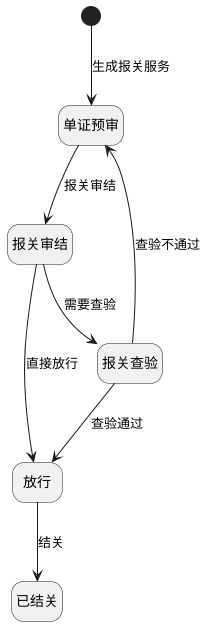

# 第027篇

> 本篇定位：空运-报关单管理；主要内容：报关单查询、材料下载与补齐通知；文档角色：模块档；文档ID：7A78DCFDE1

**主流程入口：** 本篇关联[普货进出口关务流程](../PRD.高捷物流系统.第01册.需求框架/PRD.高捷物流系统.第005篇.普货进出口关务详细流程.D409606401.md#doc-D409606401-general-cargo-customs)、[跨境电商 BC 出口关务流程](../PRD.高捷物流系统.第01册.需求框架/PRD.高捷物流系统.第006篇.跨境电商BC出口关务详细流程.E21C200E67.md#doc-E21C200E67-bc-export-customs)、[跨境电商 BC 与个人物品 CC 进口流程](../PRD.高捷物流系统.第01册.需求框架/PRD.高捷物流系统.第007篇.跨境电商BC、个人物品CC进口详细流程.94C028FB51.md#doc-94C028FB51-bc-cc-import)、[跨境电商 BBC 进口入出区与调拨流程](../PRD.高捷物流系统.第01册.需求框架/PRD.高捷物流系统.第008篇.跨境电商BBC进口详细流程.B7B938B684.md#doc-B7B938B684-bbc-import)、[跨境电商 BBC 进口特殊业务流程](../PRD.高捷物流系统.第01册.需求框架/PRD.高捷物流系统.第008篇.跨境电商BBC进口详细流程.B7B938B684.md#doc-B7B938B684-special-operations)、[异常处理流程](../PRD.高捷物流系统.第01册.需求框架/PRD.高捷物流系统.第010篇.异常处理流程.13D397C572.md#doc-13D397C572-exceptions)。

## 1. 空运-报关单管理

**业务入口：** 报关单管理

**相邻服务入口：** 目的港清关、提货与分批送达见[空运清关派送管理](../PRD.高捷物流系统.第02册.订单管理/PRD.高捷物流系统.第025篇.空运-清关派送管理.6708987F95.md#doc-6708987F95-section-12755684a639)。

**关务作业边界：** 本篇保留空运工作台的查询、材料与状态维护规则。关务人员的预录、复审、申报及异常单证处理见[普货关务作业](PRD.高捷物流系统.第028篇.普货关务作业.367A5605ED.md#doc-367A5605ED-scope)，BC 出口、BC/CC 进口与 BBC 保税单证分别见[BC 出口关务](PRD.高捷物流系统.第029篇.BC出口关务.B7D43C8769.md#doc-B7D43C8769-scope)、[BC 与 CC 进口关务](PRD.高捷物流系统.第030篇.BC与CC进口关务.034DD8F0D3.md#doc-034DD8F0D3-scope)及[BBC 进口关务](PRD.高捷物流系统.第031篇.BBC进口关务.2CA9B1E5A1.md#doc-2CA9B1E5A1-scope)。跨关务业务的只读数据查询与工作量口径见[关务查询与统计](PRD.高捷物流系统.第032篇.关务查询与统计.45DAFD3F1D.md#doc-45DAFD3F1D-declaration-query)；不能据作业平台角色推定空运工作台权限。

**概念模型：** [数据字典 · 空运订单与履约实体](../PRD.高捷物流系统.第08册.运营支撑/PRD.高捷物流系统.第066篇.数据字典.7A3D9E1F50.md#doc-7A3D9E1F50-domain-air-fulfillment)

**消息规则入口：** [消息推送规则](../PRD.高捷物流系统.第08册.运营支撑/PRD.高捷物流系统.第069篇.消息推送.5F950AB3B1.md#doc-5F950AB3B1-section-ef4930471a81)

### 1.1 报关单页面交互规则

#### 1.1.1 列表与材料操作行为

- 订单列表页面，默认分页结构，每页默认10条记录显示。

- 材料操作成功后给出结果提示；输入不符合规范或缺少必填项时，相应字段高亮提示，提交按钮置灰且不可点击。

### 1.2 空运报关单业务范围、术语与角色

#### 1.2.1 报关单业务范围

本篇定义报关服务订单的查询、材料下载、材料补齐通知和报关状态管理规则。

#### 1.2.2 业务入口与操作

| 系统 | 一级菜单 | 说明 |
| --- | --- | --- |
| 空运工作台 | 报关单管理 | 报关服务的接单和状态维护入口；访问与操作授权见[空运页面访问权限](../PRD.高捷物流系统.第08册.运营支撑/PRD.高捷物流系统.第067篇.角色与访问权限.5E31456F30.md#doc-5E31456F30-air-entry)及[操作权限](../PRD.高捷物流系统.第08册.运营支撑/PRD.高捷物流系统.第067篇.角色与访问权限.5E31456F30.md#doc-5E31456F30-air-actions)。 |

#### 1.2.3 业务术语

受控术语定义见 [数据字典 · 受控业务术语](../PRD.高捷物流系统.第08册.运营支撑/PRD.高捷物流系统.第066篇.数据字典.7A3D9E1F50.md#doc-7A3D9E1F50-domain-values)。

#### 1.2.4 参与角色与职责

参与角色为报关行客服；操作授权见[报关单操作权限](../PRD.高捷物流系统.第08册.运营支撑/PRD.高捷物流系统.第067篇.角色与访问权限.5E31456F30.md#doc-5E31456F30-air-actions)。

### 1.3 空运报关单处理功能与规则

#### 1.3.1 报关单管理

- 报关行客服完成报关服务。

#### 1.3.2 报关单列表筛选项

**界面原型概述 · 报关单列表筛选栏**

| 字段或控件 | 个别界面约束或可见反馈 |
| --- | --- |
| 报关服务号、提单号、客户 | 支持模糊查询。 |
| 始发港、目的港 | 默认值：全部。 |
| 出港日期、创建日期 | 按日期筛选；如果不筛选，默认为全部。 |
| 报关状态 | 全部/单证预审/报关审结/报关查验/放行/已结关。 |

**界面原型概述 · 报关单结果列表**

- **区域字段或业务元素**：报关服务号、提单号、报关类型、建单日期、出港日期、中文品名、预计/入仓/提单毛件体、特殊货物、客户、报关状态、下载、状态管理。
- **区域级通用规则**：列表只读展示报关服务对应的订单数据；下载和状态管理从该行进入。

#### 1.3.3 报关材料与状态管理规则

空运客服发出报关服务指令后，报关行客服在报关单列表查询订单、下载材料、发起材料补齐通知并维护报关状态。报关单按创建时间排序，初始状态为“单证预审”。

**界面原型概述 · 报关材料与状态操作**

| 字段或控件 | 适用条件 | 个别界面约束或可见反馈 |
| --- | --- | --- |
| 报关类型、单证类型、已上传材料 | 空运客服发送服务指令时 | 明确报关类型和单证类型，按单证类型上传报关材料。 |
| 报关状态 | 查看或修改状态时 | 展示当前报关作业状态，修改入口及操作时间见下方状态维护概述；可选迁移与回传控制仍待确认。 |
| 材料下载 | 报关行客服点击“下载”时 | 展示全部已上传材料，支持单个或批量下载；未上传的材料不显示PDF下载按钮。 |
| 补齐通知 | 材料不符合要求时 | 支持单个或批量发起；接收对象与内容按[消息推送规则](../PRD.高捷物流系统.第08册.运营支撑/PRD.高捷物流系统.第069篇.消息推送.5F950AB3B1.md#doc-5F950AB3B1-section-ef4930471a81)处理。 |

**报关作业状态关系**

报关状态表示报关作业进度；报关服务状态表示服务履约进度，两者分别记录。

| 当前报关状态 | 作业结果 | 后续报关状态 |
| --- | --- | --- |
| 单证预审 | 报关审结 | 报关审结 |
| 报关审结 | 直接放行 | 放行 |
| 报关审结 | 需要查验 | 报关查验 |
| 报关查验 | 查验通过 | 放行 |
| 报关查验 | 查验不通过 | 单证预审 |
| 放行 | 结关 | 已结关 |

**报关作业状态图**

下图仅展开上表已定义的作业迁移，保留查验不通过返回单证预审的回路；已结关后的修改资格尚未定义，因此不将已结关画成不可恢复的生命周期终点。

单证预审对应服务待处理阶段，报关审结对应服务中阶段，放行对应服务完成阶段。服务状态的自动更新仍按[报关服务节点规则](../PRD.高捷物流系统.第02册.订单管理/PRD.高捷物流系统.第021篇.空运-订单管理.5029269CA8.md#doc-5029269CA8-section-be0a1aa30e46)接收翌飞结果；上述作业关系不等同于允许手工跳转所有状态。手工维护与外部回传的优先级、查验退回后服务是否回退、已结关后的修改资格仍待确认。

**界面原型概述 · 报关状态管理弹窗**

- **区域字段或业务元素**：报关状态、操作时间、确认、取消。
- **区域级通用规则**：从报关单行打开弹窗，选择报关状态并记录对应操作时间；确认提交，取消返回列表。
