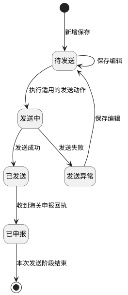
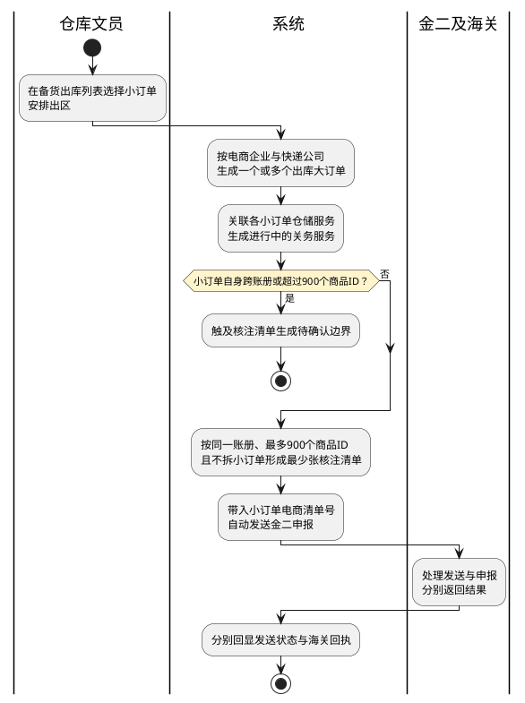
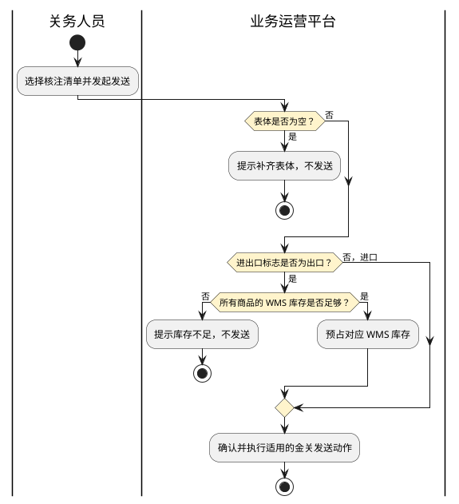

# 第031篇

> 本篇定位：BBC进口关务；主要内容：保税入出区单证、核注清单、核放单、备案清单、业务申报表与双库存协同；文档角色：模块档；文档ID：2CA9B1E5A1

**主流程入口：** [BBC 进口入出区与调拨流程](../PRD.高捷物流系统.第01册.需求框架/PRD.高捷物流系统.第008篇.跨境电商BBC进口详细流程.B7B938B684.md#doc-B7B938B684-bbc-import)、[BBC 特殊业务流程](../PRD.高捷物流系统.第01册.需求框架/PRD.高捷物流系统.第008篇.跨境电商BBC进口详细流程.B7B938B684.md#doc-B7B938B684-special-operations)。本篇完整定义金关二期与单一窗口单证操作，不以发送成功替代海关申报成功或实际过卡。

**概念模型：** [数据字典 · 关务概念与单据关系](../PRD.高捷物流系统.第08册.运营支撑/PRD.高捷物流系统.第066篇.数据字典.7A3D9E1F50.md#doc-7A3D9E1F50-customs-model)。

共用定义见[关务作业、查询与统计权限](../PRD.高捷物流系统.第08册.运营支撑/PRD.高捷物流系统.第067篇.角色与访问权限.5E31456F30.md#doc-5E31456F30-customs-access)。

## 1. 业务范围与库存协同

**单证状态与回执**

核注清单、核放单、业务申报表及出入库单共用以下发送过程。待发送可保存编辑；发送中区分发送成功和异常；发送成功为已发送，收到海关申报回执后才为已申报。图的终点仅表示本次发送阶段已形成申报结果，不表示单证整体生命周期结束。

| 对象 | 申报后及异常处理差异 |
| --- | --- |
| 核注清单、出入库单 | 已发送或已申报发起符合资格的改单时，保留原单据并生成新单据。原单据完成修改后为已改单，新单据由改单中恢复至原已发送或已申报状态；后续以新单据数量处理库存。 |
| 核放单 | 不套用核注清单的改单生成规则；已申报后可按对应资格删单，已删单只读。 |
| 业务申报表 | 已申报发起改单，在原单据上修改；保存后为已改单。原有表体不能修改或删除，只能追加；结案形成已结案。 |
| 全部上述单证 | 待发送或发送异常可按各自资格作废；删单、结案与作废是不同结果。直接重发、改单及删单的冲突资格仍以待确认边界隔离，不由共用图推断。 |

BBC进口的关务目前主要是在金二系统和单一窗口上处理，由于跨系统的操作，导致单据的数据需重复录入，相关单据和附件存储分散，不便统计和财务结算，对于查验、删改单等异常工作情况没有系统记录，需要手工统计，不利于工作量统计，缺少衡量工作质量的数据。

另外，核注清单的数据没有经过优化就申报，导致查验概率提高，增加关务工作量。其中有些商品含有涉证成分，日本原产地的商品在金二没有提醒，导致后续清关出现问题。

因此，此模块需实现关务服务记录、报关员单据操作记录、自动生成应收应付、报关数据查询、海关账册管理(后面有单独功能模块)的功能。

### 1.1 业务入口

| 内容 | 一级菜单 | 二级菜单 | 说明 |
| --- | --- | --- | --- |
| BBC进口关务 | 服务订单列表 |  | 展示由平台订单生成的业务类型为“BBC进口”的服务订单记录，可对服务订单进行查询、接单、流转、终止服务、取消服务、自定义列表等操作 |
| BBC进口关务 | 服务详情(包含一线进境、包裹出区、区间调拨、区内调拨、保税展示、简单加工、物料进区、卡板出区、退运、客退) | 基本信息-订单信息 | 展示上游订单的基本信息 |
| BBC进口关务 | 服务详情(包含一线进境、包裹出区、区间调拨、区内调拨、保税展示、简单加工、物料进区、卡板出区、退运、客退) | 服务信息 | 展示服务项内容、附件资料、单据操作的记录，其中每种业务模式涉及的单据操作不同。 |
| BBC进口关务 | 服务详情(包含一线进境、包裹出区、区间调拨、区内调拨、保税展示、简单加工、物料进区、卡板出区、退运、客退) | 服务记录 | 展示每个服务项，每种单据的具体处理事项记录 |
| BBC进口关务 | 服务详情(包含一线进境、包裹出区、区间调拨、区内调拨、保税展示、简单加工、物料进区、卡板出区、退运、客退) | 应收应付 | 每个处理事项完成后，按报价规则自动生成 |
| BBC进口关务 | 服务详情(包含一线进境、包裹出区、区间调拨、区内调拨、保税展示、简单加工、物料进区、卡板出区、退运、客退) | 操作日志 | 展示对此服务订单的操作，包含接单、编辑、终止服务、取消服务、流转记录 |

### 1.2 关联概念

本节业务术语及对象关系见数据字典；页面字段和操作约束在本篇定义。

### 1.3 参与方与职责

**待确认边界（CUSTOMS-B013）**：关务业务来源将统计列入经理/主管能力，统计专题仅允许关务部总监；最终角色及数据范围待确认，不能按姓名赋权。 下文涉及该边界的来源约束仅保留待确认，不视为已确定的执行规则。

| 用户角色 | 描述 |
| --- | --- |
| 报关员 | 对服务订单进行接单、取消服务、终止服务、流转操作；审核资料、单据操作 |
| 查验员 | 在小程序进行查验任务处理，结果记录 |
| 关务经理/主管 | 查看所有的服务订单数据，包含关务数据统计、工作台、关务服务订单看板。 |

WMS 库存表示仓库实物库存，海关账册库存表示保税监管库存；预占不等于实际出入库。核注清单、核放单、报关单或备案清单、保税展示出入库单分别保留平台单据状态、海关审核状态和卡口状态，不将三者合并为一个状态。

| 业务场景 | 预占与取消 | 海关及仓库落账 |
| --- | --- | --- |
| 包裹出区 | 客户小订单下发时预占 WMS 和海关账册库存；生成出库大订单前取消小订单，释放两类预占；生成大订单后再取消小订单，不自动释放。 | 卡口回执已过卡时扣减账册库存及其预占；WMS 实际出库时扣减 WMS 库存及其预占。 |
| 区间调拨、区内调拨、退运 | 大订单提交后预占 WMS 与账册库存；关务服务待接单时上游取消，自动取消服务并释放预占；进行中、已完成、已终止时，上游取消不自动改服务状态或释放库存。 | 依据相应单证已过卡回执更新账册；实物作业由 WMS 更新库存。 |
| 简单加工、保税展示 | 上游下发时预占；待接单取消自动释放，已经受理后不自动释放。 | 简单加工通过核注清单，保税展示通过出入库单反映已过卡的账册变化；WMS 实物库存独立更新。 |
| 一线进境、消退 | 不预占出库库存。 | 已过卡回执增加海关账册库存；WMS 按实际入库更新。 |

**跨篇待确认（CROSS-C03、CROSS-C04）**：BBC客户订单在申报前预占WMS，本表在小订单下发时预占双库存，第5章核注发送又包含WMS预占；三个阶段是否复用同一占用记录尚未明确，不能累计执行。BBC退运取消时，本表按关务服务状态判断，逆向订单篇按需求单或仓储服务状态判断；各服务状态不一致时的释放责任和条件待确认，不将任一单篇条件作为全链路释放结论。关联规则见[BBC客户订单](../PRD.高捷物流系统.第02册.订单管理/PRD.高捷物流系统.第016篇.BBC客户订单管理.40DBFB6718.md#doc-40DBFB6718-auto-declaration)及[退运取消与库存释放](../PRD.高捷物流系统.第02册.订单管理/PRD.高捷物流系统.第017篇.逆向订单与增值服务.B2B931A50F.md#doc-B2B931A50F-stock-returns)。

## 2. 包裹出区的核注清单与大订单生成

### 2.1 核注清单-自动生成(包裹出区)

**待确认边界（CUSTOMS-B031）**：同一核注清单仅一个账册、最多 900 个不同商品 ID 且不能拆分小订单；小订单自身跨账册或超限时的拒绝、人工拆单或其他处理未定义。 下文涉及该边界的来源约束仅保留待确认，不视为已确定的执行规则。

**跨篇待确认（CROSS-C02）**：下述生成规则限定一个小订单对应1张核注清单，而[BBC客户订单的关联字段](../PRD.高捷物流系统.第02册.订单管理/PRD.高捷物流系统.第016篇.BBC客户订单管理.40DBFB6718.md#doc-40DBFB6718-interface)允许关联多个核注清单号。有效关联与历史改单关联是否分开尚未明确；未确认前不能将一对一或一对多直接提升为全局关系约束。

**待确认边界（CUSTOMS-B047）**：包裹大订单已预占与核注清单发送时预占之间的去重规则未定义；发送失败、用户取消确认时何时释放亦需明确，不能重复扣占库存。 下文涉及该边界的来源约束仅保留待确认，不视为已确定的执行规则。

**核注清单-自动生成的业务约束**

- **适用范围**：业务模式=包裹出区下，核注清单的单据操作

- **参与方**：仓库文员

- **操作资格**：无

- **形成结果**：新增成功，自动申报至金二系统，单据状态=发送中/已发送/发送异常/已申报

- **处理行为**：1、在仓储服务订单列表-备货出库列表中，勾选订单号，点击“安排出区”后，按照所选订单“同一电商企业、同一快递公司”自动生成一个或多个大订单，显示到业务运营平台-电商订单-BBC订单列表，业务模式=包裹出区，订单状态=进行中，生成大订单取值规则见下表； 2、生成出库大订单后，根据大订单关联的小订单信息，按照以下规则生成核注清单并自动申报至金二系统： l 一张核注清单只有一个账册编号； l 一张核注清单不能超过900个商品ID； 一个小订单只能对应1个核注清单 满足以上条件，得到的核注清单张数最少。

安排出区后，生成包裹出区大订单的订单数据取值逻辑

基本信息：

**界面原型概述 · 核注清单-自动生成(包裹出区) · 字段区**

- **区域字段或业务元素**：业务类型、业务模式、仓库名称、入库单号、最终目的国、财务组织名称、所属部门、客服、业务员、是否流转、备注、订单状态。
- **区域级通用规则**：除所列特例外，本区域字段默认必填、默认只读。

| 字段或控件特例 | 界面特例或可见反馈 |
| --- | --- |
| 业务类型 | 显示“BBC进口” |
| 业务模式 | 显示“包裹出区” |
| 仓库名称 | 读取“安排出区”时所选小订单的仓库名称 |
| 入库单号 | 默认为空 |
| 最终目的国 | 默认为中国 |
| 财务组织名称 | 默认广东高捷物流 |
| 所属部门 | 默认广东高捷下的电商部 |
| 客服 | 默认为在风控中心设置的接单人 |
| 业务员 | 默认为在风控中心设置的默认业务员 |
| 是否流转 | 默认为否 |
| 备注 | 非必填；默认为空 |
| 订单状态 | 非必填；生成后默认是“进行中” |

客户信息：

**界面原型概述 · 核注清单-自动生成(包裹出区) · 字段区**

- **区域字段或业务元素**：客户名称、联系人、联系人邮箱、备注。
- **区域级通用规则**：除所列特例外，本区域字段默认必填、默认只读。

| 字段或控件特例 | 界面特例或可见反馈 |
| --- | --- |
| 客户名称 | 根据所选小订单的店铺名称，找到客户名称 |
| 联系人 | 根据客户名称自动带出 |
| 联系人邮箱 | 根据客户名称自动带出 |
| 备注 | 非必填；默认为空 |

总运单信息：

**界面原型概述 · 核注清单-自动生成(包裹出区) · 字段区**

- **区域字段或业务元素**：运输方式、始发港、目的港、总运单号。
- **区域级通用规则**：除所列特例外，本区域字段默认非必填、默认只读。

| 字段或控件特例 | 界面特例或可见反馈 |
| --- | --- |
| 运输方式 | 默认为空 |
| 始发港 | 默认为空 |
| 目的港 | 默认为空 |
| 总运单号 | 默认为空 |

货物信息：

**界面原型概述 · 核注清单-自动生成(包裹出区) · 字段区**

- **区域字段或业务元素**：货物统称、预计件数、毛重、体积、预计最大尺寸(长、宽、高)、序号、商品ID、海关编码(HScode)、品牌、商品条形码、中文品名、规格、单位、数量、总价、原产国、G.W毛重（KG）、N.W淨重（KG）、失效日期、批次号。
- **区域级通用规则**：除所列特例外，本区域字段默认非必填、默认只读。

| 字段或控件特例 | 界面特例或可见反馈 |
| --- | --- |
| 货物统称 | 默认为空 |
| 预计件数 | 默认为空 |
| 毛重 | 必填；统计所有小订单的总毛重 |
| 体积 | 默认为空 |
| 预计最大尺寸(长、宽、高) | 默认为空 |
| 序号 | 系统自动生成 |
| 商品ID | 必填；依次显示所选小订单中的商品ID |
| 海关编码(HScode) | 根据商品ID，从商品备案库中自动带出 |
| 品牌 | 根据商品ID，从商品备案库中自动带出 |
| 商品条形码 | 根据商品ID，从商品备案库中自动带出 |
| 中文品名 | 根据商品ID，从商品备案库中自动带出 |
| 规格 | 根据商品ID，从商品备案库中自动带出 |
| 单位 | 必填；根据商品ID，从商品备案库中自动带出 |
| 数量 | 必填；统计关联小订单中所有此商品ID的数量 |
| 总价 | 必填；统计关联小订单中所有此商品ID的总价 |
| 原产国 | 必填；根据商品ID，从商品备案库中自动带出 |
| G.W毛重（KG） | 必填；根据商品ID，从商品备案库中自动带出 |
| N.W淨重（KG） | 必填；根据商品ID，从商品备案库中自动带出 |
| 失效日期 | 必填；根据商品ID，从商品备案库中自动带出 |
| 批次号 | 必填；根据商品ID，从商品备案库中自动带出 |

服务信息：

自动关联仓储服务订单，这里会有多条仓储服务订单，服务状态=已完成，每个小订单对应一条仓储服务订单。

自动生成一条关务服务订单，服务状态=进行中，用于存放自动生成的核注清单。

附件资料：

暂无数据。

合并包裹时，按同一电商企业及同一快递公司形成尽可能少的出库大订单。每张核注清单仅对应一个账册，最多包含 900 个不同商品 ID，且同一小订单的商品不可拆至不同核注清单。若单个小订单自身跨账册或超过上限，处理方式待确认，不得拆单或忽略超限商品。

**包裹出区自动生成与申报图**

本图止于本次生成与申报反馈，不表示已过卡或已扣减账册库存；发送阶段复用[单证状态与回执](#doc-2CA9B1E5A1-scope)中的状态图。超限分支只标示规则缺口，不补定拒绝、拆单、回滚大订单或人工处理方式；关联基数与重复预占仍按本节跨篇待确认边界处理。

## 3. 关务服务受理与结束

### 3.1 服务订单列表

**界面原型概述 · 服务订单列表 · 筛选栏**

- **区域字段或业务元素**：服务订单号、订单号、交接单号、总运单号、业务模式、仓库名称、运输方式、客户名称、下单日期。
- **区域级通用规则**：除所列特例外，本区域字段默认非必填、默认可编辑。

| 字段或控件特例 | 界面特例或可见反馈 |
| --- | --- |
| 服务订单号 | 支持批量查询，输入多个，换行符分隔 |
| 订单号 | 支持批量查询，输入多个，换行符分隔 |
| 交接单号 | 支持批量查询，输入多个，换行符分隔 |
| 总运单号 | 支持批量查询，输入多个，换行符分隔 |
| 业务模式 | 选择 |
| 仓库名称 | 选择 |
| 运输方式 | 选择 |
| 客户名称 | 手动录入，模糊查询 |
| 下单日期 | 默认显示近一个月的起止日期，如2022-04-08至2022-05-08 |

**界面原型概述 · 服务订单列表 · 列表栏**

- **区域字段或业务元素**：服务订单号、订单号、交接单号、总运单号、业务类型、业务模式、运输方式、仓库名称、理货状态、客户名称、业务员、建单人、下单时间、订单状态、上游取消服务、服务订单状态、接单人。
- **区域级通用规则**：除所列特例外，本区域字段默认必填、默认只读。

| 字段或控件特例 | 界面特例或可见反馈 |
| --- | --- |
| 服务订单号 | 编码规则：S+105+YYMMDD+5位流水号 |
| 订单号 | 读取上游订单的订单号 |
| 交接单号 | 非必填；读取同一订单号仓储服务记录的交接单号，如果没有则为空 |
| 总运单号 | 非必填；读取上游订单的总运单号 |
| 业务类型 | 读取上游订单的业务类型 |
| 业务模式 | 读取上游订单的业务模式 |
| 运输方式 | 读取上游订单的运输方式 |
| 仓库名称 | 读取上游订单的仓库名称 |
| 理货状态 | 读取此订单号仓储服务中的理货状态 |
| 客户名称 | 读取上游订单的客户名称 |
| 业务员 | 源于订单的业务员，根据订单号匹配 |
| 建单人 | 读取上游订单的建单人 |
| 下单时间 | 生成服务订单的时间，YYYY-MM-DD hh:mm:ss |
| 订单状态 | 有以下情况： 进行中 已完成 已取消 |
| 上游取消服务 | 当上游订单有取消此服务时，显示为“是”，反之为“否” |
| 服务订单状态 | 有以下情况： 待接单 进行中 已完成 已终止 已取消 |
| 接单人 | 非必填；读取服务订单的接单人账号名称 |

总计数量：点击后默认展示近1个月收到的服务订单和数量；

待接单：点击后默认展示所有待接单状态下的服务订单和数量；

进行中：点击后默认展示所有进行中的服务订单和数量；

已完成：点击后默认展示近一个月完成的服务订单和数量；

已取消：点击后默认展示近一个月已取消的服务订单和数量；

已终止：点击后默认展示近一个月已终止的服务订单和数量。

当输入下单日期时，以上分类的总数要对应所选日期的数据。

查询：在不选择任何查询字段下，点击“查询”按钮，默认所有查询条件。选择对应的查询条件，则显示符合结果的数据。查询出的数据，按照系统记录的“下单时间”倒序排列。

重置：清空所有查询条件。

收起：点击收起按钮，查询栏收起。（查询栏默认是展开状态）

查看详情：点击服务订单号，跳转至服务订单详情界面。

接单：勾选订单后，支持批量勾选订单，点击按钮，弹出提示框，

在提示框点击“确定”，接单成功后，服务订单状态由“待接单”变为“进行中”。

注意：仅“待接单”的才可接单成功，如果勾选的订单中包含其他状态的服务订单，则仅对“待接单”的执行操作，其他的自动过滤；如果勾选的订单没有“待接单”的，则点击“接单”按钮后，弹出提示：所选订单已被接单。

流转：点击按钮，弹出流转弹窗，在流转弹窗可选择流转给所有报关员或指定人。

1．仅“进行中”的服务订单能被流转，如果勾选的服务订单中包含了其他状态，则仅对自己接单的“进行中”的执行操作，其他的自动过滤；如果勾选的订单没有“进行中”的，则点击按钮后，弹出提示：所选订单不能流转。

2．当流转给所有报关员时，所有报关员都能接单，当流转给指定人时，被指定人无需接单，可直接进行接单后的操作。

3.流转后，接单/指定人可代替原接单人进行后续的操作，原接单员只能查看。

终止服务：

1、当“上游取消服务”=“是”，此服务订单才可以执行终止服务；否则弹出提示：此服务订单不能被终止。

2、允许执行终止服务时，点击按钮，弹出确认弹窗：

点击确定，执行终止操作，服务订单状态变为“已终止”。

1.上游订单取消时，当服务订单状态为“待接单”，则自动取消服务订单，服务订单状态直接变为“已取消”；

2.当服务订单状态为“进行中”，允许人为点击“终止服务”按钮；

3.当服务订单状态为“已完成”，则服务订单状态不变。

4.终止服务不影响应收应付的生成，终止服务后，服务订单只能被查看，不能进行其他操作。

取消服务：

1、当“上游取消服务”=“是”，此服务订单才可以执行取消服务；否则弹出提示：此服务订单不能被取消。

2、允许执行取消服务时，点击按钮，弹出确认弹窗：

点击确定，执行取消操作，服务订单状态变为“已取消”。

1.上游订单取消时，如果服务订单状态为“待接单”，则自动取消服务订单，且服务订单状态变为“已取消”；当服务订单状态为“进行中”，允许人为点击“取消服务”按钮；

2.当服务订单状态为“已完成”，则服务订单状态不变。

3.取消服务不再生成应收应付；

4.取消服务后，服务订单只能被查看，不能进行其他操作。

批量查询：可对服务订单号、订单号、总运单号、客户分单号进行批量查询（填写多个内容换行符隔开）。

自定义列表：点击自定义列表，展示自定义列表弹窗。

完成服务：针对“进行中”服务订单来的，点击后

点击确定后，更新服务订单的状态为“已完成”，生成服务记录详情(处理事项为“全部”)，附件显示到服务详情中。

处理人：默认显示接单人；

处理时间：默认当前时间

结果说明：手动录入，如果有内容，则在服务记录的表格中，点击“处理结果-已完成”，可弹出结果说明。

## 4. 订单、理货与服务详情

### 4.1 服务订单详情

### 4.2 一线进境

### 4.3 订单信息

以上字段只是做展示，不可编辑，具体可参考3.1.2.字段说明。

收起订单信息：点击按钮后，隐藏订单信息内容，按钮文案变为“展开订单信息”，点击后，显示订单信息内容。

### 4.4 理货报告

直接读取上游订单的理货报告的数据，同步显示即可。

与上游订单的理货报告页交互一致。

### 4.5 服务信息

### 4.6 国内报关

服务项基本信息：

**界面原型概述 · 国内报关 · 字段区**

- **区域字段或业务元素**：服务类型、供应商、内部部门、是否委外、外部单位、备注、服务状态。
- **区域级通用规则**：除所列特例外，本区域字段默认必填、默认只读。

| 字段或控件特例 | 界面特例或可见反馈 |
| --- | --- |
| 服务类型 | 读取上游订单的信息 |
| 供应商 | 读取上游订单的信息 |
| 内部部门 | 读取上游订单的信息 |
| 是否委外 | 可编辑；默认“否”，修改为“是”后，不能再编辑 |
| 外部单位 | 非必填；当“是否委外”选择“否”时，不显示此字段。 |
| 备注 | 非必填；读取上游订单信息 |
| 服务状态 | 非必填；显示此服务项的服务状态，服务订单接单后，就显示“进行中”，确定“完成服务”操作，才显示“已完成”； 已完成后，单据操作的按钮除了“打印”，其他按钮置灰，不可点击；附件资料除了“下载”，其他按钮都置灰，不可点击。 |

附件资料的字段说明：

**界面原型概述 · 国内报关 · 字段区**

- **区域字段或业务元素**：资料名称、附件类型、来源、操作时间、操作人、回执信息。
- **区域级通用规则**：除所列特例外，本区域字段默认非必填、默认只读。

| 字段或控件特例 | 界面特例或可见反馈 |
| --- | --- |
| 资料名称 | 如果是上游订单带过来的，则读取上游订单的信息；如果是单证制作生成的，则显示对应的单据名称，如装箱单、发票等 |
| 附件类型 | 单证制作的，按生成的类型显示附件类型； 读取上游订单的附件类型 |
| 来源 | 分别有3种：上游订单、当前服务订单、单证制作 |
| 操作时间 | 显示对应的操作时间，如上传时间、单证生成的时间 |
| 操作人 | 读取单证制作的账号名称、上传人的账号名称 |
| 回执信息 | 展示审核结果，如果没有审核结果，则不显示 |

确认完成：

1、如果任意一条“单据状态”≠已申报/已改单/已删单/已作废，则弹出提示：

当前报关还未结束，不能确认完成。

2、如果所有“单据状态”＝已申报/已改单/已删单/已作废，才允许确认完成，弹出提示：

确定已完成服务？完成后不能再继续国内报关的任何操作。

取消   确定

点击“确定”，服务项的“服务状态”就变为已完成。

### 4.7 查验

1、在单据操作中点击“安排查验”后，生成查验基本信息；勾选单条基本信息，点击“安排查验”，记录并生成安排结果；线下查验完成后，点击“结果记录”提交记录后，生成处理详情。

2、字段说明、按钮说明与普货关务的一致，可参考普货关务PRD。

## 5. 核注清单

核注清单发送前必须有表体。出口方向还检查并预占 WMS 库存，进口方向不执行该项出库预占。资格校验中的待发送与发送异常范围仍按本节待确认边界处理。

预占不等于实际出库。包裹大订单已经预占与本处发送再次预占之间的去重规则、发送失败后的预占释放时点尚未定义，须确认后才能形成完整的库存执行口径。

**核注清单-新增的业务约束**

- **适用范围**：核注清单的单据操作

- **参与方**：关务

- **操作资格**：无

- **形成结果**：新增成功，单据状态=待发送（业务模式=包裹出区的核注清单是自动生成后并自动申报至海关系统的，这种情况的，单据状态=发送中/已发送/发送异常/已申报）

- **处理行为**：业务模式=一线进境、区间调拨、区内调拨、退运、消退业务模式 1、点击“新增”按钮，进入核注清单表头录入界面，录入后点击“保存”，进入核注清单详情界面，这样就新增成功了，单据状态=待发送；切换到表体界面，可编辑表体信息。 业务模式=包裹出区 1、核注清单的新增是在仓储服务-备货出库服务订单列表勾选订单后点击“安排出区”后，自动生成出库订单的同时也自动生成核注清单的，具体自动生成规则见下面用例。 2、自动生成后系统自动申报至金二系统，单据状态=发送中/已发送/发送异常/已申报。 业务模式=简单加工 点击新增时，判断是否已有核注清单，没有，则可进入新增表体界面； 如果已有核注清单，则判断已有的核注清单单据状态是否＝已作废/已删单/已改单。是，则可进入新增表体界面；否，则弹出提示：当前已有处理中的核注清单，暂不支持新增。

**核注清单-编辑的业务约束**

- **适用范围**：核注清单的操作

- **参与方**：关务

- **操作资格**：单据状态=待发送/发送异常

- **形成结果**：编辑后，可再次发送到金二。

- **处理行为**：1、点击单据编号，进入单据详情页，点击修改，可对已有内容进行修改后，点击发送金二。

**待确认边界（CUSTOMS-B029）**：核注清单发送用例仅待发送，界面包括发送失败；暂存后人工申报与自动申报的适用业务模式也需明确，不能将发送成功视为已申报。 下文涉及该边界的来源约束仅保留待确认，不视为已确定的执行规则。

**核注清单-发送金二的业务约束**

- **适用范围**：一线进境、区间调拨、区内调拨、简单加工、退运、消退类型的核注清单的单据操作

- **参与方**：关务

- **操作资格**：单据状态=待发送

- **形成结果**：发送后，能收到成功回执，单据状态变为“已发送”

- **处理行为**：勾选单据，点击“发送金二”按钮后，可在单据状态查看发送结果。

**核注清单-改单的业务约束**

- **适用范围**：核注清单-改单操作

- **参与方**：关务

- **操作资格**：1、未被绑定到核放单，单据状态=已发送/已申报，且卡口状态≠已过卡，则可以改单； 2、如果已经被绑定到核放单了，那么只有当核放单的状态=已作废、已删除、已改单的时候，才可以改单。

- **形成结果**：改单后，生成一张新的单据，且新单据备注变为“原单据编号+改单生成”，改单完成后原单据状态=已改单，后续卡口状态=已过卡时要按照新的申报数量去更新海关账册库存。

- **处理行为**：1、勾选一条单据，点击“改单”，复制原单据，生成新的单据，并进入新单据编辑界面。 新单据会显示在列表，备注原单据编号+改单生成； 新单据状态为改单中，旧单据状态都为“已改单”。 2、编辑后点击“保存”，更新单据状态为“已发送/已申报”（继承原单据改单之前的状态）。新单据的海关审核状态、卡口状态读取金二返填的回执。 海关审核状态、卡口状态不再更新。 3、当卡口状态=已过卡，才更新海关账册，进出口标记=进口，增加账册库存；进出口标记=出口，减少账册库存； 当单据状态=删单或者卡口状态=已过卡，如果之前有预占库存的，要释放预占账册库存。

**待确认边界（CUSTOMS-B030）**：核注清单删单用例要求已申报、未绑定有效报关或备案单且未过卡，列表还列出审核退单；条件应取交集还是分场景待确认。 下文涉及该边界的来源约束仅保留待确认，不视为已确定的执行规则。

**核注清单-删单的业务约束**

- **适用范围**：核注清单-删单操作

- **参与方**：关务

- **操作资格**：1、未被绑定到核放单，且单据状态=已申报，卡口状态≠已过卡，则可以删单； 2、如果已经被绑定到核放单了(包含未申报和已申报)，那么只有当核放单的状态=已作废、已删除、已改单的时候，才可以删单。

- **形成结果**：删单后，单据状态=已删单

- **处理行为**：勾选一条单据，点击“删单”，弹出确认提示，确认删单后，单据状态变为“已删单”。

- **例外处理**：1a不满足前置条件 1a-1弹出提示：此单据暂不支持删单。

**核注清单-作废的业务约束**

- **适用范围**：核注清单的单据操作

- **参与方**：关务

- **操作资格**：单据状态=待发送、发生异常

- **形成结果**：作废成功后，单据状态=已作废

- **处理行为**：1.勾选一个单据，点击其他操作-作废按钮后，可在单据状态查看作废结果。 2.作废后只能查看，不能进行其他操作。

- **例外处理**：1a所选单据不满足前置条件， 1a-1弹出提示：此单据不能作废

**核注清单/核放单/进境备案清单/出境备案清单/进口报关单-安排查验的业务约束**

- **适用范围**：核注清单/核放单/进境备案清单/出境备案清单/进口报关单的单据操作

- **参与方**：关务

- **操作资格**：单据状态=已申报、已删单

- **形成结果**：安排查验后，生成一个“查验”tab，可看到查验的安排记录；如果有多次查验，那就生成多条查验记录。

- **处理行为**：勾选一条单据，点击后弹出界面，录入分配信息，可见“查验”Tab， 点击“查验”Tab，可在里面记录及查看查验结果。

- **例外处理**：1a所选单据状态≠已申报， 1a-1弹出提示：此单据不能进行安排查验操作

### 5.1 单据操作-核注清单

列表初始状态是没有内容的，只有表头字段，新增后才有内容显示。

核注清单列表字段说明：

**待确认边界（CUSTOMS-B039）**：核注、备案、业务申报表等编号采用 YYDDMM，而出入库单使用 YYMMDD；各对象规则与日期段含义待确认。 下文涉及该边界的来源约束仅保留待确认，不视为已确定的执行规则。

**界面原型概述 · 单据操作-核注清单 · 列表栏**

- **区域字段或业务元素**：单据编号、进出口标志、核注清单编号、企业内部清单编号、核注清单类型、单据状态、海关审核状态、卡口状态、备注。
- **区域级通用规则**：除所列特例外，本区域字段默认非必填、默认只读。

| 字段或控件特例 | 界面特例或可见反馈 |
| --- | --- |
| 单据编号 | 必填；新增核注清单，保存后，系统自动生成，编码规则：209+YYDDMM+5位流水号 |
| 进出口标志 | 必填；读取核注清单上“进出口标记” |
| 核注清单编号 | 必填；QD+4位主管海关+2位年份+1位进出口标志+9位流水号；读取金二返填的“保税清单编号” |
| 企业内部清单编号 | 必填；读取核注清单上的内容 |
| 核注清单类型 | 读取核注清单上的内容 |
| 单据状态 | 见本节单据状态及操作资格 |
| 海关审核状态 | 读取核注清单审核回执 |
| 卡口状态 | 读取核注清单表头上的卡口状态 |
| 备注 | 如果有改单的，则显示xx改单生成，XX是原单据编号 |

核注清单-单据状态说明：

| 中台操作类型 | 前置条件 | 单据状态(操作后) |
| --- | --- | --- |
| 新增后保存 | / | 待发送 |
| 编辑 | 单据状态=待发送/发送异常 | 待发送 |
| 发送金二-暂存 | 单据状态=待发送/发送异常 | 发送中 |
| 发送金二-暂存 | 单据状态=待发送/发送异常 | 已发送 |
| 发送金二-暂存 | 单据状态=待发送/发送异常 | 发送异常 |
| 发送金二-申报 | 单据状态=待发送/发送异常 | 已申报 |
| 改单(不发送金二) | 单据状态=“已发送/已申报” | 复制生成新单据，单据状态=改单中，新单据保存修改后，原单据状态=已改单，新单据状态=已发送/已申报(继承原单据状态) |
| 删单(不发送金二) | 单据状态=“已申报”且审批状态=“退单” | 已删单 |
| 作废 | 单据状态=待发送/发送异常 | 已作废 |
| 安排查验 | 单据状态=已申报 | 操作后不影响单据状态 |

核注清单-新增

新增：点击后跳转到核注清单新增界面:

核注清单类型=普通清单、先入区后申报、区内流转、区港联动、保税电商的界面：

简单加工的界面：

**界面原型概述 · 单据操作-核注清单 · 字段区**

- **区域字段或业务元素**：清单预录入编号、清单正式编号、企业内部清单编号、核注清单类型、电商账册号、进出口标记、经营单位编号、经营单位名称、经营单位信用代码、收发货单位编码、收发货单位名称、收发货单位信用代码、申报单位代码、申报单位名称、申报单位信用代码、报关标志、报关类型、报关单类型、料件/成品标志、监管方式、运输方式、进出境关别、申报地海关、起运/运抵国地区、清单进出卡口状态、流转类型、申报表编号、核扣标志、预核扣日期、正式核扣日期、报关单编号、区域代码、清单状态、关联报关单编号、关联清单编号、关联备案号、关联报关单境内收发货人编号、关联报关单境内收发货人名称、关联报关单境内收发货人社会信用代码、关联报关单申报单位代码、关联报关单申报单位名称、关联报关单申报单位信用代码、关联报关单生产单位编码、关联报关单生产单位名称、关联报关单生产单位信用代码、对应报关单申报单位代码、对应报关单申报单位名称、对应报关单申报单位社会统一信用代码、对应报关单编号、商品项数、主管海关、功能区、是否生成报关、申报标志、关联单证号、总毛重、总件数、备注、录入单位代码、录入单位名称、录入单位信用代码、报关单申报日期、录入日期、清单申报日期、申报人IC卡号、申报人证书号、修改次数（删除）。
- **区域级通用规则**：除所列特例外，本区域字段默认非必填、默认只读。

| 字段或控件特例 | 界面特例或可见反馈 |
| --- | --- |
| 清单预录入编号 | 发送金二成功后返回预录入编号 |
| 清单正式编号 | 海关审批通过后金二系统自动返填 |
| 企业内部清单编号 | 必填；保存表头后自动生成，规则：业务模式代码+订单号+_3位流水号，如：FEG22031600001_001,如果一个订单有多个核注清单，则后面的流水号自动增加。 业务模式代码：一线进境FE，区间调拨IN，区内调拨TW，包裹出区PO，消退CR，简单加工SP，保税展示BD，废料出区WO， |
| 核注清单类型 | 必填；标识清单类别，0：普通清单，3：先入区后申报，4：简单加工，5：保税展示交易，6：区内流转，7：区港联动，8:保税电商， 业务模式“一线进境、区间调拨、退运、消退”，则默认选中0：普通清单； 业务模式“包裹出区”，则默认选中“8:保税电商”； 业务模式“区内调拨”，则默认选中“6：区内流转”； 业务模式“保税展示”，则默认选中“5：保税展示交易”； 业务模式“简单加工”，则默认选中“4：简单加工”； |
| 电商账册号 | 必填；选择，数据来源于基础数据库-账册数据 |
| 进出口标记 | 必填；核注清单类型=简单加工，则默认是出口，不能编辑；其他核注清单类型则选择进口/出口， |
| 经营单位编号 | 必填；默认是443066K51Q，可点击查询框查找选择 |
| 经营单位名称 | 必填；根据经营单位编号自动带出 |
| 经营单位信用代码 | 根据经营单位编号自动带出 |
| 收发货单位编码 | 必填；默认是443066K51Q，可点击查询框查找选择 |
| 收发货单位名称 | 根据收发货单位编码自动带出 |
| 收发货单位信用代码 | 根据收发货单位编码自动带出 |
| 申报单位代码 | 必填；默认是443066K51Q，可点击查询框查找选择 |
| 申报单位名称 | 根据申报单位代码自动带出 |
| 申报单位信用代码 | 根据申报单位代码自动带出 |
| 报关标志 | 必填；1.报关2.非报关 |
| 报关类型 | 1.关联报关2.对应报关； 当报关标志为“1.报关”时，必填，可选择“关联报关单”/“对应报关单”； 当报关标志填写为“2.非报关”时，非必填，可选择“关联报关单”/“对应报关单”。 |
| 报关单类型 | 1:进口报关单 2:出口报关单 3:进境备案清单 4:出境备案清单 X-进口两步申报报关单 Y-进口两步申报备案清单 当报关标志为“1.报关”时，必填； 当报关标志填写为“2.非报关”时，非必填。 |
| 料件/成品标志 | 必填；I：料件，E：成品 |
| 监管方式 | 必填；点击搜索项选择 |
| 运输方式 | 必填；可编辑；当报关标志为“1.报关”时，可点击搜索按钮选择；当报关标志填写为“2.非报关”时，显示“9&#124;其它运输”，不可编辑 |
| 进出境关别 | 必填；可编辑；点击搜索项选择 |
| 申报地海关 | 必填；可编辑；点击搜索项选择 |
| 起运/运抵国地区 | 必填；当报关标志为“1.报关”时，可点击搜索按钮选择；当报关标志填写为“2.非报关”时，显示“142&#124;中国”，不可编辑 |
| 清单进出卡口状态 | 必填；金二系统返填 |
| 流转类型 | 选择，非流转类不填写，流转类填写: A：加工贸易深加工结转、B：加工贸易余料结转、C：不作价设备结转、D:区间深加工结转、E：区间料件结转 |
| 申报表编号 | 可编辑；申报表编号仅当核注清单类型=“简单加工”时，才可编辑且必填，其他核注清单类型下置灰，不可编辑；且需要先选择电商账册号之后，才能选择这个账册下海关审核状态=“入库成功”申报表编号 |
| 核扣标志 | 金二自动返填 |
| 预核扣日期 | 金二自动返填 |
| 正式核扣日期 | 金二自动返填 |
| 报关单编号 | 金二自动返填 |
| 区域代码 | 可编辑；点击搜索按钮选择 |
| 清单状态 | 金二自动返填 |
| 关联报关单编号 | 可编辑；手动录入 |
| 关联清单编号 | 可编辑；手动录入 |
| 关联备案号 | 可编辑；手动录入 |
| 关联报关单境内收发货人编号 | 可编辑；报关类型为“关联报关”时才显示，且必填，点击搜索按钮选择 |
| 关联报关单境内收发货人名称 | 可编辑；报关类型为“关联报关”时才显示，且必填，根据关联报关单境内收发货人编号自动带出 |
| 关联报关单境内收发货人社会信用代码 | 可编辑；报关类型为“关联报关”时才显示，非必填，根据关联报关单境内收发货人编号自动带出 |
| 关联报关单申报单位代码 | 可编辑；报关类型为“关联报关”时才显示，且非必填，点击搜索按钮选择 |
| 关联报关单申报单位名称 | 可编辑；报关类型为“关联报关”时才显示，且非必填，根据关联报关单申报单位代码自动带出 |
| 关联报关单申报单位信用代码 | 可编辑；报关类型为“关联报关”时才显示，非必填，根据关联报关单申报单位代码自动带出 |
| 关联报关单生产单位编码 | 可编辑；报关类型为“关联报关”时才显示，且非必填，点击搜索按钮选择 |
| 关联报关单生产单位名称 | 可编辑；报关类型为“关联报关”时才显示，且非必填，根据关联报关单生产单位编码自动带出 |
| 关联报关单生产单位信用代码 | 可编辑；报关类型为“关联报关”时才显示，非必填，根据关联报关单生产单位编码自动带出 |
| 对应报关单申报单位代码 | 必填；可编辑；报关类型为“对应报关”时才显示，且必填，点击搜索按钮选择 |
| 对应报关单申报单位名称 | 必填；可编辑；报关类型为“对应报关”时才显示，且必填，根据对应报关单申报单位代码自动带出 |
| 对应报关单申报单位社会统一信用代码 | 可编辑；报关类型为“对应报关”时才显示，非必填，根据对应报关单申报单位代码自动带出 |
| 对应报关单编号 | 当满足以下2个条件时，该项为必填项： 1、报关单类型：X或Y、报关类型为：2-对应报关时， |
| 商品项数 | 根据核注清单表体的项数进行返填 |
| 主管海关 | 必填；可编辑；默认是5165&#124;南沙保税，可点击搜索按钮选择 |
| 功能区 | 可编辑；物流区、加工区、港口二期 |
| 是否生成报关 | 可编辑 |
| 申报标志 | 可编辑；0--暂存； 1--申报； 业务模式：一线进境、区间调拨、区内调拨、保税展示、简单加工、废料出区的核注清单新建时都默认是暂存，不能修改； 业务模式：包裹出区，核注清单新建时都默认是申报，不能修改。 |
| 关联单证号 | 可编辑；手动录入 |
| 总毛重 | 可编辑；手动录入 |
| 总件数 | 可编辑；手动录入 |
| 备注 | 可编辑；手动录入 |
| 录入单位代码 | 必填；默认是443066K51Q |
| 录入单位名称 | 默认是广州捷晟物流供应链有限公司 |
| 录入单位信用代码 | 默认是91440101MA5AW8U966 |
| 报关单申报日期 | 金二系统返填 |
| 录入日期 | 金二系统返填 |
| 清单申报日期 | 金二系统返填 |
| 申报人IC卡号 | 金二系统返填 |
| 申报人证书号 | 金二系统返填 |
| 修改次数（删除） | 金二系统返填 |

点击“保存”后，保存表头信息，显示表头详情：

表头字段与新增核注清单时一致，全部置灰不可编辑。

切换到表体界面，

点击新增，

**界面原型概述 · 单据操作-核注清单 · 字段区**

- **区域字段或业务元素**：核注清单序号、底账备案序号、商品料号、商品编码、商品名称、商品规格型号、申报计量单位、第一法定计量单位、第二法定计量单位、申报数量、申报单价、申报总价、币制、第一法定数量、第二法定数量、毛重、净重、单耗版本号、重量比例因子、第一比例因子、第二比例因子、原产国、最终目的国、征免方式、报关单商品序号、申报表序号、商品归类标志、备注。
- **区域级通用规则**：除所列特例外，本区域字段默认必填、默认可编辑。

| 字段或控件特例 | 界面特例或可见反馈 |
| --- | --- |
| 核注清单序号 | 只读；显示此商品在核注清单表体中的排序，系统自动生成 |
| 底账备案序号 | 非必填；只读；根据商品料号，从商品备案库中自动带出；如果商品料号对应的备案序号为空，则显示为空，核注清单申报后金二系统会返填 |
| 商品料号 | 只读；点击搜索按钮，弹出商品信息，弹窗的数据来源与订单信息-货物明细，选择后自动带入表体弹窗中。 |
| 商品编码 | 根据商品料号从商品备案库中带出；如果商品料号不存在于商品备案库的，则可手动录入商品编号或者点击搜索按钮，从商品编码库中选择 |
| 商品名称 | 优先根据商品料号从商品备案库中自动带出；如果商品料号不存在于商品备案库的，则可根据商品编码从商品编码库中带出 |
| 商品规格型号 | 优先根据商品料号从商品备案库中自动带出；如果商品料号不存在于商品备案库的，则可根据商品编码从商品编码库中带出 |
| 申报计量单位 | 只读；根据商品料号从商品备案库中自动带出；带出后不可编辑，其他情况下可手动录入 |
| 第一法定计量单位 | 优先根据商品料号从商品备案库中自动带出；如果商品料号不存在于商品备案库的，则可根据商品编码从商品编码库中带出 |
| 第二法定计量单位 | 只读；优先根据商品料号从商品备案库中自动带出；如果商品料号不存在于商品备案库的，则可根据商品编码从商品编码库中带出；如果都没有，则可手动录入 |
| 申报数量 | 根据商品料号读取订单信息-货物信息中的数量 |
| 申报单价 | 只读；不能编辑，等于申报总价除以申报数量 |
| 申报总价 | 根据商品料号读取订单信息-货物信息中的总价 |
| 币制 | 手动录入，模糊匹配选择 |
| 第一法定数量 | 手动录入 |
| 第二法定数量 | 非必填；手动录入 |
| 毛重 | 非必填；根据商品料号读取订单信息-货物信息中的毛重 |
| 净重 | 非必填；根据商品料号读取订单信息-货物信息中的净重 |
| 单耗版本号 | 非必填；手动录入 |
| 重量比例因子 | 非必填；手动录入 |
| 第一比例因子 | 非必填；手动录入 |
| 第二比例因子 | 非必填；手动录入 |
| 原产国 | 根据商品料号读取订单信息-货物信息中的原产国，如果为空，则手动录入，从国别数据表中模糊匹配选择 |
| 最终目的国 | 手动录入，从国别数据表中模糊匹配选择 |
| 征免方式 | 默认全免，可选择： 折半征税 全免 特案 征免性质 保证金 保函 折半补税 全额退税 照章征税 |
| 报关单商品序号 | 非必填；手动录入 |
| 申报表序号 | 非必填；只读；不可编辑，金二系统返填 |
| 商品归类标志 | 非必填；默认是归类，可选择： 归类、不归类 |
| 备注 | 非必填；手动录入 |

点击商品料号，

电商明细：此tab仅核注清单类型=“保税电商”的才有数据。BBC包裹出区的2C小订单申报后海关会返填电商清单号(每个2C小订单对应一个电商清单号)，勾选这些小订单生成平台大订单后，要自动带上这个电商清单号，自动生成核注清单时，要自动带出这些电商清单号。

核注清单-编辑

核注清单详情（核注清单类型=保税电商）

核注清单类型=普通清单、先入区后申报、区内流转、区港联动，没有电商明细tab，其他都与上面一致。

核注清单详情（核注清单类型=简单加工）

修改按钮交互：

仅单据状态=待发送/发送异常，才显示；

点击后跳转到核注清单修改界面，

普通清单、先入区后申报、区内流转、区港联动、保税电商的界面：

简单加工的核注清单修改界面：

点击保存后，在当前单据上更新内容，可再次发送给金二。

核注清单-发送金二

勾选一条单据点击按钮后，判断是否满足“单据状态=待发送/发送异常”

不满足，弹出提示：所选单据不能进行发送金二操作。

满足，判断表体是否为空，为空弹出提示：

表体不为空，如果是进出口标志=“出口”，则校验表体中所有商品料号的WMS库存是否足够，足够则预占WMS库存，并弹出提示：

点击确定后，单据状态变为“发送中”，当发送回执没有异常，则显示“发送成功”；发送回执有异常，则显示“发送异常”。

库存不足，则弹出提示：库存不足，发送失败。

3、如果是进出口标志=“进口”，则不用校验和预占库存，直接弹出提示：

核注清单-导出

勾选单据，导出excel表格到本地，支持勾选多个单据导出，每个单据单独一个文件，具体样式见导出模板。

模板包含表头、表体的所有信息。

核注清单-作废

1、勾选一条单据，点击“作废”按钮，判断是否满足“单据状态=待发送、发送异常”，

不满足，弹出提示：此单据不能作废。

满足，弹出提示：

2、点击确定后，单据状态变为“已作废”。

核注清单-安排查验

勾选一条单据，点击“安排查验”，判断是否满足“单据状态=已申报、已删单”，不满足，弹出提示：此单据不能进行安排查验操作

满足，点击后

点击确定后，生成查验基本信息和处理详情，以及服务记录的查验

核注清单-改单

勾选一条单据，点击改单，判断是否满足单据状态=已发送/已申报，不满足，弹出提示：此单据暂不支持改单。

满足，原单据状态变为“已改单”，复制原单据生成一个新单据，并进入新单据修改界面：

以上界面的字段均是新增核注清单时所录入的内容，黄色代表可编辑且必填，灰色代表不可编辑，白色代表可编辑非必填。

点击“完成修改”后，弹出提示：

新单据状态由“改单中”变为“已发送/已申报”，备注显示xx改单生成，xx是原单据编号。

核注清单-删单

勾选一条单据，点击删单按钮，判断是否满足

1、未被绑定到核放单，单据状态=已申报且卡口状态≠已过卡；

不满足，弹出提示：此单据暂不支持删单。

满足，弹出提示界面：

点击确定后，此单据只能查看，单据状态=已删单。

## 6. 进出境备案清单

**进口报关单/进境备案清单/出境备案清单-作废的业务约束**

- **参与方**：关务

- **操作资格**：已有对应的单据，且单据状态为 “待复审/复审通过/复审不通过”

- **形成结果**：作废成功，单据状态改为“已作废”。

- **处理行为**：报关员勾选一条报关单，点击“作废”按钮，弹出确认作废提示，确定作废后，系统将此报关单状态改为“已作废”。

- **例外处理**：1a所选报关单状态非“待复审/复审通过/复审不通过” 1a-1弹出提示：当前报关单无法被作废，如需删单，请选择“删单”操作。

**提交审核的业务约束**

- **适用范围**：BBC关务

- **参与方**：关务

- **操作资格**：单据状态=未提交

- **形成结果**：点击“提交审核”，状态为“待复审”。

- **处理行为**：在报关单/备案清单预录界面，点击“提交审核”，检查字段必填项，都填写后，弹出提示：提交成功，并返回服务详情页。 提交成功后，单据状态变为“待复审”。

**进口报关单/进境备案清单/出境备案清单-改单的业务约束**

- **适用范围**：进口报关单操作

- **参与方**：关务

- **操作资格**：已在单一窗口确认申报，单据类型“整合申报、一次录入、完整申报”且单据状态=已申报；且此条单据编号，未生成过改单的服务记录。

- **形成结果**：改单后，原单据内容不变，状态改为“已改单”，自动生成新的单据，内容是修改后的，备注为“单据编号+改单生成”

- **处理行为**：报关员在服务订单详情页-单据操作中选择一条报关单点击“其他操作-改单”，跳转到改单详情页； 在改单详情页对报关单内容进行修改，提交修改内容； 系统保留原单据内容，状态改为“已改单”；再按照修改后的内容生成一张新的单据，状态为“改单中”，备注为“单据编号+改单生成”。

- **例外处理**：1a所选单据不满足前置条件， 1a-1弹出提示：此单据不能进行改单操作

**待确认边界（CUSTOMS-B032）**：备案清单手工海关状态维护资格前后不一；删单用例要求未结关而界面只判已申报。完整资格及状态映射待确认。 下文涉及该边界的来源约束仅保留待确认，不视为已确定的执行规则。

**进口报关单-删单的业务约束**

- **适用范围**：进口报关单的单据操作

- **参与方**：关务

- **操作资格**：单据状态=已申报

- **形成结果**：删单后，单据状态=已删单；

- **处理行为**：勾选一条单据，点击“删单”，弹出确认提示，确认删单后，单据状态变为“已删单”。

- **例外处理**：1a不满足前置条件 1a-1弹出提示：此单据暂不支持删单。

**进境/出境备案清单-新增的业务约束**

- **适用范围**：进境/出境备案清单的单据操作

- **参与方**：关务

- **形成结果**：新增后，点击“保存”，单据状态=未提交

- **处理行为**：服务单的业务模式=备货入库，在报关单列表点击“新增”，则可选择整合申报/两步申报，选择后进入到对应的进境备案清单录入界面；服务单的业务模式=备货出库，在报关单列表上点击“新增”，则进入出境备案清单录入界面 录入后，点击保存或提交复审，可在报关单列表中查看单据状态。

**进境备案清单-复制的业务约束**

- **适用范围**：进境备案清单的单据操作

- **参与方**：关务

- **操作资格**：已有进境备案清单

- **形成结果**：复制成功，生成一条新的单据，单据状态=未提交

- **处理行为**：1、勾选一条进境备案清单，点击复制，提示复制成功。可在列表看到新增成功的单据，状态=未提交。

**进境备案清单-完整申报的业务约束**

- **适用范围**：进境备案清单概要申报后的单据操作

- **参与方**：关务

- **操作资格**：单据类型是进境备案清单(概要申报)，且报关状态=已放行

- **形成结果**：完整申报新增后，会生成新的单据，初始的单据状态=未提交或待复审(根据保存或提交复审操作来显示)，报关状态为空，海关编号跟概要申报是一样的。

- **处理行为**：勾选一条单据，点击完整申报，进入完整申报界面，录入内容后，点击保存或提交复审； 操作后可返回服务详情页，在单据操作记录可见新增的完整申报的记录。

- **例外处理**：1a所选单据不满足前置条件 1a-1点击后弹出提示：所选单据不支持做完整申报。

### 6.1 单据操作-备案清单

**界面原型概述 · 单据操作-备案清单 · 字段区**

- **区域字段或业务元素**：单据编号、报关单单据类型、进出口标志、申报方式、海关编号、关联核注清单号、单据状态、报关状态、备注。
- **区域级通用规则**：除所列特例外，本区域字段默认必填、默认只读。

| 字段或控件特例 | 界面特例或可见反馈 |
| --- | --- |
| 单据编号 | 新增进境备案清单，提交审核后，系统自动生成，编码规则：208+YYDDMM+5位流水号 |
| 报关单单据类型 | 显示“保税区进出境备案清单” |
| 进出口标志 | 显示“进口” |
| 申报方式 | 读取新增时选择的进境备案清单类型，分别有概要申报、完整申报、整合申报 |
| 海关编号 | 读取进境备案清单上的海关编号 |
| 关联核注清单号 | 显示报关单中随附单证代码为小写“a”时的随附单证编号，如果没有，则为空。小写“a”代表保税核注清单 |
| 单据状态 | 非必填；见本节单据状态及操作资格 |
| 报关状态 | 非必填；读取单一窗口的回执，当报关状态=已结关，则要把进境备案清单的商品信息同步到订单信息中 |
| 备注 | 非必填；如果有改单的，则显示xx改单生成 |

进境备案清单-单据状态说明：

| 操作类型 | 前置条件 | 单据状态 | 报关状态 | 备注 |
| --- | --- | --- | --- | --- |
| 提交复审 | 新增后，点击“提交复审” | 待复审 | / | 新增后保存时没有生成单据编号 |
| 复审 | 复审通过 | 复审通过 | / |  |
| 复审 | 复审不通过 | 复审不通过 | / |  |
| 发送单一窗口 | 点击发送按钮后，接收回执之前 | 发送中 | / |  |
| 发送单一窗口 | 发送单一窗口收到成功回执 | 已发送 | / |  |
| 发送单一窗口 | 发送单一窗口收到异常信息回执 | 发送异常 | / |  |
| 发送单一窗口 | 收到报关回执 | 已申报 | 已申报/已审结/已放行/已结关/删单/改单/查验 |  |
| 改单 | 单据状态=已申报 | 已改单 | 已申报/已审结/已放行/已结关/删单/改单/查验 | 记录原单据编号+改单生成 |
| 删单 | 单据状态=已申报且报关状态≠已结关 | 已删单 | 已申报/已审结/已放行/删单/改单/查验 |  |
| 作废 | 单据类型=待复审/复审通过/复审不通过/发送异常 | 已作废 | / |  |
| 完整申报 | 已有概要申报，且报关状态=已放行 | 待复审/复审通过/复审不通过/发送中/已发送/发送异常/已申报/已改单/已删单/已作废 | 已申报/已审结/已放行/已结关/删单/改单/查验 | 勾选概要申报的单据，录入完整申报的内容后，提交审核 |
| 安排查验 | 单据状态=已申报 | 不影响 | 已申报/已审结/已放行/已结关/删单/改单/查验 |  |
| 报关状态管理 | 单据状态=已申报，且报关状态≠已结关 | 不影响 | 显示修改后的状态 | 当有新的回执时要自动更新报关状态 |

备案清单-新增

新增：点击后选择“整合申报/两步申报”模式，点击整合申报，跳转到整合申报界面：

表头特殊字段说明，其他字段与进口报关单一致，见本篇关联的普货关务预录申报章节

**界面原型概述 · 单据操作-备案清单 · 字段区**

- **区域字段或业务元素**：申报地海关、境内收发货人、境外收发货人-企业名称、消费使用单位、申报单位、报关单类型、清单类型。
- **区域级通用规则**：除所列特例外，本区域字段默认必填、默认可编辑。

| 字段或控件特例 | 界面特例或可见反馈 |
| --- | --- |
| 申报地海关 | 默认是南沙保税 |
| 境内收发货人 | 默认是91440101MA5AW8U966、443066K51Q、广州捷晟物流供应链有限公司 |
| 境外收发货人-企业名称 | 读取服务订单-订单信息的“境外收发货人名称” |
| 消费使用单位 | 默认是91440101MA5AW8U966、443066K51Q、广州捷晟物流供应链有限公司 |
| 申报单位 | 默认是91440101MA5AW8U966、443066K51Q、广州捷晟物流供应链有限公司 |
| 报关单类型 | 只读；默认是通关无纸化 |
| 清单类型 | 默认是一般备案清单 |

商品信息字段说明，其他交互与进口报关单的一致，具体交互可见普货关务PRD。

**界面原型概述 · 单据操作-备案清单 · 字段区**

- **区域字段或业务元素**：备案序号、商品编号、商品名称、规格型号、成交数量、成交计量单位、单价、总价、原产国(地区)。
- **区域级通用规则**：除所列特例外，本区域字段默认必填、默认可编辑。

| 字段或控件特例 | 界面特例或可见反馈 |
| --- | --- |
| 备案序号 | 非必填；如果商品ID已存在，则根据商品ID从商品备案库中自动带出，否则就手动录入 |
| 商品编号 | 如果商品ID已存在，则根据商品ID从商品备案库中自动带出；否则就手动录入，录入后按enter键就自动带出商品名称、规格型号 |
| 商品名称 | 如果商品ID已存在，则根据商品ID从商品备案库中自动带出；否则就根据商品编号从商品编码表中自动带出，可编辑 |
| 规格型号 | 只读；如果商品ID已存在，则根据商品ID从商品备案库中自动带出；否则就根据商品编号从商品编码表中自动带出，不可编辑 |
| 成交数量 | 读取订单信息-货物信息中对应商品ID的数量 |
| 成交计量单位 | 读取订单信息-货物信息中对应商品ID的单位 |
| 单价 | 只读；等于总价除以成交数量 |
| 总价 | 读取订单信息-货物信息中对应商品ID的总价 |
| 原产国(地区) | 读取订单信息-货物信息中对应商品ID的原产国 |

选择“概要申报”，弹出模式选择界面：

点击确定后，进入概要申报界面；不同模式显示对应字段。

基本信息特殊字段说明，其他字段与进口报关单一致，见本篇关联的普货关务预录申报章节

**界面原型概述 · 单据操作-备案清单 · 字段区**

- **区域字段或业务元素**：申报地海关、境内收发货人、消费使用单位、申报单位。
- **区域级通用规则**：除所列特例外，本区域字段默认必填、默认可编辑。

| 字段或控件特例 | 界面特例或可见反馈 |
| --- | --- |
| 申报地海关 | 默认是南沙保税 |
| 境内收发货人 | 默认是91440101MA5AW8U966、443066K51Q、广州捷晟物流供应链有限公司 |
| 消费使用单位 | 默认是91440101MA5AW8U966、443066K51Q、广州捷晟物流供应链有限公司 |
| 申报单位 | 默认是91440101MA5AW8U966、443066K51Q、广州捷晟物流供应链有限公司 |

**界面原型概述 · 单据操作-备案清单 · 字段区**

- **区域字段或业务元素**：商品编号、商品名称、成交数量、成交计量单位、总价、原产国(地区)。
- **区域级通用规则**：除所列特例外，本区域字段默认必填、默认可编辑。

| 字段或控件特例 | 界面特例或可见反馈 |
| --- | --- |
| 商品编号 | 如果商品ID已存在，则根据商品ID从商品备案库中自动带出；否则就手动录入，录入后按enter键就自动带出商品名称、规格型号 |
| 商品名称 | 如果商品ID已存在，则根据商品ID从商品备案库中自动带出；否则就根据商品编号从商品编码表中自动带出，可编辑 |
| 成交数量 | 读取订单信息-货物信息中对应商品ID的数量 |
| 成交计量单位 | 读取订单信息-货物信息中对应商品ID的单位 |
| 总价 | 读取订单信息-货物信息中对应商品ID的总价 |
| 原产国(地区) | 读取订单信息-货物信息中对应商品ID的原产国 |

备案清单-复审

1、勾选一条单据，点击“复审”，判断是否满足“单据状态=待复审”，不满足，弹出提示：

此单据暂不支持复审。

满足，进入备案清单复审界面：

备案清单-发送单一窗口

1、勾选一条单据，点击“发送单一窗口”，判断是否满足“单据状态=复审通过、待发送”，不满足，弹出提示：

此单据暂不支持发送单一窗口。

2、满足，点击后弹出提示：

点击“确定”，推送进境备案清单报文到单一窗口暂存。

备案清单-导出

点击后导出备案清单excel格式到本地，具体见导出模板。

备案清单-复制

勾选一条单据，点击复制按钮，弹出提示：

确定后，生成一条新的单据，单据状态=未提交，打开该单据可进入备案清单新增界面。

备案清单-作废

勾选一条单据，点击“作废”按钮，判断是否满足单据状态= “待复审/复审通过/复审不通过/发送异常”，不满足，弹出提示：此单据暂不支持作废。

满足，弹出提示：

作废后，此单据状态显示为“已作废”，只能查看，不能进行其他操作。

备案清单-完整申报

1、勾选一条单据，点击“完整申报”按钮，判断是否满足申报方式=概要申报且报关状态= “已放行”，不满足，弹出提示：此单据暂不支持完整申报。

2、满足，跳转到完整申报界面：

自动带上概要申报时填写的内容，黄色代表必填且可编辑，灰色代表不可编辑，白色代表非必填可编辑，其他交互与整合申报的一致。

备案清单-安排查验

交互与核注清单-安排查验的一致。

备案清单-改单

1、勾选一条单据，点击改单，判断是否满足单据状态=已申报，不满足，弹出提示：此单据暂不支持改单。

2、满足，进入进境备案清单-改单界面：

自动带出申报时填写的内容，黄色代表必填且可编辑，灰色代表不可编辑，白色代表非必填可编辑，修改后点击“提交修改”，

点击确定，则保存修改内容，生成一张新单据，状态为“已改单”；同时在服务记录增加改单记录。

备案清单-删单

1、勾选一条单据，点击删单，判断是否满足单据状态=已申报，不满足，弹出提示：此单据暂不支持删单。

2、满足，弹出确认提示，确认删单后，单据状态变为“已删单”。

备案清单-报关状态管理

1、勾选一条单据，点击“报关状态管理”，判断是否满足单据状态=“已发送、已申报”，不满足，弹出提示：当前状态不能进行报关状态管理操作

2、满足，

点击确定后，将状态显示到报关状态栏，如果当前已有状态，则直接替换成手工选择的状态，后续海关系统返回新的状态后则显示海关返回的状态。

备案清单未专门列出的基本信息、商品、集装箱、随附单证和单证复审规则引用[普货关务预录申报](PRD.高捷物流系统.第028篇.普货关务作业.367A5605ED.md#doc-367A5605ED-section-bcd6f4283f42)及[报关单复审](PRD.高捷物流系统.第028篇.普货关务作业.367A5605ED.md#doc-367A5605ED-review)。两步申报确认保留运输工具申报进境之日起 14 日内完成完整申报的承诺；复审发送前提示核实日本食品及原产地证明等必要材料。

## 7. 核放单

**核放单-新增的业务约束**

- **适用范围**：核放单的单据操作

- **参与方**：关务

- **操作资格**：无

- **形成结果**：新增成功，单据状态=待发送

- **处理行为**：点击新增，进入表头录入界面，点击“保存”后，如果表头中“关联单证类型=核注清单/出入库单”,则需要选择“单据类型=已申报且海关审核状态=入库成功”的对应类型单据进行关联，并带到表体中。 选择关联单据时，如果核放单绑定类型=一票一车或者一票多车的，只能选择一条单据，如果是多票一车，可以勾选多条单据；选择后进入表体列表。 在表体列表中，如果核放单绑定类型=一票多车的，可选择这个单据需要核放的货物明细。

**核放单-编辑的业务约束**

- **适用范围**：核放单的操作

- **参与方**：关务

- **操作资格**：单据状态=待发送/发送异常

- **形成结果**：编辑后，可重新发送到金二，自动申报

- **处理行为**：1、点击单据编号，进入单据详情页，点击修改，可对已有内容进行修改后，可点击发送金二自动申报。 2、删除表体时，要同时删除对应的货物明细。

**核放单-发送金二的业务约束**

- **适用范围**：核放单的操作

- **参与方**：关务

- **操作资格**：单据状态=待发送

- **形成结果**：发送成功，并自动在金二申报

- **处理行为**：1、勾选单据，点击“发送金二”按钮后，提示：操作成功。 2、可在单据状态查看发送结果。

- **例外处理**：1a所选单据不满足前置条件 1a-1点击弹出提示：当前状态不支持发送金二

**待确认边界（CUSTOMS-B033）**：核放单删单表含已发送及已申报，动作只允许已申报且未过卡；发送后尚未申报是否可删除待确认。 下文涉及该边界的来源约束仅保留待确认，不视为已确定的执行规则。

**核放单-删单的业务约束**

- **适用范围**：核放单的单据操作

- **参与方**：关务

- **操作资格**：单据状态=已申报，且卡口状态≠已过卡

- **形成结果**：删单后，单据状态=已删单；删单后，原来绑定的核注清单才可进行改单、删单操作

- **处理行为**：勾选一条单据，点击“删单”，弹出确认提示，确认删单后，单据状态变为“已删单”。

- **例外处理**：1a不满足前置条件 1a-1弹出提示：此单据暂不支持删单。

**核放单-作废的业务约束**

- **适用范围**：核放单的操作

- **参与方**：关务

- **操作资格**：单据状态=待发送、发送异常

- **形成结果**：作废成功后，单据状态=已作废；

- **处理行为**：1.勾选一条单据，点击其他操作-作废按钮后，可在单据状态查看作废结果。 2.作废后只能查看，不能进行其他操作。

- **例外处理**：1a所选单据不满足前置条件， 1a-1弹出提示：此单据不能作废

### 7.1 单据操作-核放单

1、目前有一线进境、包裹出区、区间调拨、区内调拨、保税展示、简单加工、物料进区、退运、消退的服务单详情中有涉及核放单的操作。

2、操作包含：新增、编辑、发送金二、作废、安排查验、删单。

3、以下是核放单在服务单详情页列表展示：

**界面原型概述 · 单据操作-核放单 · 列表栏**

- **区域字段或业务元素**：单据编号、核放单编号、企业内部编号、车牌号、进出标志、核放单类型、绑定类型、关联单证类型、关联单证编号、单据状态、海关审核状态、卡口状态、备注。
- **区域级通用规则**：除所列特例外，本区域字段默认非必填、默认只读。

| 字段或控件特例 | 界面特例或可见反馈 |
| --- | --- |
| 单据编号 | 必填；新增核放单，保存后，系统自动生成，编码规则：210+YYDDMM+5位流水号 |
| 核放单编号 | 必填；读取金二返填的核放单的内容 |
| 企业内部编号 | 必填；读取核放单上的内容 |
| 车牌号 | 必填；读取核放单上的内容 |
| 进出标志 | 读取核放单上的内容 |
| 核放单类型 | 读取核放单上的内容 |
| 绑定类型 | 读取核放单上的内容 |
| 关联单证类型 | 读取核放单上的内容 |
| 关联单证编号 | 读取核放单上的关联单证表体的所有单证编号，以“\”分隔 |
| 单据状态 | 具体见下方单据说明 |
| 海关审核状态 | 读取核放单的审核回执 |
| 卡口状态 | 读取核放单的过卡回执 |

核放单单据状态流转说明：

| 中台操作类型 | 前置条件 | 单据状态(操作后) |
| --- | --- | --- |
| 新增后保存 | / | 待发送 |
| 编辑 | 单据状态=待发送/发送异常 | 待发送 |
| 发送金二（自动申报） | 单据状态=待发送/发送异常 | 发送中 |
| 发送金二（自动申报） | 单据状态=待发送/发送异常 | 已发送 |
| 发送金二（自动申报） | 单据状态=待发送/发送异常 | 发送异常 |
| 发送金二（自动申报） | 单据状态=待发送/发送异常 | 已申报 |
| 删单(不发送金二) | 单据状态=“已发送/已申报” | 已删单 |
| 作废 | 单据状态=待发送/发送异常 | 已作废 |
| 安排查验 | 单据状态=已申报 | 操作后不影响单据状态 |

核放单-新增

点击新增，跳转到表头录入界面：

表头、表体、货物明细的联动交互：

**待确认边界（CUSTOMS-B034）**：核放类型矩阵规定空车无货物明细，明细操作却把空车进出区列为可新增删除条件；应确认是条件连接词错误还是类型限制错误。 下文涉及该边界的来源约束仅保留待确认，不视为已确定的执行规则。

| 核放单类型 | 关联单证类型 | 绑定类型 | 表体 | 货物明细 |
| --- | --- | --- | --- | --- |
| 一线一体化进出区 | 核注清单 | 无 | 不可操作 | 可操作 |
| 一线一体化进出区 | 核注清单 | 一票一车 | 单选 | 不可操作 |
| 一线一体化进出区 | 核注清单 | 多票一车 | 多选 | 不可操作 |
| 一线一体化进出区 | 核注清单 | 一票多车 | 单选 | 可操作 |
| 二线进出区 | 核注清单 | 无 | 不可操作 | 可操作 |
| 二线进出区 | 核注清单 | 一票一车 | 单选 | 不可操作 |
| 二线进出区 | 核注清单 | 多票一车 | 多选 | 不可操作 |
| 二线进出区 | 核注清单 | 一票多车 | 单选 | 可操作 |
| 非报关进出区 | 出入库单 | 无 | 不可操作 | 可操作 |
| 非报关进出区 | 出入库单 | 一票一车 | 单选 | 不可操作 |
| 非报关进出区 | 出入库单 | 多票一车 | 多选 | 不可操作 |
| 非报关进出区 | 出入库单 | 一票多车 | 单选 | 可操作 |
| 卡口登记货物 | 无 | 无 | 不可操作 | 可操作 |
| 卡口登记货物 | 无 | 一票一车 | 不可操作 | 可操作 |
| 卡口登记货物 | 无 | 多票一车 | 不可操作 | 可操作 |
| 卡口登记货物 | 无 | 一票多车 | 不可操作 | 可操作 |
| 空车进出区 | 无 | 无 | 不可操作 | 不可操作 |
| 空车进出区 | 无 | 一票一车 | 不可操作 | 不可操作 |
| 空车进出区 | 无 | 多票一车 | 不可操作 | 不可操作 |
| 空车进出区 | 无 | 一票多车 | 不可操作 | 不可操作 |

**待确认边界（CUSTOMS-B011）**：来源含固定申报企业、海关和场所代码，未说明是否仅适用于指定经营单位或口岸；各字段保留原值作为待确认配置，不推广为全系统默认。 下文涉及该边界的来源约束仅保留待确认，不视为已确定的执行规则。

**界面原型概述 · 单据操作-核放单 · 字段区**

- **区域字段或业务元素**：核放单编号、核放单预录入号、核放单类型、进出标志、绑定类型、关联单证类型、车牌号、车自重、IC卡号、箱号、箱型、箱重、关联单证编号、车架号、车架重、总重量、货物总净重、货物总毛重、区内企业编码、区内企业名称、区内企业社会信用代码、企业内部编号、申请人及联系方式、起始地目的地、主管海关、是否生成非保税、到货确认标志、申报标志、功能区、备注。
- **区域级通用规则**：除所列特例外，本区域字段默认非必填、默认可编辑。

| 字段或控件特例 | 界面特例或可见反馈 |
| --- | --- |
| 核放单编号 | 只读；金二系统返填 |
| 核放单预录入号 | 只读；金二系统返填 |
| 核放单类型 | 必填；可选择2.一线一体化进出区，3：二线进出区，4：非报关进出区，5：卡口登记货物，6：空车进出区 一线进境的默认是“一线一体化进出区”； 业务模式为包裹出区、区间调拨、区内调拨、简单加工都是默认二线进出区； 物料进区默认是卡口登记货物； 保税展示默认是非报关进出区 |
| 进出标志 | 必填；I：进区，E：出区 |
| 绑定类型 | 1：一车多票（一车必须将多票货物全部拉完），2：一票一车（一车必须将一票货物全部拉完），3：一票多车（一票货物可以分多车拉） 卡口登记货物、空车进出区类型的核放单默认是“无”，其他类型为必填。 |
| 关联单证类型 | 只读；1：核注清单，2：出入库单，一个核放单只能对应一种类型的单证。 核放单类型为“一线一体化进出区、二线进出区”，则显示为“核注清单” 核放单类型为“非报关进出区”，则显示为“出入库单”；  核放单类型为“卡口登记货物、空车进出区”，则显示为“无”； |
| 车牌号 | 必填；手动录入 |
| 车自重 | 必填；手动录入 |
| IC卡号 | 手动录入 |
| 箱号 | 手动录入 |
| 箱型 | 手动录入 |
| 箱重 | 手动录入 |
| 关联单证编号 | 只读；读取表体的内容 |
| 车架号 | 手动录入 |
| 车架重 | 手动录入 |
| 总重量 | 只读；等于车自重+车架重+箱重+货物总毛重 |
| 货物总净重 | 手动录入 |
| 货物总毛重 | 手动录入 |
| 区内企业编码 | 必填；默认443066K51Q |
| 区内企业名称 | 根据区内企业编码从区外企业编码数据表中自动带出 |
| 区内企业社会信用代码 | 根据区内企业编码从区外企业编码数据表中自动带出 |
| 企业内部编号 | 必填；手动录入 |
| 申请人及联系方式 | 必填；手动录入 |
| 起始地目的地 | 只读；为空，无需处理 |
| 主管海关 | 必填；默认是5165&#124;南沙保税，可手动录入后，模糊匹配查询 |
| 是否生成非保税 | 默认是无，无需处理 |
| 到货确认标志 | 选择1：是，0：否 |
| 申报标志 | 只读；默认选择“申报”，不可编辑 |
| 功能区 | 选择物流园、加工区、港口二期 |
| 备注 | 手动录入 |

| 服务单订单类型 | 默认核放单类型 | 备注 |
| --- | --- | --- |
| 一线进境 | 一线一体化进出区 |  |
| 包裹出区 | 二线进出区 |  |
| 区间调拨 | 二线进出区 |  |
| 区内调拨 | 二线进出区 |  |
| 物料进区 | 卡口登记货物 |  |
| 废料出区 | / | 不会涉及核放单 |
| 保税展示 | 非报关进出区 |  |
| 简单加工 | 二线进出区 |  |
| 退运 | 二线进出区 |  |
| 客退 | / | 不会涉及核放单 |

点击保存后，进入表体界面：

表体是与表头“绑定类型”进行联动的。

绑定类型为“一票多车/一票一车”时，表头新增时只能选择一个关联单证(核注清单/出入库单)，选择后覆盖之前选择的那个关联单证；多票一车的可以选择多个关联单证。

核放单绑定类型=一票一车、多票一车的，根据关联单证类型来显示海关审核状态=入库成功，且未被核放过的核注清单或者出入库单；

核放单绑定类型=一票多车的，根据关联单证类型来显示海关审核状态=入库成功，且剩余可核放数量＞0的核注清单或者出入库单；

所属的服务单的订单类型与当前服务单的一致，比如当前是简单加工，那么只能展示简单加工服务单下的核注清单数据；

弹窗数据来源说明：

**界面原型概述 · 单据操作-核放单 · 字段区**

- **区域字段或业务元素**：关联单证号。
- **区域级通用规则**：除所列特例外，本区域字段默认非必填、默认只读。

| 字段或控件特例 | 界面特例或可见反馈 |
| --- | --- |
| 关联单证号 | 根据核放单表头“关联单证类型”来显示。 如果关联单证是“核注清单”，则显示表体中商品ID“剩余可申报数量”大于0的核注清单编号； 如果是“出入库单”，则显示表体中料号“剩余可申报数量”大于0的出入库单编号 |

选择后，列表显示：

2、绑定类型为“无”，没有新增和删除按钮，

**界面原型概述 · 单据操作-核放单 · 筛选栏**

- **区域字段或业务元素**：关联单证号、关联单证类型。
- **区域级通用规则**：除所列特例外，本区域字段默认非必填、默认可编辑。

| 字段或控件特例 | 界面特例或可见反馈 |
| --- | --- |
| 关联单证号 | 手动录入 |
| 关联单证类型 | 只读；默认显示新增核放单表头时的关联单证类型，不可编辑 |

**界面原型概述 · 单据操作-核放单 · 列表栏**

- **区域字段或业务元素**：核放单号、核放单预录入号、关联单证号、关联企业内部编号、关联单证类型。
- **区域级通用规则**：除所列特例外，本区域字段默认非必填、默认只读。

| 字段或控件特例 | 界面特例或可见反馈 |
| --- | --- |
| 核放单号 | 显示金二系统返填的内容 |
| 核放单预录入号 | 显示金二系统返填的内容 |
| 关联单证号 | 显示新增表体时选择的单证号 1、如果关联单证是“核注清单”，则显示核注清单编号。 2、如果关联单证是“出入库单”，则显示出入库单编号。 3、如果是“无”，则不显示“新增”和“删除”按钮；也不显示“操作”一列，表体的列表中只有表头没有具体数据 |
| 关联企业内部编号 | 根据关联单证号自动带出 |
| 关联单证类型 | 显示新增核放单表头时的关联单证类型。 |

货物明细列表与表头的联动，规则

绑定类型为“一票多车”，“核放单类型=空车进出区”，才可新增和删除货物明细；

“一票一车/多票一车”不能新增和删除货物明细，

点击选择货物明细，

以上商品信息均来自关联单证的表体信息。

**界面原型概述 · 单据操作-核放单 · 字段区**

- **区域字段或业务元素**：数量、剩余可申报数量、装载数量、毛重、净重。
- **区域级通用规则**：除所列特例外，本区域字段默认必填、默认只读。

| 字段或控件特例 | 界面特例或可见反馈 |
| --- | --- |
| 数量 | 非必填；显示关联单证表体中的申报数量 |
| 剩余可申报数量 | 非必填；1、显示关联单证表体中的可分配到此核放单的数量，等于数量-已分配到其他核放单的数量； 2、选择后点击确定，则剩余可申报数量会减少，当对应的核放单状态=已删单后，才增加回来 |
| 装载数量 | 手动录入，不能＞剩余可申报数量 |
| 毛重 | 手动录入 |
| 净重 | 手动录入 |

选择后，显示货物明细：

核放单-编辑

单据状态=待发送/发送异常，才可编辑。

点击核放单编号，进入核放单详情页，

点击“修改”，进入核放单修改界面，

注意：如果单据状态≠待发送/发送异常，则不显示此按钮。

置灰字段不能修改，黄色字段必填，白色字段选填；

点击“保存”，保存表头修改信息，表体和货物明细的修改内容在操作后就自动保存；

删除表体，要同时删除对应的货物明细。

核放单-发送金二

勾选一条单据，点击“发送金二”按钮，点击后判断是否满足“单据状态=待发送/发送异常”，不满足，弹出提示：当前状态不支持发送金二

满足，则自动发送申报报文至金二，并弹出提示：操作成功。

核放单-作废

1、勾选一条单据，点击“作废”按钮，判断是否满足单据状态=待发送/发送异常，不满足，弹出提示：此单据暂不支持作废。

2、满足，弹出提示：

点击确定，作废后，此单据状态显示为“已作废”，只能查看，不能进行其他操作。

核放单-安排查验

交互与核注清单-安排查验一致。

核放单-删单

1、勾选一条单据，点击删单按钮，判断是否满足单据状态=已申报，且卡口状态≠已过卡，不满足，弹出提示：此单据暂不支持删单。

2、满足，弹出提示界面：

点击确定后，此单据只能查看，单据状态=已删单。

**核放分配不变量**：剩余可申报数量等于关联单证申报数量减去已分配至其他核放单的数量；装载数量不得超过剩余可申报数量。选择确认后立即减少可分配数量，对应核放单已删单后恢复。删除核放单表体时同步删除对应货物明细；删单确认应提示不可恢复，删单后仅可查看。

## 8. 业务申报表

**业务申报表-新增的业务约束**

- **适用范围**：业务申报表的操作

- **参与方**：关务

- **操作资格**：无

- **形成结果**：新增成功，单据状态=待发送

- **处理行为**：点击“新增”，进入业务申报表-表头新增界面，业务类型只能选择“保税展示交易/简单加工”，进出标志默认“出口”，不能编辑；申报标志默认“暂存”，不能编辑。 业务类型=保税展示交易，只要新增表头和表体；业务类型=简单加工，需要新增表头、表体、单耗表体。 新增后可点击“发送金二”。

**业务申报表-编辑的业务约束**

- **适用范围**：业务申报表的操作

- **参与方**：关务

- **操作资格**：单据状态=待发送/发送异常

- **形成结果**：编辑后，可再次发送到金二。

- **处理行为**：点击单据编号，进入单据详情页，点击修改，可对已有内容进行修改后，点击发送金二，可同步更新金二的内容。 简单加工的业务申报表，当删除表体时，要同步删除对应的单耗表体。

**业务申报表-改单的业务约束**

- **适用范围**：业务申报表-改单操作

- **参与方**：关务

- **操作资格**：单据状态=已发送/已申报

- **形成结果**：改单后，直接在原单据上更新内容，不再重新生成新单据

- **处理行为**：1、勾选一条单据，点击“改单”，进入改单界面，其中表体只能新增，不能编辑和删除已发送(发送金二标志=已发送)和已申报(处理标志≠增加)的表体数据； 2、新增后，直接在原单据上更新数据，点击“完成修改”后只要表头和表体有发生修改，单据状态就变为“已改单”。

**待确认边界（CUSTOMS-B035）**：发送用例允许待发送及已修改，界面允许待发送及发送失败；已修改是否为独立状态、失败重发的完整条件待确认。 下文涉及该边界的来源约束仅保留待确认，不视为已确定的执行规则。

**业务申报表-发送金二的业务约束**

- **参与方**：关务

- **操作资格**：单据状态=待发送/已改单

- **形成结果**：发送后，能收到成功回执，单据状态变为“已发送”

- **处理行为**：勾选单据，点击“发送金二”按钮后，可在单据状态查看发送结果。

**业务申报表-作废的业务约束**

- **适用范围**：业务申报表的单据操作

- **参与方**：关务

- **操作资格**：单据状态=待发送、发送异常

- **形成结果**：作废成功后，单据状态=已作废

- **处理行为**：1.勾选一个单据，点击其他操作-作废按钮后，单据状态变为已作废。 2.作废后只能查看，不能进行其他操作。

- **例外处理**：1a所选单据不满足前置条件， 1a-1弹出提示：此单据不能作废

**业务申报表-结案的业务约束**

- **适用范围**：业务申报表的单据操作

- **参与方**：关务

- **操作资格**：海关审核状态=入库成功

- **形成结果**：确认结案后，单据状态=已结案

- **处理行为**：1.勾选一个单据，点击其他操作-结案按钮后，单据状态变为已结案。 2.结案后只能查看，不能进行其他操作。

- **例外处理**：1a所选单据不满足前置条件， 1a-1弹出提示：此单据不能结案

### 8.1 单据操作-业务申报表

业务申报表-列表显示

业务申报表单独一个功能模块，不在BBC关务模块下，

**界面原型概述 · 单据操作-业务申报表 · 筛选栏**

- **区域字段或业务元素**：预录入编号、申报表编号、业务类型、单据状态、海关审核状态、录入日期。
- **区域级通用规则**：除所列特例外，本区域字段默认非必填、默认可编辑。

| 字段或控件特例 | 界面特例或可见反馈 |
| --- | --- |
| 预录入编号 | 手动录入，支持批量查询 |
| 申报表编号 | 手动录入，支持批量查询 |
| 业务类型 | 选择，选项有简单加工、保税展示交易 |
| 单据状态 | 选择，选项有待发送/发送中/已发送/发送异常/已申报/已改单/已作废/已结案 |
| 海关审核状态 | 选择，选项有通过/转人工/退单/入库成功/入库失败 |
| 录入日期 | 点击按钮选择时间 |

**界面原型概述 · 单据操作-业务申报表 · 列表栏**

- **区域字段或业务元素**：单据编号、预录入编号、申报表编号、业务类型、进出标志、单据状态、海关审核状态、录入日期、经营单位代码、经营单位名称。
- **区域级通用规则**：除所列特例外，本区域字段默认必填、默认只读。

| 字段或控件特例 | 界面特例或可见反馈 |
| --- | --- |
| 单据编号 | 新增核放单，保存后，系统自动生成，编码规则：214+YYDDMM+5位流水号 |
| 预录入编号 | 显示金二系统返填的编号 |
| 申报表编号 | 申报表在金二申报后，由金二系统返填 |
| 业务类型 | 显示新增表头时选择的选项，有“保税展示交易”“简单加工” |
| 进出标志 | 目前只有“出口”类型 |
| 单据状态 | 具体见下表说明 |
| 海关审核状态 | 非必填；显示申报之后，收到的审核回执 |
| 录入日期 | 显示新增表头后保存的时间 |
| 经营单位代码 | 显示表头的“经营单位代码” |
| 经营单位名称 | 显示表头的“经营单位名称” |

单据状态：

业务申报表-新增

点击新增，弹出表头录入界面：

**待确认边界（CUSTOMS-B037）**：出入库单选择同方向业务申报表，但业务申报表被固定为出口；保税展示入库的可选申报表来源及方向转换待确认。 下文涉及该边界的来源约束仅保留待确认，不视为已确定的执行规则。

**界面原型概述 · 单据操作-业务申报表 · 字段区**

- **区域字段或业务元素**：申报表编号、申报表预录入编号、进出标志、业务类型、账册编号、区外账册编号、经营单位代码、经营单位名称、经营单位信用代码、区外企业代码、区外企业名称、区外企业信用代码、合同有效期、展示交易地址、保证金征收编号、料件性质、主管海关、边角料标志、功能区、企业内部编码、申报标志、备注。
- **区域级通用规则**：除所列特例外，本区域字段默认非必填、默认可编辑。

| 字段或控件特例 | 界面特例或可见反馈 |
| --- | --- |
| 申报表编号 | 只读；金二系统返填 |
| 申报表预录入编号 | 只读；金二系统返填 |
| 进出标志 | 必填；只读；默认是出口，不能编辑 |
| 业务类型 | 必填；只读；业务模式为”保税展示“，则显示C-保税展示交易、如果业务模式为”简单加工，那就显示“G-简单加工 |
| 账册编号 | 必填；手动录入，模糊匹配后选择，或者点击搜索按钮从已有的账册号中选择 |
| 区外账册编号 | 手动录入 |
| 经营单位代码 | 必填；默认是443066K51Q |
| 经营单位名称 | 必填；只读；根据经营单位代码自动带出 |
| 经营单位信用代码 | 只读；根据经营单位代码自动带出 |
| 区外企业代码 | 手动录入，模糊匹配后选择，或者点击搜索按钮从已有的区外企业编码库中选择 |
| 区外企业名称 | 只读；根据区外企业代码自动带出 |
| 区外企业信用代码 | 只读；根据区外企业代码自动带出 |
| 合同有效期 | 必填；点击日期按钮选择 |
| 展示交易地址 | 手动录入，当业务类型=保税展示交易时，必填 |
| 保证金征收编号 | 手动录入 |
| 料件性质 | 选择I：料件/半成品、E：成品/残次品 |
| 主管海关 | 必填；默认5165&#124;南沙保税 |
| 边角料标志 | 只读；默认为空 |
| 功能区 | 选择物流园、加工区、港口二期 |
| 企业内部编码 | 手动录入 |
| 申报标志 | 选择，默认是暂存，不可编辑 |
| 备注 | 手动录入 |

点击保存后，保存表头信息，跳转到业务申报表详情-表头页面，

点击“表体”，切换到表体列表页，初始是为空的。

点击表体新增，

表体新增字段说明：

**待确认边界（CUSTOMS-B036）**：商品表两行均称单价，其中一行的取值为总价；应确认字段名和计算关系，不新增第二个单价概念。 下文涉及该边界的来源约束仅保留待确认，不视为已确定的执行规则。

**界面原型概述 · 单据操作-业务申报表 · 字段区**

- **区域字段或业务元素**：申报表序号、料件性质、成品类型、备案序号、商品料号、商品编码、商品名称、规格型号、申报数量、单价、单价、计量单位、第一法定单位、第二法定单位、币制、许可证编号、许可证有效期、商品标记、商品备注、备注。
- **区域级通用规则**：除所列特例外，本区域字段默认非必填、默认可编辑。

| 字段或控件特例 | 界面特例或可见反馈 |
| --- | --- |
| 申报表序号 | 只读；按新增的顺序自动生成 |
| 料件性质 | 必填；只读；如果申报表表体-业务类型是“简单加工”，则此处可选择“料件/成品”；如果是“保税展示交易”，则此处固定“料件”，不可编辑 |
| 成品类型 | 只读；默认为空 |
| 备案序号 | 如果料件性质=料件，则必填，点击搜索按钮，从对应账册编号下的商品信息中选择 如果料件性质=成品，则为空，不可编辑 |
| 商品料号 | 必填；根据账册编号查询出该账册编号下已有备案的商品信息，选择后，自动带出以下的字段信息读取订单信息-货物信息的商品ID |
| 商品编码 | 必填；根据商品料号和账册编号，自动带出；如果商品料号为空，则可点击搜索按钮从商品编码数据表中查询 |
| 商品名称 | 必填；根据商品料号和账册编号，自动带出；如果商品料号为空，则根据商品编码自动带出；如果都为空，那就手动录入 |
| 规格型号 | 必填；根据商品料号和账册编号，自动带出；如果商品料号为空，则根据商品编码自动带出；如果都为空，那就手动录入 |
| 申报数量 | 根据商品料号读取订单信息-货物信息的数量，商品料号=商品ID，也可手动录入，也可为空 |
| 单价 | 必填；等于总价除以申报数量 |
| 单价 | 根据商品料号读取订单信息-货物信息的总价，商品料号=商品ID |
| 计量单位 | 必填；根据商品料号读取订单信息-货物信息的单位，商品料号=商品ID，也可手动录入，从单位数据库中模糊匹配选择 |
| 第一法定单位 | 必填；只读；根据所选的备案序号，自动带出 |
| 第二法定单位 | 只读；根据所选的备案序号，自动带出 |
| 币制 | 必填；只读；根据所选的备案序号，自动带出 |
| 许可证编号 | 手动录入 |
| 许可证有效期 | 手动选择日期 |
| 商品标记 | 只读；默认是非重点商品，不可编辑 |
| 商品备注 | 手动录入 |
| 备注 | 手动录入 |

新增表体的交互说明：

1、点击备案序号的搜索按钮，

数据来源于表头所选账册编号下的所有备案商品信息，双击即可选择单条商品信息带回表体信息界面中，并关闭此弹窗。

点击“保存”按钮，判断必填性，都满足，则保存表体信息到表体列表中；

点击“保存并新增”，判断必填性，都满足，则保存信息到表体列表中，并自动打开下一个表体新增弹窗，申报表序号自动增1。

如果新增表头时，业务类型选择“简单加工”，则保存表头后，进入表头详情页

6、切换到“表体”界面，

7、点击新增表体，

注意：料件性质可选择“料件/成品”，其他字段说明同上。

切换到“单耗表体”，

初始是为空的。

点击新增，

单耗表体字段说明：

**界面原型概述 · 单据操作-业务申报表 · 字段区**

- **区域字段或业务元素**：成品申报表序号、料件申报表序号、净耗数量、处理标志、发送金二标志。
- **区域级通用规则**：除所列特例外，本区域字段默认必填、默认可编辑。

| 字段或控件特例 | 界面特例或可见反馈 |
| --- | --- |
| 成品申报表序号 | 点击搜索按钮，从表体数据中选择 |
| 料件申报表序号 | 点击搜索按钮，从表体数据中选择 |
| 净耗数量 | 手动录入，整数 |
| 处理标志 | 只读；初始状态是增加，发送金二后，则显示“未修改”，如果有新增，则显示“增加” |
| 发送金二标志 | 只读；如果当前申报表已发送到金二，则显示“已发送”，否则显示“未发送” |

点击搜索按钮，

数据来源于当前申报表-表体信息：

业务申报表-发送金二

1、勾选一条单据，点击“发送金二”按钮，点击后判断是否满足“单据状态=待发送/发送异常”，不满足，弹出提示：当前状态不支持发送金二

2、满足，则自动发送暂存报文至金二，并弹出提示：操作成功。

业务申报表-编辑

单据状态=待发送/发送异常，才可编辑。

点击业务申报表编号，进入详情页，

点击“修改”，进入编辑界面，仅黄色和白色字段可编辑。

切换到表体界面，可进行新增、删除、编辑，与新增表体的交互一致：

编辑后，单据状态=待发送，可点击“发送金二”按钮，再次发送。

注意：简单加工的业务申报表，当删除表体时，要同步删除对应的单耗表体。

业务申报表-改单

单据状态=已发送/已申报，才可改单。

选择一条单据，点击其他操作-改单，进入改单界面：

1、业务申报表的改单是直接在原单据上更新数据，只要表头和表体有发生修改，单据状态就变为“已改单”。

2、改单时，业务申报表的表体只能新增，不能编辑和删除已发送(发送金二标志=已发送)和已申报(处理标志≠增加)的表体数据。

业务申报表-作废

1、勾选一条单据，点击“作废”按钮，判断是否满足单据状态=待发送/发送异常，不满足，弹出提示：此单据暂不支持作废。

2、满足，弹出提示：

点击确定，作废后，此单据状态显示为“已作废”，只能查看，不能进行其他操作。

业务申报表-结案

1、勾选一条单据，点击“结案”按钮，判断是否满足海关审核状态=入库成功，不满足，弹出提示：此单据暂不支持结案。

点击确定，此单据状态显示为“已结案”，只能查看，不能进行其他操作。

## 9. 保税展示出入库单

**出入库单-新增的业务约束**

- **适用范围**：保税展示模式下，出入库单的单据操作

- **参与方**：关务

- **操作资格**：无

- **形成结果**：新增成功，单据状态=待发送

- **处理行为**：1、点击“新增”，如果业务模式=备货出库， 1-1则判断当前是否有出入库单(进出标志=出口)， 没有，则点击按钮后跳转到出入库单新增界面，进出标志默认是“出口”且不能编辑； 有，判断已有的出入库单(进出标志=出口)的单据状态是否=已作废、已删单， 是，则点击按钮后跳转到入库单新增界面，进出标志默认是“出口”，且不能编辑。 否，则弹出提示：当前已有出口的出入库单。 2、点击“新增”，如果业务模式=备货入库，则跳转到出入库单新增界面，进出标志默认是“进口”且不能编辑。

**出入库单-编辑的业务约束**

- **适用范围**：出入库单的操作

- **参与方**：关务

- **操作资格**：单据状态=待发送/发送异常

- **形成结果**：编辑后，可再次发送到金二。

- **处理行为**：1、点击单据编号，进入单据详情页，点击修改，可对已有内容进行修改后，点击发送金二。

**出入库单-改单的业务约束**

- **适用范围**：出入库单-改单操作

- **参与方**：关务

- **操作资格**：1、未被绑定到核放单，单据状态=已发送/已申报，且卡口状态≠已过卡，则可以改单； 2、如果已经被绑定到核放单了，那么只有当核放单的状态=已作废、已删除、已改单的时候，才可以改单。

- **形成结果**：改单后，生成一张新的单据，且新单据备注变为“原单据编号+改单生成”，改单完成后原单据状态=已改单，后续卡口状态=已过卡时要按照新的申报数量去更新海关账册库存。

- **处理行为**：1、勾选一条单据，点击“改单”，复制原单据，生成新的单据，并进入新单据编辑界面。 新单据会显示在列表，备注原单据编号+改单生成； 旧单据状态为“已改单”，新单据状态为“改单中”。 2、编辑后点击“完成修改”，更新单据状态为“已发送/已申报”（继承原单据改单之前的状态）。新单据的海关审核状态、卡口状态读取金二返填的回执。 原单据状态更新为“已改单”，海关审核状态、卡口状态不再更新。 3、当卡口状态=已过卡，才更新海关账册，进出口标记=进口，增加账册库存；进出口标记=出口，减少账册库存； 当单据状态=删单或者卡口状态=已过卡，如果之前有预占库存的，要释放预占账册库存。

**出入库单-作废的业务约束**

- **适用范围**：出入库单的操作

- **参与方**：关务

- **操作资格**：单据状态=待发送、发生异常

- **形成结果**：作废成功后，单据状态=已作废；

- **处理行为**：1.勾选一条单据，点击其他操作-作废按钮后，可在单据状态查看作废结果。 2.作废后只能查看，不能进行其他操作。

- **例外处理**：1a所选单据不满足前置条件， 1a-1弹出提示：此单据不能作废

**出入库单-删单的业务约束**

- **适用范围**：出入库单-删单操作

- **参与方**：关务

- **操作资格**：1、未被绑定到核放单，且单据状态=已申报，卡口状态≠已过卡，则可以删单； 2、如果已经被绑定到核放单了(包含未申报和已申报)，那么只有当核放单的状态=已作废、已删除、已改单的时候，才可以删单。

- **形成结果**：删单后，单据状态=已删单

- **处理行为**：勾选一条单据，点击“删单”，弹出确认提示，确认删单后，单据状态变为“已删单”。

- **例外处理**：1a不满足前置条件 1a-1弹出提示：此单据暂不支持删单。

### 9.1 单据操作-出入库单

仅保税展示服务单详情中有出入库单操作。

出入库单-新增

**界面原型概述 · 单据操作-出入库单 · 列表栏**

- **区域字段或业务元素**：单据编号、单据类型、出入库单编号、申报表编号、业务类型、进出标志、单据状态、海关审核状态、卡口状态、备注。
- **区域级通用规则**：除所列特例外，本区域字段默认必填、默认只读。

| 字段或控件特例 | 界面特例或可见反馈 |
| --- | --- |
| 单据编号 | 新增保存后系统自动生成，编码规则215+YYMMDD+5位流水号 |
| 单据类型 | 显示“出入库单” |
| 出入库单编号 | 读取新增后海关返填的出入库单编号 |
| 申报表编号 | 读取出入库单新增时选择的申报表编号 |
| 业务类型 | 显示“保税展示交易” |
| 进出标志 | 读取出入库单表头的进出标志 |
| 单据状态 | 具体见下面单据状态说明，如果是发送异常，则可点击查看异常回执信息。 |
| 海关审核状态 | 非必填；读取海关审核回执信息，点击可查看回执详情 |
| 卡口状态 | 非必填；读取审核回执中的过卡标志，具体有1：未过卡、2：部分过卡、3：已过卡 |
| 备注 | 非必填；如果是改单生成的新单据，则显示xx改单生成，xx是原单据编号 |

单据状态说明：

点击新增，如果业务模式=备货出库，

1-1则判断当前是否有出入库单(进出标志=出口)，

没有，则点击按钮后跳转到出入库单新增界面，进出标志默认是“出口”且不能编辑；

有，判断已有的出入库单(进出标志=出口)的单据状态是否=已作废、已删单，

是，则点击按钮后跳转到入库单新增界面，进出标志默认是“出口”，且不能编辑。

否，则弹出提示：当前已有出口的出入库单。

2、点击“新增”，如果业务模式=备货入库，

则跳转到出入库单新增界面，进出标志默认是“进口”且不能编辑。

新增表体：

表头字段说明：

**待确认边界（CUSTOMS-B038）**：出入库单多数字段被列为只读，取值说明和界面却要求手工输入或选择；新增与编辑态应逐项确认。 下文涉及该边界的来源约束仅保留待确认，不视为已确定的执行规则。

**界面原型概述 · 单据操作-出入库单 · 字段区**

- **区域字段或业务元素**：出入库单编号、出入库单预录入编号、区域代码、申报表编号、业务类型、进出标志、件数、毛重、净重、包装种类、关联申请单号、料件性质、主管海关、经营单位代码、经营单位名称、关联出入库单编号、企业内部编码、申报标志、备注、功能区。
- **区域级通用规则**：除所列特例外，本区域字段默认非必填、默认只读。

| 字段或控件特例 | 界面特例或可见反馈 |
| --- | --- |
| 出入库单编号 | 金二系统返填 |
| 出入库单预录入编号 | 金二系统返填 |
| 区域代码 | 必填；默认是南沙保税港区,只有这个选项 |
| 申报表编号 | 必填；点击搜索按钮，选择相同进出标志且单据状态=已申报，海关审核状态=入库成功的业务申报表 |
| 业务类型 | 必填；默认是保税展示交易 |
| 进出标志 | 必填；显示新增所选的进出口类型 |
| 件数 | 手动录入 |
| 毛重 | 当卡口状态=已过卡后，自动统计表体的毛重之和 |
| 净重 | 当卡口状态=已过卡后，自动统计表体的净重之和 |
| 包装种类 | 必填；选择，具体有： 木箱 纸箱 桶装 散装 托盘 包 其他 |
| 关联申请单号 | 1、当进出标志=进口时，必填。 2、点击搜索按钮，选择同一业务申报表编号，“保税展示交易、进出标志=出口且海关审核状态=海关入库”的出入库单。 |
| 料件性质 | 必填；由选择的业务申报表返填，I：料件E：成品 |
| 主管海关 | 必填；默认是5165&#124;南沙保税，点击搜索按钮可选择其他海关 |
| 经营单位代码 | 必填；默认是443066K51Q，可点击搜索按钮选择 |
| 经营单位名称 | 必填；根据经营单位代码 自动带出 |
| 关联出入库单编号 | 手动录入出入库单编号，当退货单标志=退货单时，显示为必填 |
| 企业内部编码 | 可编辑；手动录入 |
| 申报标志 | 必填；默认0--暂存 |
| 备注 | 可编辑；手动录入 |
| 功能区 | 可编辑；选择，选项有：物流区 加工区 港口二期 |

保存后显示表头详情和表体tab，点击tab切换到表体页：

刚进入时列表是空白的，点击新增按钮，

表体字段说明：

**界面原型概述 · 单据操作-出入库单 · 操作区**

- **区域字段或业务元素**：出入库单序号、申报表序号、商品料号、商品编号、商品名称、规格型号、计量单位、第一法定单位、第二法定单位、申报数量、单价、总价、币制、第一法定数量、第二法定数量、毛重、净重、料件性质、重量比例因子、第一比例因子、第二比例因子、原产国、最终目的国、征免方式、关联商品序号、是否参与合并、备注。
- **区域级通用规则**：除所列特例外，本区域字段默认必填、默认只读。

| 字段或控件特例 | 界面特例或可见反馈 |
| --- | --- |
| 出入库单序号 | 非必填；系统自动生成表体自然流水号，从1开始 |
| 申报表序号 | 点击搜索按钮，从已关联的业务申报中选择表体信息 |
| 商品料号 | 根据申报表序号，自动带出 |
| 商品编号 | 根据申报表序号，自动带出 |
| 商品名称 | 根据申报表序号，自动带出 |
| 规格型号 | 根据申报表序号，自动带出 |
| 计量单位 | 根据申报表序号，自动带出 |
| 第一法定单位 | 根据申报表序号，自动带出 |
| 第二法定单位 | 非必填；根据申报表序号，自动带出 |
| 申报数量 | 可编辑；1、手动录入 2、在“进口”的出入库单新增界面时，录入的申报数量要≤关联申请单“进出标志=出口”的出入库单申报数量 |
| 单价 | 根据申报表序号，自动带出 |
| 总价 | 等于申报数量*单价 |
| 币制 | 根据申报表序号，自动带出 |
| 第一法定数量 | 可编辑；手动录入 |
| 第二法定数量 | 非必填；可编辑；当第二法定单位不为空时，必填，手动录入 |
| 毛重 | 非必填；可编辑；手动录入 |
| 净重 | 非必填；可编辑；手动录入 |
| 料件性质 | 默认是料件 |
| 重量比例因子 | 非必填；可编辑；手动录入 |
| 第一比例因子 | 非必填；可编辑；手动录入 |
| 第二比例因子 | 非必填；可编辑；手动录入 |
| 原产国 | 可编辑；点击搜索按钮选择 |
| 最终目的国 | 可编辑；点击搜索按钮选择 |
| 征免方式 | 可编辑；点击搜索按钮选择 |
| 关联商品序号 | 可编辑；读取申报表序号 |
| 是否参与合并 | 非必填；默认0:不参与合并 |
| 备注 | 非必填；可编辑；手动录入 |

点击申报表序号右边的搜索按钮，

列表数据均读取已关联的业务申报表的表体信息。

表体新增保存后返回表体列表界面，点击“明细”，可查看表体明细：

点击“编辑”，弹出编辑表体界面：

交互与新增表体时一致。

出入库单-编辑

单据状态=待发送/发送异常，才可编辑。

1、点击出入库单编号，进入出入库单详情页，

点击修改，跳转到出入库单修改界面：

置灰字段均不可编辑，黄色字段可编辑且必填，白色字段可编辑，非必填。

表头修改后，点击“保存”，跳转到出入库单详情页：

切换到表体页签，可新增、删除、编辑表体，与出入库单-新增交互一致。

出入库单-发送金二

1、勾选一条单据，点击“发送金二”按钮，点击后判断是否满足“单据状态=待发送/发送异常”，不满足，弹出提示：当前状态不支持发送金二

2、满足，则自动发送暂存报文至金二，并弹出提示：操作成功。

出入库单-作废

1、勾选一条单据，点击“作废”按钮，判断是否满足单据状态=待发送/发送异常，不满足，弹出提示：此单据暂不支持作废。

2、满足，弹出提示：

点击确定，作废后，此单据状态显示为“已作废”，只能查看，不能进行其他操作。

出入库单-安排查验

交互与核注清单-安排查验一致。

出入库单-改单

1、勾选一条单据，点击改单，判断是否满足单据状态=已发送/已申报，不满足，弹出提示：此单据暂不支持改单。

2、满足，复制生成一条新单据，并进入新单据修改界面：

点击保存后，原单据状态由“改单中”变为“已改单”，新单据状态由“改单中”变为“已发送/已申报”，备注显示xx改单生成，xx是原单据编号。

出入库单-删单

勾选一条单据，点击删单按钮，判断是否满足

1、未被绑定到核放单，且卡口状态≠已过卡；

不满足，弹出提示：此单据暂不支持删单。

满足，弹出提示界面：

点击确定后，此单据只能查看，单据状态=已删单。

## 10. 服务记录与操作日志

### 10.1 服务记录

### 10.2 操作日志

操作日志界面，展示操作日志详情，按操作时间升序排列。

**界面原型概述 · 操作日志 · 字段区**

- **区域字段或业务元素**：操作人、操作名称、操作时间、操作内容。
- **区域级通用规则**：除所列特例外，本区域字段默认必填、默认只读。

| 字段或控件特例 | 界面特例或可见反馈 |
| --- | --- |
| 操作人 | 获取操作该行为的人员名字 |
| 操作名称 | 操作人员点击关务服务订单操作栏中的按钮名称，比如接单、流转、编辑、终止、取消服务 |
| 操作时间 | 操作人员点击关务服务订单操作栏中按钮的时间 |
| 操作内容 | 操作人员点击关务服务订单操作栏中的按钮后，是否完成该操作 |
