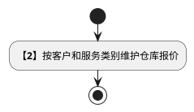
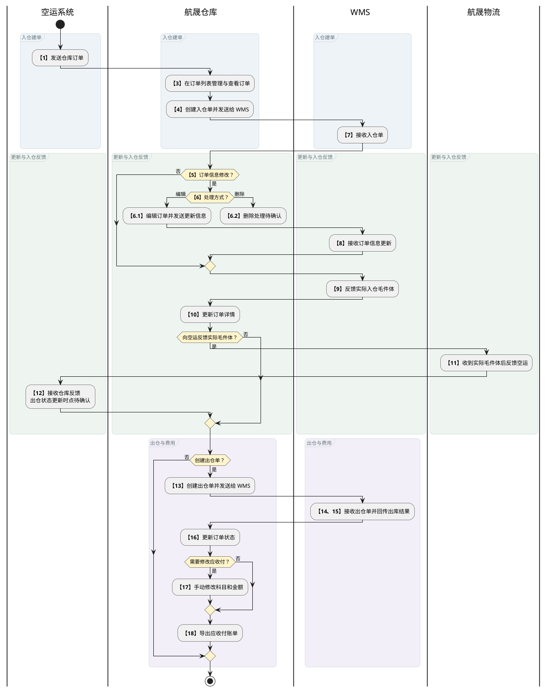
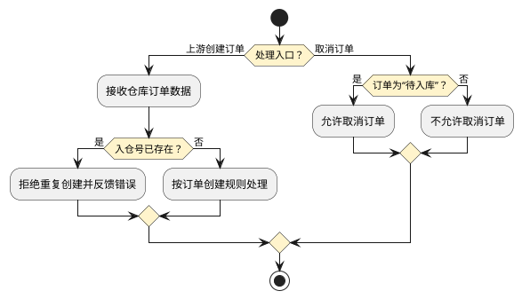
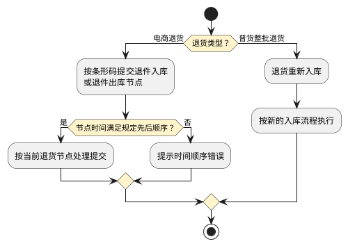
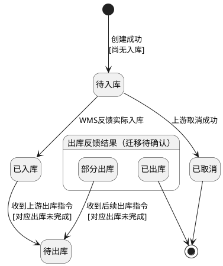
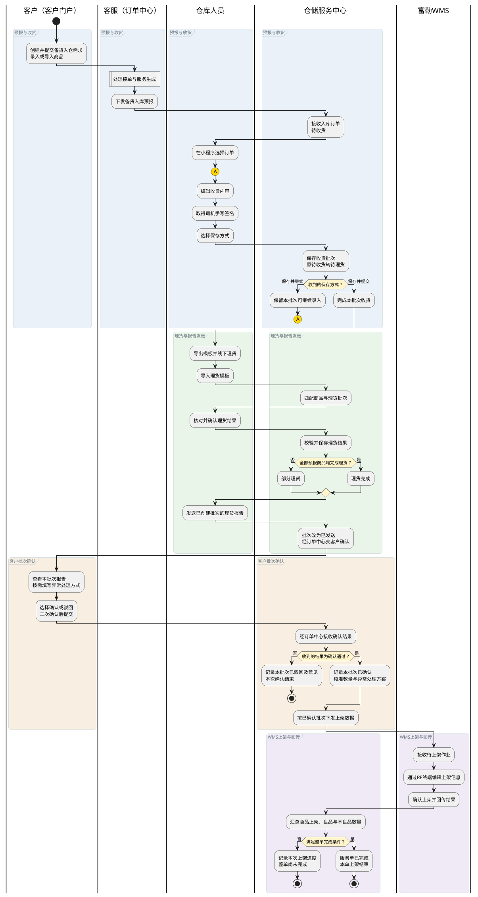
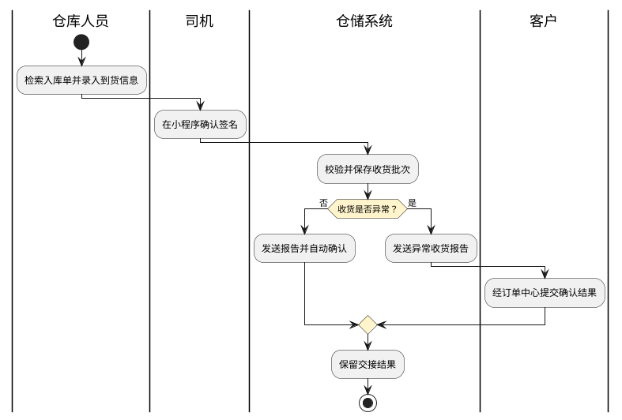
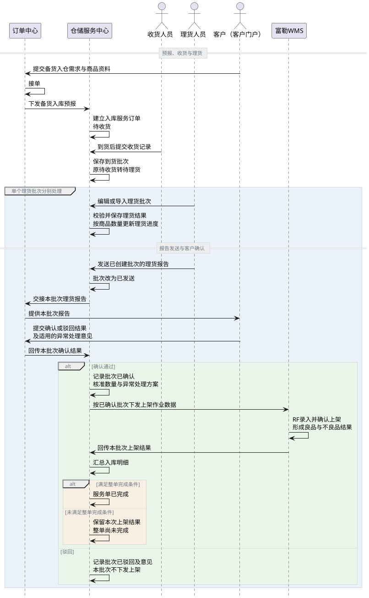
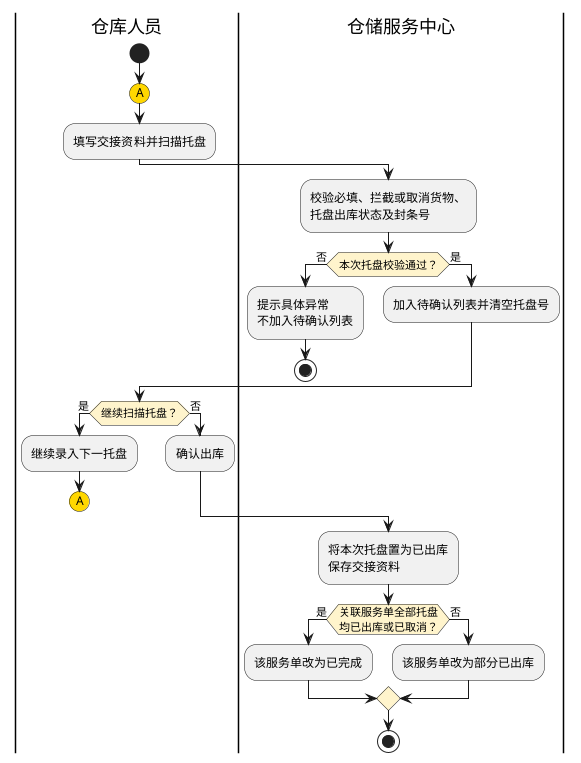
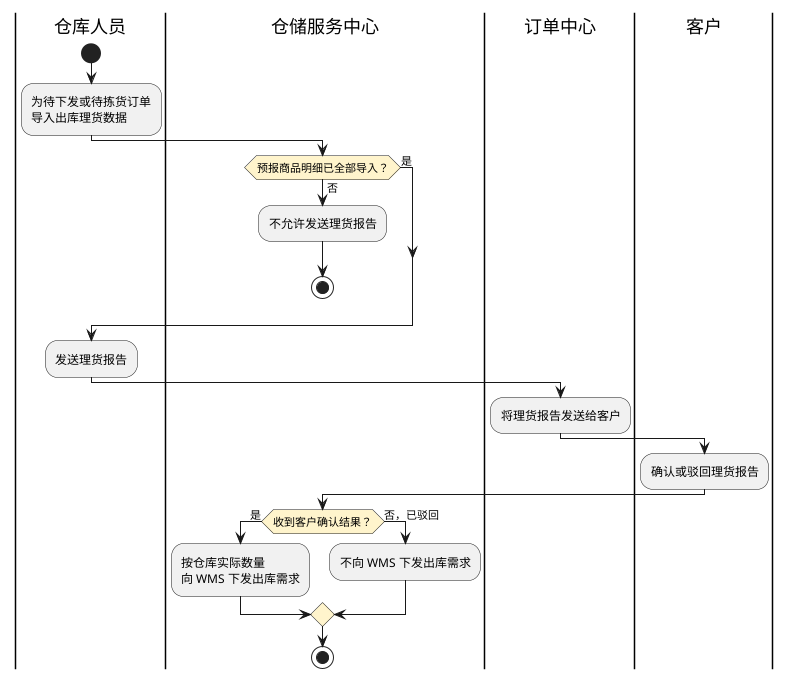

# 第033篇

> 本篇定位：仓库-仓库订单管理；主要内容：订单、托盘、服务、应收应付、退货与运输看板；文档角色：模块档；文档ID：A77FC65070

**关联业务主流程：** [普货进出口关务流程](../PRD.高捷物流系统.第01册.需求框架/PRD.高捷物流系统.第005篇.普货进出口关务详细流程.D409606401.md#doc-D409606401-general-cargo-customs)、[跨境电商 BC 出口关务流程](../PRD.高捷物流系统.第01册.需求框架/PRD.高捷物流系统.第006篇.跨境电商BC出口关务详细流程.E21C200E67.md#doc-E21C200E67-bc-export-customs)、[跨境电商 BC 与个人物品 CC 进口流程](../PRD.高捷物流系统.第01册.需求框架/PRD.高捷物流系统.第007篇.跨境电商BC、个人物品CC进口详细流程.94C028FB51.md#doc-94C028FB51-bc-cc-import)、[跨境电商 BBC 进口入出区与调拨流程](../PRD.高捷物流系统.第01册.需求框架/PRD.高捷物流系统.第008篇.跨境电商BBC进口详细流程.B7B938B684.md#doc-B7B938B684-bbc-import)、[跨境电商 BBC 进口特殊业务流程](../PRD.高捷物流系统.第01册.需求框架/PRD.高捷物流系统.第008篇.跨境电商BBC进口详细流程.B7B938B684.md#doc-B7B938B684-special-operations)、[异常处理流程](../PRD.高捷物流系统.第01册.需求框架/PRD.高捷物流系统.第010篇.异常处理流程.13D397C572.md#doc-13D397C572-exceptions)。
**关联模块流程：** [仓单订单外部对接流程](../PRD.高捷物流系统.第01册.需求框架/PRD.高捷物流系统.第011篇.DDP跨模块作业与结算流程.7579B595B8.md#doc-7579B595B8-section-e1cba7e91d25)、[仓库管理流程](#doc-A77FC65070-section-d404c18c5637)、[地面服务单据扫描上传流程](../PRD.高捷物流系统.第05册.运输管理/PRD.高捷物流系统.第043篇.用车-地面服务小程序.C027EE380C.md#doc-C027EE380C-section-5445851213dc)、[中转仓用车流程](../PRD.高捷物流系统.第01册.需求框架/PRD.高捷物流系统.第011篇.DDP跨模块作业与结算流程.7579B595B8.md#doc-7579B595B8-section-e4cd43033ac4)。
共用定义见[仓库模型与库存实体](../PRD.高捷物流系统.第08册.运营支撑/PRD.高捷物流系统.第066篇.数据字典.7A3D9E1F50.md#doc-7A3D9E1F50-inventory-model)、[仓储模型与多式干线权限](../PRD.高捷物流系统.第08册.运营支撑/PRD.高捷物流系统.第067篇.角色与访问权限.5E31456F30.md#doc-5E31456F30-warehouse-trunk-access)。

## 1. 业务范围与仓库订单流程

**业务入口：** 仓库订单页面。

**概念模型：** [数据字典 · 地面运输与仓储实体](../PRD.高捷物流系统.第08册.运营支撑/PRD.高捷物流系统.第066篇.数据字典.7A3D9E1F50.md#doc-7A3D9E1F50-domain-ground-warehouse)

### 1.1 业务目标与范围

仓库订单管理覆盖仓库订单、托盘、服务、应收应付、退货和运输看板，并与空运系统及 WMS 衔接。

### 1.2 操作入口

| 系统 | 一级菜单 | 二级菜单 | 说明 |
| --- | --- | --- | --- |
| 航晟物流 | 订单管理 | 仓库订单管理 | 基于仓库订单维度进行管理 |
| 航晟物流 | 订单管理 | 托盘管理 | 基于仓库托盘维度进行查看 |
| 航晟物流 | 订单管理 | 运输订单看板 | 仓库视角的用车订单看板 |
| 航晟物流 | 订单管理 | 运输运单看板 | 仓库视角的用车运单看板 |
| 航晟物流 | 订单管理 | 退货管理 | 电商类小包裹的退货管理 |

### 1.3 受控术语

受控术语定义见 [数据字典 · 受控业务术语](../PRD.高捷物流系统.第08册.运营支撑/PRD.高捷物流系统.第066篇.数据字典.7A3D9E1F50.md#doc-7A3D9E1F50-domain-values)。

### 1.4 基本流程说明

仓库系统负责向 WMS 下发入出仓单，并接收实际作业结果；入仓和出仓均按托盘管理，支持部分处理。

步骤 2 是独立的报价维护，不要求每个订单重新维护；报价规则见[仓库客户报价](../PRD.高捷物流系统.第06册.财务管理/PRD.高捷物流系统.第045篇.仓储-报价管理.26A37BCF5F.md#doc-26A37BCF5F-section-1b5bd7f58f71)。

步骤 6 的删除资格、结果及 WMS 后续处理尚未定义，图中不补画删除后的去向。步骤 12 在表中承接实际入仓毛件体反馈，但结果写为更新出仓状态；图中保留该待确认边界，不将入仓反馈等同于完成出仓。

| 环节 | 参与方 | 处理与结果 | 后续环节 |
| --- | --- | --- | --- |
| 1. 发送仓库订单 | 空运系统 | 空运系统发送需要仓库服务的订单 | 3 |
| 2. 维护仓库报价 | 航晟仓库 | 按客户和服务类别维护[仓库客户报价](../PRD.高捷物流系统.第06册.财务管理/PRD.高捷物流系统.第045篇.仓储-报价管理.26A37BCF5F.md#doc-26A37BCF5F-section-1b5bd7f58f71)。 |  |
| 3. 仓库订单列表 | 航晟仓库 | 所有不同客户的仓库订单都将在订单列表上统一管理和查看维护。 | 4 |
| 4. 创建入仓单 | 航晟仓库 | 仓库系统创建入仓单，发送给WMS | 5 |
| 5. 是否修改 | 航晟仓库 | 仓库客服可根据实际业务对仓库订单选择进行修改 | 6或10 |
| 6. 编辑或删除订单记录 | 航晟仓库 | 若选择修改，则通过修改编辑功能完成修改。 | 8 |
| 7. 接收入仓单 | WMS | WMS接收入仓单 | 8 |
| 8. 接收更新订单数据（提单号等信息） | WMS | 订单信息（补充提单号信息等）修改后，WMS接收更新后的信息。 | 9 |
| 9. 反馈入仓毛件体信息 | WMS | WMS反馈真实的入仓毛件体。 | 10 |
| 10. 查看订单详情（更新信息） | 航晟仓库 | 可在订单详情页面看到详情，实际毛件体信息和预计的应收付信息等。 | 11或13 |
| 11. 收到实际毛件体 | 航晟物流 | 将实际毛件体信息反馈到空运系统。 | 12 |
| 12. 更新出仓状态 | 空运系统 | 收到仓库反馈后，更新出仓状态。 |  |
| 13. 创建出仓单 | 航晟仓库 | 仓库系统创建出仓单，发给WMS系统。 | 16 |
| 14. 接收出仓单 | WMS | WMS接收出仓单。 | 15 |
| 15. 回传出库数据 | WMS | WMS回传出库结果给仓库系统。 | 16 |
| 16. 更新订单状态 | 航晟仓库 | 仓库系统接收WMS的反馈后，更新订单状态。 | 17 |
| 17. 修改应收付科目 | 航晟仓库 | 如有需要，可手动修改应收付科目和金额。 | 18 |
| 18. 导出应收付账单 | 航晟仓库 | 可通过批量导出功能，导出应收付账单。 |  |

仓库与 WMS 交接遵守以下规则：空运系统与仓库系统使用统一的仓库订单字段和数据标准；入仓和出仓按托盘管理，并支持部分入仓和部分出仓。

### 1.5 逆向流程节点说明

上游创建订单时校验入仓号是否重复；订单取消另按当前入库状态判断。

“拒绝重复创建并反馈错误”：入仓号已存在时，仅允许更新该入仓号对应的已有订单。

电商退货按包裹条形码校验节点时间；普货整批退货重新入库时，进入新的入库流程。

| 流程点 | 异常节点 | 前置条件 | 后续处理 |
| --- | --- | --- | --- |
| 1 | 创建订单-入仓号重复 | 上游系统发送的仓库订单中，入仓号已经存在。 | 不允许重复创建并反馈错误。入仓号已存在时，仅允许更新该订单内容，例如提单号和委托毛件体信息。 |
|  | 电商退货管理 | 以条形码维度校验以下时间顺序： 电商退货时间＜退件入库时间＜退件出库时间 | 不满足顺序时，在退件入库或退件出库扫码提交时提示错误。 |
|  | 普货退货管理 | 普货整批货退货，重新入库，则按照新的入库流程执行。 |  |
|  | 订单修改 | 订单状态=待入库，则所有信息均可修改。 订单状态=已入库或部分出库，则除入仓号和客户信息以外的输入项可修改。 订单状态=已出库或已取消，则不可修改。 |  |
|  | 订单取消 | 订单状态=待入库，则订单可取消，否则均不可取消。 |  |

## 2. 仓库订单创建、查询与记录

### 2.1 仓库订单手动创建

- 此页面的访问与创建角色见[地面业务页面访问](../PRD.高捷物流系统.第08册.运营支撑/PRD.高捷物流系统.第067篇.角色与访问权限.5E31456F30.md#doc-5E31456F30-ground-entry)和[操作权限](../PRD.高捷物流系统.第08册.运营支撑/PRD.高捷物流系统.第067篇.角色与访问权限.5E31456F30.md#doc-5E31456F30-ground-actions)；仓库无法自行创建订单。

#### 2.1.1 仓库订单创建界面原型概述

**界面原型概述 · 仓库订单创建**

- **区域字段或业务元素**：客户订单号、客户、客户联系人、联系电话、业务类型、委托重量（kg)、委托数量（件）、委托体积（m³）、委托中文品名、实际总重量（kg）、实际总数量（件）、实际总体积（m³）、实际体积重、尺寸（长度cm）、尺寸（宽度cm）、尺寸（高度cm）、随货资料、加重到（kg）、打托（托）、拆托（托）、分拣（次）、改标签（个）、我司过磅、我司转仓、我司贴标签、仓库名称、库位、货损情况、备注。
- **区域级通用规则**：除所列特例外，字段均选填。

| 字段或控件特例 | 界面特例或可见反馈 |
| --- | --- |
| 客户订单号 | 需要由此生成对应的入仓号，且此入仓号需要用另外一套新的编码；可编辑。 |
| 客户 | 候选范围见[地面业务数据与字段范围](../PRD.高捷物流系统.第08册.运营支撑/PRD.高捷物流系统.第067篇.角色与访问权限.5E31456F30.md#doc-5E31456F30-ground-scope)；必填；初始不设值。 |
| 联系电话 | 长度限制：8～20 个字符。 |
| 业务类型 | 1.出口空运；2.进口空运；3.出口海运；5.跨境陆运；6.陆运；必填。 |
| 委托重量（kg)、委托体积（m³）、实际总重量（kg）、实际总体积（m³）、实际体积重、加重到（kg） | 小数点后2位。 |
| 委托数量（件）、实际总数量（件）、打托（托）、拆托（托）、分拣（次）、改标签（个） | 正整数。 |
| 尺寸（长度cm） | 分成长宽高分别录入。 |
| 随货资料 | 有；无；初始不设值。 |
| 我司过磅、我司转仓、我司贴标签 | 1.是；2.否。 |

#### 2.1.2 仓库订单创建规则

录入创建仓库订单的信息。

**参与方：** 高捷物流-空运事业部或航晟物流-客服部

**入口与前提：** 从空运系统模块的“创建仓库订单”按钮进入

**业务结果：** 校验通过后创建仓库订单；校验不通过时标识错误字段且不提交。

**处理规则**

1. 按照“仓库订单创建”界面原型概述校验必填项、业务格式和长度。输入不符合要求时，高亮对应输入项，并将“提交”按钮置灰且不可点击。

1. 对“入仓号”进行重复性校验；入仓号已存在时，提示“您创建的入仓号已存在，请重新输入！”

1. 客户订单号由创建者手动录入并进行去重校验。系统按照“仓库代码+YYMMDD（6位）+4位流水”的规则自动生成入仓号（仓库订单号），以体现外部独立客户的仓库订单，例如 WH0012012170001。

1. 空运事业部录入的订单，在仓库订单管理页面显示客户全称“高捷物流-空运部”；航晟物流-客服部录入的订单，显示创建时选择的客户全称。

**分支与边界**

修改订单：

1. 订单=待入库状态，所有信息可修改；

1. 订单=已入库或部分出库状态，除入仓号和客户以外的信息，均可修改；

1. 其他订单状态（已出库或已取消），不可修改；

**业务衔接**

从空运模块单独创建仓库订单的角色授权见[地面业务操作权限](../PRD.高捷物流系统.第08册.运营支撑/PRD.高捷物流系统.第067篇.角色与访问权限.5E31456F30.md#doc-5E31456F30-ground-actions)。创建后：

- 航晟物流客服部创建的仓库订单，在仓库订单管理页面显示订单录入的委托方全称。

- 空运系统传入的仓库订单，在仓库订单管理页面显示合作方档案中配置的“高捷物流集团-空运事业部”全称。

### 2.2 仓库订单查询与状态

- 将所有客户提交的自动创建的仓库订单和手动创建的仓库订单，统一在仓库订单列表页面展示。

#### 2.2.1 仓库订单列表栏界面原型概述

**界面原型概述 · 仓库订单列表栏**

| 字段或控件 | 个别界面约束或可见反馈 |
| --- | --- |
| 客户 | 空运创建的仓库订单，客户显示为空运事业部全称；航晟物流-客服部创建的仓库订单，显示为具体的航晟客户的全称名称。 |
| 入仓号 | 上游系统传来的订单的入仓号，或手动创建订单时根据“客户订单号”的输入而自动生成。 |
| 提单号 | 上游系统传来的订单的提单号。 |
| 状态 | 待入库、已入库、待出库、部分出库、已出库、已取消；状态判定见[仓库订单业务规则](#doc-A77FC65070-section-618ffffbd5cd)。 |
| 实际件数 | 实际入库总件数。 |
| 实际重量 | 实际入库总重量。 |
| 实际体积 | 实际入库总体积。 |
| 我司过磅、我司转仓、我司贴标签 | 取订单上的相应字段值。 |
| 订单创建时间 | 仓库收到并完成订单创建的时间。 |
| 单证上传时间 | 微信小程序“单证上传”扫一扫操作的提交时间。 |
| 入库时间 | WMS反馈的实际入库时间。 |
| 报关审结时间 | 空运系统获取并回传的报关审结时间。 |
| 出库时间 | 最新一次的出库时间。 |
| 备注 | 收到订单上的备注信息。 |
| 操作 | 编辑、详情、标签；操作规则见[仓库订单业务规则](#doc-A77FC65070-section-618ffffbd5cd)。 |

#### 2.2.2 仓库订单列表规则

查看订单列表，了解订单概况

**参与方：** 仓库人员

**入口与前提：** 成功接收上游传来的仓库订单创建申请

**处理规则**

**页面订单数据源**

- 高捷物流-空运事业部的仓库服务自动生成的仓库订单；

- 航晟物流-客服部的仓库服务自动生成的仓库订单；

- 高捷物流-空运事业部手动创建的仓储订单；

- 航晟物流-客服部手动创建的仓储订单；

- 仓库自己手动创建的仓储订单；

**页面排序规则**

- 以订单创建时间倒序排序，每页展示50条记录；

1. 选中订单：支持选择一条或多条订单，并展示所选订单的汇总信息。

- 已选择X项：所选订单数量；

- 总重量X kg：所选订单委托重量之和；

- 总数量X件：所选订单委托数量之和；

- 总体积X m³：所选订单委托体积之和；

- 清空：取消全部选择；

- 下载标签：将所选订单的航空标签打包为一个压缩文件下载。

**界面原型概述 · 航空标签**

- **区域字段或业务元素**：提单条码、提单号（AWB NO.）、出发港（DEPARTURE）、目的港（DESTINATION）、总件数（TOTAL PCS.）、分单号（HAWB NO.）、分单目的港（HAWB DESTINATION）、分单件数（HAWB TOTAL PCS.）；UPS模板还展示航司名称、分单条码和分单出发港。
- **区域级通用规则**：按UPS与非UPS分别使用对应模板，标签字段只读；提单与分单的目的港、件数分别取对应单据，不能混用。

| 字段或控件特例 | 界面特例或可见反馈 |
| --- | --- |
| UPS提单条码 | 条码内容为提单号后拼接 `0001`；示例：提单号 `78415710435` 对应扫码值 `784157104350001`。 |
| UPS分单条码 | 条码内容为分单号；示例：分单号 `5930389839` 对应相同扫码值。 |
| UPS模板固定文字 | 模板固定航司名称为 `CHINA SOUTHERN AIRLINES`，提单和分单出发港为 `CAN`；提单号、分单号、各自目的港及件数动态取值。其他航司或出发港的模板选择条件尚未定义。 |
| 非UPS提单条码 | 模板展示提单条码；其编码内容、码制尚未明确，不套用UPS的拼接规则。 |

标签纸张尺寸、每单打印张数和码制尚未明确；UPS条码中的 `0001` 是否随标签序号变化也未定义，不据此自行生成递增条码。

订单状态与操作规则：

- 待入库：当前没有发生过任何入库。
- 已入库：只有发生了货物入库，状态便是“已入库”。
- 待出库：接收到上游的出库指令，但还没有完成对应的出库（发给WMS出库指令，WMS还没反馈出库完成）。
- 部分出库：已实际出库数量（件数）<=总入库数量。
- 已出库：已实际出库数量（件数）=总入库数量。
- 已取消：上游系统发送取消订单指令，并成功取消。
- 订单行操作：“编辑”用于修改；“详情”用于查看订单详情；“标签”用于下载该订单的“打印”标签。

仓库订单的指令状态与实际出入库反馈分开推进。下图只连接已明确的迁移；终点表示本次仓库订单出入库生命周期结束，不表示后续结算完成。出库数量判定的重叠边界保留在图后说明。

- “待入库→已取消”：仅“待入库”订单可取消；已入库后的取消不画为合法迁移。“待出库”的出库指令到达与 WMS 实际出库反馈是不同事件，操作记录按[订单操作记录规则](#doc-A77FC65070-section-6f1385314889)分别记录。
- “出库反馈结果”：只是两个已有状态的图示分组，不是新增状态。“部分出库”的 `已实际出库件数 <= 总入库件数` 与“已出库”的等值条件重叠，零出库量与多次出库的判定边界也需明确；图中暂不连接 WMS 出库反馈至这两个状态，也不以图示改写原条件。

### 2.3 订单详情与操作记录

- 查看仓库订单的详情信息。

#### 2.3.1 订单操作记录规则

仓库人员从订单列表的“详情”进入，查看订单字段、空运航班航线信息及操作记录。

**界面原型概述 · 仓库订单详情与操作记录**

- **区域字段或业务元素**：订单详情、航班航线其他信息；操作记录的事件、备注、操作人和时间；收起或展开订单信息、编辑订单、返回、展开或收起其他信息。
- **区域级通用规则**：详情只读展示订单和空运订单的对应字段，有值时显示、无值时留空；操作记录按事件时间升序排列。

| 字段或控件特例 | 适用条件 | 界面特例或可见反馈 |
| --- | --- | --- |
| 订单详情 | 进入页面 | 默认展开；点击“收起订单信息”后收起并显示“展开订单信息”，再次点击展开。 |
| 其他信息 | 查看航班航线 | 点击“展开其他信息”展开，点击“收起其他信息”收起。 |
| 编辑订单、返回 | 执行操作 | 分别进入订单编辑页面、返回订单列表。 |
| 客户订单号 | 独立手动创建的订单 | 显示“客户订单号”名称及订单号；其他订单不显示该字段及名称。 |
| 时间 | 每条操作记录 | 记录事件发生时间，格式为YYYY-MM-DD HH:mm。 |

**操作记录生成规则**

| 事件 | 触发或来源 | 备注内容 | 操作人 |
| --- | --- | --- | --- |
| 创建仓库订单 | 手动创建或接收上游仓库订单 | 订单备注 | 按订单来源显示空运事业部或航晟物流客服部全称 |
| 单证上传 | 微信小程序“单证上传”扫码提交 | 扫码时填写的备注 | 扫码操作人账户ID |
| 入库 | WMS反馈实际入库 | 实际入库总重量 | WMS |
| 接收出库指令 | 上游发送出库指令 | 指令中的总出库重量 | 按订单来源显示空运事业部或航晟物流客服部全称 |
| 出库 | WMS反馈实际出库；部分出库按每次实际出库分别记录 | 本次实际出库总重量 | WMS |
| 重新称重 | WMS回传托盘重新称重后的毛件体 | 对应托盘号及“重新称重”事项 | WMS |

### 2.4 备货与集货服务订单

仓储服务中心承接订单中心下发的主订单和客户订单，不直接连接第三方电商平台、客户 ERP 或客户门户。客户的报告确认经订单中心回传。备货的收货交接、理货报告维护在仓储服务中心完成，上架、拣货、打包与实物出库由富勒 WMS 执行；集货收货、理货、托盘和出库交接在仓储服务中心完成，不下发富勒作业。

| 服务模式 | 单据与作业范围 | 业务类型或订单类型 |
| --- | --- | --- |
| 备货入库 | 上游订单与入库服务订单一一关联；一单包含多个商品，按理货批次向 WMS 交接上架结果 | BC进口及退运、CC进口及退运；BBC的一线进境、区间调拨、区内调拨、简单加工、保税展示、物料进区、客退、消退 |
| 备货出库 | 承接客户订单，WMS执行拣货、打包与出库；仓储中心处理退运/退供理货和安排出区 | BC进口、CC进口、BBC包裹出区，以及对应退供、调拨、加工、展示、废料出区和退运业务 |
| 集货入库 | 主订单与下属包裹或委托明细关联；跨境电商按小订单/包裹理货，非跨境电商按委托件数理货 | 出口空运及退运、进口空运及退运、BC出口、BC进口及退运、CC进口及退运 |
| 集货出库 | 承接出库主订单及其托盘信息，展示出库结果和交接信息 | 与集货入库的业务类型衔接 |

仓储中心接收上游服务时生成自身的入库单号或出库单号，分别保留上游服务单号和预报单号，不以字段改名把不同编号合并。财务组织取物理仓所属公司，部门取上游传入的创建人部门。优先级有高、中、低，尚无差异化调度规则时默认高，不因优先级显示增加抢占或重排作业规则。

备货入库接单时建立一个收货交接单和一个有效理货单。正文允许一个理货单有多个理货批次，理货截图却写“一个服务单只有一个理货批次，一个理货批次可进行多次理货”，且图中又显示多个批次页签；批次数量关系待确认。收货交接单、理货单及批次的具体编号格式存在来源冲突，待统一确认。集货的上游主单、仓储入库单和包裹的数量关系不能仅由列表一行推定，需按实际主单及委托明细关联展示。

**界面原型概述 · 仓储服务订单列表**

- **区域字段或业务元素**：备货入库、集货入库、备货出库、集货出库页签；入库单号/出库单号、预报单号、客户订单号、总运单号/提单号、分单号、出库主订单、优先级、业务类型、业务模式、订单类型、运输方式、包装类型、客户、客服、仓库、服务单状态、是否拦截、服务单创建时间、客户订单创建时间、预计与实际出入库时间、备注、详情。
- **区域级通用规则**：按服务模式展示对应单据和只读上游信息、作业结果；点击详情进入该服务单，集货入库的理货操作进入集货理货页面。

| 字段或控件特例 | 界面特例或可见反馈 |
| --- | --- |
| 备货入库查询 | 入库单号、客户订单号、总运单号、预报单号、状态及日期区间 |
| 集货入库查询 | 入库单号、客户订单号、分单号、提单号、预报单号、状态、入库仓库、下发时间和预计入库时间区间 |
| 备货出库 | 显示电商平台、店铺、是否预售、承运公司、快递单号、安排出库状态及出库托盘号；出库托盘号支持批量查询 |
| 集货出库查询 | 出库单号、预报单号、所属仓库；货物列表可按托盘号查询 |
| 出库主订单、安排出库状态 | 显示安排出库的回填结果；新建备货出库记录的安排状态为未安排 |

**界面原型概述 · 仓储服务详情**

- **区域字段或业务元素**：基本信息、客户信息、货物信息、入库明细、收货报告、理货报告、附件资料、物流节点、操作日志。
- **区域级通用规则**：业务基本信息和上游资料只读，各作业操作在对应报告或作业页面录入，不在详情页修改上游订单。

| 区域 | 字段与呈现范围 |
| --- | --- |
| 基本与客户信息 | 本库单号、预报单号、客户订单号、总运单号、业务类型、业务模式、订单类型、运输方式、包装类型、客户及联系人姓名/电话/邮箱、仓库、店铺、财务组织、部门、业务人员、是否拦截、状态与创建/预计/实际时间 |
| 备货货物 | 商品ID、商品编号、商品条码、中英文名称、是否质检、品牌、原产国、海关编码、规格型号、单价、总价、单位、预计数量、预计毛重/净重/体积、长宽高、生产日期、失效日期、生产批次、增值服务项；按商品编号查询，商品明细以商品编号与批号联合区分 |
| 备货出库收发货人与承运商 | 收发货人姓名、电话、地址、邮政编码、身份证号、备注；承运商名称、快递单号、发运时间、车牌号、司机姓名、司机电话 |
| 备货入库明细 | 商品条码、中文名称、规格型号、预计数量、实收数量、核准入库数量、上架数量、良品数量、不良品数量、生产日期、失效日期、批次号 |
| 集货委托汇总 | 委托与实际入库的总件数、总重量、总体积；实际值在集货理货后更新 |
| 集货委托明细 | 托盘号、客户单号、快递单号、状态、包裹重量、长宽高、体积、内件名称；快递单号单项查询；跨境电商按包裹展示，非跨境电商按委托件数和尺寸展示 |
| 集货出库货物 | 出库状态、托盘号、客户订单号、关联入库单号、托盘尺寸/体积/重量、包裹重量/件数/尺寸、是否高捷托盘、司机与电话、车牌号、测量时间、操作人、备注；同托盘多个包裹尺寸分别展示 |
| 附件资料 | 资料名称、上传时间、上传人员、备注；保留文件查看/下载入口 |

上述模式与既有航晟仓库订单的状态名称不完全一致，不以“已入库”“已完成”“已出库”近义替换跨模块状态。实际入库时间、实际出库时间不得依据尚未统一的来源默认值填写为订单创建时间。

## 3. 入库收货、理货与托盘作业

**备货入库整体流程**

客户门户发起备货入库时，客户创建入仓需求，录入或导入商品并提交；订单中心处理接单与服务生成后下发入库预报。仓库完成收货与理货，客户经门户确认理货批次，富勒 WMS 执行上架并回传结果。收货、理货和上架分别记录作业进度；单次作业结束不代表整单完成。

下图展开客户门户入口，需求创建沿用[客户物流需求单](../PRD.高捷物流系统.第02册.订单管理/PRD.高捷物流系统.第015篇.客户门户订单管理.C90EB28313.md#doc-C90EB28313-demand-orders)；其他上游来源的服务交接仍见[备货与集货服务订单](#doc-A77FC65070-warehouse-service-modes)。来源图称“运营平台生成平台订单，自动接单”，与现行客服接单、补充后提交的适用关系未明确；本图中的接单子流程不指定自动接单条件，也不改变已有服务单生成时点。

连接符 `A` 表示“保存并继续”后返回“编辑收货内容”，到货批次的续录与新建、收货报告的正常自动确认和异常确认见[入库收货与交接报告](#doc-A77FC65070-receiving-handover)。司机签名由司机本人完成。

理货进度与批次确认分开处理：部分理货时也可发送已创建批次，不以整单理货完成作为客户确认或已确认批次下发上架的前提。图中理货进度判定及再次保存不回退的约束见[理货录入与批次维护](#doc-A77FC65070-section-41caf4e72794)；客户确认操作见[客户门户的报告确认规则](../PRD.高捷物流系统.第02册.订单管理/PRD.高捷物流系统.第015篇.客户门户订单管理.C90EB28313.md#doc-C90EB28313-warehouse-reports)。

“保存理货结果”不表示实物上架完成或库存已可用。整单完成条件、部分上架后续处理及回传边界统一见[报告确认与WMS上架](#doc-A77FC65070-section-79400903c2a2)；图中的驳回终点只结束本次确认，不表示服务单取消或完成。

来源图把收货、理货及报告发送统称为WMS作业，本图按[备货与集货服务订单](#doc-A77FC65070-warehouse-service-modes)区分仓储服务中心与富勒WMS。来源中的“揽收清单”先按[收货交接报告](#doc-A77FC65070-receiving-handover)承接可确认的包裹收货及报告交接行为，是否为独立单据见[多批次理货确认图问题](../../analysis/PRD自洽性问题.md#stock-inbound-batch-review)。

### 3.1 入库收货与交接报告

仓库人员在 PC 收货报告的“收货”入口或小程序“入库揽收”按车记录到货。只允许尚未已完成、已取消的入库服务单收货；收货任务安排在线下执行，不由此增加线上任务看板。

图适用于小程序收货；PC 收货的司机签名是否必需未被来源明确要求，不因共用流程补定。异常收货由客户确认与来源保存表“默认已确认”的冲突仍待解决，不能以默认值跳过异常处理。

| 操作或事件 | 处理与结果 |
| --- | --- |
| 首次收货 | 收货类型默认取入库单包装类型，允许调整；后续收货类型以首次揽收确定的类型为准 |
| 小程序保存并继续 | 有可继续的批次时继续登记该批次，否则生成新到货批次；该批次仍可继续录入 |
| 小程序保存并提交 | 完成本批次，此后不能继续向该批次录入 |
| PC确定收货 | 每次保存生成新到货批次 |
| 收货保存成功 | 保存车辆、司机、柜号、数量、异常、图片与签名记录；服务单原为待收货时转为待理货，其他状态保持 |
| 报告发送与确认 | 不论是否异常均发送收货报告；正常自动确认，异常的客户确认结果、确认时间和备注由订单中心回传 |

**界面原型概述 · 入库揽收列表**

- **区域字段或业务元素**：备货入库、集货入库；入库单号、预报单号、客户订单号、车牌号查询；单号、预计/实收数量、下发时间、业务类型、仓库、客户、状态。
- **区域级通用规则**：仅列尚未完成或取消的入库单，按服务单创建时间倒序，选择单据后进入收货操作或收货记录。

**界面原型概述 · 收货操作**

- **区域字段或业务元素**：车牌号、司机姓名、司机电话、柜号、收货类型、收货数量、是否异常、异常数量、异常类型、备注、图片、司机签名、保存并继续、保存并提交；PC入口提供确定与取消。
- **区域级通用规则**：到货信息可录入，车牌号、收货类型、收货数量和是否异常必填；除所列特例外其余项选填。

| 字段或控件特例 | 界面特例或可见反馈 |
| --- | --- |
| 车牌号、司机姓名、司机电话 | 车牌号从送货信息选择或手工输入；选择车牌联动司机姓名，姓名联动电话，司机信息可修改；多车牌的首个默认选择规则未确定 |
| 收货数量 | 必须大于0 |
| 异常数量、异常类型 | 选择异常时必填；类型可多选破损、少发、多发、其他 |
| 备注 | 异常类型含其他时必填 |
| 司机签名 | 小程序收货必填，支持手写确认 |

**界面原型概述 · 收货交接报告**

- **区域字段或业务元素**：交接单号、入库单号、客户、业务类型/模式/订单类型、仓库、包装类型、服务单状态；通知/实收/正常/异常托数或包裹件数；送货车辆、司机姓名/电话、预计件数；到货批次、揽收日期、揽收人员、复核人员、是否异常、异常类型、柜号、实收数量、异常数量、图片、签名、客户确认结果/时间、备注。
- **区域级通用规则**：按实际收货类型展示托数或包裹件数，批次明细只读展示作业记录与客户确认结果，通知数量来自上游，实收数据来自收货操作。

### 3.2 备货理货、确认与上架

#### 3.2.1 理货录入与批次维护

仓库人员可编辑或导入备货入库理货报告。服务单已取消/已完成时拒绝；所有预报商品均已满足“少货数量＋实收数量≥预报数量”时，提示已完成理货并要求核对，不继续追加理货。

采用模板作业时，仓库人员导出模板、线下理货后导入结果，系统按商品和理货批次匹配数据；仓库人员核对确认后，按下述规则校验并保存理货结果。

无理货批次或无已创建批次时，进入编辑自动生成新批次；已有已创建批次时，询问是否创建新批次，选择否则编辑现有已创建批次。录入与导入执行相同的商品校验和汇总规则。

| 校验或处理 | 业务规则 |
| --- | --- |
| 非预报商品 | 商品编号与预报不一致时，提示具体商品并询问是否继续；继续则保存为异常品类，否则清空当前行。保存分类以商品ID是否属于预报为依据 |
| 少货 | 选择少货时，实收数量＋少货数量必须等于预报数量；不满足时提示应填的少货差额 |
| 批次与效期 | 预报商品已填写生产日期、失效日期或生产批次时，理货对应项必须填写 |
| 异常明细 | 异常类型包含少货、商品破损、包装破损、其他；异常数量不得小于0；其他异常保留说明与数量 |
| 新增实收 | 货物详情累计实收数量增加本次实收数量；记录理货人及理货时间 |
| 修改实收 | 累计实收数量按“修改后数量－本条原数量”差额调整，不把整条数量再次累加 |
| 少货数量变更 | 新增累计本次少货数量；修改公式的来源误抄实收字段，正式修改口径待确认 |
| 入库明细汇总 | 按商品条码、生产日期、失效日期、批次号汇总非已驳回批次的实收数量；上架数量＝WMS回传良品数量＋不良品数量 |
| 理货进度 | 原状态为待收货、待理货或部分理货时，按全部商品的实收与少货处理结果更新理货完成/部分理货；其他状态不因再次保存而回退 |

**界面原型概述 · 备货理货报告**

- **区域字段或业务元素**：理货单号、入库单号、状态、客户、仓库、业务模式/类型/订单类型；通知品类、理货品类、通知数量、理货数量、正常数量、异常数量；预报商品；理货批次；预报品类与异常品类两组明细；客户确认信息；编辑、导入、发送、导出。
- **区域级通用规则**：基础信息、预报商品及汇总只读；仅已创建批次在编辑时输入，其他批次展示已保存的理货与确认结果。

| 区域 | 字段与界面约束 |
| --- | --- |
| 理货明细 | 理货结果、商品编号、条码、中文名称、容器号、规格、预计件数、实际数量（件）、实际毛重（kg）、长宽高、生产日期、失效日期、生产批次、正品数量、异常类型/数量/处理方案、图片、备注、理货人、理货时间；商品名称和规格从商品资料或订单已保存资料取得 |
| 批次确认 | 批次状态、客户确认人、确认时间、备注；每批次分别展示结果 |
| 导入模板 | 理货批次、容器号、商品条码、实收数量、是否异常、少货数量、商品破损数量、包装破损数量、其他异常说明/数量、生产日期、失效日期、生产批号、商品重量（kg）、长宽高（cm）；多项其他异常以英文逗号分隔 |
| 导入定位 | 填写既有批次号时，同批次已有商品修改、无该商品新增；未填写批次号时按新批次处理；服务单号和商品编号是否仍为导入必填列存在来源差异 |
| 导出模板 | 入库单号、客户单号、预报单号、理货单号、理货单状态、客户、商品ID/编号/条码/中文名、预报数量、实收数量、异常数量、异常类型/数量/处理结果、理货结果、理货人、理货时间；其他异常同时导出说明 |

通知品类按预报商品ID计数，通知数量汇总预报数量；理货品类按理货批次商品ID计数，理货数量汇总实际件数；正常数量汇总预报品类的正品数量；异常数量汇总预报品类的异常数量与异常品类的实际数量。重复商品ID是否去重及被驳回批次在报告顶部指标中的排除规则尚待统一，不能由表格名称推定。

#### 3.2.2 报告确认与WMS上架

发送时没有已创建批次，提示“当前无可发送的理货报告”；有则将对应批次改为已发送并交订单中心。客户确认后批次改为已确认，驳回后改为已驳回；各批次独立记录审核人、审核时间和意见。

多批次作业按各批次的理货结果、发送状态与客户确认结果分别处理。来源图中的批次1、2、3仅示意批次区分，不限定数量、先后或并行方式，也不要求等待全部批次再提交客户确认；到货批次与理货批次的对应关系仍按现有待确认边界处理。

已确认批次的实收数量计入核准入库数量，并回填异常处理方案。正品数量＝实收数量－应扣异常数量；少货数量、处理方案为转正品上架的异常数量不计入应扣异常数量。部分待上架和待上架的具体判据在两份来源中不同，尚待统一，不把超收直接判为部分待上架。

**备货入库交接时序**

下图以客户门户提交的备货需求为入口，按收货、理货职责分别呈现仓库作业；分组内以单个理货批次为处理范围，各批次分别适用。报告及客户确认结果经订单中心交接，已确认批次的上架数据由仓储服务中心下发富勒 WMS。

收货保存、理货进度与报告发送的资格分别按[入库收货与交接报告](#doc-A77FC65070-receiving-handover)、[理货录入与批次维护](#doc-A77FC65070-section-41caf4e72794)及本节规则执行；图中的连续展示不要求整单全部收货或全部理货后才能发送已创建批次。图只表示业务交接顺序，不约定接口同步等待或超时时长；驳回后的重提方式仍待确认。

尚未提交客户确认结果不等于驳回；发送、确认与驳回分别按本节已有状态规则记录，不因尚未确认而重建收货记录。明确驳回时记录本批次已驳回及意见，已知的短溢货重新理货入口见[客户门户的报告确认规则](../PRD.高捷物流系统.第02册.订单管理/PRD.高捷物流系统.第015篇.客户门户订单管理.C90EB28313.md#doc-C90EB28313-warehouse-reports)。来源图“是否确认”的否分支返回收货预报节点，但未区分等待、驳回及重新理货，具体回退范围和重发批次关系仍待确认，不将其画为自动重新收货。

每个已确认理货批次向 WMS 下发一次上架作业数据；入库原单是否还应在接单时预先下发，以及两类下发如何关联，仍需统一。

上架人员在富勒 WMS 的 RF 终端编辑上架信息并确认作业结果，由 WMS 回传。完成单次 RF 作业不直接表示整单入库完成，仍须核对下述完成条件。

WMS 上架回传按仓库、入库批次、商品条码、生产日期、失效日期、批次号对应入库明细，分别累计上架、良品与不良品数量。查询对象包含部分待上架、待上架、部分上架且批次未回传的订单。整单完成需同时核对：非驳回批次全部回传、已确认批次每个商品上架量等于实收量、每个预报商品的累计实收量与少货量已覆盖预报量。部分上架的继续完成资格、批次回传标记的更新时点及重复回传去重尚未形成唯一口径，不能因重复查询重复增加库存。

### 3.3 集货理货与托盘作业

#### 3.3.1 小包裹和大宗商品理货

| 判定或操作 | 小包裹理货 | 大宗商品理货 |
| --- | --- | --- |
| 业务范围 | BC出口、BC进口及退运、CC进口及退运；非跨境电商提示改用大宗商品理货 | 出口空运及退运、进口空运及退运；跨境电商提示改用小包裹理货 |
| 定位货物 | 快递单号或客户订单号 | 服务单号、快递单号或提单号 |
| 托盘限制 | 托盘号不得已存在；同托盘的包裹业务类型必须一致，不同则提示两类业务名称并拒绝加入 | 托盘号不得已存在；一个托盘不得关联多个服务单 |
| 已拦截货物 | 拒绝录入并提示放置指定区域等待退回 | 拒绝录入并提示放置指定区域等待退回 |
| 已出库或已绑托货物 | 已出库拒绝；待出库提示已关联托盘号并拒绝重复录入 | 对已出库/已绑托货物的统一校验未完整定义 |
| 连续录入 | 保存并录入下一单，清空本次单号继续扫码；切换未保存托盘号前询问是否完成当前托盘 | 保存并继续录入仅留在当前待提交列表；取消须确认，清空当前页全部待录数据 |
| 完成 | 打托完成时保存理货和托盘数据，包裹数量按每个小订单1件计 | 理货完成时保存包裹尺寸、件数、重量、托盘数据、图片及理货记录 |

小包裹完成打托后，更新对应小订单的托盘号和待出库状态；大宗商品完成后，更新入库单的关联托盘与累计实际入库件数。两份来源对集货单部分完成、全部完成和自动确认采用了不同的数量/状态判据，尚待统一；确认条件未满足时不能将整单或未处理包裹一并标为已完成。

集货理货完成会产生理货批次并发送报告。小包裹采用全部包裹待出库或已取消的判据时，未有确认结果的理货批次自动确认，确认人记录为系统；大宗商品的超收与自动确认边界尚待明确。集货理货报告显示托盘号、整托尺寸/体积/总重量、包裹重量/数量/尺寸、是否高捷托盘、测量时间、操作人员、图片、备注及确认结果，不以托盘汇总代替包裹明细。

**界面原型概述 · 集货理货录入与列表**

- **区域字段或业务元素**：小包裹/大宗商品模式；托盘号、订单定位字段；包裹长宽高、重量、件数；托盘长宽高、重量、体积、包裹总件数、图片；保存并继续、完成、清空/取消；待提交托盘及货物明细。
- **区域级通用规则**：托盘号和订单定位字段必填；所填内容先在当前列表核对，完成操作后形成托盘与理货结果。

| 字段或控件特例 | 界面特例或可见反馈 |
| --- | --- |
| 小包裹识别 | 使用快递单号/客户订单号，结果显示入库单号和快递单号 |
| 大宗包裹明细 | 支持多组尺寸；长、宽、高、件数必填，重量选填；同一服务单可有多种尺寸 |
| 托盘尺寸、体积 | 托盘长宽高以m录入、体积以m³显示；大宗包裹尺寸单位需与预报保持明确，不能混用cm与m |
| 托盘重量 | 可承接已对接称重设备的测量结果；必填与否在大宗录入表、图片和保存表之间存在差异 |
| 采集设备图片 | 展示当前设备取得的图片；完成打托时与当前托盘关联保存 |
| 小包裹列表的托盘重量/尺寸/体积 | 修订记录要求隐藏，字段表仍保留，最终显示范围待确认 |

#### 3.3.2 托盘查询、打印与拆组托

托盘管理展示集货理货形成的托盘及其明细，托盘保存暂存区、包裹数量、尺寸、体积、总重量、创建人、创建时间、状态；明细保留入库单号、客户单号、提单号、快递单号、包裹重量、尺寸、体积和数量。小包裹托盘初始待出库；大宗托盘的待下发/待出库定义存在来源差异，不能跨模式统一套用。

**界面原型概述 · 托盘查询与明细**

- **区域字段或业务元素**：托盘号、服务单号、提单号、快递单号、客户单号、暂存区编号、创建时间、状态、安排出库状态查询；托盘和包裹展开明细、打印托盘号、安排出库。
- **区域级通用规则**：单号支持批量查询，暂存区单项查询，创建时间区间查询；状态默认待出库，候选含全部、待下发、待出库、已出库、已取消；安排出库状态默认全部。

选择托盘时打印已选择托盘条码；未选择时生成新托盘号并打印，编码规则为 `WH＋007＋YYMMDD＋五位流水号`。标识为 `WH` 开头的托盘显示为高捷托盘；`007` 的仓库适用范围尚未定义，不推广为全仓统一固定编号。

**界面原型概述 · 小程序拆托与组托**

- **区域字段或业务元素**：托盘号、入库单号/快递单号、可操作包裹数量、本次取出/放入包裹数量、保存、取消、结束拆托/组托完成、包裹尺寸、托盘尺寸和重量。
- **区域级通用规则**：扫描单号后显示本次可操作数量，保存一条后清空单号和数量，保留托盘继续操作。

拆托时定位该托盘中的货物，本次取出数量不得大于在托数量；结束拆托对已保存数量执行解绑，并录入拆出包裹尺寸，更新原托盘和服务单理货信息。组托时先校验托盘未使用或已使用但未出库，显示尚未绑定托盘的可操作件数；放入数量不得小于0、不得超过可操作数量，保存后回填托盘关联，组托完成再录入尺寸和重量。零数量组托和拆托的最小数量未形成一致口径，暂不补造严格正数约束。

#### 3.3.3 暂存区存入与取出

暂存区用于入库过程的贴标、等待单证以及出库前清点和装车准备。新增或编辑时校验名称与编号不可重复；绑定使用中单据/托盘时不得删除或停用，反馈“当前暂存区正在使用中”。已启用时重复启用只提示无需操作。

小程序扫描已启用暂存区后才可继续扫描托盘；未启用则拒绝。扫描后展示该区已有托盘和本次未存入托盘。托盘已在另一区时，显示原区并确认是否转入当前区；确认存入后更新托盘与暂存区关联。取出按选中记录解除当前存放关系并记录已取出，不删除历史记录。

**界面原型概述 · 暂存区维护与小程序暂存**

- **区域字段或业务元素**：维护页查询暂存区名称、编号、状态；列表和编辑区显示编号、名称、启用/停用状态、存储数量、描述、操作；小程序显示暂存区、托盘号、已存入/未存入、存入时间、操作人、存入和取出。
- **区域级通用规则**：维护页名称和编号不支持批量查询；小程序以扫描结果填充字段，显示当前区的托盘，状态反馈紧邻托盘记录。

### 3.4 订单托盘管理

- 展示该仓库订单下的关联托盘信息及其出入库状态。

#### 3.4.1 订单托盘管理界面原型概述

字段定义见 [数据字典 · 托盘管理字段](../PRD.高捷物流系统.第08册.运营支撑/PRD.高捷物流系统.第066篇.数据字典.7A3D9E1F50.md#doc-7A3D9E1F50-ground-warehouse-entity-pallet)。

**界面原型概述 · 订单详情托盘管理**

- **区域字段或业务元素**：托盘号、状态、入库件数、入库体积、入库毛重、入库照片、入库时间、出库件数、出库体积、出库毛重、司机姓名、车牌号、封条号、出库照片、最新出库时间。
- **区域级通用规则**：字段只读展示当前订单下托盘的实际作业结果，按入库时间升序排列；取值规则见[托盘管理规则](#doc-A77FC65070-section-b7d86ea35cad)。

| 字段或控件特例 | 界面特例或可见反馈 |
| --- | --- |
| 入库照片、出库照片 | 以缩略图展示，每行3张，超过时换行。 |
| 司机姓名、车牌号、封条号 | 托盘尚未出库时留空。 |

#### 3.4.2 托盘管理规则

查看每个托盘的出入库详情信息

**参与方：** 仓库人员

**入口与前提：** 进入订单详情页面，切换到“托盘管理”页签

**业务结果：** 准确接收WMS反馈的仓库出入库数据。

**处理规则**

1. 页面排序：按照托盘的入库时间正序排序。

托盘号、入库件数、体积、毛重、照片和入库时间，以及出库件数、体积和毛重均取WMS反馈的实际值。入库毛重不包含托盘自身重量。托盘已出库时，司机姓名、车牌号和封条号取WMS反馈的该托盘对应信息；尚未出库时不填这些值。出库照片取微信小程序“出库扫描”提交的照片附件，最新出库时间取该托盘最近一次出库记录时间。

**仓库接收的上游出库指令，必须要明确如下信息**

- 入仓号：必填项，仓库必须存在该入仓号且订单状态=已入库或部分出库；

- 出库件数：出库件数需要<=当前该订单或批次的剩余可出库件数；

- 是否一起合并出库：需要一起合并在一起出库的，则相关的入仓号和批次号要一起提供；（仓库收到信息后，传给WMS）

托盘状态的判定与仓库订单相应状态的定义规则相同。

### 3.5 货物托盘管理

- 提供统一的货物管理页面，展示所有订单的托盘信息。

#### 3.5.1 货物托盘列表规则

将不同仓库订单中的托盘在同一个列表中进行展示。

**参与方：** 仓库人员

**入口与前提：** 该托盘记录已在特定订单上生成

**业务结果：** 托盘信息显示正确

**处理规则**

1. 页面排序规则：按照托盘的“入库时间”正序排序。

**筛选项**

- 客户：默认全部；

- 状态：默认全部，即托盘状态；

- 入库日期与出库日期：托盘的实际出入库日期，均默认当天，默认进入此页面时，此日期项不生效，点击查询后，才生效，可单选，也可选择日期区间或不选。

- 查询输入项：入仓号与托盘号可精准搜索。

1. 页面字段：与订单详情-托盘管理中的字段取值均保持相同，仅“详情”列，点击“查看”按钮，跳转到该订单详情的“托盘管理”页签。

## 4. 出库交接、退货与拦截

### 4.1 出库交接与安排出区

#### 4.1.1 集货出库交接

仓库人员录入承运商、司机姓名、司机电话、车牌号、封条号和托盘号后查询，全部为必填。非跨境电商托盘含被拦截服务单时，提示具体服务单并要求将货物放置一旁联系客服；跨境电商含已取消包裹时，列出快递单号并要求取出后再操作。已出库托盘拒绝重复出库，已绑定托盘的封条号拒绝重复使用。

校验通过的托盘加入待确认列表，清空托盘号并回到扫描位置。确认出库后，托盘状态改为已出库，保存车辆、承运商、司机与封条信息；关联服务单的全部托盘均已出库或已取消时，服务单改为已完成，否则改为部分已出库。该结果按托盘及其关联服务单更新，不把其他未交接托盘一并完成。

**集货出库交接与服务单完成判定**

连接符 A 接回本图“填写交接资料并扫描托盘”，继续使用当前交接资料。异常托盘按上文提示处理，本图终点仅结束本次校验或交接；服务单完成判定逐单执行，不扩展为同车其他服务单全部完成。

**界面原型概述 · 集货出库交接**

- **区域字段或业务元素**：承运商、司机、司机电话、车牌号、封条号、托盘号；待确认列表的入库单号、客户订单号、出库单号、提单号、托盘号、重量、体积、包裹件数、客户；查询、确认出库、清空。
- **区域级通用规则**：输入区全部必填，结果区只读显示通过校验的托盘及货物，异常提示定位被拦截单号或冲突封条号。

#### 4.1.2 备货与集货安排出区

安排出区向订单中心提交仓储实际出库结果以生成出库主订单。成功后回填主订单号并更新安排状态；禁止对已安排/已发送对象重复处理。支持按单反馈成功或失败，仅成功对象更新标记，失败对象保留未安排并显示失败信息。

| 来源模式 | 已明确业务范围 | 订单中心需承接的内容 |
| --- | --- | --- |
| 备货出库 | BC进口、CC进口及BBC包裹出区；调拨业务已有出库主订单，不重复生成 | 业务类型、业务模式、财务组织、部门、客服、业务员、是否流转、原财务组织/部门、状态、备注；客户及联系人姓名/电话/邮箱；客户订单号、总件数、货物统称、商品编号、中英文名称、特殊货物、规格、数量、单位、单价 |
| 跨境电商集货 | 按相同业务类型归组；业务类型包含BC出口、BC进口及退运、CC进口及退运 | 财务组织、部门、客服、业务员由订单中心取得；客户取广东高捷，业务定位编码为C05564；联系人取客户资料；运输方式、始发港、目的港、总运单号由订单中心取得；传入客户订单号、快递单号、货物统称、快递公司、托盘号及重量 |
| 非跨境电商集货 | 来源同时包含“禁止、等待客服操作”及按业务类型＋客户合单规则，执行入口待确认 | 候选规则要求客户单号、所选托盘件数合计、托盘重量合计、各服务单包裹尺寸×件数所得体积合计；不在未确认入口前自动生成 |

跨境集货订单重量优先取托盘明细包裹重量，无值时取订单原重量。备货安排成功后生成的仓储服务应关联原仓储服务单，不再重复下发仓储作业，只回填服务单和出库主订单号。

| 生成场景 | 默认服务及归属 |
| --- | --- |
| BC/CC备货出区 | 仓储服务：出库仓所属公司、操作人部门；干线：广东高捷空运产品组；关务：广东高捷关务部；快递：广东高捷电商客服部 |
| BBC备货包裹出区 | 仓储服务：出库仓所属公司、操作人部门；关务：广东高捷关务部 |
| 跨境电商集货出区 | 仓储服务：出库仓所属公司、操作人部门；关务：广东高捷关务部 |

上述默认服务均为我司服务。安排出库的已完成/已出库映射、未勾选时的处理、勾选一单是否扩展同托盘全部订单、集货是否必须先完成实物交接，来源存在冲突，须确认后才形成唯一操作资格，不通过界面默认选中绕过。

### 4.2 退运与退供的出库理货

仅退运订单、退供订单显示备货出库理货报告，并在创建时生成理货单。订单为待下发或待拣货时允许导入，模板包含出库单号、商品编号、商品条码、仓库实际数量；商品已有生产批次、生产日期或失效日期时，相应列必填。导入后更新商品仓库实际数量。

预报商品明细全部导入后才允许发送报告，经订单中心发送给客户。客户确认后按仓库实际数量向 WMS 下发出库需求，客户驳回则不下发。报告支持按模板导出；来源没有定义驳回后重报及局部修订规则。

**退运、退供理货确认与下发**

本图从有权导入的退运、退供订单开始，仅结束本次报告处理，不表示订单已出库；驳回后的重报、局部修订以及接口失败后的处理未定义，未补画自动重试或成功结果。

### 4.3 退货管理

- 显示电商退货的相关节点管理。

#### 4.3.1 退货管理界面原型概述

**界面原型概述 · 退货管理**

| 字段或控件 | 个别界面约束或可见反馈 |
| --- | --- |
| 提单号 | “电商退货”扫码提交上来的提单号；显示层级：提单。 |
| 包裹条码 | “电商退货”扫码提交上来的包裹条码；显示层级：包裹。 |
| 客户名称 | 显示层级：提单+包裹；取电商提货单客户还是留空存在来源差异，见问题清单 GJ-WORD-P1-08。 |
| 最后退货时间 | “电商退货”操作的时间节点，提单维度的“最后退货时间”则显示最新一次的该提单号被操作的“电商退货”的操作时间；显示层级：提单+包裹。 |
| 最新扫描人员 | 包裹条码维度的“电商退货”、“退件入库”或“退件出库”的操作人员；显示层级：包裹。 |
| 提货人姓名 | 提单号维度的“退货出库”操作的填入的提货人姓名；显示层级：包裹。 |
| 提货人联系方式 | 提单号维度的“退货出库”操作的填入的提货人联系方式；显示层级：包裹。 |
| 提货人车牌号 | 提单号维度的“退货出库”操作的填入的提货人车牌号；显示层级：包裹。 |
| 条码数量 | 只显示在提单号行，该提货单下属多少退货包裹条码；显示层级：提单。 |
| 退货入库数 | 只显示在提单号行，该提货单下属多少已操作“退货入库”的包裹条码数量；显示层级：提单。 |
| 退货出库数 | 只显示在提单号行，该提货单下属多少已操作“退货出库”的包裹条码数量；显示层级：提单。 |
| 入库时间 | 只显示在提单号行，该包裹条码的实际入库时间，即操作“退货入库”的时间；显示层级：包裹。 |
| 出库时间 | 只显示在提单号行，该包裹条码的实际出库时间，即操作“退货出库”的时间；显示层级：包裹。 |

#### 4.3.2 退货管理规则

管理电商退货的相关退货节点。

**参与方：** 仓库人员

**入口与前提：** 相关退货节点已在微信小程序的扫一扫功能操作。

**业务结果：** 数据信息与节点显示正确

**处理规则**

1. 页面数据源：初始数据取微信小程序“电商退货”扫码结果；退件入库和退件出库节点分别取“退件入库”“退件出库”的扫码结果。

1. 数据展示：页面同时展示提单行与包裹行；一个提单行下管理与该提单号关联的全部包裹条码行。选中提单行即选中其下全部包裹条码行。

1. 页面排序规则：按最后退货时间倒序排列。

1. “退件出库”扫码时录入提货人姓名、联系方式和车牌号。

**选中包裹码行后显示“退签单导出”按钮，导出文件包含**

- 客户名称：留空。

- 提货地址：`花都区花东镇空港大道9号——空港电商国际产业园A7栋2-3号门`。该固定地址适用的仓库范围、是否允许以系统配置替代及配置维护规则尚未明确。

- 提货人姓名：取包裹码关联的提货人姓名。

- 提货车牌：取包裹码关联的提货人车牌号。

- 提货人手机：取包裹码关联的提货人联系方式。

- 提单号：取对应提单号。

- 包裹条码：取对应包裹条码。

- 安检退件时间：取包裹码“电商退货”操作时间。

**分支与边界：** 扫码操作的时间节点必须满足“电商退货＜退件入库＜退件出库”，具体操作规则见[地面服务小程序退件规则](../PRD.高捷物流系统.第05册.运输管理/PRD.高捷物流系统.第043篇.用车-地面服务小程序.C027EE380C.md#doc-C027EE380C-section-67d974e9f765)。

### 4.4 仓储拦截与作业记录

收到上游取消请求时记录拦截请求，是否拦截置为是；该标记表示请求发生，不等同取消成功。取消结果回传订单中心。

| 对象 | 拒绝条件 | 允许时的处理 |
| --- | --- | --- |
| 备货入库 | 已上架完成或部分上架 | 其余状态请求WMS取消；成功才改为已取消，失败不改变作业状态 |
| 备货出库 | 已完成；WMS已完成或已取消也被来源列为拒绝 | WMS尚未作业时可取消；已进入作业但未完成时先冻结，冻结后是否即算取消成功待确认 |
| 非跨境电商集货入/出库 | 服务单已完成 | 未完成则服务单改为已取消；已完成保持原状态并反馈拦截失败 |
| 跨境电商集货入/出库 | 被拦截的小订单已出库 | 未出库则仅该小订单改为已取消，服务单不随单个包裹取消而直接取消 |

**界面原型概述 · 仓储操作日志**

- **区域字段或业务元素**：节点、操作详情、操作人、操作时间；可定位理货批次、商品条码、托盘号和出库主订单号。
- **区域级通用规则**：各类服务单详情只读显示已发生的作业日志，系统动作记录系统操作者，人工动作保留实际执行或审核人员。

| 模式 | 需记录的业务节点 |
| --- | --- |
| 备货入库 | 创建、PC/小程序收货、创建/修改理货批次、发送报告、确认/驳回批次、提交WMS、上架条码与数量、发起拦截及成功/失败结果 |
| 备货出库 | 创建、导入/发送理货报告、确认/驳回、提交WMS、拣货完成、打包完成、出库确认、安排出区及生成主订单号、拦截结果 |
| 集货入库 | 创建、理货、自动发送报告、确认/驳回、出库交接及托盘号、安排出区及主订单号、拦截结果 |
| 集货出库 | 创建、出库交接及托盘号、拦截结果 |

## 5. 仓储服务与应收付账单

### 5.1 订单服务管理

- 展示与记录仓库的服务内容。

#### 5.1.1 服务管理规则

展示具体仓库的服务明细记录。

**参与方：** 仓库人员

**入口与前提：** 进入订单详情首页，切换到“服务管理”页签

**业务结果：** 正确显示空运的期望服务内容和记录仓库的实际操作结果。

**处理规则**

1. 服务记录排序：有期望服务数量或实际服务数量的服务项置顶。

**服务类型包括以下5项**

- 打托

- 加重

- 拆托

- 分拣

- 改标签

1. 期望服务数量：上游系统针对特定服务项传入的期望数量，例如打托服务期望完成6托。

1. 实际服务数量：由仓库人员通过“编辑”功能录入。

1. 操作人：仅有期望服务数量时，显示上游系统录入该期望服务的操作人ID；已有实际服务数量时，显示录入实际服务数量的仓库人员ID。

1. 操作时间：记录仓库人员录入实际服务数量的时间，格式为YYYY-MM-DD HH:mm。

1. “编辑”：订单状态变为“已出库”前可点击；订单已出库后不显示。编辑后，点击页面上的“保存”按钮保存内容。

**分支与边界：** 此服务项内容与应收付科目相关，见下一章节说明。

### 5.2 订单应收付账单

- 基于仓库订单维度，展示该订单的应收付记录，仅查看模式。

#### 5.2.1 应收付自动生成规则

| 序号 | 费用科目 | 触发场景 | 计算规则 | 备注 |
| --- | --- | --- | --- | --- |
| 1 | 装卸费 | WMS反馈实际出库 | 本次实际出库重量（kg）×该客户报价中的“卸载操作费（元/kg）”；计算结果低于“卸载最低收费（元）”时，按最低收费计费。 | 多次部分出库时，每次出库分别计算。 |
| 2 | 仓储费 |  | 实际仓储天数不超过配置的免租期天数时免收仓储费；超过免租期时，仓储费=对应货物重量×该客户的仓储费单价×超出免租期的天数。 |  |
| 3 | 打包费（打托） | 出库前均可在“服务管理”页面录入，但只在订单状态=已出库时，才自动生成相应的应收科目。 | 对应客户的打托费报价单价*服务管理中实际录入的打托实际服务个数。 | 只在订单全部完成(订单状态=已出库）时，自动生成记录。服务数量的录入则在订单完成前，均可录入和编辑修改。 费用科目的“单位”取该报价上的“单位”。 |
| 4 | 打包费（拆托） |  | 对应客户的拆托费报价单价*服务管理中实际录入的拆托实际服务个数。 |  |
| 5 | 打包费（加重） |  | 对应客户的加重费报价单价*（服务管理中实际录入的“加重到实际服务数量”-实际入库时的原始重量） |  |
| 6 | 操作费（分拣） |  | 对应客户的分拣费报价单价*服务管理中实际录入的分拣实际服务个数。 |  |
| 7 | 标签费 |  | 对应客户的标签费报价单价*服务管理中实际录入的标签实际服务个数。 |  |

#### 5.2.2 应收付账单规则

查看该订单的应收和应付汇总账单信息。

**参与方：** 仓库人员

**入口与前提：** 进入订单详情页面，切换到“应收付账单”页签。

**处理规则**

1. 此页面仅查看，不可直接添加费用，添加科目费用需要在“财务结算”的统一入口页面。

1. 见上文，相应的仓库科目、费用和单位需要系统根据匹配规则自动生成计算。

## 6. 仓库运输看板与报表

### 6.1 仓库运输订单看板

- 以仓库视角，来看提货点或卸货点是航晟仓库的订单。

#### 6.1.1 运输订单看板字段定义

**界面原型概述 · 仓库运输订单看板**

| 字段或控件 | 个别界面约束或可见反馈 |
| --- | --- |
| 入仓号 | 陆运订单“订单号”有值，取此值；无值，则取“分单号”；仍无值，则取“批次号”。 |
| 客户 | 陆运订单上的“委托方”信息。 |
| 类型 | 提货：所有中转订单+运输订单中的“提货点地址”可模糊匹配“航晟+仓库”；卸货：运输订单中的“卸货点地址”可模糊匹配“航晟+仓库”。 |
| 订单状态 | 取陆运订单的状态；待调度；已调度；已取消；已完成；异常中。 |
| 件数(件） | 取陆运订单的件数。 |
| 体积（m³） | 取陆运订单的体积。 |
| 重量（kg) | 取陆运订单的重量。 |
| 尺寸 | 取陆运订单的尺寸。 |
| 计划到达时间 | 取陆运订单的期望提货时间。 |
| 操作 | “查看详情”按钮。 |

#### 6.1.2 运输订单看板-查看详情字段定义

**界面原型概述 · 仓库运输订单看板详情**

| 字段或控件 | 个别界面约束或可见反馈 |
| --- | --- |
| 运单号 | 取运单的对应字段信息。 |
| 预计到达时间 | 提货类型：取订单的“期望提货时间”；卸货类型：取订单的“预计送达时间”。 |
| 备注 | 取运单的备注信息。 |
| 运单状态 | 取运单的状态。 |
| 车型、车牌号、司机姓名、联系方式、提货件数（件）、提货重量（kg）、提货体积(m³)、提货尺寸 | 展示当前记录的对应信息。 |

#### 6.1.3 仓库运输订单看板规则

帮助仓库人员查看哪些运输订单快要来提货或卸货。

**参与方：** 仓库人员

**入口与前提：** 取用车管理的订单数据，并进行过滤。

**业务结果：** 筛选并展示提货点或卸货点为航晟仓库的订单。

**处理规则**

**页面数据来源**

- 所有中转订单：提货类型为“提货”。

- 运输订单中的提货点可模糊匹配“航晟+仓库”的订单：提货类型为“提货”。

- 运输订单中的卸货点可模糊匹配“航晟+仓库”的订单：提货类型为“卸货”。

1. 页面排序：\|按照“计划到达时间”-当前时间\|越小，则排序越靠前。

1. 点击特定行的“查看详情”按钮可查看该订单的相关运单的详情页签：按照运单的“预计到达时间”顺序排序。

### 6.2 仓库运输运单看板

- 以仓库视角，来看提货点或卸货点是航晟仓库的运单。

#### 6.2.1 仓库运输运单看板筛选栏界面原型概述

**界面原型概述 · 仓库运输运单看板筛选栏**

| 字段或控件 | 个别界面约束或可见反馈 |
| --- | --- |
| 查询输入项 | 支持入仓号/运单号/车牌号的精准搜索。 |
| 类型 | 提货；卸货；默认值：全部。 |
| 车型 | 1.5T/0.6；3T/4.2；5T/7.0；8T/7.6；10T/9.6；40/45HQ；17.5米/平板；17.5米/厢车；12米平板；默认值：全部。 |
| 特种车 | 危险品；冷藏车；气垫车；平板车；默认值：全部。 |
| 运单状态 | 待提货；提货中；到达提货点；已提货；到达卸货点；已卸货；已取消；默认值：全部。 |
| 尾板车 | 1. 是；2. 否；默认值：全部。 |
| 预计到达日期 | 支持单日或日期区间筛选；默认值：当天。 |
| 实际到达日期 | 支持单日或日期区间筛选。 |

#### 6.2.2 仓库运输运单看板界面原型概述

**界面原型概述 · 仓库运输运单看板**

| 字段或控件 | 个别界面约束或可见反馈 |
| --- | --- |
| 入仓号 | 陆运订单“订单号”有值，取此值；无值，则取“分单号”；仍无值，则取“批次号”。 |
| 运单号、件数(件） | 取运单的对应字段信息。 |
| 司机及联系方式 | 将司机姓名和联系方式合并；司机姓名与联系电话按“姓名：电话”格式合并展示。 |
| 最新位置 | 取从司机端小程序获得的最新一个的司机当前位置；取不到则留空。 |
| 预计到达时间 | 司机节点时间与位置、目的地；计算口径见[仓库订单业务规则](#doc-A77FC65070-section-6a936e7e5244)；提货类型对比提货目的地；卸货类型对比卸货目的地。 |
| 实际到达时间 | 提货类型：取司机通过小程序确认“已到达提货点”的时间；卸货类型：取司机通过小程序确认“已到达卸货点”的时间。 |
| 备注 | 取运单备注信息。 |
| 类型、运单状态、车牌号、车型、特种车、尾板车、体积（m³）、预计重量（kg)、预计尺寸 | 展示当前记录的对应信息。 |

#### 6.2.3 仓库运输运单看板规则

帮助仓库人员查看哪些运输运单快要来提货或卸货。

**参与方：** 仓库人员

**入口与前提：** 取用车的运单数据，并进行过滤。

**业务结果：** 筛选并展示提货点或卸货点为航晟仓库的运单。

**处理规则**

**页面数据来源**

- 所有中转运单：提货类型为“提货”。

- 运输订单中的提货点可模糊匹配“航晟+仓库”的运单：提货类型为“提货”。

- 运输订单中的卸货点可模糊匹配“航晟+仓库”的运单：提货类型为“卸货”。

1. 页面排序：\|按照“预计到达时间”-当前时间\|越小，则排序越靠前。

预计到达时间规则：

- 提货类型：取司机点击“前往提货”的时间，加上从司机点击“前往提货”时的地理位置到提货点位置所需的时间。
- 卸货类型：取司机点击“已提货完毕”的时间，加上从司机点击“已提货完毕”时的地理位置到卸货点位置所需的时间。

### 6.3 航晟仓库月度报表

- 按照月份依次展示仓库实际出入库订单数、应收应付金额和预计盈利。

#### 6.3.1 航晟仓库月度报表界面原型概述

**界面原型概述 · 航晟仓库月度报表**

- **区域字段或业务元素**：查询栏：月份；结果区：月份、总入库订单数、总出库订单数、中转出库订单数、总应收、总应付、预计盈利。
- **区域级通用规则**：查询栏提供上述筛选条件，结果区只读展示匹配指标；取值、计算和统计口径按本节后文规则执行。

**报表指标口径**

| 指标 | 取值或计算规则 |
| --- | --- |
| 月份 | 月份数依次倒序展示，从系统中第一笔订单的月份开始 |
| 总入库订单数 | 实际入库时间发生在该月份的订单总数 |
| 总出库订单数 | 实际全部已出库时间发生在该月份的订单总数，部分出库不算 |
| 中转出库订单数 | 订单上的“我司中转”为“是”的订单，且其实际全部已出库时间发生在该月份的订单总数，部分出库不算 |
| 总应收 | 该月已完成的所有订单的订单应收金额累计（取业务主管审批通过后的数据即可） |
| 总应付 | 该月已完成的所有订单的订单应付金额累计（取业务主管审批通过后的数据即可） |
| 预计盈利 | 预计盈利=总应收-总应付 |

**指标展示示例**

示例仅说明展示形式，实际结果按上述统计口径计算。

| 指标 | 示例值 |
| --- | --- |
| 总入库订单数 | 2322 |
| 总出库订单数 | 3322 |
| 中转出库订单数 | 3222 |
| 总应收 | ￥34444.00 |
| 总应付 | ￥30444.00 |
| 预计盈利 | ￥4000.00 |

## 7. WMS业务交接与资料同步

WMS请求按目标仓库路由至对应仓库服务，南沙和香港的仓库识别值必须与仓库配置一致；来源未填完整的仓库识别值不得作为可执行映射。认证材料和运行地址由集成配置管理，不写入产品字段或业务默认值。

富勒WMS与中台的各业务连接点须记录交接日志，以便在WMS入库成功而中台未同步时定位发生差异的环节；日志留存期限及同步失败后的恢复规则尚未明确。

### 7.1 备货入出库的业务映射

| 交接内容 | 入库下发 | 出库下发 |
| --- | --- | --- |
| 作业依据 | 已确认理货批次；每批次独立关联入库单 | 已接收出库服务单；退运/退供须先取得客户确认的理货结果 |
| 来源识别 | WMS来源订单号取理货批次号，参考信息保留仓储入库单号和客户单号 | WMS来源订单号取客户订单号，参考信息保留仓储出库单号、店铺名称、快递单号和预售/现货标识 |
| 订单类型 | BBC取订单类型，其他取业务类型，并映射到WMS受控值 | BBC取订单类型，其他取业务类型；出库映射包含退供、包裹出区、调拨、加工、展示、废料出区和退运 |
| 货主 | 订单有店铺时取店铺WMS货主ID，否则取客户WMS货主ID | 来源只明示店铺WMS货主ID；无店铺订单的回退待确认 |
| 时间 | 作业创建时间取下发时点，预计到货取客户订单创建时间 | 创建时间取下发时点，预计发货取客户订单创建时间，要求交货取客户订单创建时间＋1天；自然日/时区口径待确认 |
| 商品与数量 | 商品条码；理货实收数量；按商品从1编行号 | 商品条码；预计数量，退运/退供采用客户确认的仓库实际数量 |
| 批次与货物 | 生产日期、失效日期、批次号、备注、柜号、长宽高，默认良品 | 生产日期、失效日期、批次号，默认良品；抖音与指定店铺的批次字段判定存在重叠，待统一 |
| 收货信息 | 由入库订单承接所需识别信息 | 收货人姓名、国家/省/市/区县、收件地址、电话；客户名称、发件人电话按约定传递 |

修改已下发入出库订单后需重新下达时，先取得原WMS单据取消结果，再重新提交完整单据，不直接把旧单与新单作为两次独立实物流转。现有来源只规定批量下发与单笔取消，不给接口超时、重试、部分失败和防重策略；这些边界不能以实现方式代替业务确认。

抖音店铺下发收货人姓名时，保留首尾字符，中间字符替换为星号。手机号码第4至7位打码的适用平台条件在来源中缺失，需确认；一字姓名、短电话号码的边界未定义。抖音非类自营服务传递店铺服务类型，3PL/4PL按对应类型传递；类自营及其他平台不传该项。

快递交接需要保留承运商及其WMS编码、快递服务类型、分拣码、集包地，以及顺丰二维码、集货单号与服务类型。京东订单还需向WMS提供面单扩展信息，不能只下发普通快递单号；实际平台返回字段映射及其缺失处理由已确认的快递协作约定承接。

### 7.2 出库结果与托盘回传

WMS回传仓库、客户订单号、仓储出库单号、状态、操作时间、操作人、毛重及纸箱规格。拣货完成映射待打包，完全装箱映射待出库，订单完成映射已出库；其他状态不擅自映射为已出库。毛重有值时更新仓储及订单中心毛重。

订单成为已出库后取得WMS的出库托盘号，保存到仓储出库列表并提供批量查询；查不到时不生成虚构托盘号。来源要求将三种状态回传时间都写入实际出库时间，与字段语义冲突，实际时间口径待确认。

### 7.3 客户与商品资料同步

创建客户、创建店铺或编辑店铺资料时，向有关仓库下发WMS货主资料。交接包含WMS货主ID、货主身份、中英文名称、目标仓库地址和按客户名称拼音首字母生成的助记码；一个仓库需要具备其服务客户的货主资料。

商品备案成功后向WMS下发商品条码、品名、毛重、净重、单价和所属货主。客户与店铺WMS货主ID不同的，按不同货主分别下发；BBC商品下发南沙仓，BC/CC商品下发香港仓。默认激活、非组合件，库存下限0、上限9999999；这些WMS默认值不代表库存可超卖或平台可售量。

资料同步的正式协作定位包括货主资料、商品资料、入库下发、入库取消、出库下发和出库取消。来源中的数据库表、视图、直接写库方式、技术类型、无业务取值的预留字段不作为产品规则；若协作必须依赖具体字段，按其业务含义和已确认映射维护，不直接复制完整接口结构。
