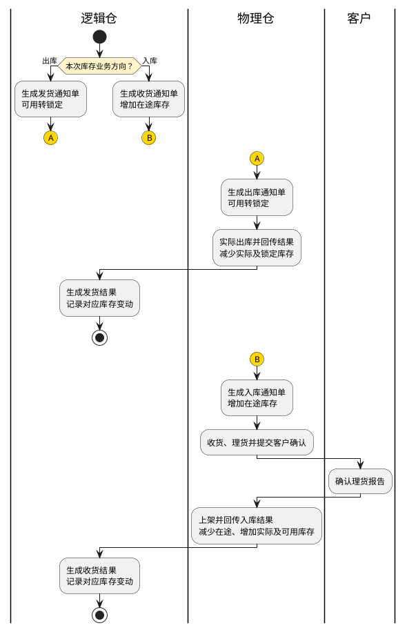
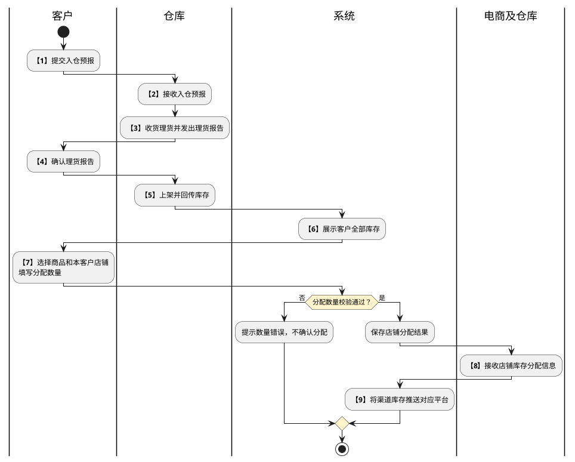

# 第033篇

> 本篇定位：仓库模型与库存管理；主要内容：四层仓库、库存分配、店铺同步、库存流水与标准单据；文档角色：模块档；文档ID：B73CA2EE76

共用定义见[仓库模型与库存实体](../PRD.高捷物流系统.第08册.运营支撑/PRD.高捷物流系统.第065篇.数据字典.7A3D9E1F50.md#doc-7A3D9E1F50-inventory-model)、[仓储模型与多式干线权限](../PRD.高捷物流系统.第08册.运营支撑/PRD.高捷物流系统.第066篇.角色与访问权限.5E31456F30.md#doc-5E31456F30-warehouse-trunk-access)。

## 1. 四层仓库与配置边界

业务运营平台维护物理仓、逻辑仓、共享仓、渠道仓及其映射，客户门户按客户和店铺查看、分配及转移库存。仓库作业产生实物库存，逻辑仓承接业务单据，共享仓按分配策略取得供货库存，渠道仓向平台店铺供货。“虚拟仓”在该模型中指共享仓，不另建第五层仓。

客服维护仓库配置；仓库人员查询库存和标准单据；客户只处理自己的商品、仓库库存和店铺库存。作业订单的收货、理货、上架及出库操作见[仓库订单管理](PRD.高捷物流系统.第032篇.仓库-仓库订单管理.A77FC65070.md#doc-A77FC65070-section-fb20853cddc3)。

| 配置对象 | 建立与关联规则 | 停用、编辑和删除限制 |
| --- | --- | --- |
| 物理仓 | 先维护所属公司，再创建实际仓库；一个物理仓可关联多个逻辑仓 | 有库存时不得停用；启用时不得编辑或删除 |
| 逻辑仓 | 创建前已有可用物理仓；每个逻辑仓只关联一个物理仓 | 有库存时不得停用；启用时不得编辑或删除 |
| 共享仓 | 用于承接逻辑仓分配的库存；可向多个渠道仓供货 | 关联渠道仓时不得停用；启用时不得编辑或删除 |
| 渠道仓 | 保存基本信息后关联一个或多个共享仓，并维护每条关联的供货比例 | 关联共享仓时不得停用；启用时不得编辑或删除 |

物理仓、逻辑仓和共享仓创建成功后默认启用。渠道仓的初始状态、停用后能否删除曾启用的仓库，以及撤销有关联库存的配置后如何处理已有库存，尚待明确，不由界面状态推定。

电商业务可在新增物理仓时生成对应逻辑仓、新增客户时生成共享仓、新增店铺时生成渠道仓，并按客户与店铺关系建立映射。客户直接把逻辑仓库存分配到店铺时，客服不必另设逻辑仓到共享仓的分配策略；不得同时重复计算同一库存的两种分配结果。

**界面原型概述 · 库存模型**

- **区域字段或业务元素**：查询栏：仓库类型、仓库名称；结果区：物理仓、逻辑仓、共享仓、渠道仓及连线关系。
- **区域级通用规则**：只展示已启用的仓库；不设条件时查询全部可见关联，选择仓库类型后限定仓库名称的候选范围。

**界面原型概述 · 仓库维护列表与详情**

- **区域字段或业务元素**：查询栏：本类仓库编码、名称；列表：编码、名称、状态、所属公司或备注、启用、停用、编辑、详情、删除；详情：仓库基本信息、创建人、创建时间和上下层仓库关联。
- **区域级通用规则**：编码精确查询、名称模糊查询，列表按创建时间倒序每页10条；详情只读，编辑和删除按钮按本节操作资格禁用。

**界面原型概述 · 仓库新建与编辑**

| 字段或控件 | 个别界面约束或可见反馈 |
| --- | --- |
| 物理仓 | 编码自动生成且只读；所属公司、名称、仓库类型、国内外关系、行政区地址、详细地址必填；仓库类型选择普通仓或保税仓，国内外关系选择国内或国外；负责人、联系方式、备注选填 |
| 逻辑仓 | 编码只读；名称和关联物理仓必填；物理仓单选已启用项且支持名称模糊搜索；备注选填；已建立的物理仓关联在编辑页只读 |
| 共享仓 | 编码只读；名称必填、备注选填 |
| 渠道仓 | 编码只读；名称必填、备注选填；保存后显示关联共享仓区域，可按编码或名称查询、批量增加或删除关联 |
| 供货比例 | 每条共享仓关联默认100%，允许1%～100%，最多两位小数；超出范围时提示错误，不保存该比例 |
| 保存校验 | 必填项缺失或内容不合法时定位字段，提交或保存不可用；成功后显示提交成功反馈 |

物理仓名称最多 12 字，详细地址和备注最多 500 字、负责人最多 10 字、联系方式最多 100 字；国内外关系在新建图中默认国内。逻辑仓、共享仓、渠道仓名称最多 50 字，备注上限通常为 500 字；渠道仓新增页另写 50 字，与弹窗表不一致，待确认。四类仓库编码及策略编码的前缀冲突集中列入问题清单，不依截图示例重定编码。

**界面原型概述 · 仓库详情关联区域**

- **区域字段或业务元素**：物理仓详情的逻辑仓名称/编码查询及逻辑仓编码/名称/备注；逻辑仓详情的共享仓名称/编码查询及分配策略编码/名称/共享仓编码/名称/备注；共享仓详情的逻辑仓来源与渠道仓供货关系；渠道仓详情的共享仓编码/名称/供货比例/备注。
- **区域级通用规则**：详情关联列表只读并分页，支持各关联区域的搜索和重置；创建人、创建时间与仓库状态在基本信息展示。

四层模型的连线依次取逻辑仓关联、库存分配策略、渠道仓关联，不从库存数量推算关联。模型查询的仓库名称在同一句出现“精确匹配”“模糊查询”，匹配方式待确认。

## 2. 库存分配策略与平台同步

### 2.1 逻辑仓向共享仓分配

库存分配策略保存策略名称、SKU范围及共享比例，再维护共享仓与逻辑仓的关联；一条策略可包含多条关联。策略按比例分配，不把关联关系本身等同于实物移库。

| 配置情形 | 处理规则 |
| --- | --- |
| 所有SKU | 设置批量共享比例，允许0%～100%，最多两位小数；黑名单内商品不共享 |
| 指定SKU | 通过白名单选择商品，并分别设置共享比例；新增白名单时输入的比例带入本次选择的商品 |
| 商品选择 | 按商品ID、商品条码、客户、商品名称、批次号筛选，可多选；展示商品ID、客户、条码、批次号、名称 |
| 关联仓库 | 单选共享仓、多选逻辑仓后形成逐条关联；支持按两类仓库编码和名称查询、单条或批量删除关联 |
| 启用与停用 | 已关联仓库的策略不得停用，并提示“有关联仓库信息不允许禁用”；无关联时允许切换 |
| 编辑与删除 | 编辑策略名称、策略类型及商品规则；删除资格与已有分配库存处理尚待明确 |

共享比例计算后出现非整数库存、多条策略命中同一商品及仓库、不同渠道比例合计超过可分配库存时的处理尚待明确；不得据此推断可超卖。

**界面原型概述 · 库存分配策略**

- **区域字段或业务元素**：查询栏：策略编码、名称、状态；列表：策略编码、名称、状态、编辑、查看关联、删除；编辑页：策略编码、名称、按比例分配、SKU范围、批量共享比例、黑名单、白名单、保存并前往关联。
- **区域级通用规则**：编码自动生成且只读，列表按创建时间倒序每页10条；SKU范围切换为“所有SKU”时显示批量比例和黑名单，切换为“指定SKU”时显示各商品比例的白名单。

策略编码、策略名称及关联页两类仓库的编码、名称均支持模糊查询，状态选启用或禁用。黑白名单支持新增、单条删除、批量删除和清空选择；新增关联弹窗另展示逻辑仓分类筛选及逻辑仓编码、名称、分类。分类来源未定义，不能据此新增仓库分类字典值。

### 2.2 渠道仓与平台店铺同步

已启用的平台店铺与渠道仓按一对一关系绑定。关联渠道仓时默认选中已关联项，改选并确定后替换为新关联；渠道库存通过自动同步发送给该店铺的平台商品。同步周期、失败反馈、重试及更换关联时原平台库存的处理尚待明确。

平台商品对照按客户、商品、店铺维护中台商品ID与平台商品ID的映射。同一客户的同一商品有三个店铺时显示三条映射。平台商品ID默认取中台商品ID，允许编辑为实际平台商品ID，支持字母、数字和特殊符号，最多100个字符。

**界面原型概述 · 电商库存同步策略与平台商品对照**

| 字段或控件 | 个别界面约束或可见反馈 |
| --- | --- |
| 同步策略查询与列表 | 按店铺、渠道仓名称模糊筛选；列表显示平台ID、平台、店铺名称、客户、已关联渠道仓；未关联时渠道仓留空 |
| 关联渠道仓弹窗 | 按编码或名称模糊检索已启用渠道仓，单选后确定 |
| 平台商品对照查询 | 客户名称模糊查询；商品ID、店铺、平台、平台商品ID精确查询 |
| 平台商品对照列表与编辑 | 显示商品ID、货号编码、商品名称、客户、平台、店铺、平台商品ID，按创建时间倒序；编辑弹窗只修改平台商品ID |

平台商品对照不输入条件时查询全部记录；重置清空全部查询条件。

### 2.3 店铺库存转移资格

客服在业务运营平台为店铺配置“允许”或“已禁止”库存转移。已禁止的店铺参与客户门户库存转移时拒绝操作并提示原因；允许操作把状态改为允许，禁止操作把状态改为已禁止。此配置只定义店铺间库存转移资格，不改变该店铺现有库存数量。

**界面原型概述 · 店铺库存转移配置**

- **区域字段或业务元素**：查询栏：客户、平台ID、店铺名称、平台；列表：客户、平台ID、店铺名称、平台、状态、允许、禁止。
- **区域级通用规则**：列表只读显示配置，已禁止行提供允许操作，允许行提供禁止操作。

本区域字段取配置页面图；正文的查询、列表字段表复制了“电商库存同步策略”，缺少状态和允许/禁止操作，两者不一致。是否允许批量禁止及禁止仅限制转出还是同时限制转入待确认。

## 3. 实物库存与变动记录

### 3.1 四层库存查询

运营平台可按物理仓、逻辑仓、共享仓、渠道仓分别查询商品库存。物理仓和逻辑仓的可用库存＝实际库存－不良品库存－锁定库存；在途库存是已预报但尚未实际入库的数量。共享仓及渠道仓显示各自分配后的可用和不良品库存，不作为实物库存重复汇总。

**界面原型概述 · 仓库库存查询**

- **区域字段或业务元素**：查询栏：仓库编码、仓库名称、客户、商品条码、商品ID、批次号；列表：所属仓库编码和名称、客户、商品ID、商品条码、商品名称、实际库存、可用库存、在途库存、锁定库存、不良品库存。
- **区域级通用规则**：四类仓库分别展示；仓库编码、商品条码、商品ID精确查询，仓库和客户名称模糊查询，所有结果只读。

| 字段或控件特例 | 界面特例或可见反馈 |
| --- | --- |
| 批次号 | 仅物理仓页签可筛选并显示，允许空值 |
| 共享仓、渠道仓库存列 | 仅显示可用库存和不良品库存；渠道仓的不良品数量取客户分配给店铺的数量 |

物理仓批次号模糊查询。共享仓不良品来源字段表写 WMS 回传，并未明确是否乘共享比例；渠道仓可用数量与共享仓比例、客户手工分配之间的优先关系待确认，不能把分配视图相加为总实物库存。

### 3.2 物理仓与逻辑仓流水

物理仓用出入库通知单和出入库结果单记录库存变化，逻辑仓用收发货通知单和收发货结果单记录。每条流水保存变更前数量、带正负号的变更数量、变更后数量和发生时间；变更后数量＝变更前数量＋变更数量。

| 事件 | 库存变化 |
| --- | --- |
| 入仓预报形成通知单 | 增加在途库存 |
| WMS完成入库并回传结果 | 减少对应在途库存，增加实际库存及可用库存；不良品按WMS质量结果分别记录 |
| BC/CC接入包裹订单 | 触发库存占用；BBC包裹在三单申报时触发占用 |
| 销售出库通知 | 可用库存减少、锁定库存增加 |
| 实际出库结果 | 锁定库存减少、实际库存减少 |

源材料同时出现“出库大订单生成时减少锁定、可用、实际库存”的描述，与上述出库结果口径冲突；具体扣减时点及可用库存是否重复扣减待确认。未确认前不把出库大订单创建等同于实物离仓，也不覆盖已有仓库订单的实际出库反馈规则。

**界面原型概述 · 库存变动记录**

| 字段或控件 | 个别界面约束或可见反馈 |
| --- | --- |
| 物理仓流水查询 | 商品ID、商品条码、物理仓名称可模糊查询；出入库类型为全部、入库、出库；单据类型为四种通知单或结果单；支持变更时间区间 |
| 逻辑仓流水查询 | 商品ID、商品条码、逻辑仓名称精确查询，商品名称模糊查询；收发货类型和四种通知单或结果单类型可选择 |
| 流水列表 | 单据号、出入库或收发货类型、单据类型、关联订单、库存类型、仓库名称、商品ID、条码、名称、变更前数量、变更数量、变更后数量、变更时间均只读 |

## 4. 海关账册库存

海关账册与实物库存分别管理，同一商品ID可关联不同账册。导入账册库存按“海关账册编码＋商品ID”校验唯一性，导入、导出使用账册列表对应字段。

| 业务情形 | 已明确处理 | 尚待明确边界 |
| --- | --- | --- |
| BBC包裹三单申报 | 增加账册锁定库存；订单取消时释放相应WMS和账册占用 | 核注清单生成与过卡两个扣减时点在来源内冲突，具体以哪个事件扣减待确认 |
| 区间调拨、区内调拨、退运 | 客服接单或提交订单时校验并预占WMS及账册库存；取消释放；关联出入库单或核注清单已过卡时按进出方向增减账册库存并释放锁定 | 同一业务关联两类单据时如何避免重复增减 |
| 简单加工、保税展示 | 客服接单或提交时校验并预占，取消释放；核注清单或出入库单已过卡时增减账册库存 | 加工耗用、产出及暂出复入的方向和数量取值 |
| 一线进境、客退 | 大订单生成进区服务单，关联入库核注清单过卡后增加账册库存 | 报关放行与过卡的库存生效关系 |

**界面原型概述 · 账册库存与变动记录**

- **区域字段或业务元素**：查询栏：商品ID、商品条码、海关账册编码、商品名称、HS编码、发生日期；库存区：账册编码、商品ID、底账备案序号、HS编码、商品条码、商品名称、规格型号、申报计量单位、第一法定单位、第二法定单位、账册库存、锁定库存；流水区：关联单据、库存类型、变更前后数量、变更数量和时间。
- **区域级通用规则**：商品名称模糊查询，其他标识精确查询；库存只读，变动记录按创建时间倒序每页10条，日期查询精确到秒。

变动记录页图明确展示订单号、关联单据、单据类型、出入库类型、库存类型、商品ID/条码/名称、HS编码、数量单位、变更前数量、变更数量、变更后数量、变更时间。该页字段表却复制库存余额列表并把第二法定单位映射为商品名称，不能用该复制表替代流水图中的变更前后数量；关联单据是否可筛选、账册编码的展示位置仍需确认。

## 5. 标准单据查询

标准单据使业务订单、逻辑库存与物理库存之间可以逐笔追溯。查询范围包含逻辑仓收发货通知单、收发货结果单及物理仓出入库通知单、出入库结果单。点击单据号查看只读详情及关联业务单据，不在查询页重新执行出入库。

**界面原型概述 · 标准单据查询与详情**

| 字段或控件 | 个别界面约束或可见反馈 |
| --- | --- |
| 通知单查询 | 通知单号、状态、收发货或出入库类型、关联单据、发出仓库编码或名称、接收仓库编码或名称、单据时间；通知单号精确或模糊匹配的来源冲突待确认 |
| 结果单查询 | 结果单号、对应通知单号、完成状态、类型、关联单据、发出及接收仓库、单据时间 |
| 通知单列表 | 单据号、状态、类型、关联单据、商品总数、发出及接收仓库编码与名称、创建时间 |
| 结果单列表 | 包含通知单列表同类信息，并显示对应通知单号；结果状态仅已收货、已发货或已入库、已出库 |
| 单据详情 | 单据号、状态、发出及接收仓库、创建人、创建时间、关联订单和通知单；商品区显示客户、商品ID、条码、名称、批次号、数量及合计，可按商品信息查询 |

通知状态包含待收货、待发货、已收货、已发货、收货取消、发货取消；物理仓对应为待入库、待出库、已入库、已出库、入库取消、出库取消。列表按创建时间倒序每页10条，时间精确到秒。

入库通知由入库大订单触发。BC/CC出库通知由接入包裹订单触发，BBC包裹出库通知由三单申报触发；BBC调拨、退运等大订单业务由相应大订单触发。结果单承接对应通知和实际结果。

**界面原型概述 · 标准单据筛选特例**

| 字段或控件 | 个别界面约束或可见反馈 |
| --- | --- |
| 逻辑仓通知/结果单 | 关联业务单据精确查询；发货逻辑仓编码或名称模糊查询、收货逻辑仓编码或名称精确查询；结果单号精确查询；状态、收发货类型单选。来源未在逻辑结果单筛选表列通知单号，不能因物理结果单有该条件就强加。 |
| 物理仓通知/结果单 | 关联业务单据精确查询；出库物理仓编码或名称模糊查询、入库物理仓编码或名称精确查询；结果单号、通知单号精确查询；状态、出入库类型单选。来源把物理仓候选写为逻辑仓，候选映射待确认。 |
| 单据详情商品区 | 按商品信息搜索，展示客户名称、商品ID、商品编码、商品名称、批次号、数量、合计；结果单展示实际已入库或已出库数量合计。来源结果单“商品总数”又取通知量，计划量与实绩量的列含义需确认。 |

图按来源库存流转示意图表达通知与结果的关系，不能用它消除“大订单生成即扣库”的来源冲突；不同库存层记录是各自视图，不重复加总。理货异常和确认拒绝按仓库作业篇处理，本图只表达来源已给的成功交接。

图中连接符 `A` 接续出库通知、物理仓出库及发货结果；连接符 `B` 接收入库通知、客户确认、上架及收货结果。两条路径互斥，不互相串行。

## 6. 客户库存分配与店铺转移

客户确认理货报告、仓库上架并回传库存后，客户门户展示该客户全部库存。客户将可分配库存分配给自己的店铺，渠道库存再用于平台同步；店铺之间的转移不改变仓库实物总库存。

图中数量校验与保存口径见下表。异常理货的具体处理在仓库作业规则中定义；同步失败后的重试与补偿不由本图补定。

| 步骤 | 参与方 | 业务处理 |
| --- | --- | --- |
| 1 | 客户 | 创建订单、导入商品并选择仓储服务和仓库，下发入仓预报。 |
| 2 | 仓库 | 接收入仓预报。 |
| 3 | 仓库 | 完成相应理货操作，生成并发送理货报告。 |
| 4 | 客户 | 确认理货报告。 |
| 5 | 仓库 | 货物上架。 |
| 6 | 系统 | 获取库存，客户门户显示全部库存。 |
| 7 | 客户 | 按商品分配到店铺。 |
| 8 | 电商及仓库 | 接收店铺库存信息。 |
| 9 | 系统 | 自动将店铺库存推送对应平台。 |

| 操作 | 输入、校验与结果 |
| --- | --- |
| 下载未分配库存 | 生成当前商品未分配库存模板；每个客户店铺动态展开可用库存、不良品库存两列 |
| 导入分配 | 按商品ID填写各店铺分配量；空值按0；导入后可分配可用库存＝导入前可分配可用库存－各店铺本次分配可用数量合计，不良品同理；其他库存不变 |
| 批量店铺分配 | 选择多条商品，单选当前客户的一个店铺，填写各商品可用库存和不良品分配数量 |
| 单商品分配 | 显示各店铺名称及该商品已有可用、不良品库存，填写每个店铺分配量 |
| 数量校验 | 分配量不得有小数，超出对应数量时拒绝确认；文字使用“可用库存/不良品库存”，单商品弹窗使用“可分配可用/不良品库存”，上限是否扣除既有分配待确认；多行合计、负数、并发占用及重复导入的处理未明确 |
| 批量店铺转移 | 图片显示已选转出店铺并选择本客户转入店铺，正文却要求“选择转出店铺”；方向和混合转出店铺是否允许待确认。转移量为整数，不得超过对应库存 |
| 单商品转移 | 显示转出店铺、可转移数量及各转入店铺的已有库存，填写可用和不良品转移量；有店铺被禁止转移时拒绝 |

**界面原型概述 · 客户全部库存**

- **区域字段或业务元素**：查询栏：仓库名称、商品编码、商品ID、失效日期、批次号、货号编码；列表：商品ID、货号编码、仓库、商品名称、可用库存、可分配可用库存、不良品库存、失效日期、批次号、库存更新时间。
- **区域级通用规则**：仓库名称模糊查询，商品标识及批次支持批量精确查询；失效日期筛选该日期以内的商品；数据只读，可用库存取WMS良品库存减锁定库存，更新时间取最近一次WMS同步时间。

**界面原型概述 · 库存分配**

- **区域字段或业务元素**：查询栏：仓库名称、货号编码、商品ID、商品条形码；列表：商品ID、商品编码、仓库、商品名称、可用库存、可分配可用库存、不良品库存、可分配不良品库存、失效日期、批次号、更新时间；操作：导入分配库存、店铺库存分配、库存分配。
- **区域级通用规则**：列表只读显示当前数量；分配页只允许填写本次分配数量，店铺单选本客户店铺，确定时展示数量校验结果。

导入弹窗支持上传 XLS 文件，确定前可取消；下载未分配模板包括商品ID、商品条码、仓库、商品名称、可分配可用库存、可分配不良品库存、失效日期、批次号及各店铺的两类分配量。全部库存与分配页的失效日期来源分别写库存数据、商品备案，批次信息粒度与同商品多仓导入识别范围待确认。

**界面原型概述 · 店铺库存与转移**

- **区域字段或业务元素**：查询栏：仓库名称、商品编码、商品ID、失效日期、店铺名称；列表：店铺、平台、商品ID、商品编码、仓库、商品名称、可用库存、不良品库存、失效日期、批次号、库存更新时间；操作：店铺库存转移、库存转移。
- **区域级通用规则**：仓库及店铺名称模糊查询，商品编码和ID批量精确查询；更新时间取最近一次店铺分配时间；转移弹窗显示转出店铺及各转入店铺，只编辑转移数量。

店铺库存字段表直接复用了“WMS 良品库存减锁定库存”及“可分配库存”，图却按店铺列示，余额应取店铺分配量还是全仓量待确认。不得据复制公式将全仓库存重复展示成每个店铺可出售量。
