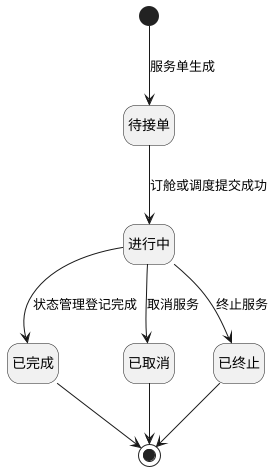
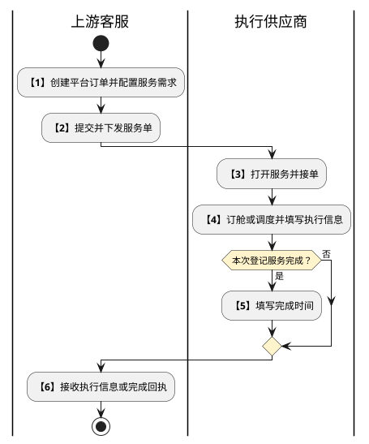

# 第036篇

> 本篇定位：干线服务共用规则；主要内容：服务入口、执行状态与中止结果、共用查询附件及追溯；文档角色：共享规则档；文档ID：76B3872565

共用定义见[综合订单与服务协同实体](../PRD.高捷物流系统.第08册.运营支撑/PRD.高捷物流系统.第066篇.数据字典.7A3D9E1F50.md#doc-7A3D9E1F50-integrated-order-model)、[仓储模型与多式干线权限](../PRD.高捷物流系统.第08册.运营支撑/PRD.高捷物流系统.第067篇.角色与访问权限.5E31456F30.md#doc-5E31456F30-warehouse-trunk-access)。

## 1. 干线服务执行

本篇统一定义平台订单下发后的干线及运输服务执行规则。上游负责选择所需服务、供应商与需求，提交后生成关联服务单并分发；供应商执行订舱或调度、登记服务信息和完成节点，上游客服接收回执。看不到已下发服务单时，核对所选供应商以及下游账号所属财务组织的绑定关系。

各场景的完整定义如下；共用规则在本篇维护，场景篇保留操作和字段特例。

| 服务场景 | 完整定义 |
| --- | --- |
| 空运-干线服务 | [空运-干线服务](../PRD.高捷物流系统.第02册.订单管理/PRD.高捷物流系统.第023篇.空运-干线服务.64F8172620.md#doc-64F8172620-air-service) |
| 海运-订舱与提单 | [海运-订舱与提单](PRD.高捷物流系统.第037篇.海运-订舱与提单.75E5609D0B.md#doc-75E5609D0B-sea-booking) |
| 陆运-中港车调度与单证 | [陆运-中港车调度与单证](PRD.高捷物流系统.第038篇.陆运-中港车调度与单证.826B300DCF.md#doc-826B300DCF-cross-border-truck) |
| 陆运-用车订单管理 | [陆运-用车订单管理](PRD.高捷物流系统.第039篇.陆运-用车订单管理.32C78B8106.md#doc-32C78B8106-platform-transport-service) |
| 平台节点时间推送 | [平台节点时间推送](../PRD.高捷物流系统.第09册.系统对接/PRD.高捷物流系统.第072篇.客户接口与数据交接.58EB46CA94.md#doc-58EB46CA94-platform-time-push) |

### 1.1 服务入口与责任

| 入口 | 服务单范围 | 执行方 |
| --- | --- | --- |
| 进口空运 | 平台订单运输方式为空运、勾选干线服务且服务类型为委外服务。来源未另给进出口方向条件，不能仅凭菜单名补充过滤条件。 | 接收服务的客服。 |
| 出口空运 | 平台订单运输方式为空运、勾选干线服务且服务类型为我司服务。来源未另给进出口方向条件。 | 空运产品部。 |
| 海运 | 运输方式为海运并勾选干线服务。 | 委外服务由电商客服执行；我司服务由海运部执行。 |
| 中港车 | 运输方式为陆运并勾选干线服务。 | 电商客服。 |
| 运输服务 | 平台订单勾选运输服务，不以干线运输方式替代运输服务条件。 | 接收服务的电商客服、航晟客服；执行差异见[运输服务](PRD.高捷物流系统.第039篇.陆运-用车订单管理.32C78B8106.md#doc-32C78B8106-platform-transport-service)。 |

### 1.2 执行状态与中止结果

以下是服务单状态，不替代原用车订单、运输运单、订舱单各自状态。

| 当前状态 | 可执行操作 | 触发与结果 |
| --- | --- | --- |
| 待接单 | 查看；空运、海运订舱；中港车、运输服务调度。 | 服务单生成的初始状态；订舱或调度提交成功后为进行中，节点为已订舱或已调度。 |
| 进行中 | 查看、编辑、状态管理、取消服务、终止服务。 | 状态管理登记完成后为已完成；取消服务后为已取消；终止服务后为已终止。 |
| 已完成、已取消、已终止 | 查看。 | 服务节点与对应终态一致，不再开放执行编辑。 |

未接单时空运、海运节点为未订舱，车辆服务为未调度。取消与终止仅适用于进行中的服务：取消不生成该服务商品的应收应付，终止须生成应收应付。此规则与既有“取消调度产生返空费”不是同一操作；已发生费用如何处理及两个操作同时涉及一张单时的先后与优先级尚未定义。

**干线及运输服务单生命周期**

本图只表达服务单执行状态；终点结束该服务单的执行，不表示财务结算已经结束，也不改变订单、运单或订舱单的独立状态。取消与终止的计费差异仍按上文处理。

| 步骤 | 参与方 | 处理与交接 |
| --- | --- | --- |
| 1 | 上游客服 | 创建订单、选择服务和供应商、填写需求。 |
| 2 | 上游客服、系统 | 提交后生成关联服务单并下发。 |
| 3 | 执行供应商 | 进入服务执行页面，接单订舱或调度。 |
| 4 | 执行供应商 | 填写执行信息，可先回执执行信息，也可继续登记完成节点。 |
| 5 | 执行供应商 | 服务完成时登记完成时间。 |
| 6 | 上游客服 | 接收服务回执，查看信息和状态。 |

本次回执结束不等于服务必然完成。上游配置的完整规则由订单篇维护，本篇不另行定义订单创建条件。

**界面原型概述 · 共用状态管理**

- **区域字段或业务元素**：服务节点、处理人、干线到达时间、备注、确定、取消。
- **区域级通用规则**：服务节点选择已完成，处理人取当前账号；到达时间默认当前时间、允许编辑，精确到秒；备注选填。

### 1.3 查询、附件和追溯

引用本节的服务列表默认每页 50 条。未填写条件时查询全部授权范围记录，填写后按条件过滤；结果按建单时间倒序，重置清空条件。无效或缺少必填项时明确提示对应字段并禁用提交或保存；返回不保存输入，也不推进状态。

**界面原型概述 · 共用附件区域**

- **区域字段或业务元素**：资料名称、附件类型、来源、操作时间、操作人、选择、下载、添加附件、删除附件。
- **区域级通用规则**：来源区分上游订单、当前服务单等实际来源；可勾选下载，添加附件经弹窗确定后进入列表；可多选删除本次维护的附件。

附件弹窗区分提单与其他附件；上游资料可包含装箱单、发票、报关单、合同、提货单等。来源未明确能否删除上游附件、大小和格式限制，不能将展示附件当成可随意覆盖的上游原件。

**界面原型概述 · 服务详情与追溯**

- **区域字段或业务元素**：服务单信息、节点轨迹、操作日志三个页签；轨迹中的订单号、总运单号、节点与发生时间；日志中的操作人、操作名称、操作时间、操作内容。
- **区域级通用规则**：详情只读；创建记录包含平台订单号，修改记录包含变更字段及新值，取消、终止记录相应操作。

空运订舱轨迹与日志记录航司、航班号、出港日期；海运记录船名、船次、出港日期和每组柜号、封条号、柜型。服务完成记录干线已到达及备注，创建节点记录建单完成。来源中的操作时间与用户填写的业务完成时间均需保留，不能相互覆盖。
