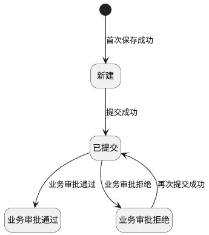
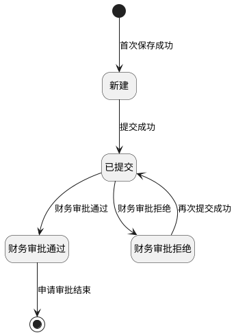

# 第052篇

> 本篇定位：财务结算-收付款申请管理；主要内容：申请来源、分组、审批、发票补录与状态；文档角色：模块档；文档ID：C548DF1D48

**关联业务主流程：** [税金管理与财务结算流程](../PRD.高捷物流系统.第01册.需求框架/PRD.高捷物流系统.第009篇.税金管理与财务结算流程.077CC05853.md#doc-077CC05853-tax-settlement)。
**关联模块流程：** [结算管理流程](../PRD.高捷物流系统.第01册.需求框架/PRD.高捷物流系统.第011篇.DDP跨模块作业与结算流程.7579B595B8.md#doc-7579B595B8-section-a5b92ee23329)。

## 1. 结算业务范围、角色与流程

**业务入口：** 收付款申请页面。

**概念模型：** [数据字典 · 财务结算实体](../PRD.高捷物流系统.第08册.运营支撑/PRD.高捷物流系统.第066篇.数据字典.7A3D9E1F50.md#doc-7A3D9E1F50-domain-finance)

### 1.1 业务目标与范围

收付款申请管理覆盖付款申请和收款申请的创建、查看、提交、审批、发票补录和查询。

### 1.2 财务结算共用入口与流程

财务结算的跨模块导航与流程见[财务结算操作入口](PRD.高捷物流系统.第048篇.财务基础与结算流程.40E841D3A6.md#doc-40E841D3A6-section-3561f6529077)、[财务结算操作权限](../PRD.高捷物流系统.第08册.运营支撑/PRD.高捷物流系统.第067篇.角色与访问权限.5E31456F30.md#doc-5E31456F30-finance-actions)、[应收结算流程](PRD.高捷物流系统.第048篇.财务基础与结算流程.40E841D3A6.md#doc-40E841D3A6-section-23c66131aa44)、[应付结算流程](PRD.高捷物流系统.第048篇.财务基础与结算流程.40E841D3A6.md#doc-40E841D3A6-section-0f97b5b6d534)。

### 1.3 收付款申请金额计算规则

付款申请和收款申请执行“保存”或“保存并提交”时，按以下规则计算金额：

- 行税额＝本次申请金额（原币）×税率÷（1＋税率），结果保留 2 位小数。
- 税额合计＝全部行税额之和。
- 申请金额合计＝全部行本次申请金额（原币）之和。
- 不含税金额合计＝申请金额合计－税额合计。
- 已申请金额（原币）为同一结算明细或调整单明细所生成、且状态为“新建”“已提交”“财务审批通过”或“财务审批拒绝”的申请行中，本次申请金额（原币）之和。
- 可申请金额（原币）＝总金额（原币）－已申请金额（原币）。
- 新增申请行时，本次申请金额（原币）默认等于可申请金额（原币），允许修改，但不得大于可申请金额（原币）；总金额（原币）大于 0 时，本次申请金额（原币）不得小于 0。

## 2. 付款申请与发票补录

### 2.1 付款申请列表

付款申请列表，可查看、删除、提交、审批付款申请。

### 2.2 付款申请列表页面

**操作与反馈**

- 查询：按填写的条件查询；未设置条件时查询全部记录。查询结果按照“付款申请批次号”倒序排列。

- 重置：重置查询条件。

- 详情：跳转至“付款申请单明细”界面，业务员和财务人员都能看到当前按钮。

- 删除：弹出“删除确认”弹框，只有业务员能看到当前按钮。

- 提交：弹出“提交确认”弹框，只有业务员能看到当前按钮。

- 审批：跳转“付款申请审批”界面，业务员和财务人员都能看到当前按钮。

**界面原型概述 · 付款申请查询栏**

- **区域字段或业务元素**：申请批次号、结算单位、应收应付周期、币种、申请金额从、(申请金额)至、状态、创建人、创建日期从、(创建日期)至。
- **区域级通用规则**：查询条件均选填、无预设值。

| 字段或控件特例 | 界面特例或可见反馈 |
| --- | --- |
| 申请批次号 | 填写付款审批批次号，支持模糊查询。 |
| 结算单位 | 选择结算单位，支持模糊查询。 |
| 应收应付周期 | 选择转换期间，支持模糊查询。 |
| 币种 | 显示2列，币种编码和币种名称；支持按币种精确查询，不选择默认全部币种。 |
| 申请金额从 | 纯数值；填写申请金额，查询申请金额≥该值的记录。 |
| (申请金额)至 | 纯数值；填写申请金额，查询申请金额≤该值的记录。 |
| 状态 | 候选列表包括：新建、财务审批拒绝、财务审批通过、已提交、业务审批通过、业务审批拒绝；支持按状态精确查询，不选择默认全部状态；“新建”状态支持删除、提交操作；“财务审批拒绝”状态支持删除、提交操作；“财务审批通过”状态为最终状态；“已提交”状态支持审批操作；“业务审批通过”状态支持查看；“业务审批拒绝”状态支持删除、提交操作；所有状态均可以查询操作。 |
| 创建人 | 填写创建人，支持模糊查询。 |
| 创建日期从、(创建日期)至 | 按日期范围选择；支持在日期范围内的精确查询。 |

**界面原型概述 · 付款申请列表栏**

- **区域字段或业务元素**：付款申请批次号、状态、结算单位、应收应付周期、不含税总金额、税额合计、申请总金额、币种、创建人、创建日期、备注、审批备注。
- **区域级通用规则**：字段均只读；按查询条件展示匹配记录；未设置查询条件时展示全部记录。

### 2.3 付款申请列表明细查看界面

在付款申请列表页面点击操作栏的“详情”，系统进入付款申请明细页面。所有状态的付款申请均显示“查看”按钮。

**操作与反馈**

- 返回：返回付款申请列表页面。

**界面原型概述 · 付款申请明细查看**

- **区域字段或业务元素**：按基本信息、发票信息和订单明细分组展示。
  - 基本信息：付款申请批次号、结算单位、应收应付周期、状态、税额合计、不含税总金额、申请总金额、申请币种、创建日期、创建人、备注、附件、审批意见。
  - 发票信息：税务发票号、发票类型、开票日期、发票含税金额、币种、税率、开票税率、未税金额。
  - 订单明细：订单号、客户、订单创建人、业务日期、订单行号、成本项目、税率(%)、数量、计费单位、含税单价(原币)、金额(原币)、提单号、已申请金额(原币)、可申请金额(原币)、本次申请金额(原币)。
- **区域级通用规则**：付款申请明细的字段信息，根据对应的“付款申请信息”表，自动带出；字段均只读。

| 字段或控件特例 | 界面特例或可见反馈 |
| --- | --- |
| 附件 | 可点击查看。 |

### 2.4 付款申请列表批量导出界面

在付款申请列表页面勾选多选框后，系统显示“导出”按钮。

**操作与反馈**

- 导出：按勾选数据，导出数据。

### 2.5 付款申请删除操作

在付款申请列表页面点击“删除”按钮，系统打开“删除确认”对话框。只有状态为“新建”“财务审批拒绝”或“业务审批拒绝”的付款申请显示“删除”按钮。

**操作与反馈**

- 确认：完成删除，返回“付款申请列表”界面。该付款申请批次号在“付款申请列表”界面消失。

- 取消：取消删除，返回“付款申请列表”界面。

### 2.6 付款申请提交操作

在付款申请列表页面点击“提交”按钮，系统打开“提交确认”对话框。只有状态为“新建”“财务审批拒绝”或“业务审批拒绝”的付款申请显示“提交”按钮。

**操作与反馈**

- 确认：完成提交，返回“付款申请列表”界面。该付款申请批次号的状态变为“已提交”。

- 取消：取消提交，返回“付款申请列表”界面。

### 2.7 付款申请审批

在付款申请列表页面点击“审批”按钮，系统进入付款申请审批页面。只有状态为“已提交”的付款申请显示“审批”按钮。

**操作与反馈**

- 返回：取消审批，返回“付款申请列表”界面。

- 审批通过：该付款申请的审批通过，返回“付款申请列表”界面。如果是业务员审批通过的，该付款申请批次号的状态变为“业务审批通过”；如果是财务人员审批通过的，该付款申请批次号的状态变为“财务审批通过”。

- 审批拒绝：该付款申请的审批拒绝，返回“付款申请列表”界面。如果是业务员审批拒绝的，该付款申请批次号的状态变为“业务审批拒绝”；如果是财务人员审批拒绝的，该付款申请批次号的状态变为“财务审批拒绝”。

**界面原型概述 · 付款申请审批**

- **区域字段或业务元素**：按基本信息、发票信息和订单明细分组展示。
  - 基本信息：付款申请批次号、结算单位、应收应付周期、状态、税额合计、不含税金额合计、申请金额合计、申请币种、创建日期、创建人、备注、附件、审批意见。
  - 发票信息：税务发票号、发票类型、开票日期、发票含税金额、币种、税率、开票税率、未税金额。
  - 订单明细：订单号、客户、订单创建人、业务日期、订单行号、成本项目、税率(%)、数量、计费单位、含税单价(原币)、总金额(原币)、提单号、已申请金额(原币)、可申请金额(原币)、本次申请金额(原币)。
- **区域级通用规则**：付款申请明细的字段信息，根据对应的“付款申请信息”表，自动带出。明细行为翻页数据，每页设置10条数据；除所列特例外，字段均只读。

| 字段或控件特例 | 界面特例或可见反馈 |
| --- | --- |
| 附件 | 可点击查看。 |
| 审批意见 | 审批人员可填写审批意见；可编辑；选填；无预设值。 |

### 2.8 付款申请审批通过

付款申请审批界面，点击“审批通过”按钮，弹出“审批通过确认”弹框。

**操作与反馈**

- 确认：确认审批通过，返回“付款申请列表”界面。如果是业务员审批通过的，该付款申请批次号的状态变为“业务审批通过”；如果是财务人员审批通过的，该付款申请批次号的状态变为“财务审批通过”，后续可查看该审批批次的明细信息。

- 取消：取消该审批动作，返回“付款申请审批”界面。

### 2.9 付款申请审批拒绝

付款申请审批界面，点击“审批拒绝”按钮，弹出“审批拒绝确认”弹框。

**操作与反馈**

- 确认：确认审批拒绝，返回“付款申请列表”界面。如果是业务员审批拒绝，该付款申请批次号的状态变为“业务审批拒绝”；如果是财务人员审批拒绝，状态变为“财务审批拒绝”，之后可删除或再次提交审批。

- 取消：取消该审批动作，返回“付款申请审批”界面。

付款申请提交及逐级审批的消息规则见[付款申请通知规则](../PRD.高捷物流系统.第08册.运营支撑/PRD.高捷物流系统.第069篇.消息推送.5F950AB3B1.md#doc-5F950AB3B1-section-38bc0838cba3)。

**付款申请提交与业务审批状态图**

本图从已保存的“新建”付款申请展开，仅展示提交与业务审批的确定路径；新建时直接保存并提交见[付款申请新增](#doc-C548DF1D48-section-e0d10d1ac8a0)。

- “业务审批通过”：财务审批的可处理状态与入口尚未统一，[付款申请审批](#doc-C548DF1D48-section-507c65157b68)仅允许“已提交”申请显示列表审批按钮，而[付款申请通知规则](../PRD.高捷物流系统.第08册.运营支撑/PRD.高捷物流系统.第069篇.消息推送.5F950AB3B1.md#doc-5F950AB3B1-section-38bc0838cba3)在业务审批通过后通知财务；[工作台审批待办](../PRD.高捷物流系统.第08册.运营支撑/PRD.高捷物流系统.第068篇.工作台与待办管理.279CFF369E.md#doc-279CFF369E-section-520e93eb4409)另有直达审批明细的入口。因此本图不连接财务审批结果，“业务审批通过”也不表示申请终态。
- 财务审批拒绝后的再次提交、删除分别见[付款申请提交](#doc-C548DF1D48-section-7f00e5b0ba39)和[付款申请删除](#doc-C548DF1D48-section-b242495363eb)；图中不展开删除路径。

### 2.10 待付款申请列表

待付款申请列表界面，可查看、导出审批通过的明细费用，创建付款申请。

### 2.11 待付款申请列表页面

**操作与反馈**

- 查询：在不选择任何查询字段下，点击“查询”按钮，未设置条件时查询全部记录。选择对应的查询条件，则显示符合结果的数据。查询的数据为“财务审批通过”且完成对账“确认”的结算明细数据和调整单数据，按照“业务日期”顺序排列、按“订单号”顺序排列。

- 重置：重置查询条件。

- 创建：跳转至“付款申请新增”界面。“创建”操作只能够创建相同“结算单位”、相同“币种”的付款申请数据。

- 按勾选创建：勾选对应数据，创建付款申请。

- 按查询条件创建：根据查询条件批量创建付款申请。

- 导出：勾选的批量数据导出。

**界面原型概述 · 待付款申请查询栏**

- **区域字段或业务元素**：订单号、(子)单号、客户、结算单位、提单号、成本项目、币种、订单创建人、业务日期。
- **区域级通用规则**：除所列特例外，查询条件均选填；支持模糊搜索。

| 字段或控件特例 | 界面特例或可见反馈 |
| --- | --- |
| 订单号、(子)单号、客户、结算单位、提单号、成本项目、订单创建人 | 无预设值。 |
| 币种 | 默认“CNY”；候选列表显示2列“币种代码”、“币种名称”，支持精确搜索；有默认值。 |
| 业务日期 | 必填；有默认值。 |

**界面原型概述 · 待付款申请列表栏**

- **区域字段或业务元素**：订单号、客户、订单创建人、业务日期、(子)单号、结算单位、成本项目、成本属性、税率(%)、数量、计费单位、含税单价(原币)、总金额(原币)、币种、提单号、备注、已申请金额(原币)、可申请金额(原币)。
- **区域级通用规则**：除所列特例外，字段均只读，取财务审批通过且对账完成的结算明细或调整单明细中的对应数据；客户展示订单客户。

| 字段或控件特例 | 界面特例或可见反馈 |
| --- | --- |
| 成本属性 | 取结算明细或调整单明细的成本项目；待付款申请界面默认展示成本属性为“应收”的数据。 |
| 提单号 | 部分订单无提单号。 |
| 已申请金额(原币) | 系统自动生成；汇总范围见[收付款申请金额计算规则](#doc-C548DF1D48-section-a4c8d210fe73)。 |
| 可申请金额(原币) | 系统自动生成；计算规则见[收付款申请金额计算规则](#doc-C548DF1D48-section-a4c8d210fe73)。 |

### 2.12 付款申请新增页面

**操作与反馈**

- 保存：保存该付款申请，弹出“保存确认”弹框。

保存校验：

①明细信息的“结算单位”、“币种”是否相同，不同则无法保存成功；

②校验必填字段是否填写，若未填写，点击保存时无法保存；

③需校验本次申请金额(原币)≤可申请金额；

④若总金额原币＞0，则本次申请金额原币＞0。

- 保存并提交：保存并提交该付款申请，弹出“提交确认”弹框。

保存并提交校验：需要进行保存校验。

- 返回：取消该付款申请，返回“待付款申请列表”界面。

- 附件上传：可上传附件，图片、文档、PDF，限制大小为20M。

- (税务发票信息)保存：保存维护的税务发票信息。

- (税务发票信息)删除：删除税务发票信息。

1. 字段说明

**界面原型概述 · 付款申请新增基本信息**

- **区域字段或业务元素**：付款申请批次号、结算单位、应收应付周期、状态、税额合计、不含税金额合计、申请金额合计、申请币种、创建日期、创建人、备注、附件。
- **区域级通用规则**：除所列特例外，字段均只读。

| 字段或控件特例 | 界面特例或可见反馈 |
| --- | --- |
| 付款申请批次号 | 保存成功后，自动生成；规则RA+年月日（YYMMDD）+5位流水。 |
| 结算单位 | 自动生成；根据勾选的结算明细上的结算单位自动生成；一个付款申请上的结算明细的结算单位必须相同。 |
| 应收应付周期 | 自动生成；根据结算单位，在客户表中查找对应的应收应付周期。 |
| 状态 | 自动生成；创建付款申请时，保存后状态为“新建”。 |
| 税额合计、不含税金额合计、申请金额合计 | 付款申请保存后自动生成；[计算规则见收付款申请金额计算规则](#doc-C548DF1D48-section-a4c8d210fe73)。 |
| 申请币种 | 自动生成；默认行上的币种；创建付款申请时，需校验相同的行币种才可以创建一个付款申请。 |
| 创建日期 | 自动生成；创建该付款申请时的系统日期；业务格式：YYYY-MM-DD。 |
| 创建人 | 自动生成；创建该付款申请的用户。 |
| 备注 | 非必填；可编辑；选填；无预设值。 |
| 附件 | 可点击查看；手工上传附件；可编辑；选填；无预设值。 |

**界面原型概述 · 付款申请税务发票信息**

- **区域字段或业务元素**：税务发票号、发票类型、开票日期、发票含税金额、币种、税率、开票税率、未税金额、附件。
- **区域级通用规则**：除所列特例外，字段均只读。

| 字段或控件特例 | 界面特例或可见反馈 |
| --- | --- |
| 税务发票号 | 选择；候选列表展示3列，付款账号、付款银行、付款账户；支持输入账号，模糊匹配；可编辑；选填；无预设值。 |
| 附件 | 可点击查看；附件。 |

**界面原型概述 · 付款申请新增明细信息**

- **区域字段或业务元素**：订单号、客户、订单创建人、业务日期、订单行号、成本项目、税率(%)、数量、计费单位、含税单价(原币)、总金额(原币)、币种、提单号、备注、已申请金额(原币)、可申请金额(原币)、本次申请金额(原币)。
- **区域级通用规则**：分页展示，每页展示50条明细信息；除所列特例外，字段均只读；勾选“结算明细”数据自动带出。

| 字段或控件特例 | 界面特例或可见反馈 |
| --- | --- |
| 已申请金额(原币) | 系统自动生成；汇总范围见[收付款申请金额计算规则](#doc-C548DF1D48-section-a4c8d210fe73)。 |
| 可申请金额(原币) | 系统自动生成；计算规则见[收付款申请金额计算规则](#doc-C548DF1D48-section-a4c8d210fe73)。 |
| 本次申请金额(原币) | 默认值与校验规则见[收付款申请金额计算规则](#doc-C548DF1D48-section-a4c8d210fe73)；可编辑；必填；有默认值。 |

**界面原型概述 · 付款申请审批意见**

| 字段或控件 | 个别界面约束或可见反馈 |
| --- | --- |
| 审批意见 | 非必填；选填；无预设值；可编辑。 |

### 2.13 付款申请保存操作

在付款申请新增界面，点击“保存”按钮，弹出“保存确认”弹框。

**操作与反馈**

- 确认：完成保存，返回“待付款申请列表”界面。自动生成付款申请批次号、税额合计、不含税金额合计、申请金额合计、创建人、创建日期。该付款申请的状态变为“新建”。

金额计算见[收付款申请金额计算规则](#doc-C548DF1D48-section-a4c8d210fe73)。

- 取消：取消保存，返回“付款申请新增”界面。

### 2.14 付款申请提交操作

在付款申请新增界面，点击“保存并提交”按钮，弹出“提交确认”弹框。

**操作与反馈**

- 确认：完成保存并提交该付款申请，返回“待付款申请列表”界面。按[收付款申请金额计算规则](#doc-C548DF1D48-section-a4c8d210fe73)自动生成税额合计、不含税金额合计和申请金额合计，同时生成付款申请批次号、创建人和创建日期；付款申请状态变为“已提交”。

- 取消：取消保存并提交，返回“付款申请新增”界面。

### 2.15 付款发票补录列表

只展示付款申请没有税务发票的行，且对应的付款申请批次的状态为“财务审批通过”。

**操作与反馈**

- 查询：按填写的条件查询；未设置条件时查询全部记录。查询结果按照“付款申请批次号”倒序排列。

- 重置：重置查询条件。

- 查看：跳转至“付款申请单明细”界面，业务员和财务人员都能看到当前按钮。

- 补录：跳转“付款申请发票补录”界面。

**界面原型概述 · 付款发票补录查询栏**

- **区域字段或业务元素**：申请批次号、结算单位、应收应付周期、币种、申请金额从、(申请金额)至、状态、创建人、创建日期从、(创建日期)至。
- **区域级通用规则**：除所列特例外，查询条件均选填、无预设值。

| 字段或控件特例 | 界面特例或可见反馈 |
| --- | --- |
| 申请批次号 | 填写付款审批批次号，支持模糊查询。 |
| 结算单位 | 选择结算单位，支持模糊查询。 |
| 应收应付周期 | 选择转换期间，支持模糊查询。 |
| 币种 | 显示2列，币种编码和币种名称；支持按币种精确查询，不选择默认全部币种。 |
| 申请金额从 | 纯数值；填写申请金额，查询申请金额≥该值的记录。 |
| (申请金额)至 | 纯数值；填写申请金额，查询申请金额≤该值的记录。 |
| 状态 | 候选列表限定：财务申请通过，无法修改；有默认值。 |
| 创建人 | 填写创建人，支持模糊查询。 |
| 创建日期从、(创建日期)至 | 按日期范围选择；支持在日期范围内的精确查询。 |

**界面原型概述 · 付款发票补录列表栏**

- **区域字段或业务元素**：付款申请批次号、状态、结算单位、应收应付周期、不含税总金额、税额合计、申请总金额、币种、创建人、创建日期、备注、审批备注。
- **区域级通用规则**：除所列特例外，字段均只读；按查询条件展示匹配记录；未设置查询条件时展示全部记录。

| 字段或控件特例 | 界面特例或可见反馈 |
| --- | --- |
| 状态 | 仅查看状态为“财务审批通过”的付款申请批次。 |

### 2.16 付款申请发票补录界面

在付款申请发票补录列表，点击“补录”按钮，跳转至“付款申请发票补录”界面。

**操作与反馈**

- 提交：弹出“提交确认”弹框;提交时校验必填信息是否已经填写。

- 返回：取消补录并返回付款申请补录列表页面。

**界面原型概述 · 付款发票补录**

- **区域字段或业务元素**：按基本信息、发票信息和结算明细分组列示，附件另列。
  - 基本信息：付款申请批次号、结算单位、应收应付周期、状态、税额合计、不含税总金额、申请总金额、申请币种、创建日期、创建人、备注、审批意见。
  - 发票信息：税务发票号、发票类型、开票日期、发票含税金额、币种、税率、开票税率、未税金额。
  - 结算明细：订单号、客户、订单创建人、业务日期、订单行号、成本项目、税率(%)、数量、计费单位、含税单价(原币)、金额(原币)、提单号、已申请金额(原币)、可申请金额(原币)、本次申请金额(原币)。
  - 附件：查看与编辑约束分别列于下表，两项说明各自对应的业务对象和区域待确认。
- **区域级通用规则**：付款申请明细的字段信息，根据对应的“付款申请批次”数据，自动带出；除所列特例外，字段均只读。

| 字段或控件特例 | 界面特例或可见反馈 |
| --- | --- |
| 附件 | 可点击查看。 |
| 税务发票号、发票类型、开票日期、发票含税金额、币种、税率 | 可编辑；必填；无预设值。 |
| 开票税率、未税金额 | 提交后由系统自动生成；计算规则见[付款申请发票补录](#doc-C548DF1D48-section-0243192953b1)。 |
| 附件 | 可点击查看；可编辑；选填；无预设值。 |

提交校验通过后，系统自动计算以下字段：

- 开票税率＝发票含税金额×税率÷（1＋税率）。
- 未税金额＝发票含税金额÷（1＋税率）。

### 2.17 付款申请新增

**业务范围**：勾选对应客户的结算明细数据，填写备注、上传附件、填写税务发票号、选择发票类型、开票日期、填写发票含税金额、税率，完成付款申请新增

**参与角色**：财务会计

**前置条件**

进入付款申请管理-> 付款申请列表，进入“待申请列表”页面；

选择结算数据，点击“创建”进入此页面

**业务结果**：保存后生成状态为“新建”的付款申请，可查看、提交或删除；保存并提交后，付款申请状态为“已提交”，可查看或审批。校验失败时不保存并提示原因。

**处理规则**

勾选“勾选界面明细”数据，进入付款申请新增页面，分别输入：备注、税务发票号、发票类型、开票日期、发票含税金额、税率、本次申请金额(原币)。

备注：

- 非必填；

- 手工录入备注；

- 未保存前，可修改备注。

附件上传

- 非必填；

- 可点击查看，手工上传附件（图片、文档、PDF，限制大小为20M）；

- 未保存前，可删除重新上传附件。

税务发票号：

- 必填；

- 未保存前，可修改。

发票类型：

- 必填；

- 从候选项中选择普通发票或专用发票。

- 未保存前，可修改。

开票日期：

- 必填；

- 未保存前，可修改。

发票含税金额：

- 必填；

- 未保存前，可修改。

点击“保存”进行提交保存，弹出保存确认弹框。

- 确认：显示“保存成功”提示，跳转到“待付款申请列表”界面，该付款申请状态变为“新建”。

- 无法提交：若必填项未输入，则该输入项红色高亮提示，保存按钮置灰不可点击。若本次申请金额(原币)>可申请金额(原币)，也无法保存成功。

- 取消保存，调整至“付款申请新增”界面，再次编辑付款申请。

点击“保存并提交”进行提交保存，弹出提交确认弹框。

- 确认：显示“提交成功”提示，跳转到“待付款申请列表”界面，该付款申请状态变为“已提交”。

- 无法提交：若必填项未输入，则该输入项红色高亮提示，保存按钮置灰不可点击。若本次申请金额(原币)>可申请金额(原币)，也无法保存成功。

- 取消提交，调整至“付款申请新增”界面，再次编辑付款申请。

**后续处理与分支**

付款申请保存后，可进行查看、删除、提交审批操作；

付款申请提交后，可进行查看、审批操作。

**补充约束**：相同的结算单位、相同的币种，才能够创建付款申请。

**关联功能**

- 付款申请列表；

- 付款核销。

## 3. 收款申请管理

### 3.1 收款申请列表

收款申请列表，可查看、删除、提交、审批收款申请。

### 3.2 收款申请列表页面

**操作与反馈**

- 查询：按填写的条件查询；未设置条件时查询全部记录。查询结果按照“收款申请批次号”倒序排列。

- 重置：重置查询条件。

- 查看：跳转至“收款申请单明细”界面。

- 删除：弹出“删除确认”弹框。

- 提交：弹出“提交确认”弹框。

- 审批：跳转“收款申请审批”界面。

**界面原型概述 · 收款申请查询栏**

- **区域字段或业务元素**：申请批次号、结算单位、应收应付周期、币种、状态、申请金额从、(申请金额)至、创建人、创建日期从、(创建日期)至。
- **区域级通用规则**：查询条件均选填、无预设值。

| 字段或控件特例 | 界面特例或可见反馈 |
| --- | --- |
| 申请批次号 | 填写收款审批批次号，支持模糊查询。 |
| 结算单位 | 选择结算单位，支持模糊查询。 |
| 应收应付周期 | 选择转换期间，支持模糊查询。 |
| 币种 | 显示2列，币种编码和币种名称；支持按币种精确查询，不选择默认全部币种。 |
| 状态 | 候选列表包括：新建、已提交、财务审批通过、财务审批拒绝；支持按状态精确查询，不选择默认全部状态；“新建”状态支持删除、提交操作；“已提交”状态支持审批操作；“财务审批拒绝”状态支持删除、提交操作；“财务审批通过”状态为最终状态。所有状态均可以查询操作。 |
| 申请金额从 | 纯数值；填写申请金额，查询申请金额≥该值的记录。 |
| (申请金额)至 | 纯数值；填写申请金额，查询申请金额≤该值的记录。 |
| 创建人 | 填写创建人，支持模糊查询。 |
| 创建日期从、(创建日期)至 | 按日期范围选择；支持在日期范围内的精确查询。 |

**界面原型概述 · 收款申请列表栏**

- **区域字段或业务元素**：收款申请批次号、状态、结算单位、应收应付周期、不含税总金额、税额合计、申请总金额、币种、创建人、创建日期、备注、审批备注。
- **区域级通用规则**：字段均只读；按查询条件展示匹配记录；未设置查询条件时展示全部记录。

### 3.3 收款申请列表明细查看界面

在收款申请列表页面点击操作栏的“查看”，系统进入收款申请明细页面。所有状态的收款申请均显示“查看”按钮。

**操作与反馈**

- 返回：返回收款申请列表页面。

**界面原型概述 · 收款申请明细查看**

- **区域字段或业务元素**：按基本信息、收款账户和订单明细分组展示。
  - 基本信息：收款申请批次号、结算单位、应收应付周期、状态、税额合计、不含税总金额、申请总金额、申请币种、创建日期、创建人、备注、审批意见、附件。
  - 收款账户：收款银行、收款账户名称、收款银行账号。
  - 订单明细：订单号、客户、订单创建人、业务日期、订单行号、成本项目、税率(%)、数量、计费单位、含税单价(原币)、总金额(原币)、币种、提单号、已申请金额(原币)、可申请金额(原币)、本次申请金额(原币)。
- **区域级通用规则**：收款申请明细的字段信息，根据对应的“收款申请信息”表，自动带出；字段均只读。

| 字段或控件特例 | 界面特例或可见反馈 |
| --- | --- |
| 附件 | 可点击查看。 |

### 3.4 收款申请列表批量导出界面

在收款申请列表页面勾选多选框后，系统显示“按查询条件批量导出”和“导出”按钮。

**操作与反馈**

- 按查询条件批量导出：按查询条件批量导出匹配数据。

- 导出：按勾选数据，导出数据。

### 3.5 收款申请删除操作

在收款申请列表页面点击“删除”按钮，系统打开“删除确认”对话框。只有状态为“新建”或“财务审批拒绝”的收款申请显示“删除”按钮。

**操作与反馈**

- 确认：完成删除，返回“收款申请列表”界面。该收款申请批次号在“收款申请列表”界面消失。

- 取消：取消删除，返回“收款申请列表”界面。

### 3.6 收款申请提交操作

在收款申请列表页面点击“提交”按钮，系统打开“提交确认”对话框。只有状态为“新建”或“财务审批拒绝”的收款申请显示“提交”按钮。

**操作与反馈**

- 确认：完成提交，返回“收款申请列表”界面。该收款申请批次的状态变为“已提交”。

- 取消：取消提交，返回“收款申请列表”界面。

### 3.7 收款申请审批

在收款申请列表页面点击“审批”按钮，系统进入收款申请审批页面。只有状态为“已提交”的收款申请显示“审批”按钮。

**操作与反馈**

- 返回：取消审批，返回“收款申请列表”界面。

- 审批通过：该收款申请的审批通过，返回“收款申请列表”界面。该收款申请批次的状态变为“财务审批通过”。

- 审批拒绝：该收款申请的审批拒绝，返回“收款申请列表”界面。该收款申请批次的状态变为“财务审批拒绝”。

**界面原型概述 · 收款申请审批**

- **区域字段或业务元素**：按基本信息、收款账户和订单明细分组展示。
  - 基本信息：收款申请批次号、结算单位、应收应付周期、状态、税额合计、不含税金额合计、申请金额合计、申请币种、创建日期、创建人、备注、附件、审批意见。
  - 收款账户：收款银行、收款账户名称、收款银行账号。
  - 订单明细：订单号、客户、订单创建人、业务日期、订单行号、成本项目、税率(%)、数量、计费单位、含税单价(原币)、总金额(原币)、币种、提单号、已申请金额(原币)、可申请金额(原币)、本次申请金额(原币)。
- **区域级通用规则**：收款申请明细的字段信息，根据对应的“收款申请信息”表，自动带出。明细行为翻页数据，每页设置10条数据；除所列特例外，字段均只读。

| 字段或控件特例 | 界面特例或可见反馈 |
| --- | --- |
| 附件 | 可点击查看。 |
| 审批意见 | 审批人员可填写审批意见；可编辑；选填；无预设值。 |

### 3.8 收款申请审批通过

在收款申请审批界面点击“审批通过”，系统弹出“审批通过确认”弹框。

**操作与反馈**

- 确认：确认审批通过，返回“收款申请列表”界面。该收款申请批次号的状态变为“财务审批通过”，之后可查看该审批批次的明细信息。

- 取消：取消该审批动作，返回“收款申请审批”界面。

收款申请提交及审批的消息规则见[收款申请通知规则](../PRD.高捷物流系统.第08册.运营支撑/PRD.高捷物流系统.第069篇.消息推送.5F950AB3B1.md#doc-5F950AB3B1-section-1dbe4edb0acb)。

### 3.9 收款申请审批拒绝

在收款申请审批界面点击“审批拒绝”，系统弹出“审批拒绝确认”弹框。

**操作与反馈**

- 确认：确认审批拒绝并返回“收款申请列表”界面。该收款申请批次的状态变为“财务审批拒绝”，之后可删除或再次提交审批。

- 取消：取消该审批动作，返回“收款申请审批”界面。

**收款申请审批状态图**

本图从已保存的“新建”收款申请展开；新建时也可直接保存并提交，进入“已提交”，见[收款申请提交操作](#doc-C548DF1D48-section-98297292678c)。

“财务审批通过”是申请审批的最终状态，不表示收款核销已完成；核销见[收款核销](PRD.高捷物流系统.第053篇.财务结算-收付款核销.45DB5A5118.md#doc-45DB5A5118-receipt-writeoff)。本图不展开新建或拒绝后的删除路径。

### 3.10 待收款申请列表

待收款申请列表界面，可查看、导出审批通过的明细费用，创建收款申请。

### 3.11 待收款申请列表页面

**操作与反馈**

- 查询：在不选择任何查询字段下，点击“查询”按钮，未设置条件时查询全部记录。选择对应的查询条件，则显示符合结果的数据。查询的数据为“财务审批通过”且完成对账“确认”的结算明细数据和调整单数据，按照“业务日期”顺序排列、按“订单号”顺序排列。

- 重置：重置查询条件。

- 创建：跳转至“收款申请新增”界面。“创建”操作只能够创建相同“结算单位”、相同“币种”的收款申请数据。

- 按勾选创建：勾选对应数据，创建收款申请。

- 按查询条件创建：根据查询条件批量创建收款申请。

- 导出：勾选的批量数据导出。

**界面原型概述 · 待收款申请查询栏**

- **区域字段或业务元素**：订单号、(子)单号、客户、结算单位、提单号、成本项目、币种。
- **区域级通用规则**：除所列特例外，查询条件均选填、无预设值。

| 字段或控件特例 | 界面特例或可见反馈 |
| --- | --- |
| 订单号 | 填写订单号，支持模糊搜索。 |
| (子)单号 | 填写(子)单号，支持模糊搜索。 |
| 客户 | 填写客户，支持模糊搜索。 |
| 结算单位 | 填写结算单位，支持模糊搜索。 |
| 提单号 | 填写提单号，支持模糊搜索。 |
| 成本项目 | 填写成本项目，支持模糊搜索。 |
| 币种 | 默认“CNY”；候选列表显示2列“币种代码”、“币种名称”，支持精确搜索；有默认值。 |

**界面原型概述 · 待收款申请列表栏**

- **区域字段或业务元素**：订单号、客户、订单创建人、业务日期、(子)单号、结算单位、成本项目、成本属性、税率(%)、数量、计费单位、含税单价(原币)、总金额(原币)、币种、已申请金额(原币)、可申请金额(原币)、提单号、备注。
- **区域级通用规则**：除所列特例外，字段均只读，取财务审批通过且对账完成的结算明细或调整单明细中的对应数据；客户展示订单客户。

| 字段或控件特例 | 界面特例或可见反馈 |
| --- | --- |
| 成本属性 | 取结算明细或调整单明细的成本项目；待收款申请界面默认展示成本属性为“应收”的数据。 |
| 已申请金额(原币) | 系统自动生成；汇总范围见[收付款申请金额计算规则](#doc-C548DF1D48-section-a4c8d210fe73)。 |
| 可申请金额(原币) | 系统自动生成；计算规则见[收付款申请金额计算规则](#doc-C548DF1D48-section-a4c8d210fe73)。 |
| 提单号 | 部分订单无提单号。 |

### 3.12 收款申请新增页面

**操作与反馈**

- 保存：保存该收款申请，弹出“保存确认”弹框。

保存校验：

①明细信息的“结算单位”、“币种”是否相同，不同则无法保存成功；

②校验必填字段是否填写，若未填写，点击保存时无法保存；

③需校验本次申请金额(原币)≤可申请金额；

④若总金额原币＞0，则本次申请金额原币＞0。

- 保存并提交：保存并提交该收款申请，弹出“提交确认”弹框。

保存并提交校验：需要进行保存校验。

- 返回：取消该收款申请，返回“待收款申请列表”界面。

- 附件上传：可上传附件，图片、文档、PDF，限制大小为20M。

- (收款账户信息)保存：保存维护的收款账号信息。

1. 字段说明

**界面原型概述 · 收款申请新增基本信息**

- **区域字段或业务元素**：收款申请批次号、结算单位、应收应付周期、状态、税额合计、不含税金额合计、申请金额合计、申请币种、创建日期、创建人、备注、附件。
- **区域级通用规则**：除所列特例外，字段均只读。

| 字段或控件特例 | 界面特例或可见反馈 |
| --- | --- |
| 收款申请批次号 | 保存成功后，自动生成；规则RA+年月日（YYMMDD）+5位流水。 |
| 结算单位 | 自动生成；根据勾选的结算明细上的结算单位自动生成；一个收款申请上的结算明细的结算单位必须相同。 |
| 应收应付周期 | 自动生成；根据结算单位，在客户表中查找对应的应收应付周期。 |
| 状态 | 自动生成；创建收款申请时，保存后状态为“新建”。 |
| 税额合计、不含税金额合计、申请金额合计 | 收款申请保存后自动生成；[计算规则见收付款申请金额计算规则](#doc-C548DF1D48-section-a4c8d210fe73)。 |
| 申请币种 | 自动生成；默认行上的币种；创建收款申请时，需校验相同的行币种才可以创建一个收款申请。 |
| 创建日期 | 自动生成；创建该收款申请时的系统日期；业务格式：YYYY-MM-DD。 |
| 创建人 | 自动生成；创建该收款申请的用户。 |
| 备注 | 非必填；可编辑；选填；无预设值。 |
| 附件 | 可点击查看；手工上传附件；可编辑；选填；无预设值。 |

**界面原型概述 · 收款账户信息**

| 字段或控件 | 个别界面约束或可见反馈 |
| --- | --- |
| 收款账号 | 选择；候选列表展示3列，收款账号、收款银行、收款账户；支持输入账号，模糊匹配；选填；无预设值；可编辑。 |
| 收款银行、收款账户名称 | 自动生成；根据收款账号自动带出；收款账号修改后，点击保存，同步发生变化；只读。 |
| 保存 | 完成收款账号修改保存。 |

**界面原型概述 · 收款申请新增明细信息**

- **区域字段或业务元素**：订单号、客户、订单创建人、业务日期、(子)单号、成本项目、税率(%)、数量、计费单位、含税单价(原币)、总金额(原币)、币种、提单号、备注、已申请金额(原币)、可申请金额(原币)、本次申请金额(原币)。
- **区域级通用规则**：分页展示，每页展示50条明细信息；除所列特例外，字段均只读；勾选“结算明细”数据自动带出。

| 字段或控件特例 | 界面特例或可见反馈 |
| --- | --- |
| 已申请金额(原币) | 系统自动生成；汇总范围见[收付款申请金额计算规则](#doc-C548DF1D48-section-a4c8d210fe73)。 |
| 可申请金额(原币) | 系统自动生成；计算规则见[收付款申请金额计算规则](#doc-C548DF1D48-section-a4c8d210fe73)。 |
| 本次申请金额(原币) | 默认值与校验规则见[收付款申请金额计算规则](#doc-C548DF1D48-section-a4c8d210fe73)；可编辑；必填；有默认值。 |

### 3.13 收款申请保存操作

在收款申请新增界面，点击“保存”按钮，弹出“保存确认”弹框。

**操作与反馈**

- 确认：完成保存，返回“待收款申请列表”界面。自动生成收款申请批次号、税额合计、不含税金额合计、申请金额合计、创建人、创建日期。该收款申请的状态变为“新建”。

金额计算见[收付款申请金额计算规则](#doc-C548DF1D48-section-a4c8d210fe73)。

- 取消：取消保存，返回“收款申请新增”界面。

### 3.14 收款申请提交操作

在收款申请新增界面，点击“保存并提交”按钮，弹出“提交确认”弹框。

**操作与反馈**

- 确认：完成保存并提交该收款申请，返回“待收款申请列表”界面。按[收付款申请金额计算规则](#doc-C548DF1D48-section-a4c8d210fe73)自动生成税额合计、不含税金额合计和申请金额合计，同时生成收款申请批次号、创建人和创建日期；收款申请状态变为“已提交”。

- 取消：取消保存并提交，返回“收款申请新增”界面。

### 3.15 收款申请新增

**业务范围**：勾选对应客户的结算明细数据，填写备注、选择收款账户，上传附件，完成收款申请新增

**参与角色**：财务会计

**前置条件**

进入收款申请管理-> 收款申请列表，进入“待申请列表”页面；

选择结算数据，点击“创建”进入此页面

**业务结果**：保存后生成状态为“新建”的收款申请，可查看、提交或删除；保存并提交后，收款申请状态为“已提交”，可查看或审批。校验失败时不保存并提示原因。

**处理规则**

勾选“勾选界面明细”数据，进入收款申请新增页面，分别输入：备注、收款账号、本次申请金额(原币)。

**备注**

- 非必填；

- 手工录入备注；

- 未保存前，可修改备注。

**附件上传**

- 非必填；

- 可点击查看，手工上传附件（图片、文档、PDF，限制大小为20M）；

- 未保存前，可删除重新上传附件。

**收款账号**

- 非必填；

- 从候选项中选择，候选列表展示3列（收款账号、收款银行、收款账户名称）；

- 未保存前，可修改银行，可选择空值。

**本次申请金额(原币)**

- 必填；

- 默认等于“可申请金额(原币)”；

- 未保存前，可修改本次申请金额(原币)。

每页显示50行明细数据，支持翻页查看明细数据。

点击“保存”进行提交保存，弹出保存确认弹框。

- 确认：显示“保存成功”提示，跳转到“待收款申请列表”界面，该收款申请状态变为“新建”。

- 无法提交：若必填项未输入，则该输入项红色高亮提示，保存按钮置灰不可点击。若本次申请金额(原币)>可申请金额(原币)，也无法保存成功。

- 取消保存，调整至“收款申请新增”界面，再次编辑收款申请。

点击“保存并提交”进行提交保存，弹出提交确认弹框。

- 确认：显示“提交成功”提示，跳转到“待收款申请列表”界面，该收款申请状态变为“已提交”。

- 无法提交：若必填项未输入，则该输入项红色高亮提示，保存按钮置灰不可点击。若本次申请金额(原币)>可申请金额(原币)，也无法保存成功。

- 取消提交，调整至“收款申请新增”界面，再次编辑收款申请。

**后续处理与分支**

收款申请保存后，可进行查看、删除、提交审批操作；

收款申请提交后，可进行查看、审批操作。

**补充约束**：相同的结算单位、相同的币种，才能够创建收款申请。

**关联功能**

- 收款申请列表；

- 收款核销。
